# 用 Python 实现多元线性回归模型

> 原文：<https://medium.com/codex/implementing-a-multiple-linear-regression-model-in-python-24f53d4ed4c1?source=collection_archive---------6----------------------->

上一次，我们实现了一个单变量线性回归模型，根据一个变量大小来预测房子的价格。今天，我们将对此进行一点扩展，并在 sqft 中包括除大小之外的一些变量。因为我们将使用矢量化和矩阵，所以我将使用 Python 的 NumPy 来实现这一点。我们将在 Jupyter 笔记本上写下我们的代码。

如果你没有 Jupyter 笔记本，你可以通过 Anaconda 安装它:

[https://www.anaconda.com/products/distribution](https://www.anaconda.com/products/distribution)

我们可以开始了吗？

在 Jupyter 笔记本上打开一个新的 Python 3 笔记本。如果你愿意，你可以把它命名为多元线性回归。

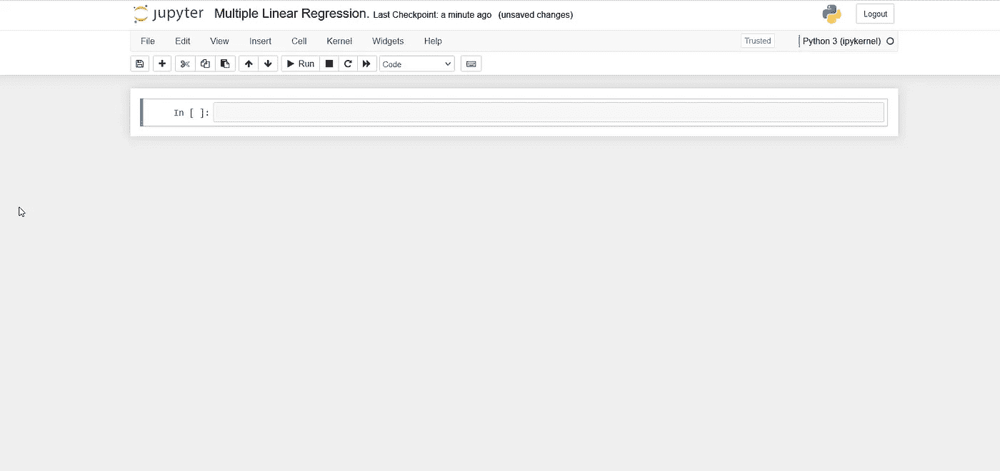

接下来，我们将 NumPy 作为 np 导入。本质上，NumPy 是一个添加了 Python 支持的库，允许用户创建多维数组，这些数组支持矢量化、矩阵和其他高级数学函数，这些函数可以与提到的数组一起使用。

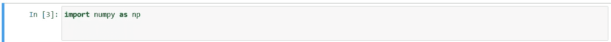

接下来，我们将创建一个用于训练多元线性回归模型的训练集。

**X_train 是**将包含以下特征的矩阵:

*   房子的面积(平方英尺)
*   卧室数量
*   楼层数
*   家的年龄
*   以美元计的价格(千片订量)

**y_train** 将代表我们的目标值(房价)。

我们将有三个培训示例:

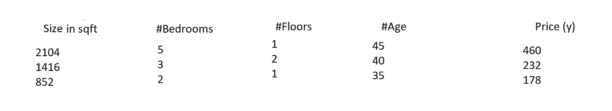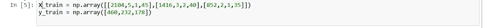

正如你所看到的，NumPy 的矩阵允许我们在一个训练示例中索引多个特征，这对于机器学习算法来说非常有用。

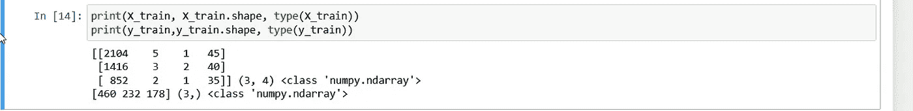

当我们打印 **X_train** 时，可以看到我们有三行(三个训练示例)和四列(每列代表一个不同的特性)。

当我们打印 **X_train.shape** 时，我们可以看到我们的矩阵的形状是(3，4)，就像我们刚才观察到的一样。

当我们打印 **type(X_train)，**我们可以看到我们做的数组是一个‘numpy . ndarray’(也就是 n 维数组，其中 n 是特征的个数)。

接下来，我们将看看 **w** 和 **b.** 的参数向量

**w，本例中的**，是一个包含 *n* 个元素的向量(每个特征一个)。因为我们有四个特征，n 是 4。

另一方面，b 是一个标量参数。每个特性没有不同的 **b** 值，所以在整个过程中它保持不变。

出于演示的目的，我们可以将 b_init 和 w_init 初始化为某些值。

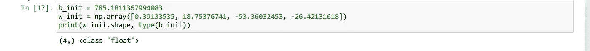

**w_init** 是一个一维 NumPy 向量，有 4 个元素(每个元素对应一个特征)。

b_init 是一个 float 类型，正如我们所料，只有一个值，并且现在保持静态。

对于单变量线性回归模型，我们使用以下等式:

f(x) = w*x + b

现在我们有了多个特征(准确地说是四个)，我们将等式改为如下:

f(x)= w0 * x0+w1 * x1+w * 2 * x2+w * 3x 3+b

从 0 到 3 (n-1)的每个 x 代表一个不同的特征。

总共 4 个特征。

因此，每个 x 也有一个参数 w，范围从 0 到 3 (n-1)。

为了简化上面的等式，我们可以将等式写为:

f(x) = **w** * **x** +b

请注意，与单变量线性回归模型不同，该方程中的 w 和 x 现在是分别包含 w 值(范围为 0-3)和 x 值(范围为 0-3)的向量。注意， **w** 和 **x** 都用粗体表示矢量化。

在这种情况下，当我们将 **w*x** 相乘时，我们得到的是这两个向量的**点积**。

当我们实现一元线性回归模型时，我们将 w 乘以 x，并添加 b 和结尾。

对于多元线性回归，我们可以编写一个函数来对单个训练示例进行预测。由于我们有四个特征，它把 w0*x0，w1*x1，w2*x2，w3*x3 相乘，加在一起，最后加上 b。

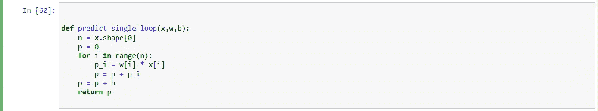

n =特征数量(4，0–3)

p =预测值，首先初始化为零

p_i =代表 wi*xi，其中 *i* 代表迭代次数*。*

当您为所有 *i* 迭代添加 w*x 时，更新 p =总预测值。

b =我们必须在末尾添加的标量参数，如等式所示

f(x)= w***x**+b

让我们使用一个训练示例来测试这个函数。

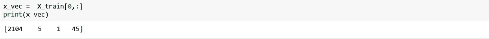

我初始化了 **x_vec** 来对应 **X_train[0，]。**

0 对应于第一行。同时， **:** 表示我想要第一行中四列中每一列的所有元素。如果我想要第二行的所有元素，我会使用 **X_train[1，:]** 等等。

我们可以看到， **x_vec** 现在对应的是第一个训练实例(2104 大小，5 间卧室，1 层，45 岁)。

让我们通过刚刚创建的函数运行 **x_vec** ，看看会发生什么。

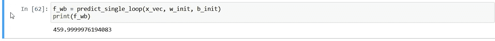

如我们所见，我们得到的值是 459.999，非常接近 460(我们的目标值)。当然，我们利用了为实现这一目的而优化的 **w_init** 和 **b_init** 的值。

但是，如果有更简单快捷的方法来计算向量 w*x 之间的点积呢？那不是很好吗？

谢天谢地，有。我们可以简单地使用 NumPy 的**点**方法，而不是使用 for 循环来计算它:

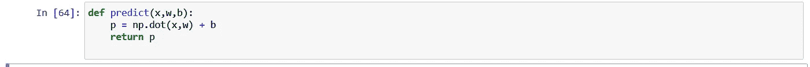

这种方法使得计算速度更快，因为它确保了使用计算机硬件同时进行多个计算。

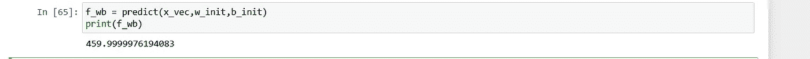

正如我们所看到的，我们得到了和使用 for 循环一样的结果。您可能会注意到，对于这个特定的示例，计算花费的时间大致相同，但是随着计算次数的增加，当使用 for 循环与 NumPy 中的 dot 方法时，时间上会有很大的差异。

**成本**

之前，我们使用以下等式计算了单变量回归模型的**成本**(预测值和目标值之间的差异):

J(w，b)= 1/2m * m-1σI = 0(*𝑓*w,b(x)^(i)- y^(i))

类似地，多元线性回归模型使用以下等式来计算**成本**:

J( **w** ，b)= 1/2m * m-1σI = 0(*𝑓****w****，b(****x****【)^(i)-y^(i】)*

注意 **w** 和 **x** 现在是粗体，因为它们代表矢量。

让我们创建一个计算成本的函数:

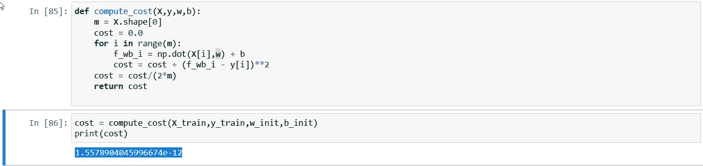

**m** =训练样本数

**f_wb_i** =将训练示例 *i* 乘以向量 **w** 并加上 b 后的预测值

**y[i]** =训练例 I 的目标值

**成本** =预测值与目标值的差值的平方

正如我们所看到的，当我们把所有的变量代入我们的方程时，我们得到了一个非常小的成本数字，使用我们预先确定的 **w** 和 b 的值

**梯度下降算法——成本函数 J 相对于 wj 和 b 的偏导数**

与成本函数类似，多元线性回归的梯度下降算法与一元线性回归的梯度下降算法非常相似。然而，w 不再是单个变量，而是一个向量，在我们的具体例子中，j 的范围是 0-3:

重复直到收敛:{

**wj**=**wj**-*𝛼* 1*/m * m-1∑I = 0(*f*w,b(x^(i))-y^(i))xj^(i)

其中 j 是特征的数量*。*

b = b-*𝛼* 1*/m * m-1∑I = 0(*f w，b (x^(i))-y^(i))*

}

同样，我们也必须同时更新这些值。

让我们创建一个函数来计算成本函数 J 相对于 **wj** 和 **b** 的偏导数:

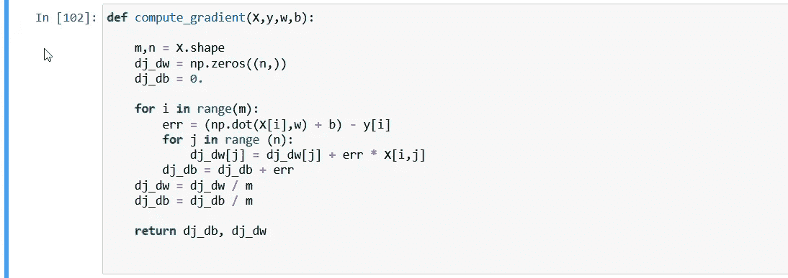

我首先声明这个函数叫做 **compute_gradient** 。

由于我们有 3 个训练示例和 4 个特征，我将使用 assign m，n to **X.shape** (3，4)。

我将为 **dj_dw** 创建一个有 n (4)个元素的数组，每个元素都是 0。

这些“点”中的每一个都将保存对应于**wj**(0–n-1)的偏导数值。

同时， **dj_db** 将是一个奇异值，因为我们没有针对每个特征的不同的 **b** 值(不像 **wj)。**

然后，我创建了一个 for 循环，它将遍历所有的训练示例(m)。

首先，我通过取 X[i] (X_train[i])和 **w** (w_init)的点积，加上 b，取总和，减去我们的目标值(Y_train[i])，来计算每个训练示例中的误差。

接下来，我们将误差乘以 X[i](如偏导数等式所示)，并将成本函数 J 相对于迭代 J 处的 wj 值的偏导数存储在一个阵列槽中。

接下来，在主 for 循环中，由于我们同时更新 b 的值，我们简单地将我们的误差附加到 **dj_db** (因为等式表明不需要乘以 X^(i)).

在第一个 for 循环运行 m 次后，我们简单地将一维数组 **dj_dw** 和变量 dj_db 除以 m，如等式所示。

最后，我们返回 **dj_dw** (包含 4 个值的数组)和 **dj_db** (包含 1 个值的变量)的值。

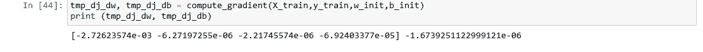

当我们打印 **dj_dw** 时，我们得到了 **dj_dw** 中预期的 4 个值和 **dj_db** 的单个值。

**梯度下降算法——实现 dj_dw 和 dj_db**

既然我们已经定义了导数 **dj_dw** 和 **dj_db** 的值，我们可以将这些值插入梯度下降函数:

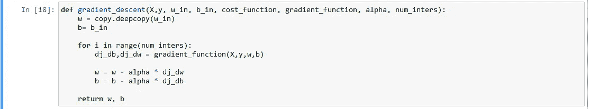

我们先做一个 w_in/b_in 的副本，这样就不会影响全局变量。

然后，我们创建一个 for 循环，它将在循环内部迭代**inter**次:

*   我们通过调用 gradient_function(这将是我们制作的 compute_gradient 函数)来计算成本函数 J 的偏导数。
*   通过减去学习率 *𝛼* * dj_dw 来更新 w 的值
*   通过减去学习率 *𝛼* *dj_b 来更新 b 的值

所有迭代完成后，我们退出循环并返回 w 和 b 的值，这些值在迭代后应该会得到更好的优化。

现在我们的函数已经准备好了，让我们来测试一下。

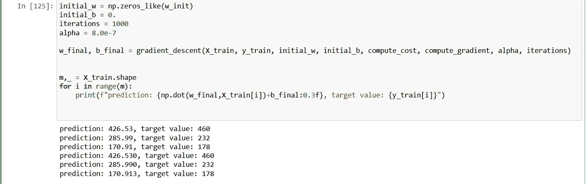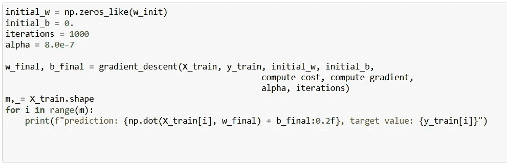

在开始任何迭代之前，我们将把参数 **w** 和 b 设置为 0。

首先，我们将 **initial_w** (vector)初始化为一个零数组，其元素数量与 **w_init** (4)相同。

接下来，我们将变量 **b** 设置为“0”(使其成为与 int 相反的 float 类型)

我们将从 1000 次迭代开始。

对于 alpha(学习率)，我们用 8.0e-7 吧。

**w_final** 和 **b _final** 是我们对 **w** 和 b 的值迭代 1000 次后应该得到的优化值。

对于我们的参数，让我们使用 X_train(训练示例)、y_train(目标值)、initial _ w(0 的数组)、initial_b(浮点类型零)、compute_cost(我们的成本函数 J)、compute_gradient(我们的计算偏导数的函数)、alpha(我们的学习率 8.0e-7)和 iterations(它被设置为 1000。)

最后，让我们通过将 w_final 和 b_final 的值代入 **f(x) =** **w*x+b.** 来计算我们的预测值

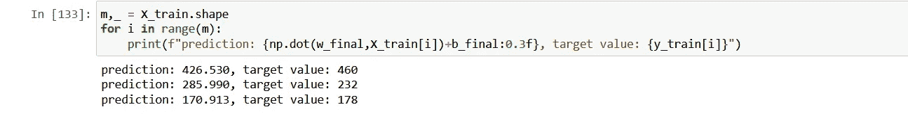

再说一次，因为我们正在实现一个多元线性回归模型，w 和 x 是向量。所以一定要用 NumPy 的点方法计算它们之间的点积，最后加 b。我们将对所有三个训练示例都这样做，这就是为什么我们使用迭代 m 次的 for 循环。

可以看到，迭代 1000 次后，结果是:

426.530 (ŷ或预测值)对 460(目标值)

285.990 (ŷ或预测值)对 232(目标值)

170.913(ŷ或预测值)对 178(目标值)

仍然有许多改进要做。如您所见，成本仍然相对较高，这意味着我们必须改变一些参数来实现收敛。从技术上讲，我们可以简单地**增加**迭代次数，但这确实意味着我们模型的训练将需要更长时间。

相反，我们将**z score****normalization**来归一化特征并改变我们的学习速率，以便我们可以更有效地达到收敛。

首先，让我们创建一个函数，它将允许我们使用 z 分数归一化来改变 **X_train** 中的特征，以便它们在值上变得相似。

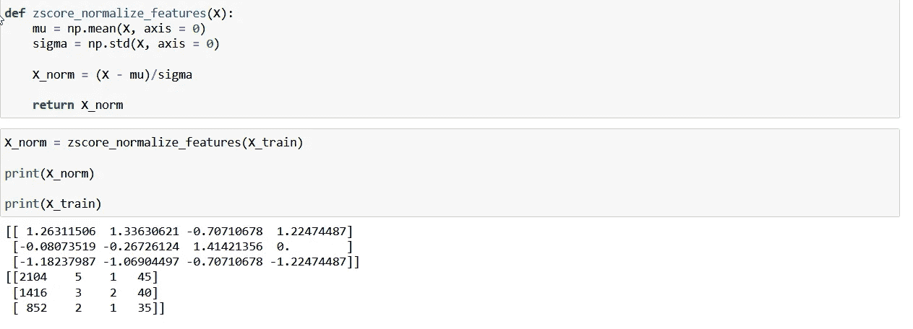

mu =每个特征的平均值，使用 NumPy 的平均值方法计算。

sigma =每个特性的标准偏差，使用 NumPy 的标准方法计算。

X_norm =我们减去 X 减去平均值，然后除以 sigma，如下式所示:

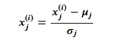

当我们试图打印 X_norm 时，我们可以看到这些值的大小类似地变化——从 1.5 到-1.2。每个特征之间不再有巨大的数字差异。

现在，让我们使用 **X_norm** 而不是 **X_train** 来重新训练模型。

我将简单地将 X_norm 作为我们的训练集插入到我们之前构建的所有函数中:

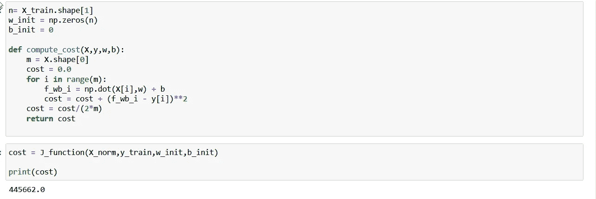

(J 函数对应 compute_cost)

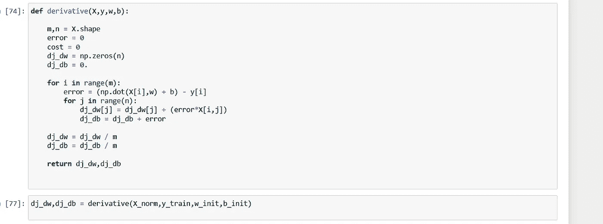

注意-函数“导数”对应于 compute_gradient，返回 dj_dw，dj_db，而不是 dj_db，dj_dw。

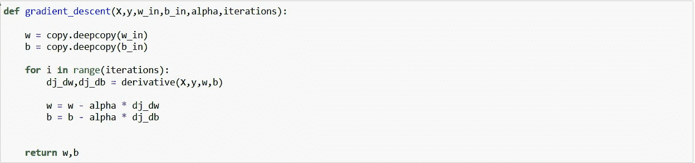

最后，让我们将 alpha(学习率)调整为 5.0e-2，并将迭代次数设置为 1000:

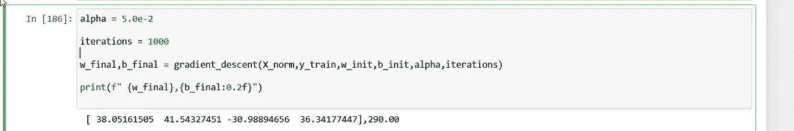

下面分别是我们的 w_final 和 b_final 的最终值:

```
[ 38.05161505  41.54327451 -30.98894656  36.34177447],290.00
```

让我们将它们代入等式 **w** * **x** +b，看看该模型是否能准确预测给定训练集的房屋价格:

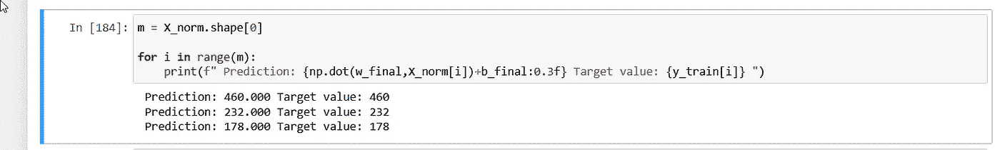

如你所见，经过 1000 次迭代，我们的模型已经收敛。我们的预测值现在正确地对应于我们的目标值，并且我们的模型非常适合这些数据。

让我们创建一个小程序并测试这个模型:

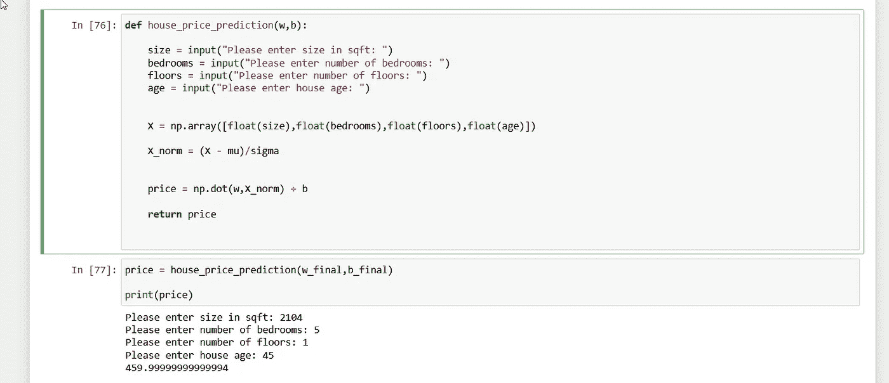

正如我们所看到的，当我们使用第一个训练示例的参数时，我们最终得到的预测值为 459.9999999，这基本上是我们四舍五入后的目标值(460)。

同样，我们可以使用不同的值进行新的预测:

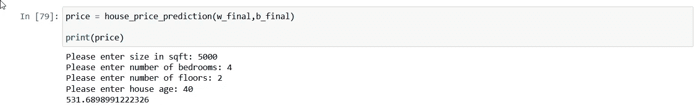

恭喜你！现在，您已经知道如何应用多元线性回归来对具有各种功能的训练示例进行预测。

为深度学习大声呐喊。人工智能和斯坦福创造了机器学习专业化。本教程深受其启发。

想了解更多？请访问:

[](https://www.coursera.org/specializations/machine-learning-introduction) [## 机器学习

### 用机器学习专业化来突破 AI。掌握基本的人工智能概念并开发实用的机器学习…

www.coursera.org](https://www.coursera.org/specializations/machine-learning-introduction)