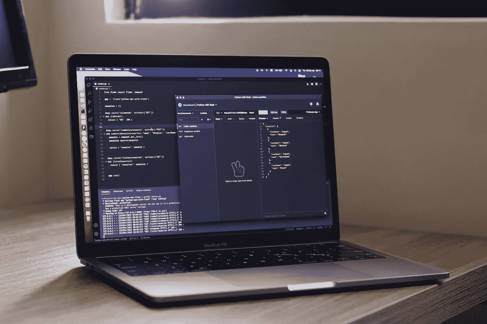

# 用 Django REST 框架实现 REST API

> 原文：<https://medium.com/codex/implementing-a-rest-api-with-django-rest-framework-41999c96fcd6?source=collection_archive---------3----------------------->

道格拉斯·洛佩斯在 [Unsplash](https://unsplash.com/s/photos/python-code?utm_source=unsplash&utm_medium=referral&utm_content=creditCopyText) 拍摄的照片

在之前的[帖子](https://python.plainenglish.io/creating-a-graphql-api-using-python-graphene-and-django-7e102b6ac88c)中，我讨论了用 Python、Graphene 和 Django 实现 GraphQL API。GraphQL 旨在解决 REST APIs 的一些缺点。尽管如此，REST API 仍然被广泛使用，并且很可能许多公司会实现越来越多的 REST API 来补充他们内部的数字化过程。