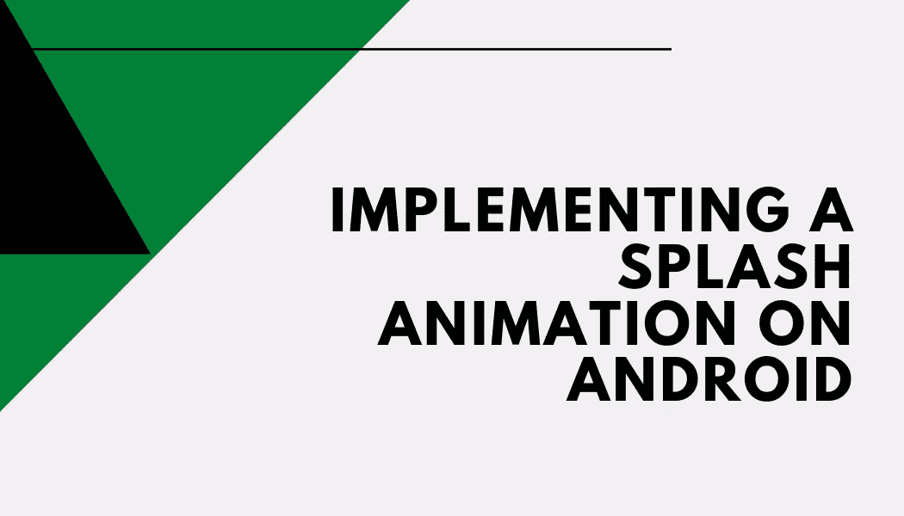

# 在 Android 上用核心闪屏 API 实现闪屏动画

> 原文：<https://medium.com/codex/implementing-a-splash-animation-with-the-core-splashscreen-api-on-android-ec3fe00d105a?source=collection_archive---------2----------------------->

> 在这篇文章中，你将学习如何用 Google 为 Android 12 及以下版本提出的原生解决方案实现一个 splash 动画。

随着 Android 12 的发布，为开发人员引入了新的 API，以便统一启动应用程序时通常显示的 splash 动画，使系统 UI 保持一致。直到现在…