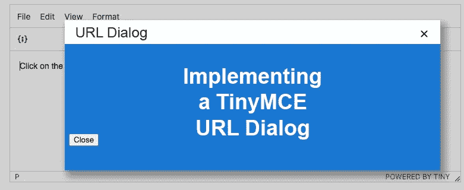
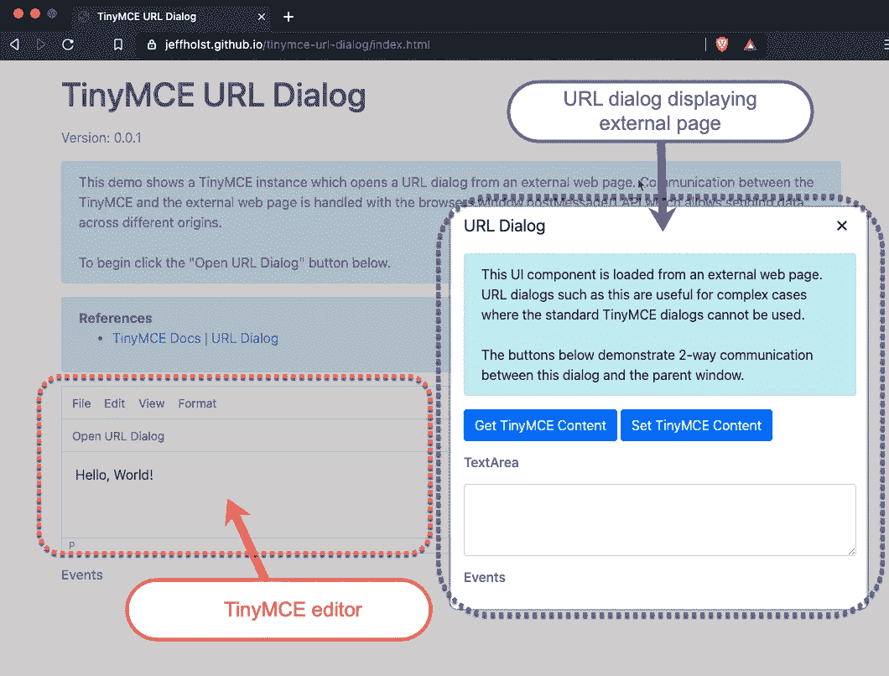
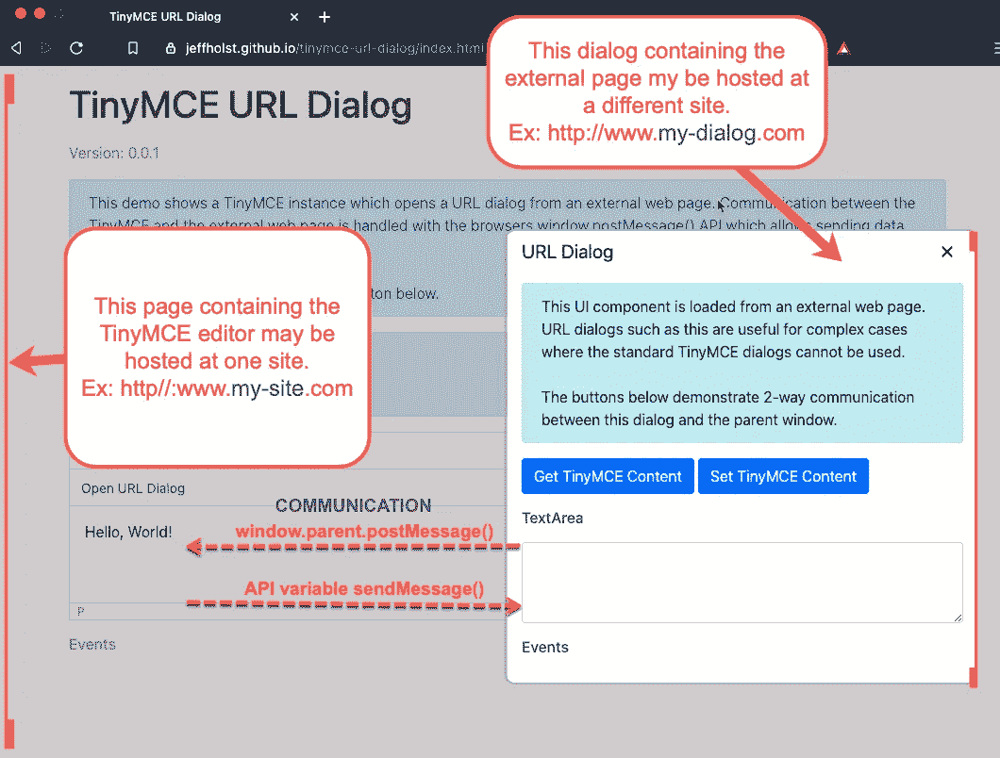
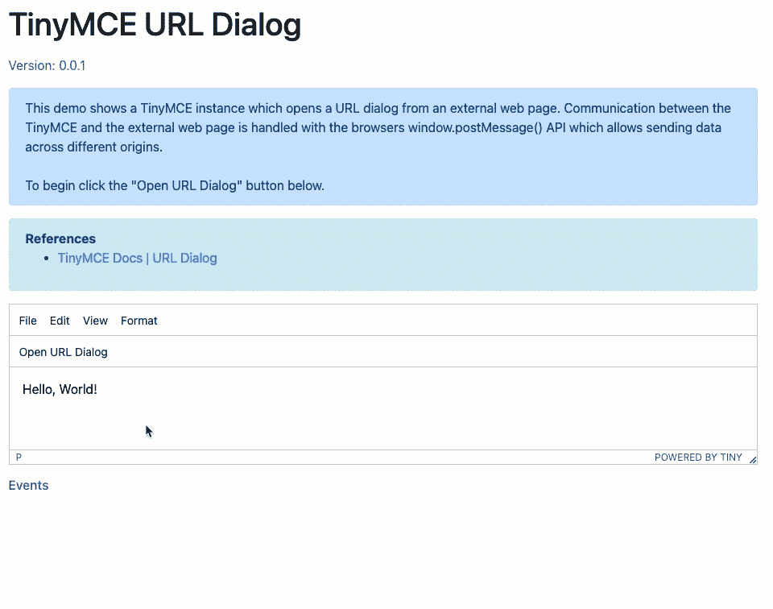
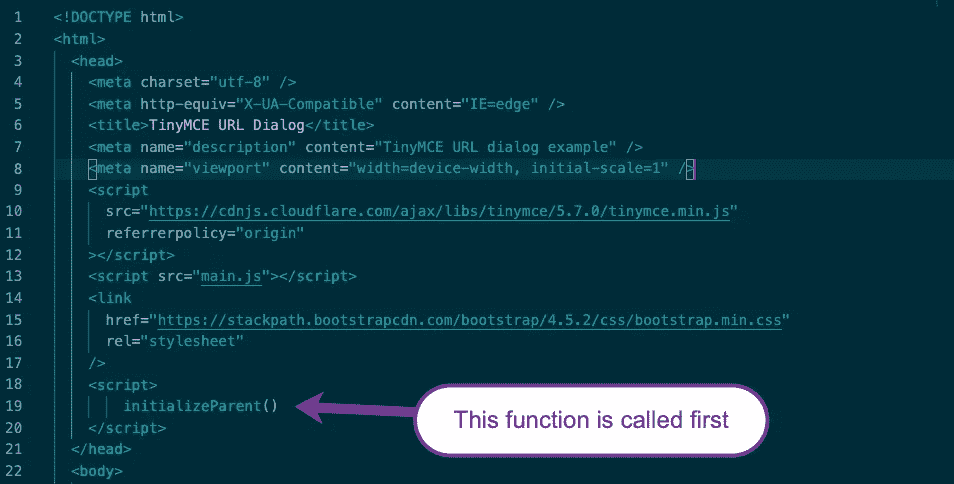
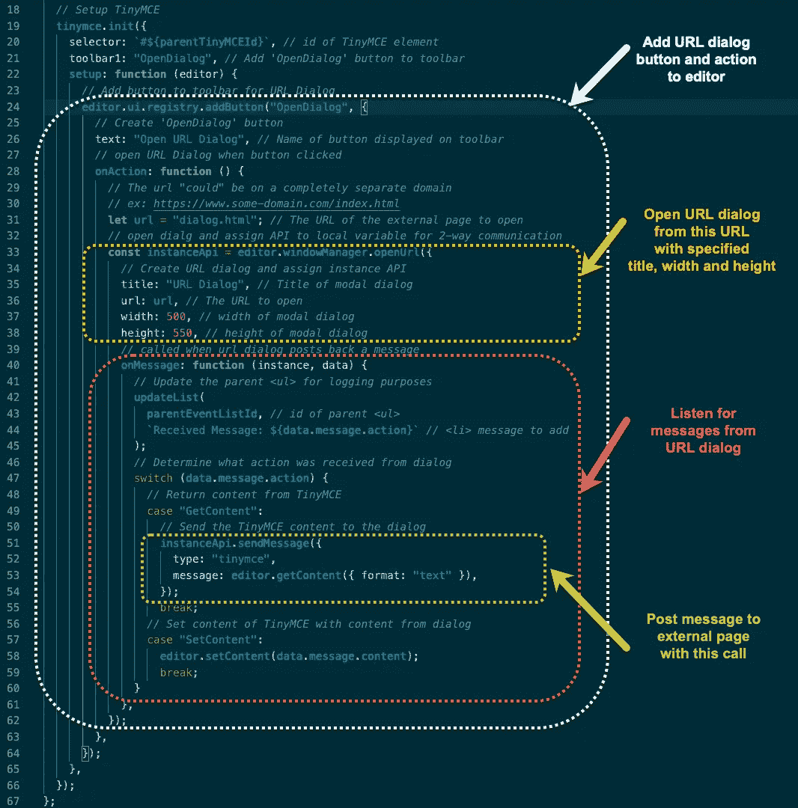
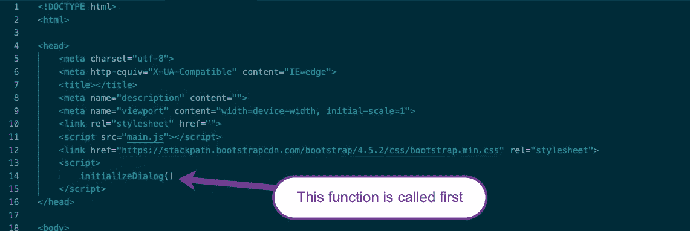
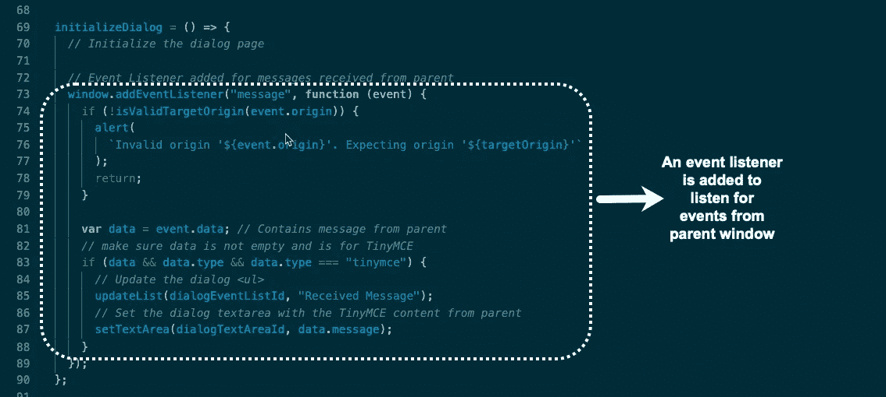
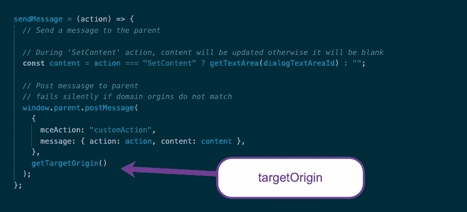
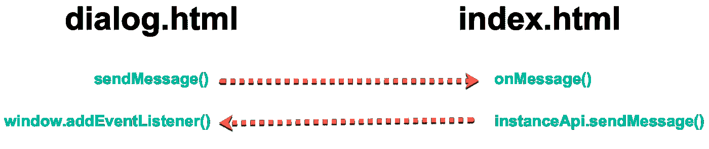

# 实现 TinyMCE URL 对话框

> 原文：<https://medium.com/codex/implementing-a-tinymce-url-dialog-a8419d09c1c6?source=collection_archive---------4----------------------->

## [法典](http://medium.com/codex)



URL 对话框是用来显示外部网页的 TinyMCE UI 组件。这些对话框用于标准 TinyMCE 插件和对话框不能满足需要的场景。URL 对话框中显示的外部页面可能位于与 TinyMCE 父页面完全不同的域中。



**图 1:** 带有 TinyMCE 编辑器和 URL 对话框的网页

# 沟通

TinyMCE 编辑器和外部页面之间的消息传递是用 JavaScript 通过[window . postmessage](https://developer.mozilla.org/en-US/docs/Web/API/Window/postMessage)**()**方法完成的，该方法允许窗口对象之间的跨源通信。



**图 2**:TinyMCE 与外部页面之间的消息传递

为了理解本文的其余部分，您可能希望[打开演示应用程序](https://jeffholst.github.io/tinymce-url-dialog/index.html)并从 [GitHub](https://github.com/jeffholst/tinymce-url-dialog) 下载源代码。

**从 GitHub 克隆演示应用**

```
$ git clone [https://github.com/jeffholst/tinymce-url-dialog](https://github.com/jeffholst/tinymce-url-dialog)
$ cd tinymce-url-dialog
```

**tinymce-url-dialog** 文件夹现在应该包含以下文件:

*   **README.md**
*   **. js**
*   **index.html**
*   **dialog.html**

# 演示演练

1.  在网络浏览器中打开**index.html**文件
2.  点击 TinyMCE 工具栏中的**打开 URL 对话框**按钮，打开一个新的对话框窗口
3.  在 **URL 对话框**中点击**获取 TinyMCE 内容**按钮来检索**“Hello，World！”**父 TinyMCE 编辑器的内容
4.  在 **URL 对话框**中，更新文本区域，说**“你好，银河！”**而不是**“你好，世界！”**
5.  在 **URL 对话框**中点击**设置 TinyMCE 内容**按钮，用新消息更新父 TinyMCE
6.  点击右上角的 **X** 关闭 **URL 对话框**
7.  TinyMCE 内容现在应该说**“你好，银河！”**



**图 3** :演示演练

# 概观

**main.js**

为了简化这个演示，index.html 和 dialog.html 使用的所有 JavaScript 都包含在文件中。

**index.html**

这是项目的起始页，包含 TinyMCE 编辑器。一旦页面加载到浏览器中，就会调用**main.js/initializeParent**()函数。



图四:index.html

**main.js/initializeParent 的**()函数用这些关键特性初始化 TinyMCE:****

*   ****TinyMCE 工具栏上增加了一个**打开 URL 对话框**按钮****
*   ****点击**打开 URL 对话框**按钮触发 **onAction** ()函数，并在模态窗口中打开外部**dialog.html**文件****
*   ****添加了 **onMessage** ()函数来监听来自外部页面的消息****
*   ******sendMessage** () API 调用用于将消息从 TinyMCE 发送到外部页面。****

********

******图 5**:tiny MCE 的 main.js 初始化****

******dialog.html******

****当在 TinyMCE 编辑器中点击**打开 URL 对话框**按钮时，外部**dialog.html**显示为 URL 对话框。一旦页面加载到浏览器中，就会调用**main.js/initializeDialog**()JavaScript 函数。****

********

******图六**:dialog.html****

******main.js/initializeDialog**()函数的关键特性是在页面中添加一个[window . addevent listener](https://developer.mozilla.org/en-US/docs/Web/API/EventTarget/addEventListener)()函数来*监听*来自 TinyMCE 父窗口的消息。****

********

******图 7** : main.js 添加 window.addEventListener()到页面****

```
**The [window.addEventListener](https://developer.mozilla.org/en-US/docs/Web/API/EventTarget/addEventListener)() function is responsible for checking the received **event.origin** to verify it should be accepted and then needs to examine the **event.data** to determine what to do.**
```

****外部**dialog.html**页面通过调用**main.js/sendMessage**()函数中的[window . parent . postmessage](https://developer.mozilla.org/en-US/docs/Web/API/Window/postMessage)向父 TinyMCE 发送消息。****

********

******图 8** : main.js — sendMessage()****

```
****Syntax**: [window.parent.postMessage](https://developer.mozilla.org/en-US/docs/Web/API/Window/postMessage)(message, targetOrigin)**message**: data sent to parent window**targetOrigin:** specifies what the origin of the parent window must be to dispatch the event.  Wildcard(*) indicates no preference otherwise the scheme, hostname, and port of the specified origin must match for the event to be dispatched**
```

# ****交流流程****

********

******图 9** :通信流程****

# ****结论****

****要获得额外的例子和查看 TinyMCE URL 对话框的所有配置选项，请务必查看[官方文档](https://www.tiny.cloud/docs/ui-components/urldialog/#urldialogconfiguration)。****

# ****参考****

*   ****[演示链接](https://jeffholst.github.io/tinymce-url-dialog/index.html)****
*   ****[GitHub 资源库](https://github.com/jeffholst/tinymce-url-dialog)****
*   ****【TinyMCE 入门****
*   ****[TinyMCE Docs | URL 对话框](https://www.tiny.cloud/docs/ui-components/urldialog/)****