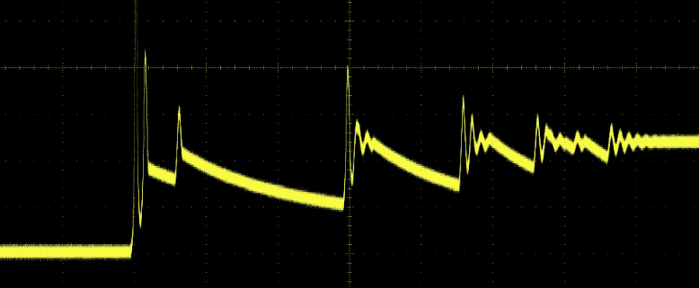
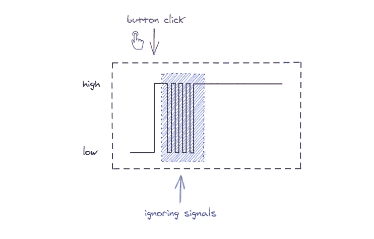
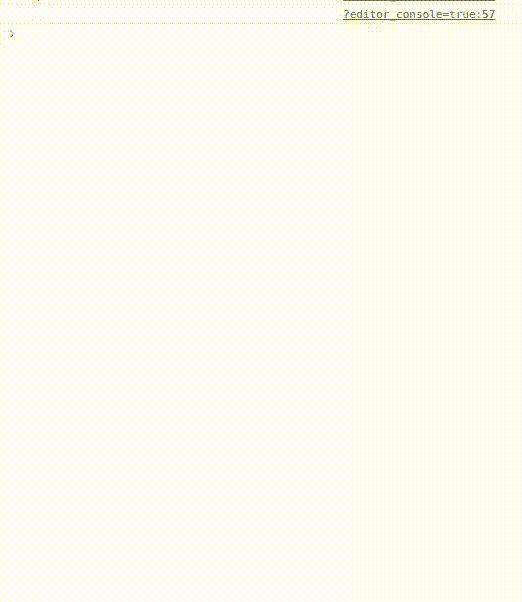
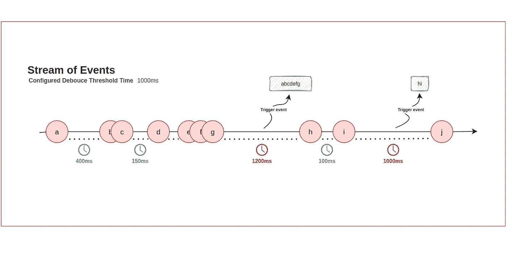

# 在 Javascript 中实现去抖

> 原文：<https://medium.com/codex/implementing-debounce-in-javascript-cf185cd2084b?source=collection_archive---------6----------------------->

## 软件工程

## 什么是去抖，如何实现


形象信用——工作

如果你的背景是移动开发，你可能已经知道什么是去抖。

无论如何，没有多少人听说过它以及它能解决什么问题，但是它非常有用，所以让我们深入研究一下。

术语“*去抖*”最早起源于电子和硬件行业。

# 机械弹跳

弹跳是机械按钮和开关的一种特性，当按下时会产生电噪声。这种噪声掩盖了输入信号，使系统读取错误。



来源— [Pololu 机器人](https://www.pololu.com/)

如果你曾经使用过微控制器之类的东西，你会非常理解这个问题。

简单地解释一下，想象你在卧室里按下电灯开关。开关不会立即与内部接触，会有一点信号反弹。这将导致你的灯在稳定之前开/关两到三次。

[极客酒吧有一篇关于这方面的文章](https://www.thegeekpub.com/246471/debouncing-a-switch-in-hardware-or-software/)。如果您对微控制器中的去抖更感兴趣，一定要去看看。

# 软件反弹

显而易见，反弹问题和解决方案是软件的对应部分。有些与微控制器的*软件方面*有关，因为这个问题也可以通过这种方法解决*。*



插图由 [FreeCodeCamp](https://www.freecodecamp.org/) 提供

然而，这个故事将是关于 *web 应用、后端和移动应用中的输入噪声，*以及它如何影响性能*。*

## 输入信号反弹发生在哪里

您可能遇到这种情况的最常见的地方是:

*   用户输入字段
*   按钮和开关
*   阅读邮件队列

如果您使用消息队列，您可能会利用*去抖*。许多消息协议和库允许您在定义的时间段内读取成批的消息，这基本上是在后台*去抖动*和聚合消息，以便在单个操作中将它们提供给客户端。

在我们手头的例子中，信号本身将由用户产生，例如在一个具有更改监听器的输入字段上。

诸如此类的组件可能会受到噪声或大量预期输入的影响，也可能会被最终用户滥用。

让我们考虑下面的例子:

```
# HTML
<input onKeyUp="inputChanged()" type="text"/># JS
function inputChanged() {
    console.log("Input event detected.");
}
```

这是当您想要监听用户输入更改时的常见情况之一。

*注意* `*onChange*` *没有被使用，因为它只在* `*focus*` *从输入字段移开时发出一个事件。*

从这个意义上说，`onChange`正在自行缓解这个问题。然而，在您想要实时做出反应的情况下，它可能没有那么有用。

每当用户更改输入值时，`onKeyUp`监听器就会发出一个事件。这通常对于例如实时搜索特征是有用的。

这里的问题是在字段`onKeyUp`中输入一些东西会在很短的时间内产生很多事件。



作者截屏

如果你正在过滤一些结果，用户界面可能会变得断断续续，你的性能将受到影响。

也许您需要实现一个模糊搜索，并且搜索应该实时发生，而不需要等待用户点击提交。为了检索结果，需要发送 HTTP 请求，发送这么多请求显然没有好处。

为了进一步解释问题的本质，让我们暂时回到消息队列。例如，您可以为 Kafka 消费者客户端配置您想要的批量大小，以及您想要接收每个批次的时间段。

```
# Sample pseudo consumer
var consumer = kafka.client()
    .batch(100)
    .in(1000ms);consumer.poll();
```

上面的伪代码将配置 Kafka 客户端获取消息，要么每秒一次，要么一收到 100 个事件就获取。你明白了。

这可能是去抖的基础，但还有更多。我们实际上并不希望每当一批事件*达到时间阈值*或*数量标记*时就消耗掉它们，但是我们希望一旦*完成接收*时就消耗掉它们。

本质上，对于任何给定的正在进行的流，我们都很难做出决定，因此为了缓解这个问题，我们希望在两个事件信号之间实现一个超时，如果经过了一个时间段，就会触发我们的批量读取。

# 解决办法

如上所述，说明去抖、事件和两个接收事件信号之间的超时周期将如下所示。



作者插图

对于去抖方法，我们需要一个超时或阈值时间，并且我们希望仅在超时时触发一个事件。

图表显示了当定时器 ie。两个事件之间经过的时间小于 1000 毫秒的阈值。我们只在 1000 毫秒过后触发一个功能。

流中的最后一个事件自然也会被使用，只是在这种情况下它自己会被使用，并且在 1000 毫秒后再次触发该函数。

简单地说，我们试图预测流中的最后一个事件。阈值时间应根据具体情况进行调整。如果我们想更及时地做出反应，我们应该配置一个更小的时间阈值。如果我们想确保某些逻辑只在我们确实得到“几乎最后”事件时才被触发，我们应该将它设置为一个较高的值。

较小的数量通常有利于面向响应用户的应用程序。当读取消息队列时，我们可能不需要立即读取事件，因此更高的阈值时间将节省我们宝贵的执行时间。

Javascript 中有许多库，尤其是在不同的框架中。

实现去抖方法的一个简单方法是使用`setTimeout`,如下面的代码片段所示:

```
# HTML
<input id="input-field" onKeyUp="inputChanged()" type="text"/># JS
const inputField = document.getElementById("input-field");function getResult() {
   console.log("Input event detected.");
   console.log(inputField.value);
   // Do something with the input
}const debounce = {
   isWaiting: false,

   submit: function (func) {
      if (!this.isWaiting) {
        this.isWaiting = true;

         setTimeout(() => {
             func.apply();
             this.isWaiting = false;
         }, 1000);
      }
   }
}function inputChanged() {
 debounce.submit(getResult);
}
```

上面代码片段中的`debounce`对象将简单地允许我们`submit`任务，但是它将检测提交是否已经等待执行，如果是，简单地跳过提交另一个任务。

这是一个非常天真的方法，没有利用*阈值计时器*，但是它抓住了问题和可能的解决方案。

一种更复杂的方法要求我们跟踪事件之间经过的时间，因为我们希望仅在时间段*到期*时触发一个函数。

普通的 Javascript 方法如下所示:

```
# HTML
<input id="input-field" onKeyUp="inputChanged()" type="text"/># JS
const inputField = document.getElementById("input-field");function getResult() {
   console.log("Input event detected.");
   console.log(inputField.value);
   // Do something with the input
}const debounce = {
   timerId: 0,
   timeout: 1000,

   submit: function (func) {
       this.cancel();

       this.timerId = setTimeout(() => {
           func.apply(this);
       }, this.timeout);
   },

   cancel: function() {
       clearTimeout(this.timerId);
   }
}function inputChanged() {
 debounce.submit(getResult);
}
```

## 要点

剖析上面的片段，重点是:

*   提交任务会设置一个带有阈值时间的计时器
*   每个随后的*事件*将取消计时器
*   从而延长了执行时间。延迟事件的*读取*
*   仅当阈值时间过去后，才执行任务
*   即。它没有被另一个事件延长

上面的代码片段复制了之前在*事件流*图中所说和说明的内容。

我强烈建议多看一些关于去抖的内容。网络上有许多帖子在不同的环境下更详细地解释了这个问题，并展示了不同的用例。

[Trey Huffine](https://medium.com/u/47e700e59e44?source=post_page-----cf185cd2084b--------------------------------) 很好地解释了这个问题，在他的[*Javascript Medium story*](https://levelup.gitconnected.com/debounce-in-javascript-improve-your-applications-performance-5b01855e086)中用一种简洁的方法解决了这个问题。看看这个。

如果你是 lodash 的粉丝，你可能想看看[他们的文档](https://lodash.com/docs/4.17.15#debounce)，因为他们有一个`debounce`方法可以使用。

RxJS 显然也有一个实现，但是即使您个人没有使用它，也要确保查看文档，因为它很好地阐释了这个概念。下面的 RxJS 文档激发了我绘制图解的灵感——事件流。

*   [rxjs/API/操作员/去抖](https://rxjs.dev/api/operators/debounce)

这个故事是关于一个没有多少人知道的概念，但是对于不同的软件工程领域、语言、平台和框架是通用的。

如果你想知道更多关于去抖的知识，如果你有任何建议，或者如果你在故事和代码片段中发现了一个错别字，请随时写下评论！

希望你喜欢它，并且觉得读起来很有趣。如果是这样，请查看[我的个人资料，点击](/@be-ja)关注并订阅我的时事通讯，收听我将要写的关于软件工程概念的新故事。

感谢您的阅读！🎉