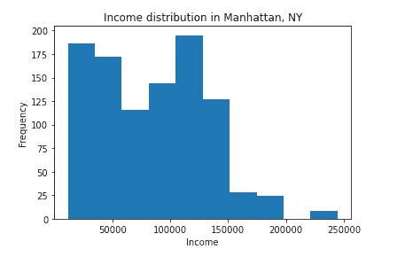
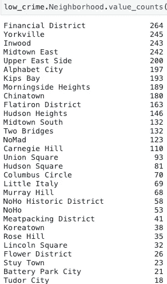
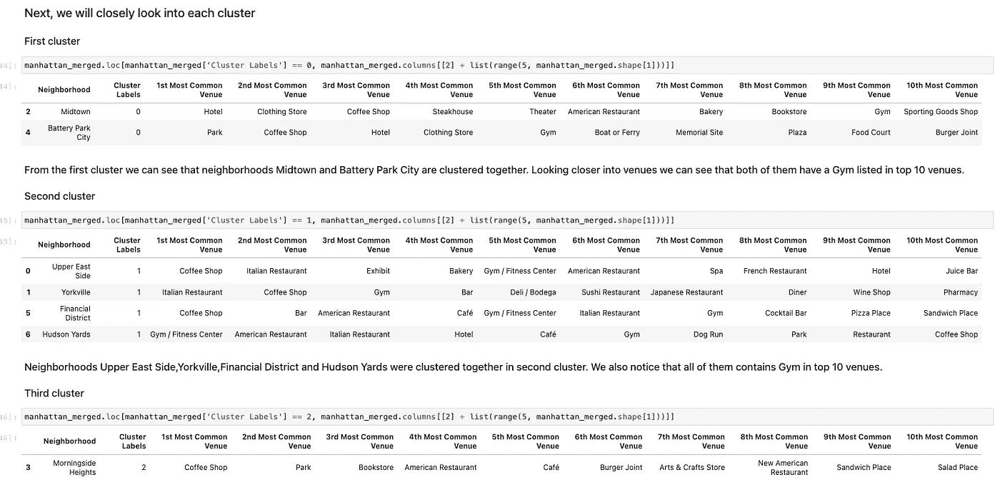

# 实现 K-means 聚类来解决业务问题

> 原文：<https://medium.com/codex/implementing-k-means-clustering-to-find-an-optimal-location-to-open-an-exclusive-gym-in-manhattan-bc192c39587?source=collection_archive---------12----------------------->

艾莉娜·格鲁布尼亚克在 [Unsplash](https://unsplash.com?utm_source=medium&utm_medium=referral) 上的照片

## **目录**

1.  介绍
2.  数据
3.  方法学
4.  结果
5.  结论

# **简介:**

虽然令人兴奋，但创办新企业也有很大的风险。一项新业务的成功需要考虑许多因素，如地点、竞争、安全。这个项目的目的是在纽约曼哈顿找到一个开设专属健身房的最佳地点。为了回答一个正在寻找开设一家新的独家健身房的最佳区域的客户的问题，我们首先必须确定哪些社区被认为是安全的，找到哪些社区有高收入，并调查附近的竞争，因为我们希望一个竞争不是很激烈的区域来增加成功的机会。

# **数据:**

本项目中使用了以下数据集:

*   纽约市人口普查确定高收入社区
*   NYPD 逮捕以确定最安全的社区
*   纽约市行政区和邻近地区的经度和纬度数据
*   场馆数据来自 Foursquare API

# **方法论:**

第一步是使用人口普查数据集找到高收入的曼哈顿社区。为了实现这一点，我们将合并人口普查区域和人口普查区块数据集，并过滤以仅保留包含曼哈顿收入信息的数据。由于我们需要从纬度和经度数据中提取邻域信息，因此我们将使用反向地理编码从地址中提取邻域，并在数据框中创建两个新列:邻域和郊区。我们需要郊区信息的原因是，我们注意到一些行缺少邻域信息，但有郊区数据，我们将使用这些数据只过滤曼哈顿的数据。图一。显示包含 41 列和 18，000 多行的合并普查数据。

图一。合并普查数据

一旦我们有了所有的邻居，下一步我们关注收入。图二。代表收入的分配。我们正在寻找高收入的社区，因此数据被过滤在年收入超过 10 万美元的社区中。结果，我们得到了 16 个街区的列表(图 3。)

图二。收入分配

图 3。收入超过 10 万英镑的社区

下一步是找到犯罪率低的社区。为此，我们将使用 NYPD 逮捕数据集。该数据集包含大量信息，包括犯罪日期和时间、犯罪类型、犯罪人的性别、年龄等。出于我们的目的，我们缩小了日期、犯罪类型、逮捕区以及纬度和经度的属性范围。图 4。从犯罪频率来看，我们可以看到小盗窃、袭击和入室盗窃是曼哈顿的前三大犯罪。与之前的数据集一样，我们将使用反向地理编码器来提取犯罪发生地附近的信息。

图 4。犯罪的类型和频率

一旦我们做到了这一点，我们就仔细研究了曼哈顿社区的犯罪频率，将阈值设定为不到 300 起。我们的结果是列出了 30 多个犯罪率低的社区。5

图 5。犯罪率低于 300 的社区

作为最终结果，我们得到了低犯罪率街区和高收入街区列表之间的交集，我们总共有 7 个街区将用于进一步分析:*炮台公园城、金融区、哈德逊广场、中城东部、晨边高地、上东区*和*约克维尔*。为了对街区进行细分和探索，我们需要一个包含纽约市 5 个区及其街区的数据集，并提供每个区的经度和纬度信息。我们创建了一个数据集，其中包含常见的邻域及其地理位置。接下来，我们利用 Foursquare API 来获取我们附近的场馆信息，并按频率对它们进行排序，只得到前 10 个最常出现的场馆。

上面的所有工作都是为下一步应用 K-Means 机器学习算法对我们的数据进行聚类而准备的。数据中心性的度量可用于分析不同观察组的平均值之间的差异。我们可以利用这种差异来确定观察值是否属于同一组。一个组中的所有数据点都应该围绕它们的中心值聚集。我们使用两种方法来确定最佳 K 值。首先，我们使用肘方法，该方法依赖于一个称为惯性的计算值，它是每个点与其最近的 K 均值中心之间距离的平方之和。如果 K 为 1，则惯性等于到数据集均值的所有平方距离的总和。图 6。表示弯头图

图。6 肘形图确定最佳 K 值

第二，我们使用轮廓分数，它捕捉每个点到相邻聚类的距离。它可用于研究所得簇之间的分离距离。轮廓图显示了一个聚类中的每个点与相邻聚类中的点的接近程度，从而提供了一种可视化评估聚类数量等参数的方法。这个度量的范围是-1，1。较高的轮廓分数将指示最佳 K 值。我们得出结论，3 是一个最佳的数字 K 值的基础上，我们获得的结果肘法和剪影评分。

## 结果和讨论:

在将 K-Means 聚类算法应用到我们的数据集之后，我们将每个邻域分配到 3 个聚类中的一个。我们使用叶图来可视化曼哈顿地图上的集群(图 7。)

图 7。在地图上可视化集群

接下来，我们仔细检查了每个集群及其附近的场地

图 8。簇

*从第一个聚类中，我们可以看到街区*中城*和*炮台公园城*聚集在一起。仔细观察场馆，我们可以发现这两个场馆都有一个健身房位列前十。

*街区*上东区、约克维尔、金融区*和*哈德逊码头*聚集在第二个集群中。我们还注意到，排名前十的场馆都有健身房。

*在第三个集群中，我们只有一个邻居: *Morningside Heights。*仔细观察场馆，我们可以发现这是 10 个最常见场馆中唯一没有健身房的集群。

# **结论:**

在这个项目中，我们希望找到一个开设专属健身房的最佳位置。为了替我们的客户回答这个问题，我们必须采取一些步骤。我们的方法是根据收入、犯罪率和附近的竞争来评估曼哈顿社区。一旦我们有了高收入和低犯罪率的社区，我们就使用 Foursquare API 来获得这些地区最常见的场地。我们应用 K-Means 对邻近区域进行聚类，并使用 follow map 将它们可视化在曼哈顿的地图上。分析每一个集群，我们得出结论，第三个集群，包含附近的*晨边高地*，将是开设健身房的最佳位置。

有详细代码的 Jupyter 笔记本可以在这里找到:[https://github . com/sivosevic/Coursera _ Capstone/blob/master/IBM _ Capstone _ Notebook . ipynb](https://github.com/sivosevic/Coursera_Capstone/blob/master/IBM_capstone_Notebook.ipynb)

这篇文章是 IBM 数据科学顶点项目的一部分。

你可以在[https://medium.com/@eellaaivo](/@eellaaivo)查看我的其他作品

感谢阅读！