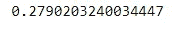

# 用 Python 实现“多元线性回归”算法。

> 原文：<https://medium.com/codex/implementing-multi-variable-linear-regression-algorithm-in-python-46fe50f31e5d?source=collection_archive---------4----------------------->


潘卡杰·帕特尔在 [Unsplash](https://unsplash.com?utm_source=medium&utm_medium=referral) 上的照片

机器学习算法在过去十年中获得了巨大的普及。今天，这些算法被用于各种数据处理和预测的多个工作领域。

在本教程中，我们将实现最基本的机器学习算法，称为“*”。如果我们用一行文字来描述线性回归，大概是这样的:*

> ****“通过您的数据点拟合一条直线*”***

*这是一个有监督的机器学习算法。如果你想了解无监督算法，[点击这里](https://writersbyte.com/datascience/implementing-k-means-clustering-with-k-means-initialization-in-python/)。*

*本教程将包括 **3 个主要部分**:*

*逐步理解和实现算法。*

*将构建的算法应用于二维数据(为了更好的可视化)。*

*对 n 维数据应用算法。*

**** *本教程中使用的全部代码可以在下面的** [**GitHub 库**](https://github.com/Moosa-Ali/Linear-Regression-Implementation.git) ****中找到。***

*让我们开始吧。*

# ***分步实施***

## ***基本理解***

*正如我们之前所讨论的，线性回归就像在我们的数据上拟合一条直线一样简单，因此为了基本的理解，我们需要重温一些基本的数学知识，看看直线的方程。*

**

*直线的方程式*

*上式中， ***X*** 和 ***Y*** 为数据点， ***m*** 和 ***c*** 分别为斜率和 Y 轴截距。我们需要' **m** '和' **c** '的适当值，以便创建一条适当的直线。*

*假设我们有多个值' ***X*** '，我们有一个单独的' ***Y*** '，那么我们可以改变上面的等式来创建一个更一般的等式，如下所示:*

**

*n 变量线性方程*

*现在我们需要的不是 m 和 c，而是 c 和从 a_0 到 a_n 的所有系数，这就是多元线性回归的完整概念。*

## ***实施***

*我们将需要以下基本数学功能和可视化库。*

*首先，我们定义一个函数，它将从 c 和 a 的一些给定值中返回 Y 的预测值(习惯上称为 **Y-hat** )*

*接下来，我们需要计算我们离 y 的原始值有多远。用机器学习的术语来说，这叫做计算**成本**。定义了几种不同的成本函数，但对于我们的情况，我们将使用传统的"**均方误差"**。 **MSE** 的作用是:*

**

*计算均方误差的公式*

*让我们把这个编码下来:*

*我们的目标是最小化由上述函数计算的成本，以便尽可能接近原始值。*

*为此，我们需要了解我们的每个参数如何影响总成本。这可以通过 ***计算每个参数的变化率来实现，也称为梯度*** 。这些方程式是:*

**

*关于偏差和系数的梯度*

*为了使成本最小化，我们需要进行一个叫做**“梯度下降”**的过程。下图显示了相对于参数值绘制的特定参数的成本。为了达到最小的成本，我们必须改变我们的参数值，这就是我们的更新方程使用的地方。*

**

*图片来源:[http://rasbt . github . io/mlx tend/user _ guide/general _ concepts/gradient-optimization _ files/ball . png](http://rasbt.github.io/mlxtend/user_guide/general_concepts/gradient-optimization_files/ball.png)*

*更新我们的参数值的最终等式如下，*

**

*更新相关参数的方程式*

*上式中的**α**称为 ***学习率。*** 其值需要优化设置，过小的值会使参数更新非常缓慢，过大的值会导致更新后的参数过冲，永远不会收敛到全局最小值。*

*让我们以通用方式编码这些更新方程，使得 n 个参数可以被更新。*

*有了所有的函数，我们只需要创建一个调用这些函数的训练例程，以最小化成本并找到合适的参数。*

# ***测试***

*现在是时候测试我们的算法了。我们将首先在一个更简单的数据集上进行测试。数据集可以从[这里](https://www.kaggle.com/andonians/random-linear-regression?select=train.csv)免费下载。数据的过滤和可视化步骤在下面执行。*

**

*样本数据值*

**

*这些数据似乎有一个清晰的线性关系，因此它将为我们提供一个很好的洞察我们的算法如何工作。*

*我们将使用**最小-最大缩放技术**对数据进行标准化。让我们为最小-最大缩放定义一个函数。(有几个库可以帮你做到这一点，但是编写代码更有趣)*

```
*data_scaled = min_max_scaler(data_train)*
```

*标准化完成后，我们可以开始在模型上拟合数据。*

```
*X_train = data_scaled["x"].values.reshape(-1,1)
y_train = data_scaled["y"].values.reshape(-1,1)
coeff, intercept, preds = fit(X_train, y_train, iterr = 3000)*
```

**

*最后成本*

*我们运行我们的过程 3000 次迭代。我们的最终损失是一个非常低的值，所以我们可以说这是一个很好的拟合。让我们想象一下结果。*

**

*适合训练数据*

**

*符合测试数据*

*我们可以看到，我们的模型在训练集上非常准确，在测试集上也相当不错。如果对模型进行更多迭代训练，结果可能会有所改善。(实验由你决定😀)*

*测试检查我们模型的另一个好方法是***【R 平方值】*** 也称为 ***【拟合优度】。为此，我们将使用 sklearn 库(因为有时你会厌倦编码😅).****

```
***from** **sklearn.metrics** **import** r2_score  
print("R_square Score:",r2_score(data_test["y"],y_pred))*
```

**

*上面的分数表明 **92.6%的拟合优度**是一个相当好的数字。*

# ***对 n 维数据的测试***

*现在来看看我们的算法是否真的适用于 n 维数据。为此，我们使用了 ***房价数据集*** 。(原始数据集有许多特征，但我们只选择了其中的几个进行测试)*

*由于大多数特征都是*字符串*类型，我们将它们转换成数字标签。*

**

*房价数据集*

*我们像以前一样标准化数据集，并将其设置为训练 2000 个时期。*

```
*weights, biases, y_predicted = fit(X_train,y_train, iterr = 2000)*
```

**

*住房数据的最终成本*

*正如我们所料，最终的成本还是很低。现在让我们检查一下" ***R 的平方值*** "*

```
***from** **sklearn.metrics** **import** r2_score
print(r2_score(y_test,predicted))*
```

**

*27.9%的拟合优度*

**拟合优度*似乎很低，这可能有多种原因；运行算法进行更多次迭代可能会增加分数，或者随着输入参数数量的增加，数据的复杂性也会增加，因此数据之间很难存在线性关系。*

# ***结论***

*我们已经使用 **Python** 成功实现了**线性回归**算法，并在我们的初始数据集上实现了相当好的拟合。我们在第二个(多变量)数据集上没有得到很好的分数，因为如此复杂的数据集很难遵循线性趋势。对于像这样的数据集，有诸如“**多项式回归**或 **SVM** 的算法。这些算法稍微复杂一点，但是它们获得了好得多的分数。*