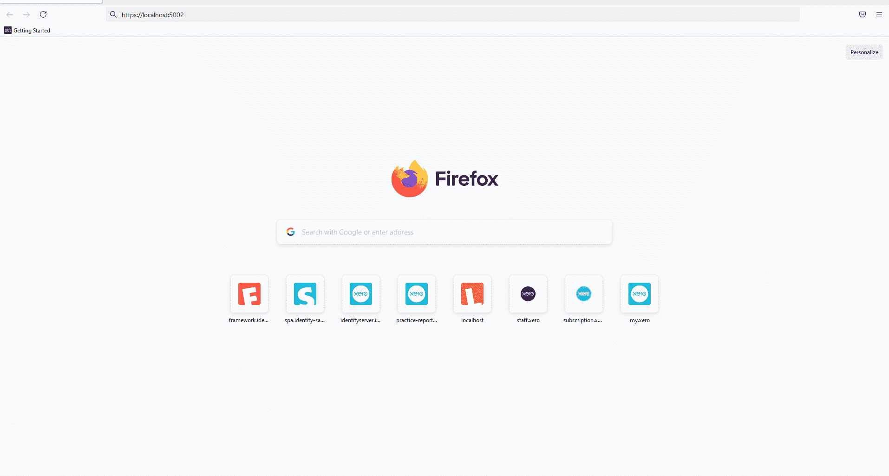

# 实现无密码身份验证现在变得非常简单——第 2 部分

> 原文：<https://medium.com/codex/implementing-passwordless-auth-is-now-stupidly-easy-part-2-e714c932b79b?source=collection_archive---------2----------------------->

在我的[上一篇文章](/@christopher.keogh/implementing-passwordless-auth-is-now-stupidly-easy-part-1-e2f5430a1ed3)中，我概述了为什么我们应该考虑放弃使用密码来认证用户，而不是使用无密码认证。在第二部分中，我们将探索如何使用 Dotnet core 3.1、IdentityServer4 和 FIDO2.NET 库实现无密码认证流程。

所有这些工具都可以作为开源技术免费获得。要运行本文中使用的示例，你要么需要某种形式的[认证器](https://www.w3.org/TR/webauthn-1/#authenticator)设置，比如 Windows Hello、Apple ID 或 Yubikey，要么你可以使用 [Chrome 的开发工具](https://developer.chrome.com/docs/devtools/webauthn/)中提供的 WebAuthn 虚拟环境。

我选择 IdentityServer4 是因为它是 [Open ID Connect 规范](https://openid.net/specs/openid-connect-core-1_0.html)的成熟开源实现，并且非常容易安装和运行。本文中使用的工作示例代码[可在 GitHub](https://github.com/dbfr3qs/PasswordlessAuthExample) 上获得，它基于 IdentityServer4 提供的[模板生成工具](https://docs.identityserver.io/en/dev/quickstarts/0_overview.html)。我不打算详细介绍生成 IdentityServer 和本文中提到的示例 MvcClient 的所有步骤，因为 IdentityServer 自己的[快速入门文档](https://docs.identityserver.io/en/dev/quickstarts/0_overview.html)已经足够详细地介绍了这些步骤。然而，如果你有兴趣从零开始，你只需要遵循第[第](https://docs.identityserver.io/en/dev/quickstarts/1_client_credentials.html)和第[第三](https://docs.identityserver.io/en/dev/quickstarts/3_interactive_login.html)教程。

我将频繁引用[示例 GitHub 库](https://github.com/dbfr3qs/PasswordlessAuthExample)而不是遍历每一行代码，同时重点概述相关的请求流并突出任何有趣的代码。

## 入门指南

首先，确保克隆[passoldless auth GitHub 库](https://github.com/dbfr3qs/PasswordlessAuthExample),其中包含启动和运行所需的所有代码。在运行 IdentityServer 项目之前，只需运行 dotnet restore 和 dotnet build:


确保还运行 MvcClient 示例应用程序:


在我们的示例中，我们在 HTTPS 端口 5010 上运行 IdentityServer，在 HTTPS 端口 5002 上运行 MvcClient 示例(我完全是随意选择端口的)。启动并运行后，您应该能够使用用户名和密码“alice”直接登录 IdentityServer，并且现在应该能够登录 MvcClient 示例:


## 无密码流程概述

现在，在研究如何在本例中实现无密码身份验证之前，让我们先看看无密码身份验证流程及其工作原理。我基本上已经把 FIDO2.NET 的[演示](https://github.com/passwordless-lib/fido2-net-lib/tree/master/Demo)应用到这个项目中，做了一些小的改动。

在我的[上一篇文章](/@christopher.keogh/implementing-passwordless-auth-is-now-stupidly-easy-part-1-e2f5430a1ed3)中，我简要概述了注册和认证过程，它们共同构成了 WebAuthn 规范中描述的无密码认证。让我们看看示例中这些流程的实现，从注册流程开始，它允许现有的 IdentityServer 用户(在这种情况下，我们坚持使用“alice”)设置无密码身份验证。


无密码注册流程实施的高级概述。

我们可以看到 IdentityServer 传递了一个凭据选项对象，浏览器使用该对象为现有 IdentityServer 用户创建新凭据。此凭据特定于 IdentityServer 的域(localhost:5010)，不能用于任何其他网站。该凭证由认证器生成，并由用户通过[授权手势](https://www.w3.org/TR/webauthn-1/#authorization-gesture)进行授权(例如，启用生物指纹扫描进行授权的 Windows Hello)。凭证由公钥/私钥对组成。私钥由身份验证者存储在本地，公钥回发到 IdentityServer 以存储在服务器端。更深入的技术解释请见我的[上一篇](/@christopher.keogh/implementing-passwordless-auth-is-now-stupidly-easy-part-1-e2f5430a1ed3)。

接下来，让我们看看实际的身份验证流程，一旦注册流程完成，用户就可以使用这个流程。


无密码身份验证流程实施的高级概述。

在很多方面，认证流程类似于注册流程。我们的 IdentityServer 实现将一组 assertionOptions 交给浏览器[，浏览器然后向认证者请求相关的凭证](https://developer.mozilla.org/en-US/docs/Web/API/CredentialsContainer/get)。在对用户进行身份验证之前，要求用户同意允许身份验证者将凭据传递回浏览器，并将此凭据发送回 IdentityServer 以验证它是否有效。我在这里使用了术语凭证签名，而我应该使用术语[断言签名](https://www.w3.org/TR/webauthn-1/#assertion-signature)。实际回发到 IdentityServer 的是验证者使用私钥/公钥算法创建的签名。私钥位于用户的认证器中，用于生成一个签名，该签名由 identity server——[依赖方](https://www.w3.org/TR/webauthn-1/#webauthn-relying-party)用它存储在服务器端的相关公钥进行验证。

## 启动并运行我们的无密码实现

现在我们对每个流程中实际涉及的内容有了更好的理解，让我们更仔细地看看我们的示例实现。

我已经添加了一个新的[无密码控制器](https://github.com/dbfr3qs/PasswordlessAuthExample/blob/master/src/IdentityServer/Controllers/Account/PasswordlessController.cs)到控制器文件夹。我从 FIDO2.NET 库中复制并粘贴了[演示控制器](https://github.com/passwordless-lib/fido2-net-lib/blob/master/Demo/Controller.cs)，并做了一些小的改动，稍后我会回来介绍。

我还向 IdentityServer 项目添加了两个新视图。一个用于[无密码登录](https://github.com/dbfr3qs/PasswordlessAuthExample/blob/master/src/IdentityServer/Views/Account/PasswordlessLogin.cshtml)，一个用于[注册](https://github.com/dbfr3qs/PasswordlessAuthExample/blob/master/src/IdentityServer/Views/Account/PasswordlessRegistration.cshtml)。我还在[登录视图](https://github.com/dbfr3qs/PasswordlessAuthExample/blob/cfbeb3c586ab058dc8b74d51431c6fe9e31865ed/src/IdentityServer/Views/Account/Login.cshtml#L44)中添加了第三个按钮，专门用于无密码登录。对于注册，我们将把它添加到[共享导航标题](https://github.com/dbfr3qs/PasswordlessAuthExample/blob/cfbeb3c586ab058dc8b74d51431c6fe9e31865ed/src/IdentityServer/Views/Shared/_Nav.cshtml#L30-L35)中，并使它仅在用户登录后才可见。


我们还想向帐户控制器添加两个新的端点[来加载我们的](https://github.com/dbfr3qs/PasswordlessAuthExample/blob/cfbeb3c586ab058dc8b74d51431c6fe9e31865ed/src/IdentityServer/Controllers/Account/AccountController.cs#L181-L189)[无密码视图](https://github.com/dbfr3qs/PasswordlessAuthExample/tree/master/src/IdentityServer/Views/Account)。

要使这些工作，我们需要添加一些 Javascript，将认证者、浏览器和依赖方(IdentityServer)之间的流粘合在一起。一个文件用于[无密码登录](https://github.com/dbfr3qs/PasswordlessAuthExample/blob/master/src/IdentityServer/wwwroot/js/passwordless.login.js)，一个文件用于[注册](https://github.com/dbfr3qs/PasswordlessAuthExample/blob/master/src/IdentityServer/wwwroot/js/passwordless.register.js)。我也从 FIDO2.NET 的演示中复制并粘贴了演示 javascript，做了一些很小的修改。

为了让我们的无密码流工作，我们需要在[启动类](https://github.com/dbfr3qs/PasswordlessAuthExample/blob/master/src/IdentityServer/Startup.cs)中为 FIDO2.NET 库设置一些代码。FIDO2.NET 需要 NewtonSoftJson 包才能正常工作，所以一旦安装好，我们需要添加它:

```
services.AddControllersWithViews().AddNewtonsoftJson();
```

安装程序代码的剩余部分:

```
services.AddFido2(options =>
    {
        options.ServerDomain = Configuration["fido2:serverDomain"];
        options.ServerName = "IdentityServerPasswordlessTest";
        options.Origin = Configuration["fido2:origin"];
        options.TimestampDriftTolerance = Configuration.GetValue<int>("fido2:timestampDriftTolerance");
        options.MDSAccessKey = Configuration["fido2:MDSAccessKey"];
        options.MDSCacheDirPath = Configuration["fido2:MDSCacheDirPath"];
    })
    .AddCachedMetadataService(config =>
    {if (!string.IsNullOrWhiteSpace(Configuration["fido2:MDSAccessKey"]))
        {
            config.AddFidoMetadataRepository(Configuration["fido2:MDSAccessKey"]);
        }
        config.AddStaticMetadataRepository();
    });
```

我们还需要 appsettings.json 中的一些配置设置:

```
{
    "fido2": {
        "serverDomain": "localhost",
        "origin": "https://localhost:5010",
        "timestampDriftTolerance": 300000,
        "MDSAccessKey": null
    }  
}
```

为了节省时间，我还从 [LoginInputModel](https://github.com/dbfr3qs/PasswordlessAuthExample/blob/cfbeb3c586ab058dc8b74d51431c6fe9e31865ed/src/IdentityServer/Controllers/Account/LoginInputModel.cs#L13) 类的 password 属性中删除了 **required** 属性，因为我们将重用这个类进行无密码登录。创建一个单独的无密码输入模型可能是更好的实践，但是我们将只修改已经存在的模型。

这应该是启动和运行注册所需的一切:


登录，然后注册无密码身份验证流程。

…随后，您应该能够使用无密码身份验证流程登录:



使用无密码流程登录我们的 MvcSample 应用程序。

## 集成 FIDO2.NET 和身份服务器 4

在[无密码控制器](https://github.com/dbfr3qs/PasswordlessAuthExample/blob/master/src/IdentityServer/Controllers/Account/PasswordlessController.cs)中有两段重要的代码需要注意。在 MakeCredentialOptions 方法中，我们[检查用户是否存在于我们的 IdentityServer 用户存储中](https://github.com/dbfr3qs/PasswordlessAuthExample/blob/f6b0a60e232fd182b4f8be0f30884aae26dc5301/src/IdentityServer/Controllers/Account/PasswordlessController.cs#L51-L55)(我们无法验证不存在的用户):

```
*// user must already exist in Identity* var identityUser = _users.FindByUsername(username);
if (identityUser == null) {
    throw new Exception("User not found");
}
```

我们还检查[用户是否真正通过了认证](https://github.com/dbfr3qs/PasswordlessAuthExample/blob/f6b0a60e232fd182b4f8be0f30884aae26dc5301/src/IdentityServer/Controllers/Account/PasswordlessController.cs#L51-L55):

```
if (!HttpContext.User.IsAuthenticated())
{
    throw new Exception("User is not authenticated");
};
```

在这个例子中，我们实际上有一个[单独的内存用户存储](https://github.com/dbfr3qs/PasswordlessAuthExample/blob/f040d183364460a7035f86c534462aad042321c3/src/IdentityServer/Controllers/Account/PasswordlessController.cs#L24)，供我们的无密码用户使用，由 FIDO2.NET 图书馆提供，[DevelopmentInMemoryStore](https://github.com/passwordless-lib/fido2-net-lib/blob/0d3078fb5d47d51563bd17a1ad43648114c4b1fb/Src/Fido2/DevelopmentInMemoryStore.cs)。我们也许可以做些什么来将它集成到我们现有的 [IdentityServer 用户存储](https://github.com/IdentityServer/IdentityServer4/blob/3ff3b46698f48f164ab1b54d124125d63439f9d0/src/IdentityServer4/src/Test/TestUserStore.cs)中，但是为了这个例子，并且为了节省时间，我们将把它们分开，并且依靠上面的检查来保持同步。

我给这个控制器添加了一个新方法，名为[signinodic](https://github.com/dbfr3qs/PasswordlessAuthExample/blob/cfbeb3c586ab058dc8b74d51431c6fe9e31865ed/src/IdentityServer/Controllers/Account/PasswordlessController.cs#L257-L270)，如下所示:

```
async Task SignInOidc(string username)
{
    var user = _users.FindByUsername(username);
    await _events.RaiseAsync(new UserLoginSuccessEvent(user.Username, user.SubjectId, user.Username));

    AuthenticationProperties props = new AuthenticationProperties();
    *// issue authentication cookie with subject ID and username* var isUser = new IdentityServerUser(user.SubjectId)
    {
        DisplayName = user.Username
    };

    await AuthenticationManagerExtensions.SignInAsync(HttpContext, isuser, props);
}
```

该方法由 [MakeAssertion](https://github.com/dbfr3qs/PasswordlessAuthExample/blob/cfbeb3c586ab058dc8b74d51431c6fe9e31865ed/src/IdentityServer/Controllers/Account/PasswordlessController.cs#L210) 方法调用，该方法在认证流程中验证浏览器发回的断言签名。如果成功，[signino doc 被调用](https://github.com/dbfr3qs/PasswordlessAuthExample/blob/f6b0a60e232fd182b4f8be0f30884aae26dc5301/src/IdentityServer/Controllers/Account/PasswordlessController.cs#L242-L246)，它[在](https://github.com/dbfr3qs/PasswordlessAuthExample/blob/f6b0a60e232fd182b4f8be0f30884aae26dc5301/src/IdentityServer/Controllers/Account/PasswordlessController.cs#L256-L268)中给用户签名，导致身份服务器写入认证和会话 cookies。

```
*// 5\. Make the assertion* var res = await _fido2.MakeAssertionAsync(clientResponse, options, creds.PublicKey, storedCounter,
    callback);

*// 6\. Store the updated counter* PasswordlessStore.UpdateCounter(res.CredentialId, res.Counter);

if (res.Status == "ok")
{
    var username = System.Text.Encoding.UTF8.GetString(creds.UserId);
    await SignInOidc(username);
}
```

## 包扎

这就是使用 IdentityServer4、Dotnet core 3.1 和 FIDO2.NET 库启动和运行基本无密码注册和认证流程的全部内容。就我个人而言，我希望看到这种有前途的技术在互联网上得到更广泛的采用，并且我希望我已经能够提供该技术如何工作以及如何实现的入门级概述。

欢迎提出问题、评论和反馈，请随时联系我们。