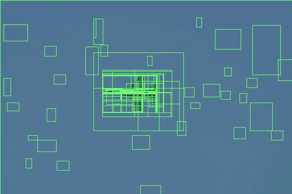
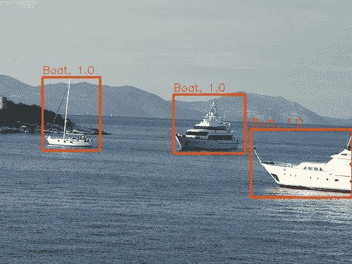

# 用 PyTorch 在 VOC2012 上实现 R-CNN 目标检测

> 原文：<https://medium.com/codex/implementing-r-cnn-object-detection-on-voc2012-with-pytorch-b05d3c623afe?source=collection_archive---------3----------------------->

沃伦·托拜厄斯在 [Unsplash](https://unsplash.com?utm_source=medium&utm_medium=referral) 上的照片

目标检测是计算机视觉中的一个复杂问题，它涉及到从给定的图像中定位和分类多个目标。它是计算机视觉中最重要和研究最广泛的问题之一。

有各种各样的对象检测方法，包括基于深度学习的方法。这些基于深度学习的方法又被分为单阶段模型和多阶段模型。R-CNN 是最初的多级目标检测器之一。这篇文章使用 PyTorch 中的 Pascal VOC 2012 数据集讨论了 R-CNN 每个组件的精确实现，包括 SVM 类别分类器训练和边界框回归，其他教程似乎通常会忽略这些内容。此外，我指出了其他教程的数据生成过程中的一个严重错误。我按照以下顺序组织了各个部分。

1.  R-CNN 简介
2.  为特定领域的微调加载和处理数据
3.  网络
4.  特定领域的精细训练(专长。包围盒回归)
5.  对象类别分类器训练
6.  NMS，推论和验证结果

这是*关于我实现两阶段物体检测算法系列的第二篇*文章。我们注意到，一些功能是在以前的职位上实现的。

 [## 两阶段目标探测指南:R-CNN，FPN，掩模 R-CNN 等等

### 多级(两级)目标检测流水线介绍

medium.com](/codex/a-guide-to-two-stage-object-detection-r-cnn-fpn-mask-r-cnn-and-more-54c2e168438c)  [## 如何处理 VOC2012 数据集并实现用于对象检测的 IoU、mAP

### 我们将实现一系列的两阶段目标检测算法，从最初的 R-CNN 到最新的…

sieunpark77.medium.com](https://sieunpark77.medium.com/how-to-process-voc2012-dataset-and-implement-iou-map-for-object-detection-8ff76891a2ad) 

*完整系列的完整代码在* [*本 COLAB 笔记本*](https://colab.research.google.com/drive/1nCj54XryHcoMARS4cSxivn3Ci1I6OtvO?usp=sharing) *中提供。因为这篇文章中的代码省略了一些细节，所以请参考笔记本以获得完整的工作实现。*

我们在一个 [wandb](https://wandb.ai/krenerd77/rcnn) 板上展示我们所有的结果和日志。

# r-CNN——概述

两阶段目标检测由两个阶段组成:生成区域建议和对它们进行分类。R-CNN 使用*选择性搜索*从每幅图像中生成 2000 个区域建议。然后使用卷积神经网络对每个区域进行分类概率预测。在使用 CNN 进行推断之前，这些区域被裁剪并*扭曲*到某个固定大小。

通过*扭曲*，区域提议被填充 p=16 个像素，并被各向异性地调整到期望的形状，如红色突出显示的。

R-CNN 的训练就是学习 CNN 分类器的参数。作者建议三个训练阶段:

组件 1 和 4 构建了推理中使用的最终模型。

*   监督预训练|组件 1，2:在学习丰富的可重用特征的背景下，在更大的图像分类数据集(也称为 ImageNet)上预训练 CNN。
*   特定于域的微调|组件 1，3:为了处理 ImageNet 域的图像和扭曲区域提议之间的差异，使用扭曲区域提议上的不同全连接头微调 CNN。
*   对象类别分类器|组件 4:在稍微不同的训练过程中学习一组新的 SVM 对象类别分类器。这集中于使模型更加了解精确定位。

我们加载在 ImageNet 上训练的预训练 CNN 特征提取器，这相当于显式训练它们。我们讨论了特定领域的微调和对象分类器训练的实现。虽然这两种设置的数据都是与论文一致地实现的，但显式学习全连接层作为 SVM 在现代深度学习的上下文中实际上并未使用，我们重用了 Softmax 对象分类器，但是我们注意到，将我们的实现修改为 SVM 相对简单。

*有关更多信息，请参考:* [*丰富的特征层次，用于精确的对象检测和语义分割*](https://www.google.com/search?client=safari&rls=en&q=Rich+feature+hierarchies+for+accurate+object+detection+and+semantic+segmentation&ie=UTF-8&oe=UTF-8)

参考配置列表

## 选择性搜索

R-CNN 使用选择性搜索实现区域提议。简而言之，该方法迭代合并分割。我们不会深入探究选择性搜索是如何工作的。让我们简短地看一下如何在 Python 中实现选择性搜索。

OpenCV 提供了一个选择性搜索的实现，可以像上面那样使用。该函数将返回一个边界框列表作为选择性搜索的结果，如下图所示。注意，像大多数 OpenCV 操作一样，图像应该是 BGR 图像，而不是 RGB 图像。

选择性搜索的结果

# 加载和处理数据

## 特定领域的微调

在 CNN 的特定领域微调中，我们需要一个数据集来提供扭曲区域提议的图像。作者认为与地面真实边界框重叠的 with > 0.5 的区域为物体的正图像，否则为标记为背景(0)的负图像。因为有如此多的背景区域，作者通过为 32 个阳性区域选择 96 个阴性区域来限制阳性和阴性区域的比例。

因为选择性搜索和循环每个样本的开销非常大，所以我们将扭曲区域的建议预先计算到一个 pickle 文件中。虽然我想将每个区域单独保存为. png 图像，但 COLAB 和 google drive 无法处理太多的驱动器 I/O。因为我们必须将所有图像保存并加载到一个文件中，所以我们只能在 RAM 中容纳 2，000 张图像。处理 200，000 个区域大约需要 1 小时。

我们首先定义变量来保存我们的结果，`train_images`和`train_labels`。在第 13 行，我们使用`os.listdir`找到目录中的每个图像(由于限制，前 2000 个图像)。

从第 19 行到第 21 行，我们遍历每个图像并读取图像和相应的注释文件。我们在之前的文章中定义了`dataset.read_xml`方法。它返回包含每个边界框信息的字典列表。

我们使用选择性搜索来寻找包围盒提议，并循环通过每个提议。

在第 28 到 30 行，我们通过填充 16 个像素来修改建议的坐标。我们还从边界框的 x，y，w，h 坐标计算{x1，x2，y1，y2}坐标，并将其保存在`bbox_est`中。我们记录地面真实和估计的包围盒的坐标，用于训练包围盒回归器。

从第 33 行到第 50 行，我们检查边界框提议是否与原始图像中的任何对象重叠。如果该提议与第 37 行中使用 IoU 确定的至少一个对象重叠，我们将图像和标签附加到数据集。

如果建议的边界框没有与任何对象重叠，它将被视为背景图像。只有当我们有足够的阳性样本时，我们才在第 53 到 60 行将样本添加到数据集。注意，我们将类标签设置为 0，这表示背景。

最后，每当我们获得两幅图像的足够样本时，计数器就被重置。这种机制在第 62 到 64 行实现。

在研究这个项目时，我遇到了几个错误地实现 R-CNN 的数据生成过程的教程。具体来说，在[这个](https://github.com/Hulkido/RCNN/blob/master/RCNN.ipynb)实现中，我们发现一些代码看起来像:

在代码遍历 g.t .边界框列表`gtvalues`的行中，根据该代码，一个提议的边界框将被分配给每个基础事实的新标签。正确的实现应该在将 IoU 与图像中存在的每个 g.t .对象进行比较之后，将提议的边界框标记为背景。因此，`if falsecouner<30` 之后应该存在后循环。

以下教程的第 127 行到第 138 行也是如此。

[https://www . pyimagesearch . com/2020/07/13/r-CNN-object-detection-with-keras-tensor flow-and-deep-learning/](https://www.pyimagesearch.com/2020/07/13/r-cnn-object-detection-with-keras-tensorflow-and-deep-learning/)

现在，我们已经定义了生成裁剪区域建议的方法，我们可以构建一个 DataLoader 对象，为我们提供我们想要的微调。

当我们创建`RCNN_Dataset`对象时，我们首先检查是否已经将处理过的图像保存在正确格式的 pickle 文件中。如果这样的文件存在，我们只需加载 pickle 文件或执行上一节讨论的`generate_dataset`方法。

因为实际数据已经加载到`self.train_images`和`self.train_labels`中，所以实现`__getitem__`方法相对简单。我们将任意大小的 Numpy 数组形状的图像处理成固定形状的归一化张量。该整形操作完成了*翘曲*。

第 62 到 66 行创建了一个包装器函数，该函数返回 dataset 对象的批量数据加载器并调用它。

# 模型

虽然任何通用 CNN 都可以用作 R-CNN 管道的卷积特征提取器，但我们使用 EfficientNet-B0 网络。由于 EfficientNet 不包含在`torchvision.models`中，我们使用`efficientnet_pytorch` [包](https://github.com/lukemelas/EfficientNet-PyTorch)。

我们的网络非常简单。它由三部分组成:

*   `self.convnet`:特征提取器 CNN，定义为 efficientnet 模型的一部分。
*   `self.classifier` : SoftMax 对象类别分类器
*   `self.bbox_reg`:边界框回归器(可选)

# 特定领域的微调

我们现在将讨论用于特定领域微调的训练循环的实现。考虑到该任务实际上与扭曲区域提议的经典图像分类没有什么不同。

*注意:上面的函数是一个包含*的类的方法

*   `self.model` an _RCNN 实例。
*   `self.validator`用于各种验证的类，我们将在后面讨论。
*   `self.loader`RCNN _ Dataset 类的数据加载器。

因为 _RCNN 本身是`nn.Module`的子类，我们可以设置优化器来计算第 9 行中`self.model.parameters()`的梯度。

训练循环很简单，除了用于边界框回归的第 38 到 54 行之外，类似于 PyTorch 中用于图像分类的典型训练循环。

## 包围盒回归

左:如何应用边界框回归，右:回归目标

边界框回归是通过提供轻微的变换来精确细化边界框的阶段。作者提出了一种包含 4 个参数的变换，d_x 和 d_y 表示要提供的翻译量，d_w 和 d_h 表示对数空间的比例因子。这 4 个参数是使用神经网络预测的，该神经网络接收提取的特征并根据回归损失进行训练。

左边的等式示出了如何将边界框细化 d 应用于边界框提议 P，以生成有希望类似于地面实况的细化边界框 G hat。右边的等式描述了给定边界框提议 P 和相应的地面实况边界框 g 的回归目标 t。在训练期间，使用带有 t 的 MSE 损失来训练网络 d。

根据论文的方程，我们在第 41 行和第 42 行读取边界框提议 P 和地面实况 G 的坐标。使用这些值，我们计算第 44 行的 t 向量。

因为没有背景的*地面真相*边界框，所以预测分类为背景的图像的边界框细化是没有意义的。第 48 行计算批次中的每个图像是否是背景的掩码(class=0)，并且模型仅在掩码为真的对象样本上学习。

我们还定义了一个函数，用于将预测的边界框细化应用于区域提议。在下图中，我们展示了边界框回归确实改善了边界框的定位。该网络改进了作为选择性搜索的原始输出的红色边界框，并预测通常更准确的橙色边界框。

向上:预测，向下:g.t 对象

# 对象类别分类器

对象类别分类器在不同的数据集上进行微调。我们只把基本事实框作为正面例子，而把与一个类的所有实例的 IoU 重叠小于 0.3 的提议标记为该类的负面例子。因此，处理数据的逻辑略有不同。我们首先选择给定图像的所有边界框，并仅在需要时从选择性搜索区域建议中选择背景区域。

我们的实现与本文中描述的方法略有不同。因为作者逐个学习每个类的 SVM，而不是同时将它们训练为 SoftMax 分类器，所以作者建议为每个类创建一个数据集，而我们不这样做。

我们的方法的一个问题是，因为每个类别的分类器是同时学习的，所以我们需要在数据集中包括背景的图像。如果我们对仅由对象组成的数据集进行微调，背景的概率估计将会消失。因此，我们应用 32:96 的比例对物体和背景进行采样。

从第 23 行到第 31 行，我们选择所有的基本事实对象。

当我们收集了一定数量的对象后，我们收集第 34 到 67 行的背景区域。我们检查所提议的边界框是否与第 49 到 54 行中的对象重叠，并对第 56 到 64 行中的背景图像进行计数。

## 训练对象类别分类器

除了仅学习最终 SoftMax 分类器的参数之外，我们用于微调对象类别分类器的训练循环与用于特定领域微调的训练循环一致。

在第 9 行，我们设置优化器只学习对象类别分类器的参数。我们还删除了包围盒回归的代码。

## 非最大抑制(NMS)

非最大值抑制是一种贪婪的合并算法，可用于对象检测，以有效地组合同一对象的紧密定位的重复区域提议。我们重复以下内容:

*   选择具有最高预测置信度(概率)的边界框并保留。
*   遍历所有其他边界框，并
*   移除与大于特定阈值的所选边界框具有 IoU 重叠的所有边界框。

我们在上面的代码中实现了这个算法。我们在下图中说明了 NMS 的影响。NMS 有效地结合了这些重复的边界框。

## 推理

R-CNN 中的推理并不像将图像输入神经网络那样简单。我们来看看它是如何实现的。

基本上，我们创建了一个包含< 2，000 个区域提议的数据集，这些提议是对第 16 行到第 32 行的给定图像进行选择性搜索的结果。我们对它们进行批处理，并创建一个 DataLoader 对象。

对于每一批，我们使用训练好的模型对第 40 行到第 47 行的每个地区提案进行预测。在第 49 行，我们发现建议的索引很有可能是某种对象(而不是背景)。我们处理包围盒的信息，并在`useful_bboxes`中收集所有检测到的区域提议的包围盒信息。

最后，我们通过将 NMS 应用于检测到的对象边界框的列表来减少重叠区域。

## 结果

验证集的结果，左边是预测，右边是遗传

训练集上的结果，左边是预测，右边是 g.t

我们甚至可以观察到，不正确的区域通常具有小得多的阈值。我们可以通过找到更好的检测目标的阈值来进一步优化模型。

你可以在[这个](https://colab.research.google.com/drive/1nCj54XryHcoMARS4cSxivn3Ci1I6OtvO?usp=sharing) COLAB 笔记本中获得 R-CNN 的完整工作源代码和更多实验的结果。

*我承认我在这篇文章上拖拖拉拉，而且写得很匆忙。如果我错过了什么，或者你想知道更多关于❤️.的事情，请在评论中告诉我*