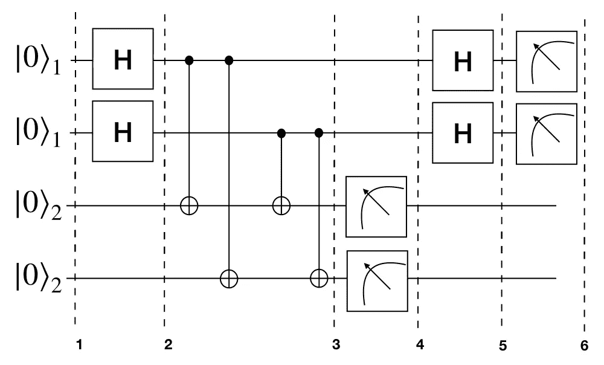
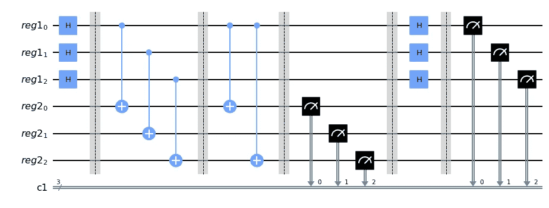
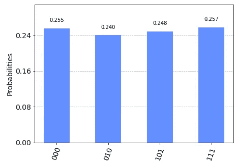
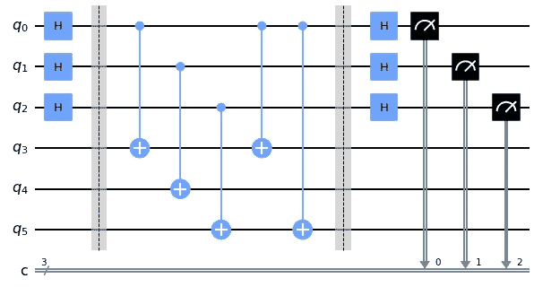

# 在 Qiskit 中实现 Simon 算法

> 原文：<https://medium.com/codex/implementing-simons-algorithm-in-qiskit-9155ce6a9527?source=collection_archive---------1----------------------->

西蒙的算法不像肖尔或格罗弗的算法那样是一种非常有影响力的量子算法。它是一个玩具算法，几乎没有一般意义上的应用。然而，这是第一个与解决这个问题的经典算法相比显示出指数级加速的算法。此外，它还启发了量子傅立叶变换等算法的发展，量子傅立叶变换是 Shor 的质因数分解算法的关键要素。

事不宜迟，让我们开始研究这个问题。假设我们有一个 2:1 函数(即，将两个不同的输入映射到一个输出的函数)。该函数将{0,1}^n 比特作为输入，并产生{0,1}^n 比特作为输出，使得输出 f(x) = f(x ⊕ s) (⊕表示逐位 X-OR) 其中 s 也是{0,1}^n 比特。我们需要找到任意的位串' **s** '。

在进入量子解之前，我们可以先检查一下寻找 **s** 的经典技术。由于函数是 2:1，我们得到 2 个输入的 1 个输出，对于 2^(n)输入，有 2^(n)/2 或 2^(n-1)唯一的输出。现在，假设 x 和 y 映射相同的输出 z，使得 x ⊕ y = z。在最坏的情况下，我们将不得不检查 2^(n-1)+1 输出以找到 x 和 y，通过对 x 和 y 进行逐位 X-OR 运算，我们将得到 z

现在我们可以看看量子解。

***电路*** :



西蒙电路的两量子位例子

***数学解释:***

我们可以一步一步来，看看电路是如何工作的。让我们考虑我们有 n 个量子位。

第一步:我们在|0⟩^n.有两个登记处

第二步:我们在第一个寄存器的量子位上应用 h 门，得到相等叠加的 2^n 态。

这里|x⟩是所有 2^n 可能的比特串的相等叠加。

步骤 3:在两个寄存器上应用了 oracle 函数后，我们在第一个寄存器上得到|x⟩，在第二个寄存器上得到|y ⊕ f(x)⟩。作为|y⟩ =|0⟩，我们在第二个登记簿上只有|f(x)⟩。

第四步:我们测量第二个寄存器的量子位。这里我们将在第二寄存器和第一寄存器上得到一个状态|f(z)⟩，两个输入|z ⟩和|z ⊕ s⟩的叠加可以产生 f(z)。这里的 **s** 是我们任意的位串。

从现在起，我们将不需要第二个寄存器|f(z)⟩.的值

步骤 5:在这个阶段，我们在第一个寄存器上应用 H-gate。我们得到了这样一个丑陋的公式。

公式显示 y(z ⊕ s)在第二个指数中，等于 y z ⊕ y s，如果 y s = 1，则整个东西的值将为 0。我们将只在 y s = 0 mod(2)的情况下得到相等叠加的值。 **(x = y mod(z)表示如果 x 除以 z，y 将是余数)。**

步骤 6:在最后一步，我们重复测量第一个寄存器，以获得不同的 y 值，从中我们可以计算出 **s** 。

***数学例题:***

一个例子将给出算法的清晰直观。

让我们用三个量子位做一个例子。我们认为 101 是隐藏的位串。我们将状态 000 与 101 进行逐位异或运算，得到值 101。因此，000 和 101 将共享相同的输出。我们可以按照上面的规则制作一个投入产出图。我们可以为每对任意选择三位输出。

现在让我们一步一步来。

1.  我们在|000⟩状态下初始化两个寄存器。

2.我们对第一个寄存器的量子位使用 H 门。

这等于:

3.在这里，我们应用了将|x>|0 >映射到|x>|f(x)>的函数。

4.我们测量第二个音域。并认为我们得到了值|000 >作为输出。

现在我们在第一个寄存器中有了相等叠加的状态|010> + |111 >，因为我们选择状态|000 >作为|010 >和|111 >的输出。

5.我们再次对第一个寄存器应用 H 门。经过一些丑陋的数学运算，我们得到以下值。

如果我们想确保我们得到的状态是正确的，我们可以使用 y s = 0 mod (2)来检查它。让我们以国家为例。

我们得到 0 是因为如果我们用 2 除以 2，我们得到 1 作为商，0 作为余数。这里的余数是我们的答案是 0。

6.我们将重复测量第一个寄存器，以获得不同的结果状态。从这些状态中，我们可以找到 s。

假设第一次测量，我们得到(010)。

我们再次测量第一个寄存器，并认为我们得到了(111)。

如果 1 s1 = 1 s2 = 0，我们会得到一个没有意义的微不足道的结果 000。但是如果 1 s1 = 1 s2，我们得到 101，这是我们认为的秘密位串。

***在 Qiskit 中实现算法:***

```
# considering our bit string to be ‘101’
b = ‘101’
n = len(b)
# creating two quantum register of ’n’ qubits and 1 classical register of ’n’ qubits
q_reg1 = QuantumRegister (n,’reg1')
q_reg2 = QuantumRegister (n,’reg2')
c_reg = ClassicalRegister (n)
circuit = QuantumCircuit (q_reg1, q_reg2, c_reg)
# applying H-gate on qubits of first register
circuit.h(q_reg1)
circuit.barrier()
# copying the data of first register to second register
circuit.cx(q_reg1, q_reg2)
circuit.barrier()
# applying bit wise X-OR from register 1 to register 2 where qubits of first register is 1
circuit.cx(q_reg1[0],q_reg2[0])
circuit.cx(q_reg1[0],q_reg2[2])
circuit.barrier()
# measuring qubits of second register
Circuit.measure(q_reg2,c_reg)
# applying H-gate to qubits of first register
circuit.h(q_reg1)
circuit.barrier()
# measuring qubits of first register
circuit.measure(q_reg1, c_reg)
circuit.draw()
```

现在，我们可以一步一步来，看看代码中发生了什么。我们取两个 3 量子位的寄存器，并在第一个寄存器上应用 H-gate。
现在，甲骨文功能的部分来了。我们将 Oracle 部分分为两步。在第一步中，我们将来自第一寄存器的量子位的 CX 门应用到第二寄存器的量子位。我们这样做是为了将第一个寄存器的状态复制到第二个寄存器。在第二步中，我们将来自第一寄存器的第一量子位的两个 CX 应用到第二寄存器的第一和第三量子位。现在，我们为什么要这么做？好吧，记住我们选择 101 作为我们任意的位串。我们正在创建一个函数，将逐位 X-OR 应用于第二个寄存器的量子位。在量子计算中，CX 做逐位 X-OR 的工作。由于我们的任意位串的第一位和第三位都是 1，我们将第一个寄存器的量子位的 CXs 应用到第二个寄存器的第一个和第三个量子位。我们不需要对第二位使用 CX，因为它是 0。至此，我们完成了 oracle 函数部分。在这里，我们可以任意改变第二个寄存器的量子位，就像我们在例子中所做的那样，但这不是必须的。
现在，我们测量我们的第二个寄存器。我们也可以忽略这一部分，因为它在这种情况下没有区别。如果我们在 Qiskit 中不使用 measurement，它只会忽略那部分。
以上代码产生以下电路。



现在，让我们运行电路并获得其输出。

```
# running the circuit using "qasm simulator"
qasm_sim = Aer.get_backend("qasm_simulator")
job = assemble(circuit,qasm_sim)
result = qasm_sim.run(job).result()
counts = result.get_counts()
plot_histogram(counts)
```

这里，我们以相等的概率得到 4 个值。分别是 000，010，101 和 111，这些是我们最终从数学例子中得到的最终值。



如果我们想确定得到的状态是否满足 y s = 0，我们也可以为此写一个代码。

```
*# Calculate the dot product of the results*
**def** **bdotz**(b, z):
    accum **=** 0
    **for** i **in** range(len(b)):
        accum **+=** int(b[i]) ***** int(z[i])
    **return** (accum **%** 2)

**for** z **in** counts:
    print( '{}.{} = {} (mod 2)'**.**format(b, z, bdotz(b,z)) )101.111 = 0 (mod 2)
101.101 = 0 (mod 2)
101.010 = 0 (mod 2)
101.000 = 0 (mod 2)
```

从上面的结果，我们可以看到，对于所有的值 y s = 0。所以，我们得到的状态是正确的。

现在，根据这四个结果状态，我们可以按照示例中的给定方法找到我们的任意位串**‘101’**。

此外，如果我们不想为甲骨文编码，我们可以为西蒙的甲骨文使用 Qiskit 教科书函数。

```
from qiskit_textbook.tools import simon_oracleb = '101'n = len(b)
simon_circuit = QuantumCircuit(n*2, n)
simon_circuit.h(range(n))    
simon_circuit.barrier()
simon_circuit+=simon_oracle(b)
simon_circuit.barrier()
simon_circuit.h(range(n))
simon_circuit.measure(range(n), range(n))
simon_circuit.draw()
```



看，我们有相同的电路。

这就是算法的全部内容。虽然这些算法与 Grover 和 Shor 等更著名的算法相比并不重要，但这些算法因其计算速度加快而受到研究。我们今天看到的 Shor 算法，就是在这个算法的启发下发展起来的。西蒙问题的量子解只需要 **O(n)** 个查询，而它的经典解需要**o(2^(n/2)】**个查询。所以我们的速度正在成倍增长。

我们将在未来的文章中涵盖更多的量子算法及其一些实际应用，敬请关注！