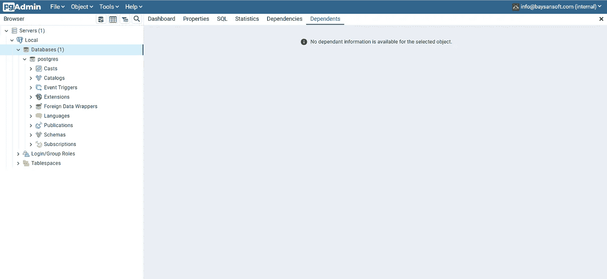
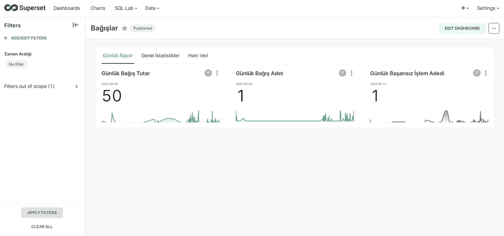

# 实现自定义简单数据管道和超集

> 原文：<https://medium.com/codex/implementing-so-simple-data-pipeline-and-superset-5d9011f10e80?source=collection_archive---------24----------------------->

## 真实案例:Python、Crontab、Docker、超集、SQLite 和 PostgreSQL

你好。在这个故事中，我们将要谈论的话题将是我最近为一个客户完成的工作之一。我实现了一个定制的数据管道来创建他们的 BI 报告。然后，我设置了一个超集实例，让他们拥有自己的 BI 工具。


照片由[艾米丽·莫特](https://unsplash.com/@emilymorter?utm_source=unsplash&utm_medium=referral&utm_content=creditCopyText)在 [Unsplash](https://unsplash.com/s/photos/data-pipeline?utm_source=unsplash&utm_medium=referral&utm_content=creditCopyText) 上拍摄

# 介绍

Python 是我用来创建管道的主要工具。我编写了一个定制脚本，从服务器上的`SQLite`数据库中提取数据，然后将其加载到我在服务器上作为仓库创建的新的`Postgres`数据库中。在实现提取和装载到仓库的过程之后，我通过使用服务器上的`crontab`来安排数据的刷新频率。最后，我设置了一个超集实例来创建 BI 报告。此外，我为自己设置了一个`PgAdmin`实例，以便在需要时修复问题。让我们探索我采取的每一步。

# 设置 Postgres & PgAdmin

在这一步创建了一个新的 Postgres 数据仓库。此外，在这一步还创建了一个 PgAdmin 实例来监控和管理 Postgres 数据仓库。

为了创建 Postgres 数据库，我得到了 Docker 的帮助。我还将一个卷绑定到 warehouse 容器来存储数据，即使它重启了也是如此。

```
*#! /bin/bash*sudo docker run --name wh-db -p 5434:5432 -e POSTGRES_PASSWORD=MY_PASSWORD -d -v /tmp/path/:/var/lib/postgresql/data postgres
```

然后，我创建了一个新的容器来启动 PgAdmin。

```
*#! /bin/bash*sudo docker container run --name pgadmin-wh -d -e PGADMIN_DEFAULT_EMAIL=info@MYMAIL.com -e PGADMIN_DEFAULT_PASSWORD=MY_PASSWORD -e PGADMIN_LISTEN_PORT=5435 -p 5435:5435 dpage/pgadmin4
```

## PgAdmin 的 Nginx 配置

我还将一个域与 PgAdmin 实例绑定，使它可以在 web 上访问。为此，我使用了下面的配置要点。



我部署的实例

# 实现 ETL 脚本

我在 web app 的文件夹里创建了一个`script.py`文件。在这个文件中，我编写了 ETL 过程的代码。当然，我创建了一个 virtualenv 并安装了以下软件包:

*   熊猫
*   sqlalchemy

```
*#! ./venv/bin/python3*import pandas as pd
import sqlite3
from sqlalchemy import create_engine*# Read sqlite query results into a pandas DataFrame* con = sqlite3.connect("/home/path/project/db.sqlite3")
df = pd.read_sql_query("SELECT * from <TABLE_NAME>", con)
df['revenue'] = pd.to_numeric(df['revenue']) / 100
df['datetime'] = pd.to_datetime(df['datetime'])con.close()*# PostgreSQL connection* engine = create_engine('postgresql://postgres:<PASSWORD>@localhost:5434/postgres')*# Load the data into the warehouse* df.to_sql('<TABLE_NAME>', con=engine, if_exists='replace',index=False)
```

脚本的第一行让自己在执行时，通过使用位于第一行的 python 环境来执行自己。

基本上，该脚本从 prod db 中提取 transactions 表，并在一些数据类型转换后将数据加载到我们使用 Postgres 创建的仓库中。还有一件非常重要的事情就是提供数据的刷新。让我们在下一步探索我是如何做到的。

# 使用 Crontab 提供新数据

`crontab`是大多数 Linux 发行版中的内置程序。我们可以使用它来调度我们的 cron 作业。另外，如果您想深入了解 crontab，您应该访问下面的链接。

[](https://man7.org/linux/man-pages/man5/crontab.5.html) [## crontab(5) - Linux 手册页

### NAME | DESCRIPTION | EXAMPLE CRON FILE | Jobs IN/etc/CRON . d/| EXAMPLE OF A Jobs IN/etc/CRON . d/JOB | SELinux with…

man7.org](https://man7.org/linux/man-pages/man5/crontab.5.html) 

我们可以通过在终端执行`crontab -e`命令来使用它。我将下面一行添加到 crontab 文件中。

```
0 0,8,16 * * * /home/path/project/venv/bin/python3 /home/path/project/script.py
```

我每天在 00.00，08.00 和 16.00 提供最新数据。通过访问下面的链接，您可以了解更多关于如何使用 crontab 安排时间的信息。

 [## crontab . guru——cron 调度表达式编辑器

### cron 调度表达式的快速简单的编辑器我们创建了 Cronitor，因为 cron 本身不能…

crontab.guru](https://crontab.guru/) 

实际上，我们已经使用纯 Python 创建了一个简单的 ETL 管道。现在，我们需要使用这些数据来创建报告。让我们在下一节看看如何创建报告。

# 设置超集和创建 BI 报表

为了创建一个超集实例，我从我创建的关于完全相同问题的资源中获得了帮助。

[](https://github.com/mebaysan/Superset-Production-Environment) [## GitHub-mebaysan/Superset-Production-Environment:我创建这个 repo 是为了准备一个超集…

### 实际上，这是一个保存了一些脚本的简单回购。那么，我为什么要创造这个呢？我在试着跑的时候很痛苦…

github.com](https://github.com/mebaysan/Superset-Production-Environment) 

你可以很容易地使用回购超集。我只是将回购克隆到客户端的服务器上，然后运行实例。下图是客户报告的一个例子。



作者图片

我还使用上面提到的脚本将一个域绑定到超集实例中。

# 最后

希望你喜欢这个故事。我觉得分享一个现实生活中的案例会有帮助。我知道流程会得到改进。然而，客户的需求非常简单。因此，我选择了最简单的方法来解决他们的问题。

亲切的问候。