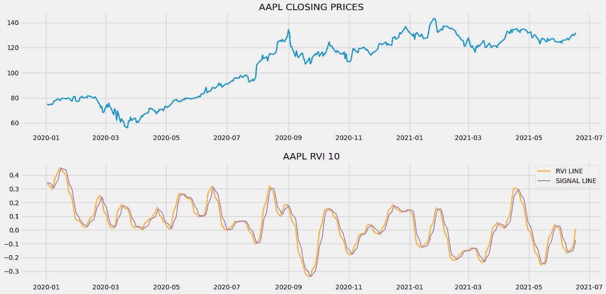
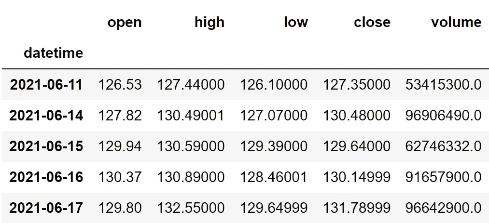
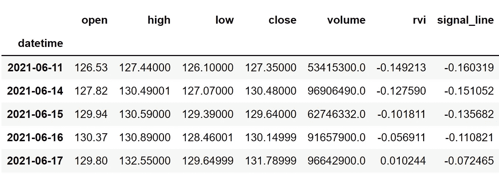
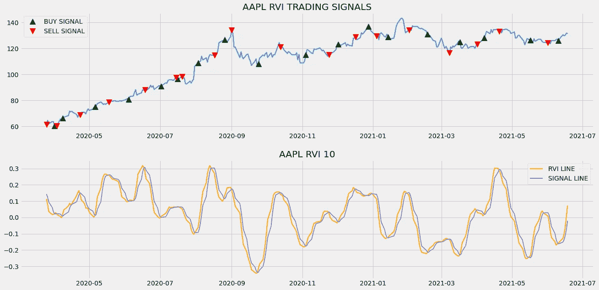
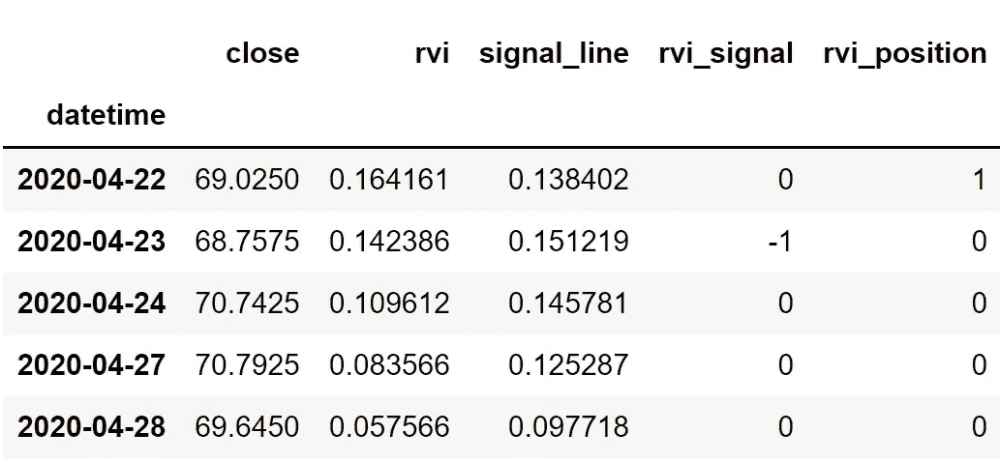

# 用 Python 实现相对活力指数和回测交易策略

> 原文：<https://medium.com/codex/implementing-the-relative-vigor-index-and-backtesting-a-trading-strategy-with-python-d317afc0923a?source=collection_archive---------1----------------------->

## 学会实施一个不太为人知的具有巨大潜力的指标，让你的交易看起来更好


穆罕默德·哈吉在 [Unsplash](https://unsplash.com?utm_source=medium&utm_medium=referral) 上的照片

股票交易领域的人肯定都知道随机振荡指标，因为它很受欢迎，今天，我们将探讨一个不仅类似，而且表现也像随机振荡指标的指标。这不是别人，正是相对活力指数，简称 RVI。在本文中，我们将首先对指标及其背后的数学原理建立一些基本的直觉。然后，我们将继续编程，使用 Python 从头构建指标，回测基于它的交易策略，将策略结果与 SPY ETF(专门设计用于跟踪标准普尔 500 市场指数运动的 ETF)的结果进行比较。事不宜迟，让我们进入文章。

在继续之前，如果你想在没有任何代码的情况下回溯测试你的交易策略，有一个解决方案。这是[的后验区](https://www.backtestzone.com/)。这是一个平台，可以免费对不同类型的可交易资产的任意数量的交易策略进行回溯测试，无需编码。点击这里的链接，你可以马上使用这个工具:[https://www.backtestzone.com/](https://www.backtestzone.com/)

# 相对活力指数(RVI)

相对活力指数是一个动力指标，作为一个工具，以确定当前的市场动力，向上或向下。与随机振荡器不同，相对活力指数是一个无界振荡器，不会在特定阈值之间波动，而是在中线(大多数情况下为零)振荡。相对活力指数由两部分组成，即 RVI 线和信号线。现在，让我们看看每个分量是如何计算的。

## RVI 线计算

为了计算 RVI 线的读数，我们必须首先确定分子和分母。

**分子可以分五步计算:**

*   第一步是找出一只股票的当前收盘价和当前开盘价之间的差额，让我们把这个差额看作“a”。
*   第二步是找出两期前的收盘价和两期前的开盘价之差，这个差乘以 2。这个产品可以被认为是 b。
*   现在第三步，确定三期前收盘价和三期开盘价之差，然后乘以二，我们姑且认为这是‘c’。
*   第四步是将我们从四个周期前的收盘价中减去四个周期前的开盘价得到的差值乘以 2，这个乘积可以作为“d”。
*   最后一步是将确定的 a、b、c 和 d 变量相加，计算指定周期数的滚动和(典型设置为 4)。分子计算可表示如下:

```
**a** = CURRENT CLOSE - CURRENT OPEN
**b** =  2 * ( CLOSE 2 PERIODS AGO - OPEN 2 PERIODS AGO )
**c** =  2 * ( CLOSE 3 PERIODS AGO - OPEN 3 PERIODS AGO )
**d** =  2 * ( CLOSE 4 PERIODS AGO - OPEN 4 PERIODS AGO )
**Numerator** = ROLLING SUM 4 [ a + b + c + d ]
```

计算分母的过程几乎与计算分子的过程相似，但我们只需分别用高价格和低价格数据替换收盘价和开盘价数据。

**分母可以分五步计算:**

*   第一步是找出一只股票的当前高价和当前低价之间的差额，让我们把这个差额记为“e”。
*   第二步是找出两个周期前的高价和两个周期前的低价之间的差异，并将该差异乘以 2。这个产品可以被认为是‘f’。
*   现在，第三步是确定三期之前的高价和三期之前的低价之差，然后乘以二，我们姑且认为这是‘g’。
*   第四步是将四个周期前的高价格减去四个周期前的低价格所得的差值乘以 2，这个乘积可以作为“h”。
*   最后一步是将确定的 e、f、g 和 h 变量相加，并计算出以 4 为回望周期的滚动和。分母计算可表示如下:

```
**e** = CURRENT HIGH - CURRENT LOW
**f** =  2 * ( HIGH 2 PERIODS AGO - LOW 2 PERIODS AGO )
**g** =  2 * ( HIGH 3 PERIODS AGO - LOW 3 PERIODS AGO )
**h** =  2 * ( HIGH 4 PERIODS AGO - LOW 4 PERIODS AGO )
**Denominator** = ROLLING SUM 4 [ e + f + g + h ]
```

得到分子和分母后，我们可以继续计算 RVI 线的读数，这真的很简单。我们只需将分子除以分母，然后通过简单的移动平均对特定数量的回看周期(周期数通常为 10)进行平滑。该计算可以用数学方法表示如下:

```
**RVI LINE** = SMA 10 [ NUMERATOR / DENOMINATOR ]
```

## 信号线计算

通常，将信号线作为一个组成部分的指标是通过简单移动平均或主要组成部分的指数移动平均(在我们的例子中是 RVI 线)在特定数量的周期内计算出来的。但是，它与相对活力指数不同。

**信号线的计算包括四个主要步骤:**第一步是将一个周期的 RVI 线读数乘以两个周期，我们将此视为“rvi1”。下一步是将两个周期前的 RVI 线读数乘以 2，这可以被认为是“rvi2”。第三步是确定三个周期前的 RVI 线读数，这些值可视为“rvi3”。最后一步是将确定的‘rvi 1’、‘rvi 2’、‘rvi 3’与 rvi 线的读数相加，并将总和或结果除以 6。该计算可以表示如下:

```
**rvi1** = 2 * RVI LINE 1 PERIOD AGO
**rvi2** = 2 * RVI LINE 2 PERIODS AGO
**rvi3** = RVI LINE 3 PERIODS AGO
**SIGNAL LINE** = ( RVI LINE + rvi1 + rvi2 + rvi3 ) / 6
```

这就是计算相对活力指数的组成部分的整个过程。现在，让我们分析一个图表，其中绘制了苹果的收盘价数据以及以 10 为回望期计算的相对活力指数，以建立对该指标及其使用方式的牢固理解。



作者图片

上面的图表分为两个面板:上面的面板显示了苹果公司的收盘价数据，下面的面板显示了以 10 为回望周期计算的相对活力指数的组成部分。该指标的主要特征是帮助交易者识别当前的市场动力，这可以在图表中清楚地看到，当市场表现出强劲的上升动力时，RVI 指标的分量正上升，当市场处于强劲的下降动力状态时，分量下降。正如我之前所说，相对活力指数是一个无界振荡器，上图证明了这一点，可以看出，RVI 指标的组成部分不像其他动量振荡器一样在特定的上限和下限之间波动，而是跨越零线或中线波动。

说到交易策略，据我所知，根据相对活力指数，可以运用三种交易策略。第一种是背离交易策略，第二种是经典的交叉策略，第三种是超买超卖策略。在本文中，我们将实施第二种交易策略，即交叉策略。这个策略在 RVI 线从信号线的下方穿越到上方时显示买入信号，同样，在 RVI 线从信号线的上方穿越到下方时显示卖出信号。RVI 交叉交易策略可以表示如下:

```
IF **PREV.RLINE** < **PREV.SLINE** AND **CUR.RLINE** > **CUR.SLINE** ==> **BUY SIGNAL**
IF **PREV.RLINE** > **PREV.SLINE** AND **CUR.RLINE** < **CUR.SLINE** ==> **SELL SIGNAL**
```

在大多数情况下，交易者使用相对活力指数和另一个技术指标来建立交易策略，但这不是本文的范围(建议尝试)。就是这样！这就结束了我们关于相对活力指数的理论部分，让我们进入编程部分，我们将首先使用 Python 从头构建指标，构建交叉交易策略，对苹果股票数据进行回溯测试，最后将结果与 SPY ETF 的结果进行比较。来做点编码吧！在继续之前，关于免责声明的一个注意事项:本文的唯一目的是教育人们，必须被视为一个信息，而不是投资建议等。

# 用 Python 实现

编码部分分为以下几个步骤:

```
**1\. Importing Packages
2\. Extracting Stock Data from Twelve Data
3\. Relative Vigor Index Calculation
4\. Creating the Crossover Trading Strategy
5\. Plotting the Trading Lists
6\. Creating our Position
7\. Backtesting
8\. SPY ETF Comparison**
```

我们将按照上面列表中提到的顺序，系好安全带，跟随每一个即将到来的编码部分。

## 步骤 1:导入包

将所需的包导入 python 环境是一个不可跳过的步骤。主要的包是处理数据的 Pandas，处理数组和复杂函数的 NumPy，用于绘图的 Matplotlib，以及进行 API 调用的请求。二级包是数学函数的 Math 和字体定制的 Termcolor(可选)。

**Python 实现:**

```
**# IMPORTING PACKAGES** 
import pandas as pd
import matplotlib.pyplot as plt
import numpy as np
import requests
from termcolor import colored as cl
from math import floor

plt.style.use('fivethirtyeight')
plt.rcParams['figure.figsize'] = (20,10)
```

现在我们已经将所有需要的包导入到 python 中。我们用十二数据的 API 端点来拉一下苹果的历史数据。

## 步骤 2:从 12 个数据中提取数据

在这一步中，我们将使用 twelvedata.com[提供的 API 端点提取苹果的历史股票数据。在此之前，关于](https://twelvedata.com/)[twelvedata.com](https://twelvedata.com/)的一个说明:十二数据是领先的市场数据提供商之一，拥有大量针对所有类型市场数据的 API 端点。它非常容易与十二数据提供的 API 进行交互，并且拥有有史以来最好的文档。此外，确保您在[twelvedata.com](https://twelvedata.com/)上有一个帐户，只有这样，您才能访问您的 API 密钥(使用 API 提取数据的重要元素)。

**Python 实现:**

```
**# EXTRACTING STOCK DATA** 
def get_historical_data(symbol, start_date):
    api_key = 'YOUR API KEY'
    api_url = f'https://api.twelvedata.com/time_series?symbol={symbol}&interval=1day&outputsize=5000&apikey={api_key}'
    raw_df = requests.get(api_url).json()
    df = pd.DataFrame(raw_df['values']).iloc[::-1].set_index('datetime').astype(float)
    df = df[df.index >= start_date]
    df.index = pd.to_datetime(df.index)
    return df

aapl = get_historical_data('AAPL', '2019-01-01')
aapl.tail()
```

**输出:**



作者图片

**代码解释:**我们做的第一件事是定义一个名为‘get _ historical _ data’的函数，它以股票的符号(‘symbol’)和历史数据的起始日期(‘start _ date’)作为参数。在函数内部，我们定义了 API 键和 URL，并将它们存储到各自的变量中。接下来，我们使用“get”函数提取 JSON 格式的历史数据，并将其存储到“raw_df”变量中。在对原始 JSON 数据进行清理和格式化之后，我们将以干净的 Pandas 数据帧的形式返回它。最后，我们正在调用创建的函数来提取苹果从 2019 年开始的历史数据，并将其存储到‘AAPL’变量中。

## 第三步:相对活力指数计算

在这一步，我们将按照之前讨论的方法和公式计算相对活力指数的组成部分。

**Python 实现:**

```
**# RELATIVE VIGOR INDEX CALCULATION** 
def get_rvi(open, high, low, close, lookback):
    a = close - open
    b = 2 * (close.shift(2) - open.shift(2))
    c = 2 * (close.shift(3) - open.shift(3))
    d = close.shift(4) - open.shift(4)
    numerator = a + b + c + d

    e = high - low
    f = 2 * (high.shift(2) - low.shift(2))
    g = 2 * (high.shift(3) - low.shift(3))
    h = high.shift(4) - low.shift(4)
    denominator = e + f + g + h

    numerator_sum = numerator.rolling(4).sum()
    denominator_sum = denominator.rolling(4).sum()
    rvi = (numerator_sum / denominator_sum).rolling(lookback).mean()

    rvi1 = 2 * rvi.shift(1)
    rvi2 = 2 * rvi.shift(2)
    rvi3 = rvi.shift(3)
    rvi_signal = (rvi + rvi1 + rvi2 + rvi3) / 6

    return rvi, rvi_signal

aapl['rvi'], aapl['signal_line'] = get_rvi(aapl['open'], aapl['high'], aapl['low'], aapl['close'], 10)
aapl = aapl.dropna()
aapl = aapl[aapl.index >= '2020-01-01']
aapl.tail()
```

**输出:**



作者图片

**代码解释:**我们首先定义一个名为‘get _ rvi’的函数，它将股票的开盘价(‘open’)、盘高(‘high’)、盘低(‘low’)、收盘价(‘close’)数据和回看期(‘look back’)作为参数。

在函数内部，我们首先计算参与分子计算的变量，即 a、b、c 和 d。这些变量是按照我们之前讨论过的公式计算的，它们相互相加以确定分子。接下来是分母的计算，与分子的计算几乎相似，但我们只是替换了某些值。在计算 RVI 线的读数之前，我们先确定分子和分母的滚动和，以 4 作为回望周期，然后将结果代入 RVI 线的公式中，得到读数。

之后，我们计算之前讨论过的三个前提变量，即 rvi1、rvi2 和 rvi3，并将之前计算的 rvi 线值代入信号线公式，以获得读数。最后，我们返回并调用函数 store Apple 的相对活力指数读数，10 为回望期。

## 步骤 4:创建交易策略

在这一步，我们将在 python 中实现所讨论的相对活力指数交叉交易策略。

**Python 实现:**

```
**# RELATIVE VIGOR INDEX STRATEGY** 
def implement_rvi_strategy(prices, rvi, signal_line):
    buy_price = []
    sell_price = []
    rvi_signal = []
    signal = 0

    for i in range(len(prices)):
        if rvi[i-1] < signal_line[i-1] and rvi[i] > signal_line[i]:
            if signal != 1:
                buy_price.append(prices[i])
                sell_price.append(np.nan)
                signal = 1
                rvi_signal.append(signal)
            else:
                buy_price.append(np.nan)
                sell_price.append(np.nan)
                rvi_signal.append(0)
        elif rvi[i-1] > signal_line[i-1] and rvi[i] < signal_line[i]:
            if signal != -1:
                buy_price.append(np.nan)
                sell_price.append(prices[i])
                signal = -1
                rvi_signal.append(signal)
            else:
                buy_price.append(np.nan)
                sell_price.append(np.nan)
                rvi_signal.append(0)
        else:
            buy_price.append(np.nan)
            sell_price.append(np.nan)
            rvi_signal.append(0)

    return buy_price, sell_price, rvi_signal

buy_price, sell_price, rvi_signal = implement_rvi_strategy(aapl['close'], aapl['rvi'], aapl['signal_line'])
```

**代码解释:**首先，我们定义一个名为‘implement _ rvi _ strategy’的函数，它将股票价格(‘prices’)和相对活力指数的组成部分(‘rvi’，‘signal _ line’)作为参数。

在该函数中，我们创建了三个空列表(buy_price、sell_price 和 rvi_signal ),在创建交易策略时，将在这些列表中追加值。

之后，我们通过 for 循环实施交易策略。在 for 循环内部，我们传递某些条件，如果条件得到满足，相应的值将被追加到空列表中。如果购买股票的条件得到满足，买入价将被追加到“buy_price”列表中，信号值将被追加为 1，表示购买股票。类似地，如果卖出股票的条件得到满足，卖价将被追加到“sell_price”列表中，信号值将被追加为-1，表示卖出股票。

最后，我们返回附加了值的列表。然后，我们调用创建的函数并将值存储到各自的变量中。除非我们画出这些值，否则这个列表没有任何意义。所以，让我们画出创建的交易列表的值。

## 第五步:绘制交易信号

在这一步，我们将绘制已创建的交易列表，以使它们有意义。

**Python 实现:**

```
**# RELATIVE VIGOR INDEX TRADING SIGNALS PLOT** 
ax1 = plt.subplot2grid((11,1), (0,0), rowspan = 5, colspan = 1)
ax2 = plt.subplot2grid((11,1), (6,0), rowspan = 5, colspan = 1)
ax1.plot(aapl['close'], linewidth = 2)
ax1.plot(aapl.index, buy_price, marker = '^', markersize = 12, color = 'green', linewidth = 0, label = 'BUY SIGNAL')
ax1.plot(aapl.index, sell_price, marker = 'v', markersize = 12, color = 'r', linewidth = 0, label = 'SELL SIGNAL')
ax1.legend()
ax1.set_title('AAPL RVI TRADING SIGNALS')
ax2.plot(aapl['rvi'], linewidth = 2, color = 'orange', label = 'RVI LINE')
ax2.plot(aapl['signal_line'], linewidth = 2, color = '#BA5FE3', label = 'SIGNAL LINE')
ax2.set_title('AAPL RVI 10')
ax2.legend()
plt.show()
```

**输出:**



作者图片

**代码解释:**我们正在绘制相对活力指数的组成部分，以及交叉交易策略产生的买入和卖出信号。我们可以观察到，只要 RVI 线的前一个读数低于信号线的前一个读数，而 RVI 线的当前读数高于信号线的当前读数，图表中就会出现绿色的买入信号。同样，每当 RVI 线的前一个读数高于信号线的前一个读数，而 RVI 线的当前读数低于信号线的当前读数时，图表中就会出现红色的卖出信号。

## 步骤 6:创建我们的职位

在这一步中，我们将创建一个列表，如果我们持有股票，该列表将指示 1；如果我们不拥有或持有股票，该列表将指示 0。

**Python 实现:**

```
**# STOCK POSITION** 
position = []
for i in range(len(rvi_signal)):
    if rvi_signal[i] > 1:
        position.append(0)
    else:
        position.append(1)

for i in range(len(aapl['close'])):
    if rvi_signal[i] == 1:
        position[i] = 1
    elif rvi_signal[i] == -1:
        position[i] = 0
    else:
        position[i] = position[i-1]

close_price = aapl['close']
rvi = aapl['rvi']
signal_line = aapl['signal_line']
rvi_signal = pd.DataFrame(rvi_signal).rename(columns = {0:'rvi_signal'}).set_index(aapl.index)
position = pd.DataFrame(position).rename(columns = {0:'rvi_position'}).set_index(aapl.index)

frames = [close_price, rvi, signal_line, rvi_signal, position]
strategy = pd.concat(frames, join = 'inner', axis = 1)

strategy
```

**输出:**



作者图片

**代码解释:**首先，我们创建一个名为‘position’的空列表。我们传递两个 for 循环，一个是为“位置”列表生成值，以匹配“信号”列表的长度。另一个 for 循环是我们用来生成实际位置值的循环。在第二个 for 循环中，我们对“signal”列表的值进行迭代，而“position”列表的值被附加到满足哪个条件上。如果我们持有股票，头寸的价值仍为 1；如果我们卖出或不持有股票，头寸的价值仍为 0。最后，我们正在进行一些数据操作，将所有创建的列表合并到一个数据帧中。

从显示的输出中，我们可以看到，在第一行中，我们在股票中的位置仍然是 1(因为相对活力指数信号没有任何变化)，但是当相对活力指数交易信号代表卖出信号(-1)时，我们的位置突然变成-1。我们的头寸将保持为 0，直到交易信号发生一些变化。现在是时候实现一些回溯测试过程了！

## 步骤 7:回溯测试

在继续之前，有必要知道什么是回溯测试。回溯测试是查看我们的交易策略在给定股票数据上表现如何的过程。在我们的例子中，我们将对 Apple 股票数据的相对活力指数交易策略实施回溯测试过程。

**Python 实现:**

```
**# BACKTESTING** 
aapl_ret = pd.DataFrame(np.diff(aapl['close'])).rename(columns = {0:'returns'})
rvi_strategy_ret = []

for i in range(len(aapl_ret)):
    returns = aapl_ret['returns'][i]*strategy['rvi_position'][i]
    rvi_strategy_ret.append(returns)

rvi_strategy_ret_df = pd.DataFrame(rvi_strategy_ret).rename(columns = {0:'rvi_returns'})
investment_value = 100000
number_of_stocks = floor(investment_value/aapl['close'][0])
rvi_investment_ret = []

for i in range(len(rvi_strategy_ret_df['rvi_returns'])):
    returns = number_of_stocks*rvi_strategy_ret_df['rvi_returns'][i]
    rvi_investment_ret.append(returns)

rvi_investment_ret_df = pd.DataFrame(rvi_investment_ret).rename(columns = {0:'investment_returns'})
total_investment_ret = round(sum(rvi_investment_ret_df['investment_returns']), 2)
profit_percentage = floor((total_investment_ret/investment_value)*100)
print(cl('Profit gained from the RVI strategy by investing $100k in AAPL : {}'.format(total_investment_ret), attrs = ['bold']))
print(cl('Profit percentage of the RVI strategy : {}%'.format(profit_percentage), attrs = ['bold']))
```

**输出:**

```
**Profit gained from the RVI strategy by investing $100k in AAPL : 71643.4**
**Profit percentage of the RVI strategy : 71%**
```

**代码解释:**首先，我们使用 NumPy 包提供的‘diff’函数计算苹果股票的回报，并将其作为数据帧存储到‘AAPL _ ret’变量中。接下来，我们将传递一个 for 循环来迭代' aapl_ret '变量的值，以计算我们从 RVI 交易策略中获得的回报，这些回报值将被追加到' rvi_strategy_ret '列表中。接下来，我们将“rvi_strategy_ret”列表转换为数据帧，并将其存储到“rvi_strategy_ret_df”变量中。

接下来是回溯测试过程。我们将通过投资 10 万美元到我们的交易策略中来回测我们的策略。首先，我们将投资金额存储到“投资值”变量中。之后，我们正在计算使用投资金额可以购买的苹果股票数量。你可以注意到，我使用了 Math 软件包提供的“floor”函数，因为当投资金额除以苹果股票的收盘价时，它会输出一个十进制数。股票数量应该是整数，而不是小数。使用“底数”函数，我们可以去掉小数。请记住,“floor”函数比“round”函数要复杂得多。然后，我们传递一个 for 循环来查找投资回报，后面是一些数据操作任务。

最后，我们打印了我们通过投资 10 万到我们的交易策略中得到的总回报，并且显示我们在一年中获得了大约 71，000 美元的利润。那还不错！现在，让我们将我们的回报与 SPY ETF(一种旨在跟踪标准普尔 500 股票市场指数的 ETF)的回报进行比较。

## 第八步:间谍 ETF 对比

这一步是可选的，但强烈推荐，因为我们可以了解我们的交易策略相对于基准(间谍 ETF)的表现如何。在这一步，我们将使用我们创建的“get_historical_data”函数提取 SPY ETF 数据，并将我们从 SPY ETF 获得的回报与我们在苹果公司的 RVI 交叉交易策略回报进行比较。

你可能已经注意到，在我所有的算法交易文章中，我没有将策略结果与标准普尔 500 市场指数本身进行比较，而是与 SPY ETF 进行比较，这是因为大多数股票数据提供商(如 12 Data)不提供标准普尔 500 指数数据。所以，我别无选择，只能选择间谍 ETF。如果你有幸得到标准普尔 500 市场指数数据，建议用它来做比较，而不是任何 ETF。

**Python 实现:**

```
**# SPY ETF COMPARISON** 
def get_benchmark(start_date, investment_value):
    spy = get_historical_data('SPY', start_date)['close']
    benchmark = pd.DataFrame(np.diff(spy)).rename(columns = {0:'benchmark_returns'})

    investment_value = investment_value
    number_of_stocks = floor(investment_value/spy[0])
    benchmark_investment_ret = []

    for i in range(len(benchmark['benchmark_returns'])):
        returns = number_of_stocks*benchmark['benchmark_returns'][i]
        benchmark_investment_ret.append(returns)

    benchmark_investment_ret_df = pd.DataFrame(benchmark_investment_ret).rename(columns = {0:'investment_returns'})
    return benchmark_investment_ret_df

benchmark = get_benchmark('2020-01-01', 100000)
investment_value = 100000
total_benchmark_investment_ret = round(sum(benchmark['investment_returns']), 2)
benchmark_profit_percentage = floor((total_benchmark_investment_ret/investment_value)*100)
print(cl('Benchmark profit by investing $100k : {}'.format(total_benchmark_investment_ret), attrs = ['bold']))
print(cl('Benchmark Profit percentage : {}%'.format(benchmark_profit_percentage), attrs = ['bold']))
print(cl('RVI Strategy profit is {}% higher than the Benchmark Profit'.format(profit_percentage - benchmark_profit_percentage), attrs = ['bold']))
```

**输出:**

```
**Benchmark profit by investing $100k : 28491.13**
**Benchmark Profit percentage : 28%**
**RVI Strategy profit is 43% higher than the Benchmark Profit**
```

**代码解释:**这一步中使用的代码几乎与前一个回溯测试步骤中使用的代码相似，但我们不是投资苹果，而是通过不实施任何交易策略来投资 SPY ETF。从输出可以看出，我们的相对活力指数交叉交易策略已经跑赢 SPY ETF 43%。太好了！

# 最后的想法！

在彻底粉碎理论和编码部分之后，我们已经成功地了解了相对活力指数是什么，该指标背后的数学原理，以及如何在 Python 中实现基于它的简单交易策略。

尽管我们成功超越了 SPY ETF 的结果，但我们仍然落后于苹果的实际回报。这可能是因为当市场波动时，相对活力指数倾向于揭示许多错误信号，这也可以在讨论我们的交叉交易策略产生的买入和卖出信号时的图表中观察到。

解决这个问题的唯一方法是将相对活力指数与另一个技术指标结合起来，这个技术指标就像一个过滤器，唯一的任务就是将虚假信号与真实信号区分开来。由于相对活力指数是一个方向性指标(指标的变动与实际市场的变动成正比)，选择一个非方向性指标，尤其是波动性指标，将成为一个很好的过滤器，最终引导我们从现实市场中获得想要的结果。

话虽如此，你已经到了文章的结尾。如果您忘记了遵循任何编码部分，不要担心。我在文章末尾提供了完整的源代码。希望你能从这篇文章中学到一些新的有用的东西。

## 完整代码:

```
# IMPORTING PACKAGES

import pandas as pd
import matplotlib.pyplot as plt
import numpy as np
import requests
from termcolor import colored as cl
from math import floor

plt.style.use('fivethirtyeight')
plt.rcParams['figure.figsize'] = (20,10)

# EXTRACTING STOCK DATA

def get_historical_data(symbol, start_date):
    api_key = 'YOUR API KEY'
    api_url = f'https://api.twelvedata.com/time_series?symbol={symbol}&interval=1day&outputsize=5000&apikey={api_key}'
    raw_df = requests.get(api_url).json()
    df = pd.DataFrame(raw_df['values']).iloc[::-1].set_index('datetime').astype(float)
    df = df[df.index >= start_date]
    df.index = pd.to_datetime(df.index)
    return df

aapl = get_historical_data('AAPL', '2019-01-01')
aapl.tail()

# RELATIVE VIGOR INDEX CALCULATION

def get_rvi(open, high, low, close, lookback):
    a = close - open
    b = 2 * (close.shift(2) - open.shift(2))
    c = 2 * (close.shift(3) - open.shift(3))
    d = close.shift(4) - open.shift(4)
    numerator = a + b + c + d

    e = high - low
    f = 2 * (high.shift(2) - low.shift(2))
    g = 2 * (high.shift(3) - low.shift(3))
    h = high.shift(4) - low.shift(4)
    denominator = e + f + g + h

    numerator_sum = numerator.rolling(4).sum()
    denominator_sum = denominator.rolling(4).sum()
    rvi = (numerator_sum / denominator_sum).rolling(lookback).mean()

    rvi1 = 2 * rvi.shift(1)
    rvi2 = 2 * rvi.shift(2)
    rvi3 = rvi.shift(3)
    rvi_signal = (rvi + rvi1 + rvi2 + rvi3) / 6

    return rvi, rvi_signal

aapl['rvi'], aapl['signal_line'] = get_rvi(aapl['open'], aapl['high'], aapl['low'], aapl['close'], 10)
aapl = aapl.dropna()
aapl = aapl[aapl.index >= '2020-01-01']
aapl.tail()

# RELATIVE VIGOR INDEX PLOT

ax1 = plt.subplot2grid((11,1), (0,0), rowspan = 5, colspan = 1)
ax2 = plt.subplot2grid((11,1), (6,0), rowspan = 5, colspan = 1)
ax1.plot(aapl['close'], linewidth = 2.5)
ax1.set_title('AAPL CLOSING PRICES')
ax2.plot(aapl['rvi'], linewidth = 2, color = 'orange', label = 'RVI LINE')
ax2.plot(aapl['signal_line'], linewidth = 2, color = '#BA5FE3', label = 'SIGNAL LINE')
ax2.legend()
ax2.set_title('AAPL RVI 10')
plt.show()

# RELATIVE VIGOR INDEX STRATEGY

def implement_rvi_strategy(prices, rvi, signal_line):
    buy_price = []
    sell_price = []
    rvi_signal = []
    signal = 0

    for i in range(len(prices)):
        if rvi[i-1] < signal_line[i-1] and rvi[i] > signal_line[i]:
            if signal != 1:
                buy_price.append(prices[i])
                sell_price.append(np.nan)
                signal = 1
                rvi_signal.append(signal)
            else:
                buy_price.append(np.nan)
                sell_price.append(np.nan)
                rvi_signal.append(0)
        elif rvi[i-1] > signal_line[i-1] and rvi[i] < signal_line[i]:
            if signal != -1:
                buy_price.append(np.nan)
                sell_price.append(prices[i])
                signal = -1
                rvi_signal.append(signal)
            else:
                buy_price.append(np.nan)
                sell_price.append(np.nan)
                rvi_signal.append(0)
        else:
            buy_price.append(np.nan)
            sell_price.append(np.nan)
            rvi_signal.append(0)

    return buy_price, sell_price, rvi_signal

buy_price, sell_price, rvi_signal = implement_rvi_strategy(aapl['close'], aapl['rvi'], aapl['signal_line'])

# RELATIVE VIGOR INDEX TRADING SIGNALS PLOT

ax1 = plt.subplot2grid((11,1), (0,0), rowspan = 5, colspan = 1)
ax2 = plt.subplot2grid((11,1), (6,0), rowspan = 5, colspan = 1)
ax1.plot(aapl['close'], linewidth = 2)
ax1.plot(aapl.index, buy_price, marker = '^', markersize = 12, color = 'green', linewidth = 0, label = 'BUY SIGNAL')
ax1.plot(aapl.index, sell_price, marker = 'v', markersize = 12, color = 'r', linewidth = 0, label = 'SELL SIGNAL')
ax1.legend()
ax1.set_title('AAPL RVI TRADING SIGNALS')
ax2.plot(aapl['rvi'], linewidth = 2, color = 'orange', label = 'RVI LINE')
ax2.plot(aapl['signal_line'], linewidth = 2, color = '#BA5FE3', label = 'SIGNAL LINE')
ax2.set_title('AAPL RVI 10')
ax2.legend()
plt.show()

# STOCK POSITION

position = []
for i in range(len(rvi_signal)):
    if rvi_signal[i] > 1:
        position.append(0)
    else:
        position.append(1)

for i in range(len(aapl['close'])):
    if rvi_signal[i] == 1:
        position[i] = 1
    elif rvi_signal[i] == -1:
        position[i] = 0
    else:
        position[i] = position[i-1]

close_price = aapl['close']
rvi = aapl['rvi']
signal_line = aapl['signal_line']
rvi_signal = pd.DataFrame(rvi_signal).rename(columns = {0:'rvi_signal'}).set_index(aapl.index)
position = pd.DataFrame(position).rename(columns = {0:'rvi_position'}).set_index(aapl.index)

frames = [close_price, rvi, signal_line, rvi_signal, position]
strategy = pd.concat(frames, join = 'inner', axis = 1)

strategy
strategy[19:24]

# BACKTESTING

aapl_ret = pd.DataFrame(np.diff(aapl['close'])).rename(columns = {0:'returns'})
rvi_strategy_ret = []

for i in range(len(aapl_ret)):
    returns = aapl_ret['returns'][i]*strategy['rvi_position'][i]
    rvi_strategy_ret.append(returns)

rvi_strategy_ret_df = pd.DataFrame(rvi_strategy_ret).rename(columns = {0:'rvi_returns'})
investment_value = 100000
number_of_stocks = floor(investment_value/aapl['close'][0])
rvi_investment_ret = []

for i in range(len(rvi_strategy_ret_df['rvi_returns'])):
    returns = number_of_stocks*rvi_strategy_ret_df['rvi_returns'][i]
    rvi_investment_ret.append(returns)

rvi_investment_ret_df = pd.DataFrame(rvi_investment_ret).rename(columns = {0:'investment_returns'})
total_investment_ret = round(sum(rvi_investment_ret_df['investment_returns']), 2)
profit_percentage = floor((total_investment_ret/investment_value)*100)

print(cl('Profit gained from the RVI strategy by investing $100k in AAPL : {}'.format(total_investment_ret), attrs = ['bold']))
print(cl('Profit percentage of the RVI strategy : {}%'.format(profit_percentage), attrs = ['bold']))

# SPY ETF COMPARISON

def get_benchmark(start_date, investment_value):
    spy = get_historical_data('SPY', start_date)['close']
    benchmark = pd.DataFrame(np.diff(spy)).rename(columns = {0:'benchmark_returns'})

    investment_value = investment_value
    number_of_stocks = floor(investment_value/spy[0])
    benchmark_investment_ret = []

    for i in range(len(benchmark['benchmark_returns'])):
        returns = number_of_stocks*benchmark['benchmark_returns'][i]
        benchmark_investment_ret.append(returns)

    benchmark_investment_ret_df = pd.DataFrame(benchmark_investment_ret).rename(columns = {0:'investment_returns'})
    return benchmark_investment_ret_df

benchmark = get_benchmark('2020-01-01', 100000)

investment_value = 100000
total_benchmark_investment_ret = round(sum(benchmark['investment_returns']), 2)
benchmark_profit_percentage = floor((total_benchmark_investment_ret/investment_value)*100)

print(cl('Benchmark profit by investing $100k : {}'.format(total_benchmark_investment_ret), attrs = ['bold']))
print(cl('Benchmark Profit percentage : {}%'.format(benchmark_profit_percentage), attrs = ['bold']))
print(cl('RVI Strategy profit is {}% higher than the Benchmark Profit'.format(profit_percentage - benchmark_profit_percentage), attrs = ['bold']))
```