# 奖励玩家—实施 Unity Ads API

> 原文：<https://medium.com/codex/implementing-unity-ads-api-5c26339cd38d?source=collection_archive---------10----------------------->

在这篇简短的文章中，我将介绍如何在你的游戏中实现 Unity Ads API，向用户展示奖励和未奖励的广告。

第一步是从包管理器安装广告包。进入“窗口”>“软件包管理器”，在“Unity 注册表”下找到“广告”，点击*安装。*

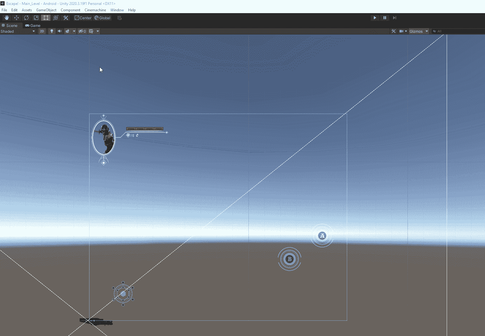

接下来，我们需要创建一个项目 ID，将我们的 Unity 广告链接到我们的帐户。进入“编辑”>“项目设置”>“广告”，选择与您的 Unity 帐户关联的组织。

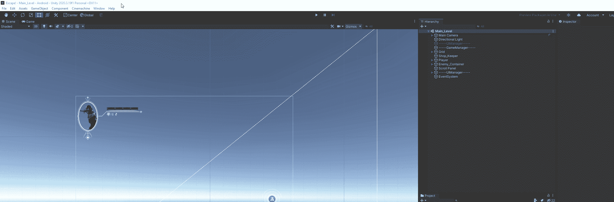

现在，您可以单击创建项目 ID 来创建您的新 ID。

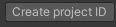

你必须回答一个关于项目是否会面向儿童的问题，这将为你创建链接。

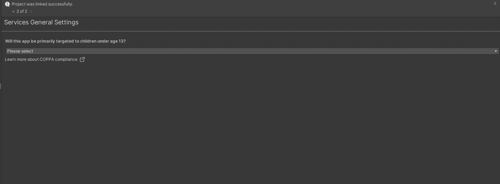

接下来，打开 Ads 服务，并确保您安装了最新的版本。出于测试目的，请确保您启用了“测试模式”。

记住当你的游戏上线时，你需要关闭测试模式。

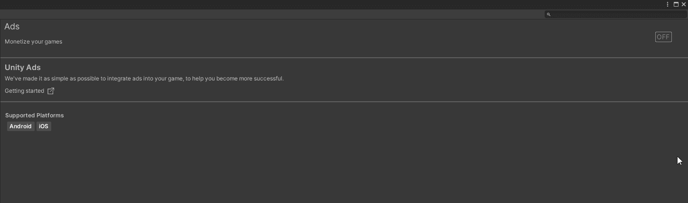

现在我们可以去我们的 [Unity 仪表盘](https://dashboard.unity3d.com/)并完成我们的设置。确保选择了正确的项目，然后单击“完成激活”按钮。你会得到一些设置选项，选择“我没有使用冥想，只有统一广告”。

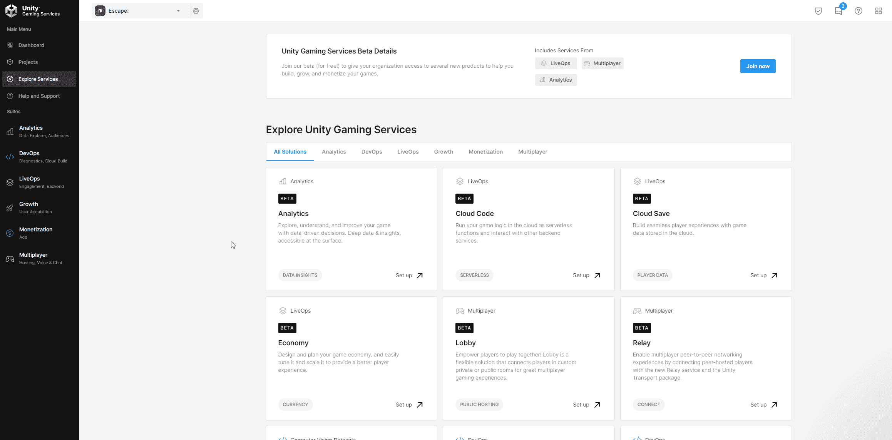

现在我们可以建立我们的广告部门了。广告单元是您希望显示的广告类型。在我们的例子中，我们将设置奖励的 Android 广告，并在玩家按下按钮时触发它们。请注意屏幕顶部的广告单元 Id 和您的游戏 ID。

在我的游戏场景中，我为玩家创建了一个按钮，点击该按钮可以观看广告并获得游戏内货币奖励。

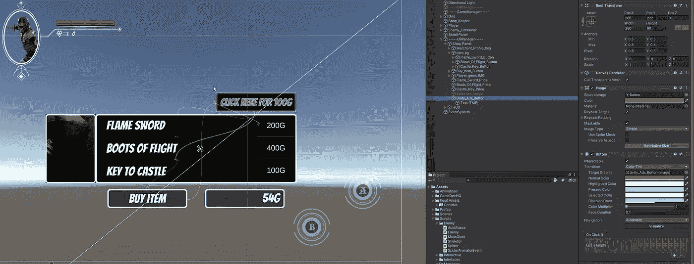

接下来，创建一个空对象来存放新的 adsManager 脚本。将您的脚本添加到对象中。在脚本中，我们将需要名称空间“ *UnityEngine。广告*”。我使用 singleton 模式设置这个类，以便能够跨所有脚本访问它。

接下来，我们要实现 IUnityAdsInitializationListener、IUnityAdsLoadListener 和 IUnityAdsShowListener 接口。这使我们能够从广告中访问上下文数据。我已经设置了每个函数来调试它的信息。文档中有更多信息。

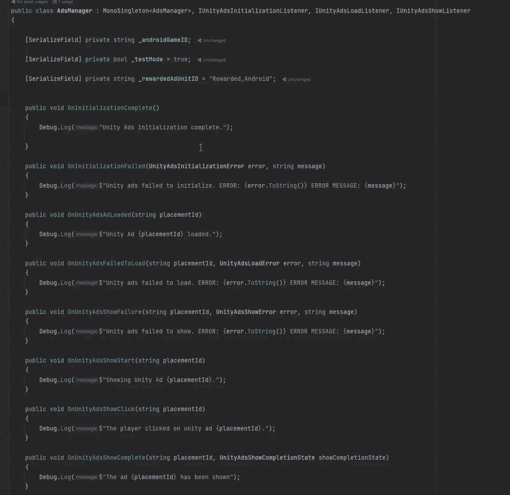

我们需要确保在第一次加载游戏时初始化并加载我们的广告，这样当玩家需要时广告就准备好了。

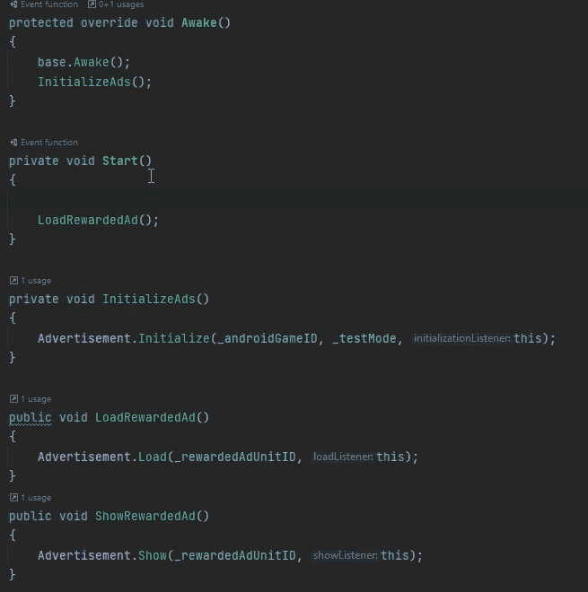

我们可以获得对按钮的引用

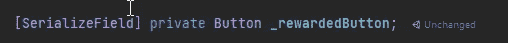

并且如果广告没有加载，则将它的可交互状态设置为假。

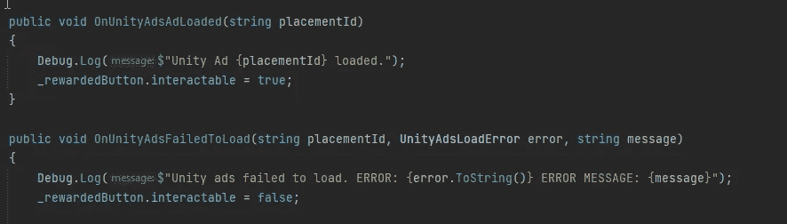

接下来，我们现在可以连接奖励玩家的功能。在播放器功能上，我们添加了一个功能来调整我们的钻石数量。

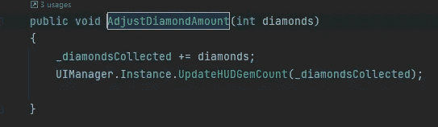

现在，我们可以在广告管理器上找到并缓存对播放器的引用。

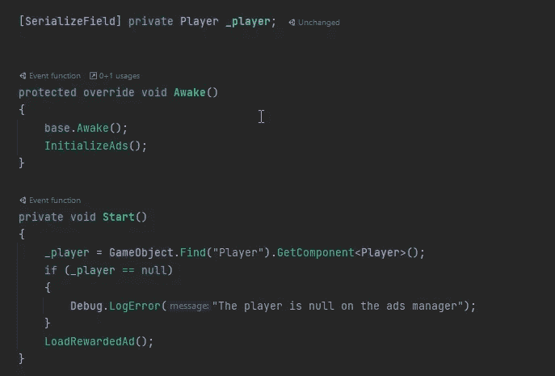

在函数“OnUnityAdsShowComplete”上，我们可以检查枚举 UnityAdsShowCompletionState

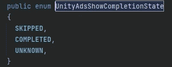

这是看玩家是否看完了整个广告。如果我们有多个广告，我们可以添加一个 switch 语句来检查广告单元 ID，适当地奖励玩家，并禁用我们的按钮。

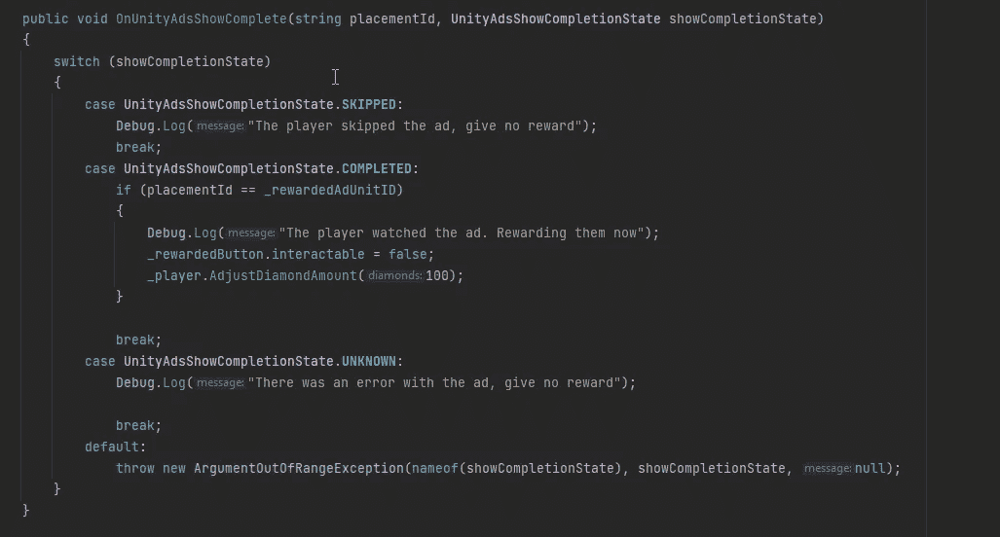

我们现在可以设置显示广告的功能。在我的 UIManager 上，我添加了以下函数。

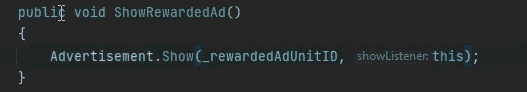

现在，我们可以将它分配给 Click 事件上的按钮。

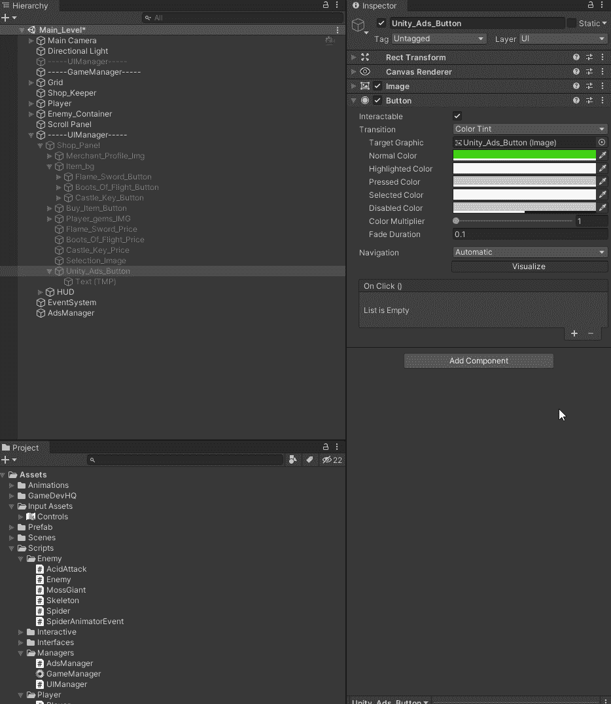

现在我们可以测试我们的功能了。

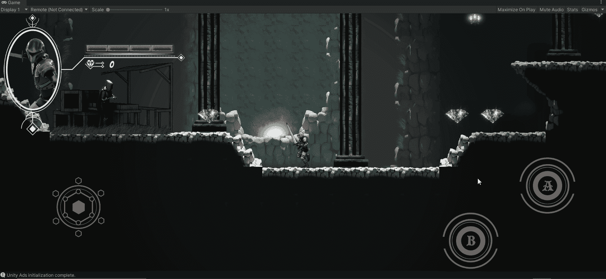

目前就这些。