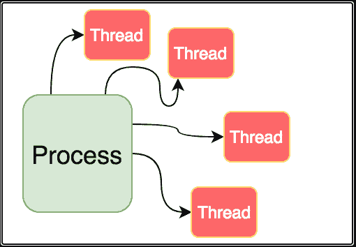

# 并行和后台处理在低延迟 Web 应用中的重要性

> 原文：<https://medium.com/codex/importance-of-parallel-and-background-processing-in-low-latency-web-apps-b57663c4e5f1?source=collection_archive---------15----------------------->

src:[https://www . slashroot . in/difference-between-process-and-thread-Linux](https://www.slashroot.in/difference-between-process-and-thread-linux)

几天前，我遇到一个场景，我被分配去优化一个 MVC 应用程序的性能和服务。

在大学期间，我们通常不会遇到这样的场景，我们会考虑优化性能以获得最佳用户体验。通常，我们开始构建一个项目并开始编码，而没有记住应用程序在 2-3 个月内最终会有多少负载。我们谈论可伸缩性，但有时当遇到瓶颈时，我们的代码开始中断。了解代码的行为非常重要。想象一下谷歌，当你输入你想搜索的东西时，你看到它让你等几秒钟，然后给你一个结果吗？不是吧？尝试了解这些应用程序如何在几分之一秒内获取您的结果，最重要的是同时为全球用户获取结果。

给 CS 社区的学生一个小提示——当你开始写代码时，考虑一下代码的影响和客户基础，以及几个月后一旦用户迷上了你的产品，它是否可以扩展。

回到我前几周的学习中来:时间长了，我遇到了学习进程和线程的需求。你应该还记得，在大学时代，我们都曾经在操作系统课上学习过线程和进程。我有机会在我的代码中实践这一点，使应用程序更具响应性和以用户为中心。

现在你看到了，在以用户为中心的应用中，低延迟和快速是非常重要的。速度是最重要的。在我看来，在这个不断变化的世界里，如果你的应用程序不够快，你最终会失去一个订户/用户。

试着阅读一下线程是如何工作的，以及什么是附加的和分离的子线程。一旦你在一个网站上执行一个操作，你可能需要考虑在 UI web 应用中引入后台处理。你可以让子线程在后台运行，而用户永远不会注意到。的确，任务和线程有它们自己的特性，但是如果你对我所说的感兴趣，试着在网上搜索一下。你将开始转动石头，异步行为将变得有点清晰。(已经在末尾分享了一些链接，建议从那里开始)。

凡事都有利弊。在 web 应用程序中引入分离的子线程会使您失去对它的控制，因为您唯一能控制的是父线程。此外，这里有一个问题要问你——你怎么知道你的子线程是在工作还是因为一些世俗的原因而死亡？(欢迎在评论中讨论这个问题)

在今天的框架中，大多数细节都是抽象的。在 ASP.Net 的 MVC 应用程序中，有一个任务的概念，通常线程的细节是从你那里抽象出来的。不过，有一些属性，您可以利用它们来揭示线程的特殊行为。

作为对所有学生和读者的总结，你构建的应用程序中最重要的东西，是以“P”开头的性能。说了这么多，不要为了它牺牲安全性。编写代码时要记住一些事情，并思考当有多人使用它，多人同时点击服务时，你的应用程序应该如何表现。在其他一些场景中，您最终进行了如此多的外部 API 调用，以至于服务开始认为您模拟了对服务的 DOS 攻击。这是一个值得考虑的有趣问题。

对于所有读到这里的人，与你分享一些有用的链接。你会发现有些事情有点矛盾，但是我会说只要有机会就去探索它们。事情会慢慢变得清晰。

[https://www . go 4 expert . com/articles/complete-threading-tutorial-c-sharp-t 30063/](https://www.go4expert.com/articles/complete-threading-tutorial-c-sharp-t30063/)
[https://www . go 4 expert . com/articles/advance-threading-tasks-c-sharp-t 30067/](https://www.go4expert.com/articles/advance-threading-tasks-c-sharp-t30067/)
[https://www . plural sight . com/guides/understand-control-flow-async-await](https://www.pluralsight.com/guides/understand-control-flow-async-await)
[https://medium . com/devtech blogs/overview-of-cview = net-5.0](/devtechblogs/overview-of-c-async-programming-with-thread-pools-and-task-parallel-library-7b18c9fc192d)
[https://docs . Microsoft . com/en-us/dot net/standard/parallel-programming/task-based-asynchronous-programming](https://docs.microsoft.com/en-us/dotnet/standard/parallel-programming/task-based-asynchronous-programming)
[https://www . c-sharp corner . com/article/task-and-thread-in-c-sharp/](https://www.c-sharpcorner.com/article/task-and-thread-in-c-sharp/)