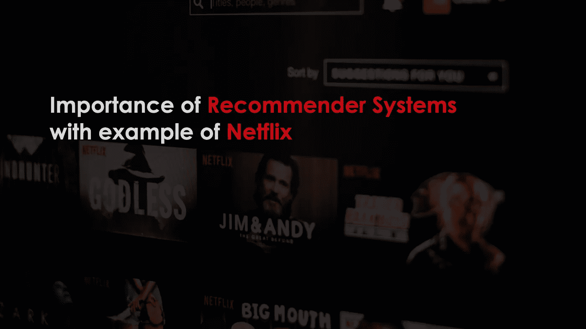
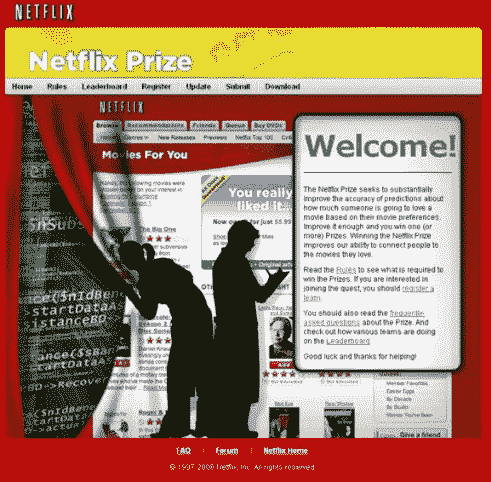
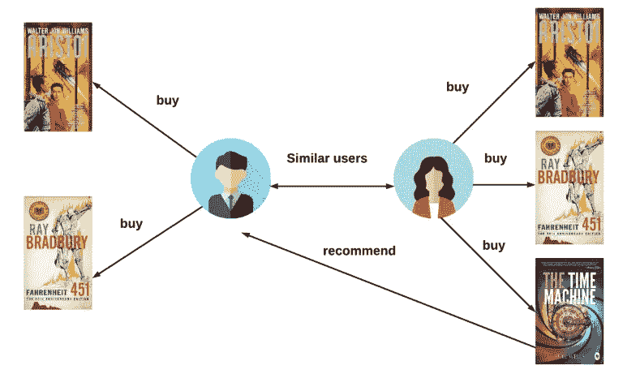
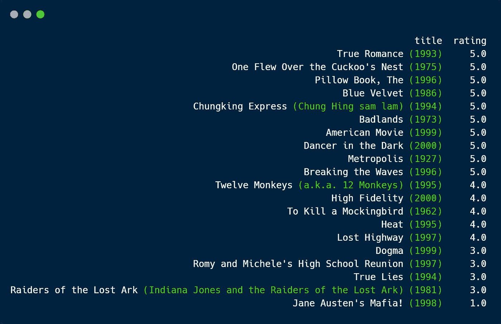
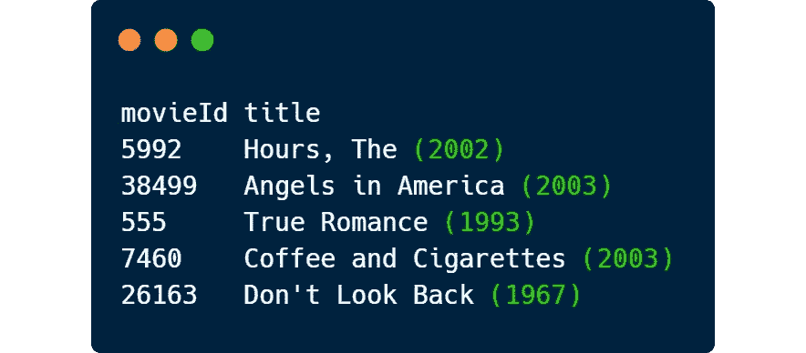

# 以网飞为例说明推荐制度的重要性

> 原文：<https://medium.com/codex/importance-of-recommendation-algorithm-with-the-example-of-netflix-e80041deb6eb?source=collection_archive---------5----------------------->

## 一切都是推荐

在本文中，我们将了解推荐系统的重要性。我们将很快从网飞的故事开始，然后是后台令人难以置信的推荐系统。在文章的最后，我将向您展示所有这些是如何与 Python 一起工作的。

我不会从理论上深入推荐系统的细节，以免延伸太多。我想在下面的文章里谈谈这个话题。

## 产品个性化是**意识**。

所有这一切都始于理解所拥有的大数据并将其用于正确的目的。服务需要让顾客意识到公司是如何适应他们的口味的。这不仅促进了对系统的信任，而且鼓励成员提供反馈，从而产生更好的建议。

推荐系统在一些行业中非常重要，因为当它们有效时，可以产生大量的收入，或者是从竞争对手中脱颖而出的一种方式。我们正在谈论一个可以整合到你能想到的每个部门的概念，比如银行、电子商务和零售部门。

## 让我们从网飞的故事开始！

我想我们都知道网飞在 1997 年是纯粹的电影租赁服务公司。用户在网飞网站上订购电影，然后收到邮寄过来的 DVD。当他们用完后，他们会简单地用提供的信封把它们寄回网飞。你能想象当时这项服务被视为一种恩惠吗？

今天，网飞在线观看电影，在全球超过 190 个国家拥有超过 2 . 09 亿的付费用户。它提供各种类型和语言的电视剧、纪录片和故事片，包括原创作品。

1998 年，在 Netflix.com，网飞开设了第一家 DVD 租赁和销售网站。

我们可以很容易地说，激动人心的部分从这里开始。

2000 年，引入了个性化电影推荐系统，使用成员对过去电影的评级来准确预测未来的选择。

该公司还在 2006 年推出了“ [Netflix Prize](https://www.netflixprize.com/index.html) ”一项机器学习和数据挖掘竞赛，旨在预测电影评级。网飞赞助了一项比赛，向能够从超过 1 亿部电影评级中获取数据集并返回比该公司现有推荐系统准确 10%的推荐的团队提供 100 万美元的大奖。

netflixprize.com

为了更深入地探索这一技术过程，你可以阅读西蒙·芬克的博客文章，他与研究界分享了他的发现

**1 亿美元**匿名电影评级，使用一个从一到五颗星给电影评级的系统。这是迄今为止发布的最大一组此类数据。

网飞对推荐算法的关注已经改变，因为网飞作为一个整体在过去几年发生了巨大的变化。网飞在 2007 年推出了即时流媒体服务，即 Netflix 奖开始一年后。

## 你也知道这个吗？电影图像根据你的兴趣而变化。

让我们考虑将网飞用来描绘电影《心灵捕手》的形象个性化。这里，系统可以基于成员对不同流派和主题的偏好程度来个性化该决定。如果网飞展示包含马特·达蒙和明妮·德瑞弗的艺术作品，观看过许多浪漫电影的人可能会对《心灵捕手》感兴趣，而如果网飞使用包含著名喜剧演员罗宾·威廉姆斯的艺术作品，则观看过许多喜剧的成员可能会被该电影吸引。

# 现在让我们更深入地了解一下这些电影推荐方法

推荐系统可以分为两种类型:

这些方法我就不深究了。在我看来，那些推荐方法是非常强大的，并且是开放的，可以实现许多领域。将有另一篇文章，可能有更多的技术细节。

协同过滤方法有 3 种不同的子方法，如**基于用户的协同**、**基于项目的协同**和**基于模型的协同**(矩阵分解)过滤。

矩阵分解是一类用于推荐系统的协同过滤算法。西蒙·芬克在他 2006 年的博客文章中报道了这一系列方法，由于其有效性，这些方法在网飞奖挑战中变得广为人知。

但是今天我会明确的给大家展示基于用户的方法，这是协同过滤方法的一种。

协同过滤的思想很简单:利用用户群体行为向其他用户进行推荐。因为推荐是基于其他用户的偏好，所以它被称为协作推荐。

> **“和你相似的用户也喜欢……”**

基于与被观察用户相似的用户购买/喜欢产品的事实，向用户推荐产品。

基于用户的协同过滤推荐系统——以 thingsolver.com 为例

假设您观看了这些电影以及您对相关电影的评分:

我们将使用 MovieLens 数据集。它包含 27.278 部电影的 20.000.263 个评级和 465.564 个标签应用。你可以在这个[链接](https://www.kaggle.com/grouplens/movielens-20m-dataset)中找到数据集。

现在，我们将尝试向您推荐与您看过的电影以及您在网飞的一些评分相关的新电影。

我会直接跳到系统电影推荐给你看。如果你对 Python 代码感兴趣，[这里是我的作品](https://github.com/nfzaltay/user-based-recommender/blob/main/user-based-recommender.py)。

**哒哒！**

这五部电影是你将在屏幕上看到的系统的电影推荐。

我将等待你的评论和喜欢。

我祝愿每个人在这条学习道路上取得成功。

这是我的 Linkedin，有任何问题或讨论，你都可以写信给我。

参考资料:

[*www.veribilimiokulu.com*](http://www.veribilimiokulu.com)

[*https://Gibson biddle . medium . com/a-brief-history-of-网飞-个性化-1f2debf010a1*](https://gibsonbiddle.medium.com/a-brief-history-of-netflix-personalization-1f2debf010a1)

 [## 网飞推荐:超越五星(下)

### 更深入地了解我们更广泛的个性化技术。

netflixtechblog.com](https://netflixtechblog.com/netflix-recommendations-beyond-the-5-stars-part-2-d9b96aa399f5)