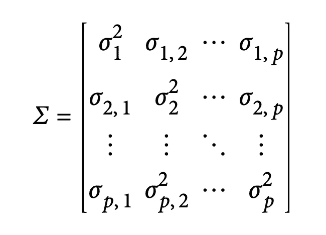

# 重要的聚类算法-使用 Python

> 原文：<https://medium.com/codex/important-clustering-algorithms-with-python-c81a170f3a3f?source=collection_archive---------9----------------------->

## 聚类可用于知识发现和扩充预测模型。

在机器学习(ML)和人工智能(AI)领域，有两种处理数据的基本方法:有监督的和无监督的机器学习。与监督学习相反，在监督学习中，我们用数据来训练模型，而在非监督学习中，我们不用。因此，监督技术主要是为预测而设计的。对于无监督学习，由于没有地面真值/标签，我们主要用它来进行描述性分析。换句话说，无监督学习用于知识发现。


[病毒](https://www.nationalgeographic.com/science/article/factors-allow-viruses-infect-humans-coronavirus)

聚类作为一种无监督的技术，是一种快速有效的知识发现方法。它们还可以用于在某些特征丢失的情况下扩充预测模型。集群对于“冷启动问题”是一个特别重要的工具在这种类型的问题中，例如发起新的营销活动或识别潜在的新型欺诈或垃圾邮件，我们最初可能没有任何响应来训练模型。随着时间的推移，随着数据的收集，我们可以更多地了解系统，并建立一个传统的预测模型。但是聚类通过识别人群来帮助我们更快地开始学习过程[1]。

在这篇短文中，我们将介绍一些在不同情况下使用的著名聚类算法。我们将使用 Python 作为实现语言来演示它们在真实场景中的应用。我们将讨论 K-means、分层和基于模型的聚类，以及给定数据集上相应的 Python 实现。

# 资料组

为了展示主成分分析在现实世界问题中的应用，我们将主成分分析应用于一个股票市场数据集。完整的数据集可以从 [Kaggle 网站](https://www.kaggle.com/szrlee/stock-time-series-20050101-to-20171231)下载。它由 30 家 DJIA 公司中的 29 家的多种股票价格组成(不包括“V ”,因为它没有完整的 12 年数据)。我们将利用 *Sci-kit Learn* 包来实现股票回报的 PCA。完整的代码可以在[这里](https://www.kaggle.com/vahidnaghshin/clusterstock)找到。

```
dic_stock_return = defaultdict(int)
for dirname, _, filenames in os.walk('/kaggle/input'):
    for filename in filenames:
        print(os.path.join(dirname, filename))
        df = pd.read_csv(os.path.join(dirname, filename))
        df['return'] = (df.Close - df.Open) / (df.Open)
        dic_stock_return[df.Name[0]] = df['return']df_stock_return = pd.DataFrame(dic_stock_return)
df_stock_return.head()
```


数据集的前五条记录

# k 均值聚类

聚类是一种将记录分成不同组的技术，其中在每个组中，不同组的成员的相似性最小，同时在同一组的成员之间保持高相似性。K-means 作为最有效的聚类算法之一，通过最小化每个记录到其分配的聚类的*均值*的平方距离之和，将数据划分为 *K* 个聚类。这被称为*类内平方和*或*类内平方和*。 *K* -means 不确保聚类具有相同的大小，但会找到最佳分离的聚类[1]。聚类内的平方和由下式给出:


一个分类成员的平方和

*K* -means 查找所有四个分类的分类内平方和最小的记录分配。

我们挑选了两只股票，谷歌和苹果的股票，并尝试使用 K-means 算法对每日收益进行聚类。K-means 需要预先设置聚类数。我们将把集群的数量设置为 4。使用 K-means 算法下面的 colde 将数据分组为 4 个簇。

```
tech_px = df_stock_return[['GOOGL', 'AAPL']]
#drop last row since it is NaN
tech_px = tech_px.drop(3019)
kmeans = KMeans(n_clusters=4).fit(tech_px)
tech_px['cluster'] = kmeans.labels_
centers = pd.DataFrame(kmeans.cluster_centers_, columns=['GOOGL', 'AAPL'])
print(centers)
```


集群中心

我们可以将这些点和它们相应的聚类中心可视化如下

```
fig, ax = plt.subplots(figsize=(14, 10))
ax = sns.scatterplot(x='GOOGL', y='AAPL', hue='cluster', style='cluster', 
                     ax=ax, data=tech_px)
ax.set_xlim(-0.1, 0.1)
ax.set_ylim(-0.1, 0.1)
centers.plot.scatter(x='GOOGL', y='AAPL', ax=ax, s=50, color='black')plt.tight_layout()
plt.show()
```


四个不同的集群和点

如果我们对包含所有公司的完整数据集应用 K-means，并将聚类数设置为 4，则每个聚类中的成员数可以通过以下方式获得

```
#remove rows with at least one NaN values
nan_rows = df_stock_return[df_stock_return.isnull().T.any()]df_stock_return = df_stock_return.drop(list(nan_rows.index))
syms = sorted(['MMM', 'AXP', 'AAPL', 'BA', 'CAT', 'CVX', 'CSCO', 'KO', 'DIS', 'XOM', 'GE',
               'GS', 'HD', 'IBM', 'INTC', 'JNJ', 'JPM', 'MCD', 'MRK', 'MSFT', 'NKE', 'PFE',
               'PG', 'TRV', 'UTX', 'UNH', 'VZ', 'WMT', 'GOOGL', 'AMZN', 'AABA'])
top_df = df_stock_return[syms]
kmeans = KMeans(n_clusters=4).fit(top_df)
from collections import Counter
print(Counter(kmeans.labels_))
```


可以看出，每个聚类中的点数非常不平衡。不平衡聚类可能是由远处的异常值或与其余数据截然不同的记录组造成的，这两种情况都可能需要进一步检查[1]。


聚类均值

通过观察聚类中心，我们可以看到聚类 1 和 3 对应于下行市场，而聚类 2 和 4 对应于上行市场。

## 选择群集的数量

因为 K-means 算法需要设置聚类的数量，所以我们应该能够选择适当数量的聚类。不幸的是，没有一种放之四海而皆准的方法来设置集群的数量。一种方法是调查不同数量的聚类的平均聚类内平方距离。

```
inertia = []
for n_clusters in range(2, 15):
    kmeans = KMeans(n_clusters=n_clusters, random_state=0).fit(top_df)
    inertia.append(kmeans.inertia_ / n_clusters)
inertias = pd.DataFrame({'n_clusters': range(2, 15), 'inertia': inertia})
ax = inertias.plot(x='n_clusters', y='inertia')
plt.xlabel('Number of clusters(k)')
plt.ylabel('Average Within-Cluster Squared Distances')
plt.ylim((0, 1.1 * inertias.inertia.max()))
ax.legend().set_visible(False)plt.tight_layout()
plt.show()
```


不同集群数量的集群内平均 sqr 距离

在评估要保留多少集群时，最重要的测试可能是:这些集群在新数据上复制的可能性有多大？聚类是可解释的吗？它们与数据的一般特征相关吗？或者它们只是反映了一个特定的实例？你可以通过交叉验证来评估这一点。

# 分层聚类

分层聚类允许用户可视化指定不同数量的聚类的效果。它在发现边缘或异常群体或记录方面更敏感。分层聚类也有助于直观的图形显示，从而更容易解释聚类。

层次聚类从将每个点视为一个单独的聚类开始，然后将相似的聚类合并成一个更大的聚类，直到只有一个单独的聚类。两个聚类的相似性包括不同的距离定义，该距离定义基于两个不同聚类的成员的成对比较。分层聚类的灵活性是有代价的，而且分层聚类不能很好地扩展到包含数百万条记录的大型数据集。

为了在股票市场上应用层次聚类，我们的目标是基于它们的每日回报对相似的公司进行分组。因此，我们将有 30 行，对应于每个公司，每天有 3018 列。通过应用层次聚类，我们有

```
top_df = top_df.transpose()Z = linkage(top_df, method='complete')fig, ax = plt.subplots(figsize=(8, 5))
dendrogram(Z, labels=list(top_df.index), color_threshold=0)
plt.xticks(rotation=90)
ax.set_ylabel('distance')plt.tight_layout()
plt.show()
```


系统树图

从上图可以看出，亚马逊和 UNH 与其他股票的差异最大，因为它们在更高的距离合并。我们可以通过以下方式访问具有给定数量的集群的成员

```
memb = fcluster(Z, 4, criterion='maxclust')memb = pd.Series(memb, index=top_df.index)
for key, item in memb.groupby(memb):
    print(f"{key} : {', '.join(item.index)}")
```


4 个集群的集群成员

常见的相异度度量有四种:*完全连锁*、*单连锁*、*平均连锁*、*最小方差*。前面定义的完全链接方法倾向于产生具有相似成员的聚类。单一链接方法是两个分类中的记录之间的最小距离。这是一种“贪婪”的方法，产生的集群可能包含完全不同的元素。平均连锁法是所有距离对的平均值，代表单一连锁法和完全连锁法之间的折衷。最后，最小方差法，也称为 *Ward 的*法，类似于 *K* -means，因为它最小化了组内平方和[1]。使用最小方差最类似于 K 均值聚类。使用`linkage`中的`method`属性，我们可以选择我们将要使用的。

# **基于模型的聚类**

基于模型的聚类方法最近获得了关注。该技术基于统计理论，并提供了更严格的方法来确定集群的性质和数量。例如，在可能有一组记录彼此相似但不一定彼此接近的情况下，可以使用它们[1]。

最广泛使用的基于模型的聚类方法依赖于多元正态分布。多元正态分布是正态分布对一组 *p* 变量 *X* 1、 *X* 2、...， *X p* 。协方差矩阵是变量之间相互关系的度量。



*p 变量的协方差矩阵*

请注意，协方差矩阵是围绕从左上到右下的对角线对称的。基于模型的聚类背后的关键思想是，每个记录都被假设为分布为 *K* 多元正态分布之一，其中 *K* 是聚类的数量[1]。

```
mclust = GaussianMixture(n_components=2).fit(tech_px)
fig, ax = plt.subplots(figsize=(8, 8))
colors = [f'C{c}' for c in mclust.predict(tech_px)]tech_px.plot.scatter(x='GOOGL', y='AAPL', c=colors, alpha=0.5, ax=ax)
ax.set_xlim(-0.1, 0.1)
ax.set_ylim(-0.1, 0.1)plt.tight_layout()
plt.show()
```

输出将是


通过基于模型的聚类获得的聚类

正如您所看到的，基于模型获得的聚类不同于 K-means 聚类获得的聚类。

同样，我们可以改变集群的数量，看看 BIC 是如何变化的。

```
results = []
covariance_types = ['full', 'tied', 'diag', 'spherical']
for n_components in range(1, 9):
    for covariance_type in covariance_types:
        mclust = GaussianMixture(n_components = n_components, warm_start=True,
                                 covariance_type = covariance_type)
        mclust.fit(tech_px)
        results.append({
            'bic': mclust.bic(tech_px),
            'n_components': n_components,
            'covariance_type': covariance_type,
        })

results = pd.DataFrame(results)colors = ['C0', 'C1', 'C2', 'C3']
styles = ['C0-','C1:','C0-.', 'C1--']fig, ax = plt.subplots(figsize=(8, 8))
for i, covariance_type in enumerate(covariance_types):
    subset = results.loc[results.covariance_type == covariance_type, :]
    subset.plot(x='n_components', y='bic', ax=ax, label=covariance_type, 
                kind='line', style=styles[i]) # , color=colors[i])plt.tight_layout()
plt.show()
```


使用`warm_start`参数，计算将重用来自先前拟合的信息。这将加快后续计算的收敛速度。

# 参考

[1]布鲁斯、彼得、安德鲁·布鲁斯和彼得·格德克。*数据科学家实用统计:使用 R 和 Python 的 50 多个基本概念*。奥莱利媒体，2020。