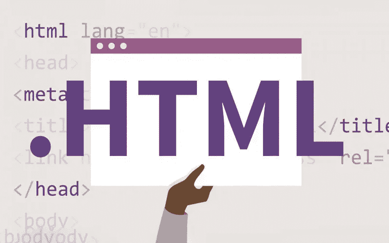

# 需要了解的重要 HTML 标签

> 原文：<https://medium.com/codex/important-html-tags-to-know-78d6ea51c0b4?source=collection_archive---------10----------------------->

## 面向绝对初学者的 Web 开发

开始学习如何开发网站，或者只是修改一些你很久以前已经涉及的材料？这篇文章将帮助你理解 HTML 的核心概念和你应该知道的重要标签，从而开始你的 web 开发生涯。



[来源](https://www.google.com/url?sa=i&url=https%3A%2F%2Ftrickiknow.com%2Fhtml-for-dummies-basics-begginers-guide%2F&psig=AOvVaw2241xwzyTOsjyNFrV4Jy90&ust=1667065432340000&source=images&cd=vfe&ved=0CA4Q3YkBahcKEwjw8bPpvIP7AhUAAAAAHQAAAAAQBQ)

在我们开始之前，让我们来谈谈 HTML 文档的基本结构

# 基本 HTML 模板

## HTML 标签

每个文档都以一个`<html />`标签开始和结束。在第一行，你看到一个`<!DOCTYPE html>`；这只是告诉浏览器我们将要使用一个 HTML 文档。

## 头部标签

你的网站不仅仅依赖于网站内部的东西，还依赖于配置。`<head />`是一个**容器标签**，用于指定你的网站的配置。

## 标题标签

如果您以`.html`扩展名保存文件，并在浏览器中查看该文件，您将在浏览器的选项卡中找到标题。

## 正文标签

您想要显示的所有内容都将放在 body 标签中。

# 重要的 HTML 标签

# 至

###### —标题标签

标题标签就是你必须在你的网站上添加一个大的粗体文本。这可能是你整个网站的标题，副标题，甚至是你网站的某个部分的标题。说到组织…

## —部门标签

这个标签是目前为止，HTML 网站中使用的最重要的标签。用文字来解释它的用途和使用方法并不容易。理解用法的唯一方法是阅读他人的代码并理解它。

## —锚标签

什么是没有链接的网站？锚定标签帮助您创建到其他网站和/或您自己网站内部的链接。锚点标签带有一个强制的**属性**:

```
<a **href="https://cybercoder-naj.github.io"**>
  Click here to see my website
</a>
```

## 

—段落标签

这是 HTML 中常用的另一个非常重要的标签。通常，这充当特定文本的容器。当您在段落标记中添加文本时，可以确保文本的上下有一行间距。

##  —图像标签

图像标签也非常有用。我们可以在网站上添加任何我们想要的图片，无论是在本地的项目目录中，还是从互联网上。这个标签有两个强制属性。

```

```

# 结论

写这篇文章的目的是告诉你 HTML 中常用的标签，以帮助你推进你的 web 开发之旅。

[学习网页设计](http://www.winnystudio.com/kmcweb/lectures/LearningWebDesig4thEdition_01.pdf) —我用这本书学习网页开发，强烈推荐。

我希望你喜欢读我的文章，并学到了一些东西。谢谢大家！✌

```
**Want to connect?**My [GitHub](https://github.com/cybercoder-naj) profile.
My [Portfolio](https://cybercoder-naj.github.io) website.
```