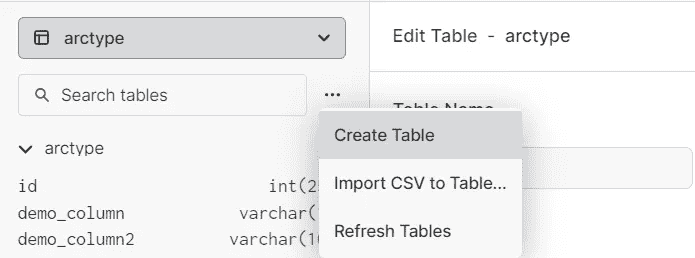
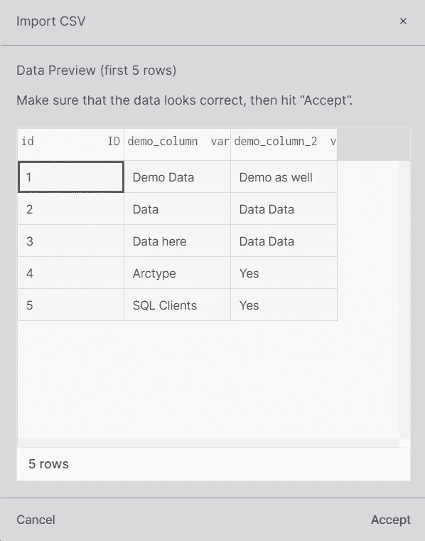
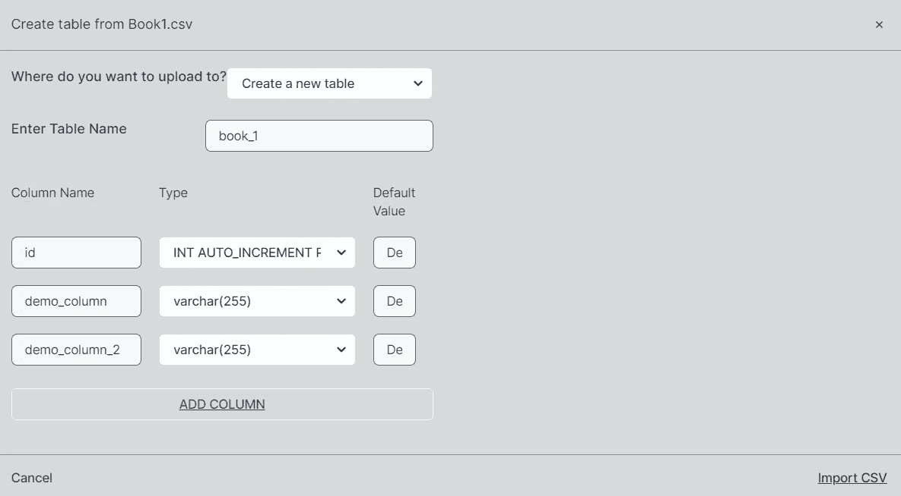

# 使用 MySQL 和 Arctype 导入数据

> 原文：<https://medium.com/codex/importing-data-using-mysql-and-arctype-a8c0d9549e80?source=collection_archive---------10----------------------->


如果您是希望快速将数据加载到数据库中的开发人员或数据库管理员，您可能已经知道有很多选择，至少就 MySQL 而言。在这篇博客中，我们将介绍将数据导入 MySQL 实例时的选项。

# 有哪些选择？

首先，在将数据导入 MySQL 时，您有两个导入数据的选项:

*   可以使用`INSERT INTO`并指定一个表名以及需要导入给定数据库实例的列和数据。
*   用户也可以使用`LOAD DATA INFILE`并指定一个特定的文件，他或她希望将数据从该文件加载到给定的表中。

现在，我们可以告诉你，“不，`LOAD DATA INFILE`不是将数据导入基于 MySQL 或 MariaDB 的实例的唯一选项”，但是，这不是你来这里的目的——你来这里是为了了解将数据导入基于 MySQL 的实例的最佳机制。

现在你已经知道`LOAD DATA INFILE`和`INSERT INTO`是你唯一的选择——然而，你可能也知道我们已经在我们的的早期博客文章中介绍了`LOAD DATA INFILE`和[提供的一些功能，所以你可能想知道我们为什么要写另一个。嗯，我们还没有涵盖所有内容！](https://arctype.com/blog/mysql-load-data-infile/)

比如我们告诉你`LOAD DATA INFILE`更快，事实也的确如此。但是，一旦您需要将数据快速导入到数据库实例中，您还有几个其他的选择。例如，您可以像这样使用`COMMIT`语句:

```
SET autocommit=0;
INSERT INTO arctype (demo_column) VALUES (‘Demo Column’);
COMMIT;
```

以上面指定的方式运行查询将有助于您的数据库在插入数据时执行得更好，因为`COMMIT`语句保存了数据库的当前状态。换句话说，将`autocommit`的值设为 0，导入数据，然后提交可能是在 MySQL 中导入数据的一个更好的选择，因为您只需要在需要的时候将修改保存到磁盘上，这样可以减少 MySQL(或 MariaDB)的麻烦。另外，考虑将`unique_checks`设置为 0，将`foreign_key_checks`也设置为 0:将这些参数设置为 off (0)也会提高数据库性能。

如果您运行的是 MyISAM 存储引擎，将数据导入 MySQL 的另一个快速方法是将`.frm`、`.MYD`和`.MYI`文件复制到不同数据库服务器上的给定文件夹中。不过这里有一个警告——您应该只使用 MyISAM 这样做，因为 InnoDB 的工作方式不同。除非你充分意识到后果，否则不要尝试这种方法。

您可以[阅读我们关于 InnoDB 与大数据的博客文章，以了解更多信息](https://arctype.com/blog/mysql-storage-engine-big-data/)，但本质上，InnoDB 有一个核心文件——ibdata1——这是其性能的核心。像这样简单地复制文件弊大于利，因为 ibdata1 中的表空间 ID 与复制到新服务器的数据库文件中的表空间 ID 不匹配。

另一种加快给定数据导入的快速方法是在导入时锁定表。在导入数据之前运行一个`LOCK TABLES`查询，完成后运行`UNLOCK TABLES`，你应该可以开始了。如果您发现自己需要防止某些会话修改表，那么建议使用这种方法。

您也可以使用由`INSERT`语句提供的批量导入功能。`INSERT INTO arctype (demo_column) VALUES (‘demo’), (‘demo’);`会比普通的`INSERT`语句插入得更快。

然而，这些并不是你可以采用的唯一选择。如果您正在使用 MyISAM(您不应该这样做，但是如果您发现自己被迫使用这样的存储引擎…)，您可能还想考虑增加`bulk_insert_buffer_size`的值。根据 MySQL，该变量限制了每个线程的缓存树的大小(以字节为单位),因此，如果您发现自己在使用 MyISAM 时导入了大量数据，这应该会有所帮助。

## 一个注意事项:secure_file_priv 变量

`secure_file_priv`变量与数据库实例内部的数据批量导入密切相关。[在之前的帖子中，我们说过](https://arctype.com/blog/mysql-load-data-infile/) `[LOAD DATA INFILE](https://arctype.com/blog/mysql-load-data-infile/)` [比](https://arctype.com/blog/mysql-load-data-infile/) `[INSERT](https://arctype.com/blog/mysql-load-data-infile/)` [语句要快得多，因为它自带了许多所谓的“花里胡哨”语句](https://arctype.com/blog/mysql-load-data-infile/)。这种魔力的一部分是`load_data_infile`。该变量通常驻留在您的`my.cnf`文件中(该文件本身位于您的`/var/bin/mysql`目录中)，看起来是这样的(下面的例子引用了在 Windows 环境中使用的变量):

`secure_file_priv=”c:/wamp64/tmp”`

简单地说，这个变量限制了哪些目录可以用来将数据加载到 MySQL 数据库实例中。换句话说，一旦您运行一个`LOAD DATA INFILE`查询，并且您加载到数据库实例中的文件不在这个目录中，MySQL 将返回一个类似这样的错误:

```
ERROR 1290 (HY000): The MySQL server is running with the --secure-file-priv option so it cannot execute this statement
```

为了克服这个错误，您需要从您的`my.cnf`文件中删除`--secure-file-priv`设置，或者从变量值中指定的目录中加载您的数据。一旦你这样做了，你的数据应该被加载(和导出)没有任何问题！

# 其他问题

除了使用`LOAD DATA INFILE`将数据加载到 MySQL 数据库实例中并利用这个特权之外，当使用`SELECT … INTO OUTFILE`从 MySQL 导出数据时，这样一个变量的值也可能是相关的。该变量也可用于通过`LOAD DATA INFILE`和`SELECT ... INTO OUTFILE`禁用导入和导出操作:在这种情况下，只需将该变量设置为`NULL`。不过，一般来说，您也可以运行类似于`SHOW QUERY VARIABLES LIKE ‘secure_file_priv’`或`SELECT @@secure_file_priv`的查询，以便观察这个变量被设置到的目录的名称。

# 是时候导入一些数据了！

现在，您已经准备好导入一些数据了。您能使用`INSERT`查询并逐个插入所有的行吗？或者您可能会使用`INSERT`提供的批量插入功能？

从技术上讲，是的——你可以做到。您可以通过将 CSV 文件中的行复制到`INSERT`语句中来插入它们，然后逐个运行它们，但是这将花费相当多的时间，您还需要确保将 CSV 文件中行的正确值复制到`INSERT`语句中，等等。-那会很麻烦！

谢天谢地，有一些工具可以帮助你完成这些任务。其中一些工具是 SQL 客户端。例如， [Arctype](https://arctype.com) 开发的 SQL 客户端可以像电子表格一样帮助你编辑表格，你可以选择任何你想要编辑的单元格，只需点击删除就可以删除行，等等。

但是，Arctype 有另一个功能应该与本文的范围更相关，即 Arctype 还允许您将 CSV 文件导入到数据库实例中。让我们看看如何做到这一点！

继续并启动 Arctype。在你桌子的右边，在桌子结构的上方，你会发现三个水平的点。点击它们:



这些点表示可供您使用的选项:您可以创建一个表格或刷新它们，也可以将给定 CSV 文件的内容导入到您的表格中。点击**导入 CSV** 并选择您想要导入的文件:



Arctype 将为您提供有关文件的一些信息，并提供 CSV 文件包含的前五行。一旦您对看到的输出感到满意，就该导入数据了——继续并点击 **Accept** :



单击 accept 后，您将能够定义要导入数据的表的列，您将能够创建新表或选择将数据上传到现有表中。

一旦您对屏幕上看到的内容感到满意，继续点击 I**import CSV**导入您的文件:您的数据现在应该存在于您的表中了！就是这样——真的就这么简单。


有时，当您的数据太长而无法导入时，您可能会遇到如上所示的一些错误(在这种情况下，Arctype 将导入导致错误的所有行)，但通常情况下，导入过程应该会很顺利

# 底线

当您发现自己需要快速将数据导入 MySQL 实例时，`LOAD DATA INFILE`远不是您唯一的选择。您还可以使用`INSERT`语句提供的批量插入功能，修改 MySQL 的功能，使其只在数据完全加载到数据库表中后才提交，并且使用`LOAD DATA INFILE`只将数据加载到特定的列中。

我们希望您继续关注我们的博客，因为我们为您准备了更多的内容——这个博客涵盖了数据库、安全性和对开发人员的一般建议，因此您一定会找到您正在寻找的内容。此外，如果您想尝试目前为止所学的内容，Arctype 是实现这一目的的最佳工具。使用下面的按钮下载 Arctype，并立即测试您的技能！

Lukas 是一个有道德的黑客，MySQL 数据库管理员，也是一个经常参加会议的演讲者。自 2014 年以来，Lukas 发现并负责任地披露了立陶宛国内外一些访问量最大的网站的安全漏洞，包括广告、礼品购买、游戏、托管网站以及一些政府机构的网站。Lukas 运行着世界上最大和最快的数据泄露搜索引擎之一:[BreachDirectory.com](http://breachdirectory.com/)并经常在多个地方写博客，教育人们关于信息安全和其他主题。他还在 lukasvileikis.com 经营自己的博客。