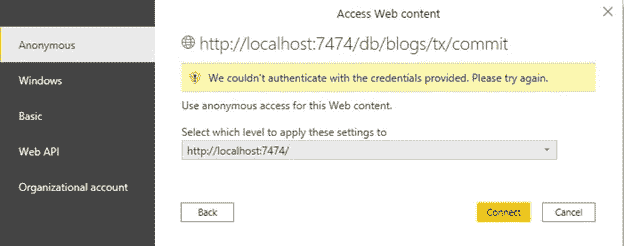

# 使用 Power BI 导入 Neo4j 图形数据

> 原文：<https://medium.com/codex/importing-neo4j-graph-data-with-power-bi-d2686e9255bc?source=collection_archive---------1----------------------->

Neo4j + Power BI(版权归微软和 Neo4j 所有)

利用图形驱动的数据库系统，从复杂的关系数据库转换到更加流线化的数据工作流，并不意味着您必须彻底清除整个技术套件。许多目前无处不在的技术可以与 graph 结合在一起，以促进有效的数据工作流，同时还允许您利用您已经在技术堆栈中进行的投资。本文向您展示了如何将图形数据库 Neo4j 与 Power BI 集成，Power BI 是一个商业智能工具，可能已经是您的技术堆栈的一部分。据 Forrester 和 Gartner 称，Neo4j 和 Power BI 是两项领先的技术。

具体来说，本文介绍了如何将 Neo4j HTTP API 的默认版本与 Power BI 一起使用。利用 Web API 方法允许在 Power BI 的在线服务中使用为 REST API 编写的所有查询。还有其他选项可以将 Neo4j 连接到 Power BI 或其他 BI 工具，包括 Neo4j 的 JDBC 基于 Java 的 BI 连接器，或夏洛特·斯卡登的[Neo4jDataConnectorForPowerBi](https://github.com/cskardon/Neo4jDataConnectorForPowerBi)。除了这些解决方案，使用 R 或 Python 代码将数据导入 Power BI Desktop 也很容易。

虽然如果您想要手动发布报告以在 Power BI online 环境中共享，这些解决方案是可行的，但是 Power BI online 不允许从[定制数据连接器](https://docs.microsoft.com/en-us/power-bi/connect-data/desktop-connector-extensibility)自动刷新。Power BI online 也不支持 Neo4j 的 [R 包](https://docs.microsoft.com/en-us/power-bi/connect-data/service-r-packages-support)，也不支持 Neo4j 连接的 [Python 包](https://docs.microsoft.com/en-us/power-bi/connect-data/service-python-packages-support)。这意味着，为了让 Power BI online 根据计划自动刷新来自 Neo4j 数据的报告，您不能使用 R、Python、自定义连接器或 JDBC/ODBC 连接器。允许从 Neo4j 进行实时自动刷新的唯一选项是 HTTP REST API。

微软正致力于在 Power BI 在线环境中允许定制连接器，但这很可能只在高级版本中可用。目前，自定义连接器仅适用于内部和桌面环境。在 Power BI Desktop 中开发的任何内容都可以在 Power BI Desktop 中在线发布和手动刷新，并随时在线重新发布，但如果 Power BI Online service 中没有 Microsoft 支持的连接器，则不能自动刷新。Neo4j 的 R 和 Python 包也是如此。Neo4j 的 r 和 Python 包可以在 Power BI Desktop 中使用，可以在线发布，但是在线服务不能刷新。这意味着您可以使用 R 和 Python 手动刷新和手动重新发布基于 Neo4j 包的报告，但是刷新不能自动进行和安排。

在我们开始之前，需要理解和解决 Neo4j 的 HTTP API 和 Power BI 的一些技术复杂性:

1.Neo4j 的 HTTP API 是一个 REST，基于 POST 的 API。默认情况下，Power BI REST API 连接器期望使用基于 GET 的 REST 调用。因为 Neo4j 利用了基于 POST 的 REST API，所以一些定制的 Power 查询编码必须在 Power BI 中利用 Power 查询脚本来完成。

2.Neo4j 利用 web 基本授权或基本身份验证来验证与 Neo4j 图形数据库的连接。这包括创建数据库用户名和密码的 64 位编码文本字符串。本文给出的代码在 Power Query 脚本中进行编码。

3.Power BI 要求匿名连接到 URL，但是 rest 调用可以在 web 调用的头中包含身份验证。为了适应这种情况，需要对超级查询脚本进行一些特殊的设置和定制编码。

4.Neo4j 的 HTTP API 不是一个标准化的 REST API，这意味着根据提交给 Neo4j 数据库的 Cypher 查询的类型，您会得到不同的 JSON 结构。因此，我们需要单独的查询模板来查询节点、查询关系和查询属性，因为对于每种类型的 Cypher 查询，从 Neo4j 得到的 JSON 结构是完全不同的。

本演练将使用运行在 Neo4j Desktop Enterprise Edition 中的本地 Neo4j 数据库，以便您可以看到如何在多图数据库环境中连接到特定的数据库。对于数据，我们将使用一个超级快速且易于创建的数据集，该数据集使用博客提要和博客类别。对于这个例子，我使用的是 StarWars.com 博客提要。要快速将博客数据放入 Neo4j，只需利用 APOC 库使用下面的 Cypher 查询。(注意:您需要确保在您的 Neo4j 数据库中安装 APOC 库，这样才能工作。)

在 Neo4j 数据库中运行这个 Cypher 查询将生成一个简单的图表，其中包含博客条目和每篇文章的相应类别:

您可以将 URL 指向任何博客或 RSS 源。您可以随意更改和调整查询以获取其他信息，或者从其他博客获取数据。请注意，我添加了一个名为“a.blog = "StarWars.com”的属性，因此如果您想要获取多个博客并将它们合并到一个图形数据库中，只需对多个博客提要 URL 运行多次查询，更改 blog 属性以匹配您正在获取的博客的名称。这样，如果需要，您可以在以后使用博客名称按博客名称过滤节点。

要确保 graph db 的数据正常工作，只需在 Neo4j 中运行以下 cypher 查询:

> 匹配 p=(a:Article)-[r]-(c)返回 p

您应该会看到一个漂亮的图形，显示了每个博客的类别:

完成后，我们现在准备将数据导入 Power BI 进行可视化。

一个小提示:如果您想将博客数据放入 Power BI，您可以不使用 Neo4j。但是在这种情况下，假设我们希望在 Neo4j 中运行一些图形数据科学算法，以利用关系数据库中不可用的关系信息。

此外，将 Neo4j 数据提取到 Power BI 时，Neo4j 中的数据没有任何外键来建立表之间的关系。本文探讨了处理这种情况的 Power BI 查询选项，因为在图数据库中不需要外键来创建关系。

> 获取数据

让我们从使用最常见、最简单的 Cypher 查询类型将数据拉入 Neo4j 开始:获取所有文章节点。我们将使用的 cypher 查询是:“MATCH (a:Article) RETURN a”。这将给我们所有带有“文章”标签的节点实体。

为了在 Power BI 中进行设置，我们将使用 Power BI Web 连接器。Web 连接器简单而有效，因为您只需连接到一个 URL 就可以获得数据。Power BI 将自动计算出需要哪种类型的附加数据连接器来从 URL 获取数据。如果一个 URL 指向一个 Excel 文件，Power BI 将自动为您在 Web 连接器周围包装一个 Excel 连接器。XML 或 JSON 也是如此。

我在前面说过，Power BI 在从 URL 获取 REST 或 Web 数据时使用 GET 请求。Neo4j 需要一个 POST 请求来使用 Neo4j HTTP API。因此，我们要做的不仅仅是连接到 Neo4j URL 来建立连接和获取数据。我已经创建了一个 Power 查询模板，它将允许我们轻松地提供 Neo4j 将数据拉入 Power BI 所需的参数。

要使用查询模板，请通过单击“转换数据”按钮从 Power BI 启动 Power Query。

在超级查询中，从主页功能区中，单击新源图标上的下拉菜单，然后选择“空白查询”

要编辑查询，请单击主页功能区中的“高级编辑器”图标。

突出显示空白查询中的所有文本并将其删除，这样查询就完全为空。

粘贴以下查询:

关于超级查询脚本的几点注意事项:

*   这个 Power 查询看起来可能很复杂，因为它将几个步骤合并成一个步骤，使用户更容易输入参数，而不会看到所有的 JSON 导航步骤。Power Query Script 是一种函数式语言，允许您将函数包装在函数中。Power BI 中的每一步本质上都是一个函数，因此可以通过围绕前一步包装后续步骤来将这些步骤组合成一个步骤。这个超级查询脚本的核心是一个 Web。Contents()连接器函数，并包装了其他几个 JSON 导航函数。
*   超级查询脚本使用 Neo4j 的默认数据格式，而不是新的 Jolt 格式。
*   尽管查询中没有明确说明，但是 Web。Contents()函数正在执行 HTTP POST 调用。当 HTTP 调用中使用了某些头时，Power BI 会自动执行 post。在这个查询中，我们在 HTTP 头中传递授权参数，在 web 调用体中传递 Cypher 查询。Power BI 在内部将其作为 POST 调用发送到服务器，即使查询中没有明确说明 POST 或 GET。
*   Neo4j 的基本身份验证需求在 Power Query 脚本的一部分中处理，该部分说:" # " Authorization " = " Basic " & Binary。ToText(文本。ToBinary(_ _ Username & ":" & _ _ Password，null，null))"。稍后我将向您展示如何在查询步骤中提供数据库用户名和密码。这段代码自动创建 base 64，即基本的 auth 令牌，并在 HTTP API 调用的头中将它传递给 Neo4j。如果你对此有疑问，或者它是如何工作的，欢迎留下评论。
    本文是我在 Neo4j NODES 2020 大会上所做会议的延伸[利用 Power BI](https://youtu.be/AKswn4xwZBw) 实现 Neo4j 数据整形和可视化管道的自动化。如果您观看了 NODES 2020 大会上的演示，您将会看到我是如何使用 Python 脚本或者使用 Neo4j HTTP 调用来手动创建基本的 Auth 令牌，以获得用于传递凭证的基本 Auth 令牌的。
    该方法是一个更新版本，在 Power Query 脚本中一切正常，不需要任何外部处理来创建 base 64 编码。

粘贴代码后，您的查询应该如下所示:

完成后，单击“完成”按钮。

Power BI 第一次连接到新的数据源时，它会提示您确定如何连接到该数据源。当连接到 Neo4j 时，选择匿名连接很重要。查询中使用实际的用户名和密码，但是到 Neo4j 的 web 连接需要是匿名的。如果您的 Neo4j 服务器需要 Windows 或其他凭证，您应该指定您的凭证来连接到服务器—不是 Neo4j 数据库，而是连接到服务器本身。如果您在本地桌面上使用 Neo4j，请选择匿名连接。

将 Query1 重命名为“Articles”。完成后，您应该有一个名为 Articles 的查询，包括 6 个应用步骤。

您的查询显示错误是正常的。我们需要设置 URL、数据库名称、用户和密码，以便正确连接到 Neo4j 数据库。为此，单击每个应用的步骤并设置适当的值。

如果您不确定每个步骤的作用，可以将鼠标悬停在每个步骤右侧的信息图标上，以查看每个步骤要输入内容的描述。所有需要输入参数的步骤都在步骤名称前用双下划线标出。

从列表中第一个应用的步骤开始，单击 __Neo4jURL 步骤，并键入您的 neo4j 服务器的 URL。如果您使用默认安装值在本地桌面上运行 Neo4j，那么您的 Neo4j 服务器 URL 是 [http://localhost:7474](http://localhost:7474) 。如果您的服务器设置不同或使用不同的端口号，只需更改列出的 URL。

接下来，单击 __Neo4jDatabase 步骤并键入数据库的名称。我在 Neo4j 中创建了一个新的数据库，并将 Neo4j 中的数据库称为“博客”。如果您将数据加载到默认的 neo4j 数据库，只需键入 Neo4j 或您想要连接的任何数据库。

接下来，选择 __Username 步骤，并输入用于访问 Neo4j 数据库的用户名。

现在，选择 __Password 步骤，并为您指定的用户输入 Neo4j 密码。

最后，在 __CypherQuery applied 步骤中输入您的 cypher 查询。这个查询模板只返回节点对象。因此，输入一个只返回节点的 Cypher 查询。我们首先想从 Neo4j 得到的是所有的文章。Cypher 查询匹配(n:Article)返回 n 将给出 Neo4j 中标签为 Article 的所有节点。

现在，当您单击 applied steps 中的最后一步“准备展开行”时，您应该会看到一个名为“row”的列，其中包含一列“Record”行。

至此，您已经拥有了一个成功连接到 Neo4j 的可重用查询模板。这个基本查询将成为未来多个 Neo4j Power 查询的基础。随着返回不同类型 JSON 结构的新型 Cypher 查询的运行，我们将创建新的查询来处理各种 JSON 结果、层次结构树。

因为我们将重用这个基本查询，所以制作它的副本并将其重命名为“Neo4jNodeTemplate”是个好主意。一旦查询被复制，您可以禁用它，这样它就不会被加载。为此，右键单击查询并取消选中“启用加载”复选框。通过这种方式，您可以为我们稍后将进行的其他类型的 Cypher 查询复制这个查询，并且您不必删除任何未使用和不需要的查询步骤。

现在我们准备返回并完成文章查询。因为我们从一个只返回节点的简单查询开始，所以我们只需要添加一个额外的步骤来获取节点属性。选择文章查询，然后单击名为“row”的列右上角的列展开图标

将出现一个下拉对话窗口，其中包含每个记录中的列列表。确保取消选中对话框底部的“使用原始列名作为前缀”。如果保持选中状态，您将得到包含原始列的列名，原始列当前称为“row ”,后跟一个句点，然后是新的列名。因此，您最终会得到 row.id、row.blog、row.body 等。要避免这种情况，请取消选中使用原始列名作为前缀的选项。完成后，单击确定按钮。

您将看到添加了一个新的应用步骤，名为“Expand row ”,现在您将看到 4 列来自 Neo4j 文章节点的文章数据。

引入其他节点也同样简单。通过右键单击 Neo4jNodeTemplate 查询并选择 Duplicate 来复制它，就像上面一样。将新查询称为“类别”。

在 Categories 中，query 选择 __CypherQuery 步骤，并将 Cypher 语句更改为拉入 category 节点:“MATCH (n:Category) RETURN n。”

接下来，选择最后一步“准备展开行”，单击名为“行”的列右上角的列展开图标。展开行列以包含列，然后单击 OK。

最后，因为我们的 Neo4jNodeTemplate 查询没有启用，所以右键单击 Categories 查询并启用它来加载。当你这样做的时候，Power BI 会询问你想要如何连接。由于 Neo4j 不允许 DirectQuery 模式(这是为 SQL Server 和其他关系数据库保留的)，所以选择“导入”模式。

现在，您将拥有一个类别表。

接下来，我们需要获得文章和类别之间的关系，以便我们可以在 Power BI 中将它们连接起来。这可以通过与获取文章和类别节点相同的方式来完成；然而，Neo4j 在返回关系时与返回节点时具有不同的 JSON 结果树结构。为了处理这些关系，我们必须再经历几个步骤来获取数据。

此外，在 Neo4j 浏览器中运行相同的 Cypher 查询时，HTTP API 会返回不同的结果。让我们来看一下其中的区别，以便充分理解这个问题，并确定从 Neo4j 获取关系数据的最佳方式。

要在 Power BI 中使用 Neo4j 中的图形关系，必须首先将数据转换成所谓的关联表。这个关联表将在前面的过程中已经创建的 Category 和 Article 表联系在一起。为了在 Power BI 中创建关联表，我们需要来自 Neo4j 的开始和结束节点 id，这样我们就可以知道哪个文章节点连接到哪个类别节点。

当我们在 Neo4j 浏览器中运行 Cypher 查询“MATCH()-[r:IN _ CATEGORY]-()RETURN r”来获取关系数据时，我们似乎得到了我们所需要的。

从 Neo4j 浏览器返回的 JSON 结构

Neo4j 浏览器显示一系列属性，包括关系标识、起始节点 id、结束节点 id、类型和关系属性。这看起来不错。但是，等等……有一个陷阱。正如我前面提到的，Neo4j HTTP API 返回的 JSON 结构与 Neo4j 浏览器不同。

来自 Neo4j 的 HTTP API 的 JSON 结构

虽然 Neo4j 浏览器会返回您需要的所有信息，但 API 不会。它消除了开始和结束节点 id，这是关联表需要的两个东西。Neo4j 浏览器在后台执行许多额外的步骤，其中一个额外的步骤是运行查询来提供额外的信息，这些信息不是直接从 Cypher 查询中提供的。

由数据分析师编写一个 Cypher 查询，该查询将返回 Power BI 在表之间建立连接所需的所有关系数据，模拟 Neo4j 关系。下面的 Cypher 查询将提供所需的数据，该查询将在 Neo4j 浏览器和 HTTP API 中工作。

MATCH (a)-[r:IN_CATEGORY]-(c)返回 id(r)作为 RelationshipId，id(a)作为 ArticleNodeId，id(c)作为 CategoryNodeId，type(r)作为 RelationshipName

必须编写 Cypher 查询，以便它返回关系和节点的期望属性。这被称为 Cypher 属性查询，因为它只返回属性。我们之前对文章和类别使用的查询是对象查询，因为它们返回节点对象。我们获取关系的第一次尝试也是一个返回关系对象的对象查询。务必在 Web API 中测试您的查询，而不要仅仅依赖于您在 Neo4j 浏览器中看到的内容。

(注意:我使用 [Postman](https://www.postman.com/) 来测试 HTTP API 调用并查看结果数据)

Neo4j 查询结果

HTTP API 生成的 JSON 如下所示:

来自 Neo4j HTTP API 的 JSON 结果

Neo4j API 返回一个包含列名的 JSON“结果”集，然后返回结果块中数据组的“行”部分中的“数据”。这类似于查询和返回节点时返回的 JSON，但它的结构略有不同，因此我们需要一个不同的 Power 查询脚本来转换 Cypher 属性查询。

返回的浏览器结果和返回的 API 结果之间的区别之一是列名被分隔到 JSON 结果层次结构的不同部分。下面的 Power Query 模板脚本将允许 Power Query 从 Neo4j 返回的 JSON 结果中获取列名和数据。这个二次幂查询脚本模板将处理任何使用属性的 Cypher 查询，而不是使用节点或关系对象作为返回值。

Neo4j 结果集不是标准化的，因此在使用 HTTP API 时编写一致的查询非常重要。您不希望混合使用既返回对象又返回属性的 RETURN 语句。例如，语句:RETURN n.property，n。这是因为生成的 JSON 会将 n 中的值放在一个独立于 n.property 值的 JSON 层次树中。第一个查询 Neo4jNodesTemplate 返回对象。下一个查询将只返回命名的属性值。

(注意:也许可以创建一个通用的 Power 查询脚本，用于大多数或多种类型的 Neo4j Cypher 返回结果集，但是对于本文，我们将把这两种类型的查询分开。)

(提示:当编写在 HTTP API 中使用的 Cypher 查询时，使用所有命名的属性或只返回对象。)

将以下脚本复制并粘贴到一个新的空白 Power 查询中，并将其命名为“Neo4jPropertyTemplate”。

应该注意，查询的第一部分与 Neo4jNodeTemplate 相同。不同之处在于，我们必须返回 JSON 树的列部分和树的数据部分。为此，有必要在查询中创建一个名为“DataWithColumnHeaders”的变量。该变量保留 Neo4jResults 变量中的[column]和[data] JSON 树结构。[column] JSON 树在查询底部附近使用，它表示:#"Neo4jResults"[columns]。该查询提取 JSON 结构并处理数据，然后单独提取列数据并在结果表的顶部插入一行数据。通过在顶部插入列名行，它使用一个函数将第一行数据提升为列标题。

这是一个提供了“亲代码”与“无代码”的例子的查询组合了几个函数来最大限度地减少模板中的查询步骤，希望 Power BI 报告编写者可以通过简单地填写双下划线或“dunder”步骤来使 cypher 查询运行，从而更容易地重用这些查询。

编写了 Neo4jPropertyTemplate 查询后，可以复制该查询，并在 _CATEGORY 中调用新查询。该查询将为您提供关系 ID、开始和结束节点以及关系的名称。完成后，您应该会看到如下所示的内容:

两个查询模板都应该设置为 disabled，而 Articles、Categories 和 IN_CATEGORY 应该设置为 enable load。

如果您单击主页功能区中的“关闭并应用”按钮，数据将被加载到 Power BI 中以供使用。

> 但是等等…我们有一个问题！

注意，基于节点的查询没有节点 id。没有办法真正把文章和类别联系起来。来自关系的数据是可用的，但是来自 Neo4j HTTP API 的节点结果集不提供完整的数据集。

要获得完整的数据集，必须运行第二个查询模板，使用命名对象属性重新创建 Articles 和 Categories 查询，以获得节点 id 来建立连接。为此，右键单击 Neo4jPropertyTemplate 查询并复制它，将其重命名为 Article。对类别做同样的事情。要返回两个查询的节点属性，请使用 Cypher object.property 符号和函数 id()来获取节点 id。

对于文章查询，使用 Cypher 查询:

> MATCH (n:Article)返回 id(n)作为 ArticleNodeid，n.id 作为 Id，n.blog 作为 blog，n.body 作为 body，n.title 作为 title

对于类别查询，请使用:

> MATCH (n:Category)返回 id(n)作为 CategoryNodeId，n.name 作为 name

当查询完成时，您将得到一个带有节点 id 的文章和类别查询。您可以删除或禁用文章和类别查询，并允许加载文章和类别查询。

现在，当您选择 close and apply 时，Power Bi 将自动在模型中创建 Category、IN_CATEGORY 和 Article 表之间的关系。

建模和设置好一切之后，您就可以开始可视化数据了。Power BI 自动使用这些关系对数据进行过滤。如果您将类别名称作为表格或切片器拖出来，然后将博客标题和主体拖到另一个表格，您可以选择一个类别并查看该类别的所有博客条目，等等。

一个在 Power BI 中过滤博客标题和正文的分类切片器的例子

一些最后的想法:根据您想要使用的数据，使用节点模板可能更容易。如果 Neo4j 中的节点有属性键，那么可以非常有效地使用节点模板来创建关联关系表和节点表之间的关系，或者直接在使用节点属性作为外键的节点之间创建关系。

我倾向于使用属性模板。这使得在编写 Cypher 代码时有必要拼写出我想要的所有节点和关系属性，但它也允许创建特定的关系，以及用于可视化和建模的列名。Power BI 将自动构建两个表之间的关系，其中两个表具有合格的外键列名和一对多基数。有时候用 Cypher 做事情更容易，有时候用 Power BI DAX 或者 Power Query 做更容易。属性模板为您提供了这种灵活性。

您可以下载数百种 Power BI 可视化工具，包括传统的力图，除了各种其他类型的可视化工具之外，还可以显示图形风格的可视化工具。

Power BI 网络导航器可视化示例

一个电力双力图的例子

另一个探索图形数据的好方法是通过分解树。只需在 Decomp Tree visual 中加载节点和属性，并开始深入查看您的数据是如何堆积的。

幂 BI 分解树可视化示例

除了 Power BI AppSource 中提供的数千种视觉效果之外，Python 和 R 视觉效果也可以通过 R 和 Python 视觉效果直接在 Power BI 中使用。

默认 Power BI 可视化突出显示 Python 可视化

如果您为您的 Office 365 环境安装了内部数据网关，一旦您将 Power BI 报告发布到 Power BI online 服务，您就可以安排自动刷新 Neo4j 图表数据，并提供仪表板、深入查看报告和 Power BI 提供的所有其他功能。

Power BI 还允许您将其他数据源与您的 Neo4j 数据集成。因此，如果您的报告作者没有 Neo4j 图表技能，他们仍然可以利用 Neo4j 数据进行分析和报告。

如果你有问题或建议，请告诉我。我很想听听你们是如何在自己的环境中使用这一技术的。