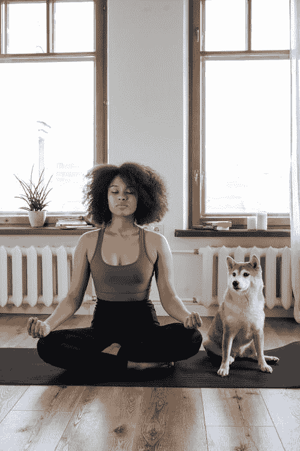

# 虚拟现实冥想的印象。

> 原文：<https://medium.com/codex/impressions-of-virtual-reality-meditation-tripp-review-422df2fd5071?source=collection_archive---------1----------------------->

## [法典](https://medium.com/codex)

[https://images . pexels . com/photos/4056529/pexels-photo-4056529 . JPEG？auto = compress&cs = tinysrgb&DPR = 2&h = 650&w = 940](https://images.pexels.com/photos/4056529/pexels-photo-4056529.jpeg?auto=compress&cs=tinysrgb&dpr=2&h=650&w=940)

# **简介:**

压力是当今世界的不幸现实。糟糕的是，随着我们压力越来越大，我们越来越难照顾好自己，比如足够健康的睡眠/锻炼/饮食。这导致了更大的压力。幸运的是，有一些方法可以管理压力，不需要太多时间，而且可以…