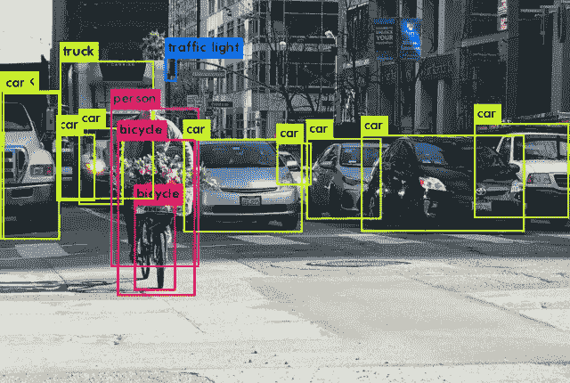
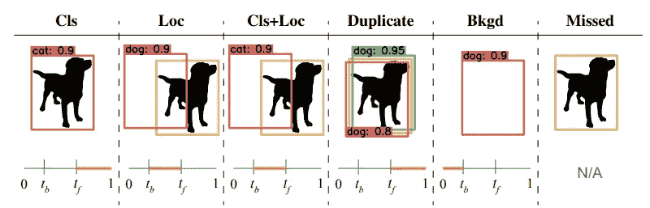
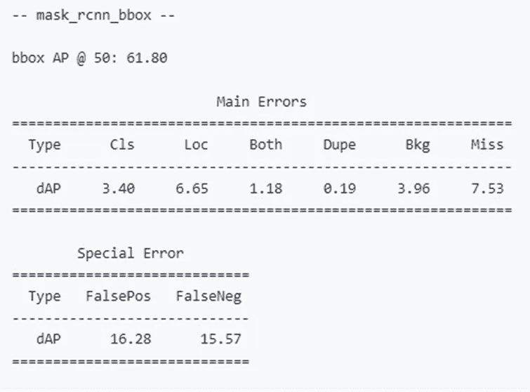
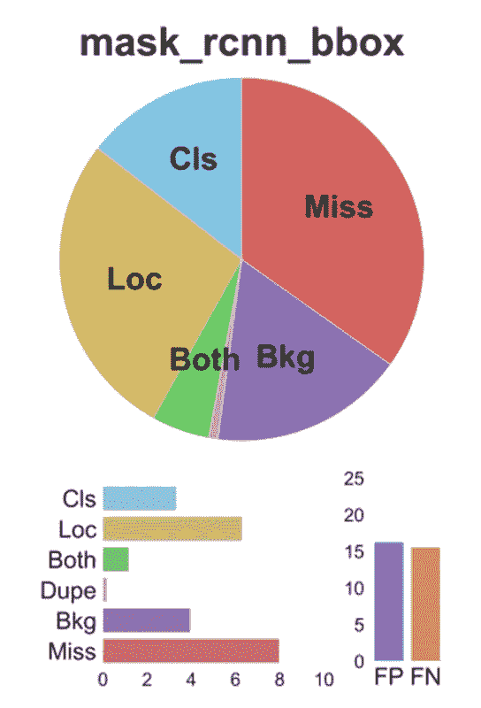

# 提高对象检测模型的性能

> 原文：<https://medium.com/codex/improve-the-performance-of-your-object-detection-model-54a94f374636?source=collection_archive---------3----------------------->

# TIDE(用于识别检测错误的工具箱)



图一

# **想要提高您的对象检测模型的性能吗？**

让我们通过了解影响整体地图值的不同类型的误差的贡献来改进它。

目标检测和分割是计算机视觉中的基本任务，其应用范围从自动驾驶汽车到肿瘤检测。

要执行对象检测，您需要的只是训练数据集。有一些开源预训练模型，如 Tensorflow 对象检测 API、detectron2 等。您只需要下载预训练模型，并使用您的自定义数据集对其进行重新训练。

现在，我们来评价这个模型。训练完你的模型后，你需要检查你的模型的性能。有一些性能指标，如 AP、map 值，通过它们可以获得模型的准确性。

在对一个模型进行了所有这些训练和评估之后，你可能会对 AP 和 map 的数字感到失望，因为它们与你的预期相差甚远。

您可以通过不同的解决方案来提高对象检测模型的性能，如借助图像增强、伪标记、集成等来改善数据集。你可以参考[这个](https://blog.francium.tech/improve-the-performance-of-your-object-detection-model-af6a20319f56)博客，了解改善你的数据集的解决方案。

为了增加你的模型的地图价值，你肯定会想知道我们在哪里可以进一步改进它。这就是潮汐出现的原因。**为了让你的模型运行得更好，TIDE 将帮助你精确定位你应该重点改进的错误类型。**

> IDE 是一个识别检测和分割错误的通用工具包。这是一种测量每个误差的贡献的技术，以隔离其对模型整体性能的影响。

*   **我们在哪里可以使用潮汐？**

如果我们以两个模型为例，模型 1 用于自动驾驶汽车，模型 2 用于肿瘤细胞检测，分别具有 map 值 42 和 45。在自动驾驶汽车的情况下，分类比定位更重要。这里，道路上物体的错误分类是不可接受的，因为它可能会导致事故。所以，比起精确定位，我们更关心召回和正确分类。然而，我们考虑肿瘤细胞检测模型，定位比分类更重要。 **TIDE 将给出分类误差和定位误差的贡献，从而我们可以相应地进行模型改进。**

*   **不同类型的错误**



来自[1]的源图像

> **分类错误:**对象定位正确但分类错误。
> 
> **定位错误:**对象分类正确，但对象定位不正确。
> 
> **分类和定位错误:**对象分类错误，对象定位也不正确
> 
> **重复错误检测:**对于同一个地面真值，模型给出两个包围盒。
> 
> **背景错误:**模型检测到包围盒，但是没有任何地面真值。
> 
> **遗漏 GT 错误:**有地面真值，但模型完全遗漏了检测包围盒。

*   **COCO 数据集的潮汐实施**

```
*# Download the Mask R-CNN results to test on. Only for demonstration purposes.***import** urllib.request *# For downloading the sample Mask R-CNN annotations*

bbox_file **=** 'mask_rcnn_bbox.json'   
mask_file **=** 'mask_rcnn_mask.json'*# Import the TIDE evaluation toolkit*
**from** tidecv **import** TIDE

*# Import the datasets we want to use*
**import** tidecv.datasets **as** datasets *# Load the dataset*
*# This will automatically download COCO's 2017 annotations for you. You can specify your own COCO-style dataset too!*
*# See datasets.py for a list of all the supported datasets.*
gt **=** datasets**.**COCO()*# Load the results in COCO format*
bbox_results **=** datasets**.**COCOResult(bbox_file) *# These files were downloaded above.*mask_results **=** datasets**.**COCOResult(mask_file) *# Replace them with your own in practice.**# Create a TIDE object to use for evaluation* 
tide **=** TIDE()*# Run the evaluations on the standard COCO metrics* tide**.**evaluate_range(gt, bbox_results, mode**=**TIDE**.**BOX )
tide**.**evaluate_range(gt, mask_results, mode**=**TIDE**.**MASK )*# Summarize the evaluations run so far in the console*
tide**.**summarize()
```

关于 TIDE 的实现可以参考[这个](https://github.com/dbolya/tide) github repo。

TIDE 将给出 COCO 数据集的输出，如下所示:



COCO 数据集的潮汐输出

```
*# Plot summaries for the evaluations run so far*
tide**.**plot()
```

tide.plot()将提供错误摘要的可视化。



潮汐图

*   **潮汐的应用**

1.  跨模型比较:我们可以很容易地使用 TIDE 来比较不同的模型。
2.  交叉数据比较
3.  跨尺度比较

**参考文献**

1.  丹尼尔·博尔亚、西恩·佛利、詹姆斯·海斯和朱迪·霍夫曼； **TIDE:识别物体检测错误的通用工具箱**， *ECCV 2020。*
2.  图沙尔·科尔赫；**如何通过理解数据来提升物体检测精度**，[https://blog . gofynd . com/boost-object-detection-model-accuracy-552586 d698 c](https://blog.gofynd.com/boost-object-detection-model-accuracy-552586d698c)
3.  用于物体检测的更好地图[https://towards data science . com/a-better-map-for-object-detection-32662767 d424](https://towardsdatascience.com/a-better-map-for-object-detection-32662767d424)

希望这些内容对你有所帮助。

阅读我以前的博客

[使用简易 OCR 对非结构化数据进行文本提取](/codex/text-extraction-for-unstructured-data-using-easy-ocr-4258d983d264)

## 谢谢大家！！