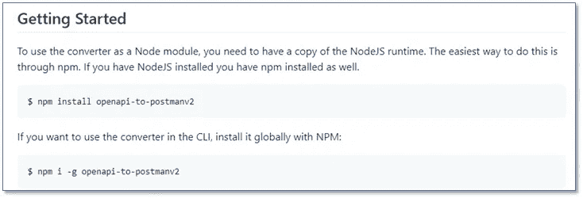
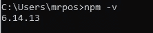
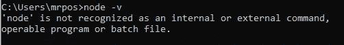
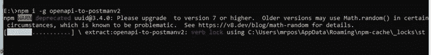
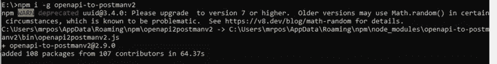

# 改进开发人员编写的文档

> 原文：<https://medium.com/codex/improving-developer-written-documentation-9a22e844342a?source=collection_archive---------24----------------------->

[安德鲁·尼尔](https://unsplash.com/@andrewtneel?utm_source=unsplash&utm_medium=referral&utm_content=creditCopyText)在 [Unsplash](https://unsplash.com/) 上拍照

# 开发人员编写的文档并不总是清晰的。这里有五种方法可以让它变得更好。

很明显，有些文档是由开发人员编写的。那些是你不能理解的。

本文研究开发人员编写的指令，如何改进它们，以及如何改变范围以吸引更多的读者。这个例子来自一个名为**openapi-to-postman(**[https://github.com/postmanlabs/openapi-to-postman](https://github.com/postmanlabs/openapi-to-postman)**)**的工具，它将 open API 规范转换为 Postman 集合文件。公平地说，对于开发者来说，这是一个很棒的工具，是用他们自己的时间完成的，也是给开发社区的一份礼物。我既不想阻止这一点，也不想从他们那里拿走任何东西。这篇文章只是关于如何使文档更好。

另外，通篇都有括号内的注释(比如 *[* [*投合他们的懒惰*](http://writeonce.org/roberts_rules_of_order.php#laziness) *]* )。这些是对罗伯特的 API 文件编写顺序规则 的引用，是编写文件的简单规则，指出该概念违反或符合哪条规则。

Postman 是一个执行 API 请求的应用程序。它可以用于测试和开发 API，甚至用于编写文档。注意我刚才做了什么。我解释了邮差是什么。

> 第一课:并不是所有的东西都必须适合目标受众。

显然，该工具是面向开发人员的，这是开发人员的常见做法。然而，这种假设可能并不正确。这样做可能会自动失去其他受众。例如，初级开发人员和 API 文档作者。初级开发人员，因为他们经常有负担的低水平，详细的工作。API 文档作者，因为他们在开发者门户上的邮差集合中有既得利益。

> 经验之二:有经验的开发人员会忽略他们已经知道的东西。

因此，包含有助于其他群体的额外信息并没有坏处。拓宽范围，你就拓宽了受众。继续。Postman 允许在一个文件中包含多组请求。这些集合称为集合。他们很方便。他们可以在一个文件中捆绑几十个，甚至几百个请求。这使得分配很方便。维护这些请求，也就是确保包含新的请求，删除旧的请求，并确保每个参数都是最新的，既费力又容易出错。从 OpenAPI 规范生成这个文件是非常有吸引力的。根据定义，规范将是最新的，因此从它生成的任何东西也将是最新的。这个工具就是这么做的。

以下是他们的部分说明。

> 第三课:永远不要用“容易”或“最容易”这个词从来都不是。

因为这里虽然很少，但是有很多评论。

这些说明是有条件的，取决于您希望如何使用该工具。但是没有解释这些条件是什么，或者何时使用它们。第一句话几乎没有意义。第二种选择并不清楚。不要告诉我你只需要知道什么是 Node 或 NodeJS 运行时。我们正试图吸引更多的观众。下面是一个编写更完整的入门指南的例子。

# 安装前

要安装此工具，请使用命令行工具节点包管理器，或者更常用的 npm。

> 第四课:预测问题。最明显的问题是 npm 是否已经安装。预见它并回答它。

要测试当前是否安装了 npm，请在终端窗口中输入命令行 *node -v* 。

如果已经安装，您将会看到这样的消息，并且您可以直接进入工具安装步骤。

如果没有安装，您会看到如下消息:

可以在这里安装 NPM:[https://tree house . github . io/installation-guides/windows/node-windows . html](https://treehouse.github.io/installation-guides/windows/node-windows.html)。

# 装置

这个工具有两种使用方式:通过代码或命令行。

## 通过代码

您可以通过 NodeJS 代码将该工具作为应用程序的一部分来运行。要安装开发工具，输入:*NPM install open API-to-post manv 2*

## 通过命令行

您可以通过命令行指令直接运行该工具。要将该工具作为应用程序安装，请输入:*NPM I-g open API-to-post manv 2*

命令窗口显示进度，

并且当完成时，它可以显示附加消息和成功指示。

您不需要克隆或复制它的 GitHub 存储库。

# 结论

> 第五课:让读者在每一步都感到舒适。这是技术写作。我们不应该去猜它的意思。 ]

这个入门示例指导经验较少的用户完成安装。写[ [我们是为了他们的方便，而不是我们的](http://writeonce.org/roberts_rules_of_order.php#were_here_for_audience_developers) ]更详细、更耗时，并且需要一个技术作者对安装过程的观点[ [知道你知道什么，知道你不知道什么](http://writeonce.org/roberts_rules_of_order.php#know_what_you_know) ]。值得注意的是，它向读者解释了每一个步骤，并引导他们完成。这意味着他们对每一步都感到舒适，并且他们可以立即确认他们所做的是正确的。

这是一个建议的方法。这只是处理指令的一种方式。