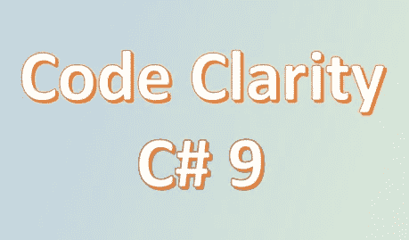

# 用 C# 9 提高我们的代码可读性

> 原文：<https://medium.com/codex/improving-our-code-readability-with-c-9-18b5ce30f629?source=collection_archive---------3----------------------->

> 在 C# 9 中，有一些新的语言特性使得我们的代码更加清晰易读。其中一个主要的是`Top-level statements.`

## 顶级语句:

> 该特性的主要目标是为了学习者和代码的清晰，允许 C#程序周围没有不必要的样板文件。

这是主程序的默认结构:

如果您仔细观察，您会发现只有一行代码将字符串“Hello World”打印到控制台。我们使用 12 行代码来执行一行。

`Top-level statements`使我们能够摆脱这些样板代码，直接执行我们的代码。样板代码包装仍然是必要的，但它是自动生成的，我们不必自己编写。我们的代码保持清晰。

`Program`类的`Main`方法是程序的入口点，因此在我们的项目中只能有一个`Main`方法。同样的原则也适用于`top-level statements,`，在我们的项目中只能有一个带`top-level statements`的编译单元(类)。

在 C# 9 中，我们可以为我们的应用程序创建一个更简单、更清晰的入口点。它适用于同步和异步代码。

**我们能传递论点吗？**是的，如果您需要向应用程序入口点传递参数，您可以直接访问`string[] args`，如下所示:

## 目标类型的新表达式

当类型已知时，这个特性允许我们避免为构造函数指定类型。这个特性的动机是允许字段初始化而不复制类型，这使得我们的代码干净。

正如我们在下面的例子(第 7 行)中看到的，它适用于更复杂的构造函数。

你可能会问，**这个特性和使用** `**var**` **数据类型的选项有什么不同？显然，它给了我们相同的解决方案(正如你在第 5 行看到的)。**

`Var`关键字只对局部变量有效。这意味着目标类型的`new`表达式在初始化属性和字段(第 9，22 行)时特别强大，因为在那里`var`关键字不是一个选项。

目标类型的`new`表达式与 var

## 模式匹配

> [*模式匹配*](https://learn.microsoft.com/en-us/dotnet/csharp/fundamentals/functional/pattern-matching) 是一种测试表达式以确定其是否具有某些特征的技术。C#模式匹配为测试表达式和在表达式匹配时采取行动提供了更简洁的语法。

模式匹配在早期版本的 C#中就存在，其中之一就是`is`模式表达式。

**关系模式**

在关系模式中，您可以使用任何一个[关系操作符](https://learn.microsoft.com/en-us/dotnet/csharp/language-reference/operators/comparison-operators) `<`、`>`、`<=`或`>=`来测试一个值与常量相比如何。您不仅可以在`is`表达式中使用它们，也可以在`switch`表达式中使用它们。

如果没有 r*relational patterns，*我们将不得不使用多个 if-else 语句，这使得我们的代码不够优雅，也更加复杂。

如果您仔细看前面的例子，您会发现我们使用了另一个新功能:

**逻辑模式**

> 从 C# 9.0 开始，使用`not`、`and`和`or`模式组合子

在以下示例中，您可以看到使用此模式来检查*产品*是否不为空，并检查其价格是否在某个范围内:

正如你所看到的，在 C# 9 新特性之后，我们的代码看起来可读性更好了。