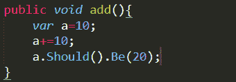
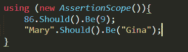
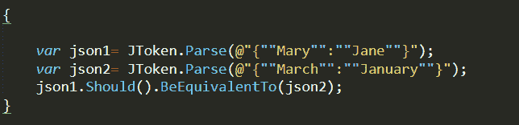
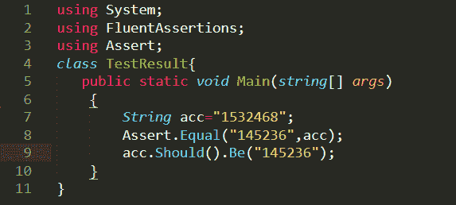
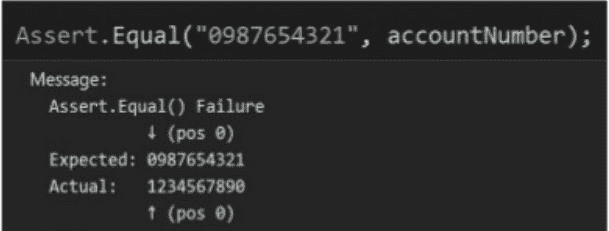
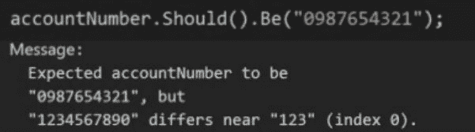

# 用 FluentAssertion 改进单元测试

> 原文：<https://medium.com/codex/improving-unit-testing-with-fluentassertion-efde0a7e3475?source=collection_archive---------9----------------------->


让我们重温一下基础知识。单元是程序中逻辑上独立的最小部分。在大多数编程语言中，一个函数被称为一个单元。单元测试是在程序中测试单元的过程。任何涉及到外部系统的测试，比如到数据库的连接，或者依赖于任何其他功能的测试，都不是单元测试。

单元测试是任何开发项目中相当重要的一部分。它有助于在集成执行之前识别错误，为开发人员节省宝贵的时间。不幸的是，单元测试需要花费大量的时间，并且经常会导致糟糕的结果。

为了防止这种情况发生，我们采用了波动分析法。在这篇文章中，让我们了解什么是流畅的断言，以及它如何帮助改进单元测试。

**目录**

*   为什么要进行单元测试？
*   什么是 FluentAssertions？
*   断言的范围
*   常用断言
*   用 JSON 断言
*   FluentAssertions 的使用如何改进单元测试？
*   结论

# 为什么要进行单元测试？

软件测试的最后阶段通常是单元测试。这通常在软件部署之前完成。在这个阶段，测试每个逻辑上独立的代码片段，以检查这些代码片段是否给出了期望的结果。这些片段通常会有一个输出。单元测试通常在编码阶段完成，以使软件在部署前没有错误。

以下是我们进行单元测试的一些原因-

*   提高了代码的灵活性。
*   降低了重构代码即改变代码的风险。
*   它通过暴露导致更好结果的边缘情况来提高代码的质量。
*   它有助于在执行集成测试之前识别代码中的错误，从而简化调试过程。
*   代码的设计和结构得到了改进，因为程序员需要考虑一个方法需要完成什么。

# 什么是 FluentAssertions？

FluentAssertions 是一堆。NET 扩展方法。它允许您指定测试驱动开发或行为驱动开发单元测试的预期结果。您可以使用以下语法来启用它-

```
using FluentAssertions;
```

FluentAssertions 支持大多数单元测试框架。您所要做的就是将对所需测试框架程序集的引用添加到单元测试项目中。相应的程序集将由 FluentAssertions 自动找到，并用于引发特定于框架的异常。

FluentAssertions 库为异常提供了更好的支持，增加了测试的可读性，同时使生成单元测试变得更加容易。

下面是一个简单断言的示例:



“a”的值被初始化为 10，再加上 10 就变成了 20。因此，我们使用代码 a.Should()对 FluentAssertions 进行了测试。Be(20)比 Assert 可读性更好。AreEqual(a，20)。

支持使用 FluentAssertions 进行单元测试的不同平台有

*   Xamarin.iOS 10.0
*   。网络核心 1.0
*   Xamarin。Mac 3.0
*   。网络核心 2.0
*   Xamarin。安卓 7.0
*   单声道的
*   通用 Windows 平台
*   。Net 框架 4.5

支持使用 FluentAssertions 进行单元测试的不同框架有

*   MSTest (Visual Studio 2010，Vis
*   姆布尼特
*   努尼特
*   XUnit
*   XUnit2
*   NSpec
*   MSpec
*   不负责任的人

# 断言的范围

所有的断言都可以被批处理到一个 AssertionScope 中，这将使 FluentAssertions 在作用域的末尾为作用域内的所有失败抛出一个异常。



# 常用断言

以下是一些常用的断言:

## 字符串(string theString =):

*   绳子。应该()。not be null()；
*   绳子。应该()。be null()；
*   绳子。应该()。BeEmpty()；
*   绳子。应该()。NotBeEmpty("不能为空")；
*   绳子。应该()。Be("某串")；
*   绳子。应该()。NotBe("某字符串")；
*   绳子。应该()。BeEquivalentTo("一些字符串")；
*   绳子。应该()。NotBeEquivalentTo("某个字符串")；

## 数值型(int a = 5；):

*   a.应该()。BeGreaterOrEqualTo(5)；
*   a.应该()。BeGreaterThan(4)；
*   a.应该()。贝莱索雷夸尔托(5)；
*   a.应该()。be(5)；
*   a.应该()。NotBe(5)；

下面给出了 JSON 中允许的断言列表:

*   比奎瓦伦托
*   ContainSingleElement()
*   包含子树()
*   HaveCount()
*   HaveElement()
*   HaveValue()
*   MatchRegex()
*   NotBeEquivalentTo()
*   NotHaveValue()
*   NotMatchRegex()
*   NotHaveElement()

不要忘记使用 FluentAssertions.Json，否则可能会出现误报。



# FluentAssertions 的使用如何改进单元测试？

这里有一个例子，清楚地捕捉到了当 FluentAssertion 用于单元测试时，理解代码和以更简单的方式编写代码的区别。与普通的单元测试不同，FluentAssertions 提供了以下好处，使程序员在执行单元测试时可以从中受益:

## 提高可读性



在上面的例子中，我们可以看到相同的单元测试是使用 Assert 和 FluentAssertions 完成的。可以清楚地看到，与第一个单元测试相比，第二个单元测试更容易阅读。

## 测试失败的更清晰的解释

**片段 1**



**片段二**



在上面的两个片段中，我们可以看到使用 Assert 和 FluentAssertions 的区别。在第二个片段中，很容易理解测试失败的原因，这要归功于一条可读的消息。然而，在第一个问题中，我们没有得到明确的信息。

# 结论

正如我们在这篇文章中看到的，使用 FluentAssertions 对你的单元测试活动有很大的帮助。它不仅提高了可读性，而且清楚地定义了测试用例的失败。这两个好处都有助于测试人员在代码中出现错误的情况下轻松地进行纠正。因此，在您的下一个单元测试项目中使用 FluentAssertions 来享受它的多重好处。

*原载于*[*https://www . partech . nl*](https://www.partech.nl/nl/publicaties/2021/04/improving-unit-testing-with-fluentassertion)*。*