# ImVoteNet:论文概述和代码分析

> 原文：<https://medium.com/codex/imvotenet-paper-review-and-code-analysis-bf103117b32e?source=collection_archive---------5----------------------->

## 利用图像投票促进点云中的 3D 对象检测

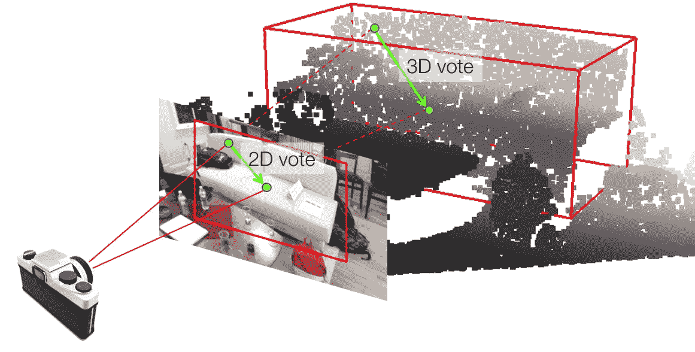

融合图像中的 2D 投票和点云中的 3D 投票。学分: [facebookresearch](https://camo.githubusercontent.com/b06ebcac5afb2566b8f0f559a7a710ea9613166861041458946a3dcbf2c2d2c2/687474703a2f2f78696e6c6569632e78797a2f696d616765732f696d766f74652e706e67)

> 请注意，这篇文章的目的是记录并有意义地与任何有兴趣了解这种艺术级架构的人分享我的学习。

实现最先进的算法似乎是一项相对简单的任务。从某个存储库中复制粘贴几行，瞧！即使我们考虑恼人的编译错误和不兼容的版本错误，实现别人的代码也是不值得称赞的。然而，如果在花了一周的时间试图解决令人沮丧的错误后，你终于训练好了你的模型，但仍然不能在一组随机的图像和点云上使用它，那该怎么办呢！要理解为什么 ImVoteNet 演示不能马上进行，恐怕您必须继续阅读。如果这似乎有点太繁琐，你可以直接跳到我的 GitHub 帐户 [*这里*](https://github.com/Sakshee5/imvotenet) 马上尝试一下 3D 物体检测演示。

说了这么多，让我们来看看这篇论文是关于什么的。

# 介绍

术语' [ImVoteNet](https://arxiv.org/abs/2001.10692) '不过是单词' Image '和' VoteNet '的混合。这里的图像指的是简单的 RGB 图像，而 [VoteNet](https://arxiv.org/abs/1904.09664) 是作者的另一种 3D 对象检测架构，该网络建立在该架构上。VoteNet 论文发表于 2019 年，展示了仅使用点云输入的最先进性能。

然而，点云数据具有固有的局限性。它们很稀疏，缺少颜色信息，并且经常受到传感器噪声的影响。另一方面，图像分辨率高，纹理丰富。此外，图像可以覆盖主动深度传感器的“盲区”，这通常是由于反射表面而出现的。因此，作者得出结论，2D 信息可以补充点云提供的 3D 几何图形，这反过来是这种架构背后的动机。

本文介绍了一种用于融合 2D 和 3D 数据的健壮技术**,通过 5.7 mAP 提高了最先进的结果。这里的“地图”指的是来自具有挑战性的 [SUN RGB-D 数据集](https://rgbd.cs.princeton.edu/)的 10 类物体的平均精度，该模型已经在该数据集上进行了训练。**

# ImVoteNet 建筑

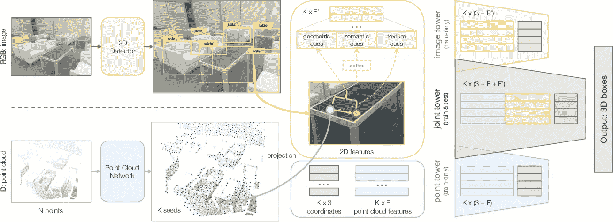

3D 对象检测流水线

为便于理解，我们将上述结构分为 3 个部分:

1.  使用[更快的 RCNN](https://arxiv.org/abs/1506.01497) 主干从 2D 检测中提取图像投票(左上半部分)
2.  深度霍夫投票用 [PointNet++](https://arxiv.org/abs/1706.02413?source=post_page---------------------------) 主干(左下半部分)
3.  功能融合和多塔训练(右半部分)

> 乍一看，该架构可能有点误导，因为它显示它输入 RGB 图像和相应的点云模型来输出 3D 检测。实际上，该模型从 RGB 图像中提取几何、语义和纹理线索，这些线索又作为输入馈送给网络。因此，我们可以说该架构的左上方属于数据处理管道，而不是培训管道。

为了彻底理解，让我们分别处理这些部分:

# 1.提取图像投票

ImVoteNet 的官方存储库直接提供来自预训练的更快 RCNN 模型的 2D 检测。**通过使用这些下载的检测文本文件中提供的信息，以几何、语义和纹理线索**的形式生成 2D 图像投票。

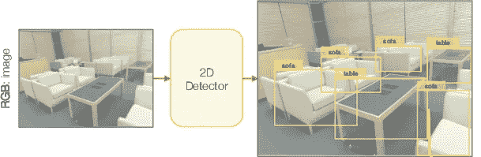

用于 2D 物体检测的预训练快速 RCNN 主干

在深入什么是“图像投票”或“线索”之前，首先让我们简单了解一下什么是更快的 RCNN 输出，因为它用于提取所述线索。

根据 ImVoteNet 的官方知识库:

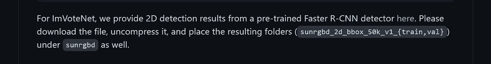

我们可以看到，来自预训练的更快 RCNN 模型的 2D 检测被直接提供用于下载。预训练模型本身不可下载。给定文件的下载和解压缩会产生一个与数据集中的每个图像相对应的. txt 文件。

每个。txt 文件包含 100 行，对应于每幅图像检测到的 100 个对象。下面是示例文本文件的前几行:

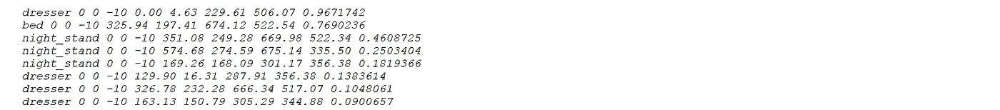

让我们快速分解一下这些值是什么:

*   对于每一行，首先我们有来自模型被训练的 10 个类的**类标签**。这 10 类是床、桌子、沙发、椅子、马桶、书桌、梳妆台、床头柜、书架和浴缸。
*   接下来的 3 个值是冗余常数。
*   接下来的 4 个值按照 Xmin、Ymin、Xmax 和 Ymax 的顺序定义了**边界框**，其中最小值定义了边界框的左上角，最大值定义了边界框的右下角。请注意，这些值不是标准化的。(图像尺寸:730 像素宽 x 530 像素高)
*   最后一个值是**对象性得分**，它是一个介于 0 到 1 之间的浮点值。它简单地定义了检测器对于它声称已经检测到的对象的置信度。

下面是一个代码片段，它加载一个给定的文本文件，并根据我们提取所讨论的线索的要求对其进行处理。

加载和处理从快速 RCNN 提取的 2D 包围盒信息

## 几何、语义和纹理线索的提取

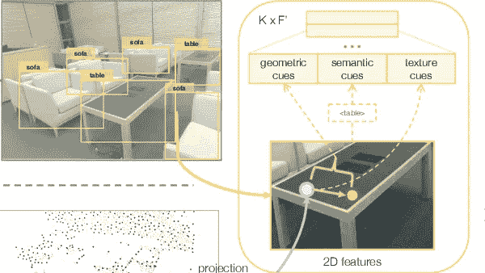

提取线索

## 几何线索

首先，什么是形象投票？

引用作者的话，“图像投票，就其几何部分而言，只是一个连接图像像素和该像素所属的 2D 对象边界框中心的向量。”

> 仅允许属于过滤的 2D 检测框内的图像像素投票。此外，多个框内的像素被给予多次投票，而不属于任何边界框的像素用零填充。查看下面相同的代码实现。

提取几何线索

## 几何线索:将图像投票提升到 3D

图像平面中的 2D 物体中心可以表示为 3D 空间中的光线，该光线借助于固有相机矩阵连接 3D 物体中心和相机光学中心。下图显示了这一点。

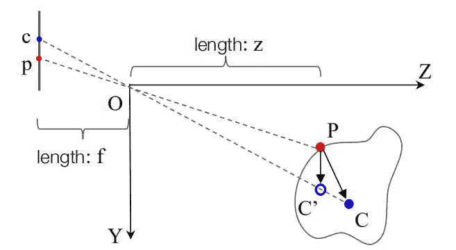

伪 3D 投票生成背后的直觉

设，
P = (x1，y1，z1) —点云中物体表面的点

C = (x2，y2，z2)-3D 对象的中心点

p = (u1，v1) —点 P 在 2D 图像上的投影

c = (u2，v2) —点 C 在 2D 图像上的投影

我们可以观察到，2D 投票将 3D 对象中心的搜索空间缩小到一条线(线 OC ),其中只有 z 值在变化。

此外，我们可以将 PC 向量，即从点 P 到投票中心的真实 3D 投票表示为

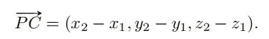

和 pc，即假设焦距 f 为的 2D 投票向量

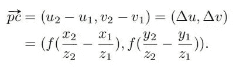

使用 Y 维的相似关系作为 v1/f = y1/z1 和 v2/f = y2/z2

因此，我们计算伪 3D 投票向量 PC '其中 C '在射线 OC 上，如下所示

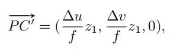

假设点 P 的表面深度和中心深度是相同的，这是合理的，考虑到物体不是非常靠近照相机的事实。

因为我们假设 z1=z2，所以上面提到的深度关系表示误差(在求导之后沿着 x 轴)

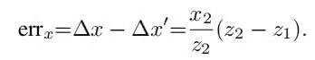

根据 PC '和 OP，我们可以得到真正的几何提示

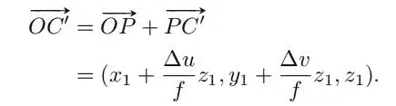

在执行一个规范后，

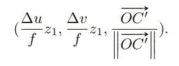

我们来讨论一下上式中的三个维度。首先，表面点 P 需要 2D 图像传递给它的几何信息，在这种情况下，搜索空间被压缩到 1D(射线 OC’)。所计算的是 2D 图像被投影到 3D 的位置。最后一个维度是到 3D 表面点的光线方向信息，以补偿由于深度近似(z1 = z2)引起的误差。

目前，我们有一个直观的图像投票是什么，由 2D 边界框的空间坐标表示。然而，每张图片的投票还会增加其语义和纹理线索。我们来看看这些是怎么定义的。

**语义提示**

与稀疏点云相比，RGB 图像可以更好地传达图像内容的语义。这种来自 2D 图像的输入将有利于区分具有类似几何形状的类别，如桌子与书桌或床头柜与梳妆台。语义线索背后的思想是用一个简单的独热类向量来表示图像中检测到的每个边界框，该向量具有该类的置信度得分。

对应于特定边界框的该独热编码矢量被传递给投影在该 2D 框内的所有 3D 点。如果一个 3D 点落入多个 2D 盒中，它将被复制，而那些没有落入任何盒中的点将被填充全零特征向量。总而言之，我们将提取 10 维语义线索向量(与 10 个 SUN RGB-D 类相关联)。

从 2D 检测中提取语义线索

**纹理提示**

简单地说，纹理线索是图像的原始 RGB 像素值。它们的重要性在于，与点云不同，2D RGB 图像非常密集地捕捉高分辨率信号，进而显示良好的纹理内容。首先，三个通道图像像素首先被归一化为[-1，1]，然后被转换为一维。注意，我们将提取一个三维纹理线索向量。

提取纹理线索

注意，除了这些线索之外，还提供相机参数(**内在(calib_K)** 和**外在(calib_Rtilt)** 矩阵)和常数值(**比例**)作为输入，以帮助将这些提取的特征提升到 3D。在进入下一节之前，让我们简要讨论一下这些输入的作用。

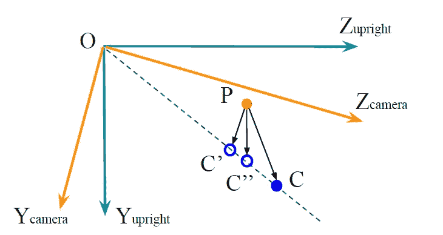

利用相机外部性的图像投票提升

在 SUN RGB-D 数据集中定义了五个坐标系。其中两个是垂直深度坐标(Z 是向上的轴，Y 是向前的，X 是向右的)和相机坐标，如上所示。竖直坐标被 Rtilt 倾斜，使得 Z 是重力方向。点云输入(接下来讨论)在直立坐标中表示，因此 3D 伪投票也需要转换到相同的坐标。这是因为网络不能估计沿着 z 摄像机方向的深度位移，因为从摄像机到直立坐标的旋转角度对于网络是未知的。

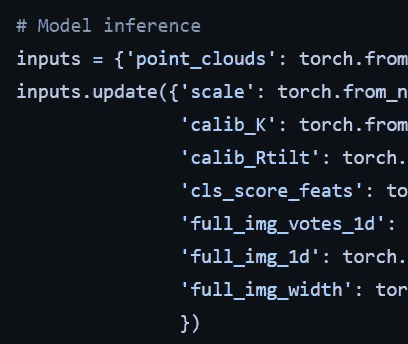

模型输入。截图来自 [demo.py](https://github.com/Sakshee5/imvotenet/blob/master/demo.py)

# 2.深度霍夫投票

> 一定要看看[霍夫变换](https://www.youtube.com/watch?v=XRBc_xkZREg)来获得投票在数学意义上如何工作的基本直觉。

这部分架构基于 VoteNet，这是一个前馈网络，输入 3D 点云并输出 3D 对象检测的对象建议。让我们粗略地看一下 VoteNet 管道。

输入是 N×3 点云，即由具有 3 个坐标属性的 N 个点组成的点云。首先，点云通过作为特征提取器的 PointNet++主干网络。

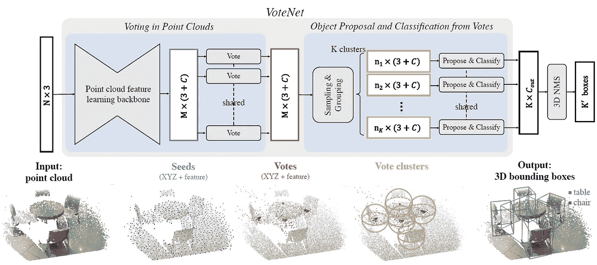

特征提取器采样 M 个种子点，同时还用 C 维特征向量扩充每个点。因此，每个点与 3+C(坐标+深度)特征的属性相关联。

> 总而言之，每一个投票既是 3D 空间中的一个点，其欧几里德坐标(3-dim)被监督为接近对象中心，也是为最终检测任务(C-dim)学习的特征向量。

这些特征然后通过多层感知器(MLP)产生投票。这正是 ImVoteNet 架构的构建基础。

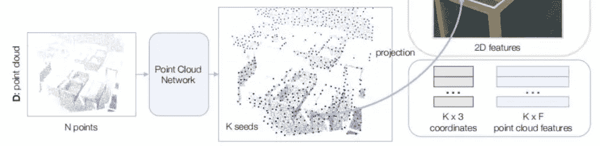

*注意，K 个种子等价于 M 个种子，F 维向量只不过是来自 VoteNet 管道的 C 维向量。*

然而，对于 VoteNet，投票直接由另一个点云网络处理，以生成对象提议和分类分数，而对于 ImVoteNet，它们与提升的 2D 投票融合，以经历多塔训练。ImVoteNet 选择了多模型方法，这将在下一节讨论。

## 总结一下；

下面是我在上面讨论的两个部分的代码实现中观察到的一些见解:

*   输入点云由 20k(=N)个随机采样点组成。点云也通过从动态深度图像中随机子采样点来扩充。使用增强技术，如翻转、沿上轴均匀旋转[-30，30]度、均匀缩放[-85，1.15]。
*   20k 点云输入被 PointNet++主干转换成 1024(=M)个种子。每个种子与其 3 个空间坐标和 256(=F)维特征向量相关联。
*   总而言之，2D 图像投票生成管道，每个复制的种子点的特征通过以下图像投票特征的连接而增强:5 维提升几何线索(2 个用于投票，3 个用于光线角度)、10 维(每类)语义线索和 3 维纹理线索。因此，融合的种子点与其 3 个空间坐标和 274(= F’)维特征向量相关联。

# 3.特征融合和多塔训练

因此，现在我们有了来自点云主干网络的 K x(3+F’)dim 提升 2D 投票和 K x (3 + F) dim 3D 点特征。这些特征被进一步串联用于训练。

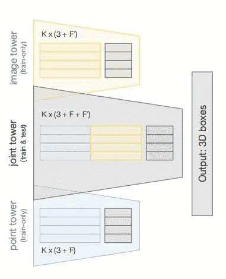

如上图所示，我们有三个训练塔:形象塔，联合塔，点塔。相应的输入仅为图像特征、关节特征和点云特征。每个塔都有相同的探测 3D 物体的目标任务，但它们都有自己的 3D 投票和盒子提议网络参数以及自己的损失。拥有三个独立训练塔的原因是为了避免级联设计。例如，如果 3D 物体提议仅仅基于 2D 物体检测输出，那么在 2D 错过的物体在 3D 中也会被错过。

尽管如此，对于这样一个多塔楼的网络结构，由于不同的学习速率，两种模态可能最终被第三种模态所支配。这可以用[渐变混合](https://arxiv.org/abs/1905.12681)来避免，这本身是另一个新颖的想法，不幸的是超出了本文的范围。

因此，最终的训练损失是三个检测损失的加权和:

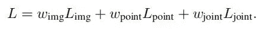

注意，在推理时，只有联合塔用于最小化计算开销。

# 结论

本文通过将 ImVoteNet 体系结构分成三个部分来讨论它，以便对本文后面的 3D 对象检测管道有一个全面的了解。它还受到与以正确格式生成模型输入相关的代码片段的支持。

> 注意:文章中提供的代码来自我的 [GitHub](https://github.com/Sakshee5/imvotenet) 中的 demo.py 脚本。然而，该脚本确实使用了来自官方 ImVoteNet 存储库的代码片段。文章中的图片是来自官方文件/存储库的截图。两者都在下面被提及。

# 参考

【https://arxiv.org/abs/2001.10692 

[https://github.com/facebookresearch/imvotenet](https://github.com/facebookresearch/imvotenet)

[https://www.programmersought.com/article/80886180098/](https://www.programmersought.com/article/80886180098/)