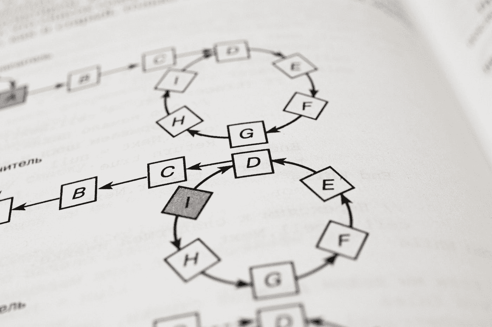

# 为算法问题辩护

> 原文：<https://medium.com/codex/in-defense-of-algorithm-questions-fb3ee9968255?source=collection_archive---------24----------------------->

照片由在 [Unsplash](https://unsplash.com?utm_source=medium&utm_medium=referral) 上拍摄

所以我读了这篇文章:

 [## 面试官:你工作 3 年了，这种算法题你都不会答？

### 一个女生的面试经历

javascript.plainenglish.io](https://javascript.plainenglish.io/interviewer-you-have-been-working-for-3-years-and-you-cant-answer-this-algorithm-question-5f79cba18e06) 

它谈到了这个算法问题。基本上给定一个有三种括号的字符串，你怎么知道…