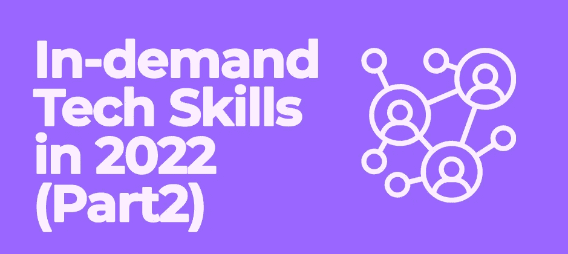

# 2022 年技术技能需求(下)

> 原文：<https://medium.com/codex/in-demand-tech-skills-in-2022-part2-1f547b5cfd3b?source=collection_archive---------10----------------------->

## 它终于来了

2022 年热门技术技能(下)。

2022 年热门技术技能——BrandwithReina

这些技术技能很受欢迎，报酬也很高。

有趣的是，品牌正在寻找拥有这些技能的人，并在你的领域保持相关性，你可能需要考虑这些技术技能。记住，科技无处不在，你的职业也不例外。

如果你想转到科技行业，你可能需要看看这些热门的科技技能，排名不分先后。

# **1。产品管理:**

通常，人们认为项目管理和产品管理是一样的。然而，它们是不同的。产品管理是关于产品的，而项目管理是关于确保产品可用的时间框架。

产品管理是一项组织职能，通过将产品及其客户放在首位，监督产品生命周期的所有方面，从开发到定位和价格。

# **2。UI/UX 设计:**

重要的是要知道用户界面设计师不同于用户体验设计师。

用户界面设计师设计网站或软件的布局，美学，而 UX 设计师专注于网站和软件的功能和可用性。他们是不同的，但他们携手合作，以确保良好的用户体验。

# **3。技术销售:**

销售是产品的最终目的。这是最受欢迎的技术技能之一。不需要编码。你擅长做生意吗？你可以在技术销售方面做得非常好。你销售的技术可以是软件或硬件，对产品了如指掌。招聘人员正在寻找具有这种技能的人。

# **4。技术写作:**

你能把复杂的指令变得简单吗？那么你应该尝试技术写作。它需要以用户容易理解的方式编写指南或说明。如果你对编码感兴趣，你也应该尝试技术写作。你可以成为任何技术领域的技术作家。

# **5。web 3/加密货币:**

Web3 是镇上的新人。这是一个新世界，如果你不了解区块链，你可能会感到困惑。Web3 的世界需要设计师、作家和数字营销人员。

拥有这些技能和对 Web3 的理解将使你在工作中处于有利地位。Web3 很大，你应该研究一下。

你错过第一部分了吗？在这里检查[。](/codex/in-demand-tech-skills-in-2022-part-1-9e4cea37717b)
关注我的 [Instagram](https://instagram.com/brandwithreina?utm_medium=copy_link) 了解更多技术技巧。