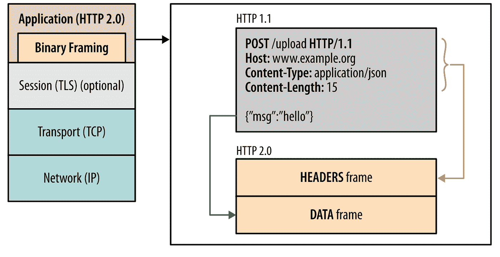
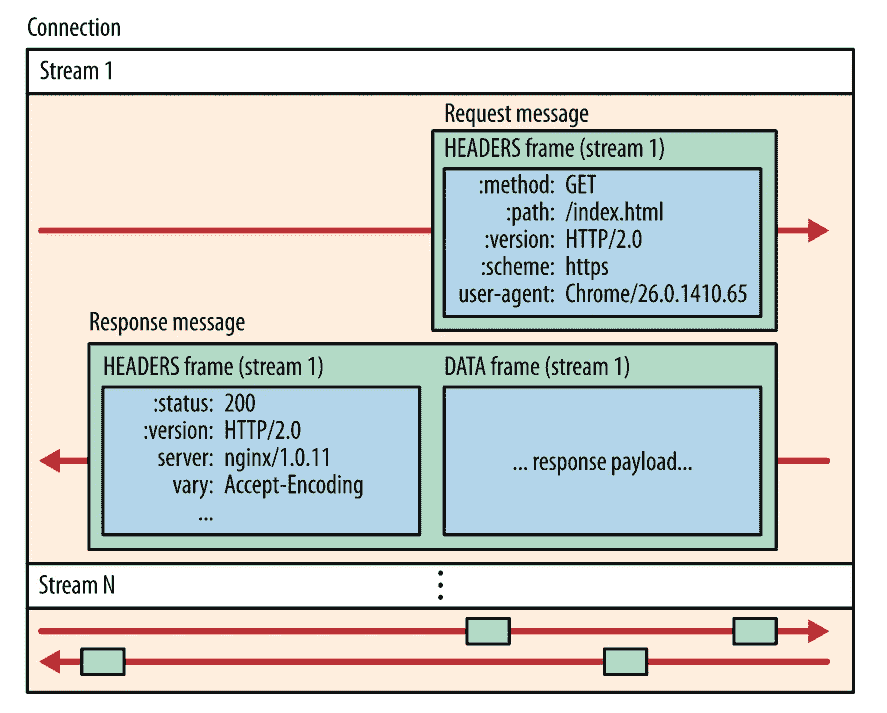
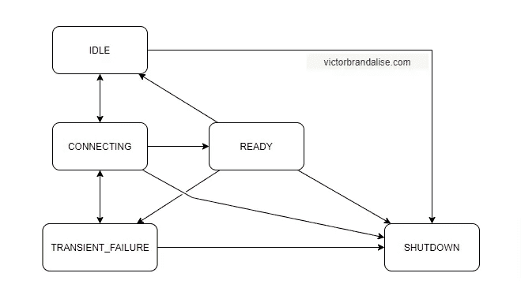
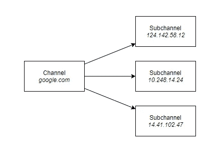

# 深入了解面向 Android 的 gRPC

> 原文：<https://medium.com/codex/in-depth-look-at-grpc-for-android-d67ccd7b626f?source=collection_archive---------2----------------------->

休息简单，容易上手。有数百个教程，在 Medium 上搜索会给你大量的结果，大多数开发者都在使用它。当我开始阅读 gRPC 时，情况并不一样。我们大多数人都是第一次使用它，有教程，但你需要浏览很多直到你找到你要找的答案，社区正在成长，但还不成熟，等等。

本文将带您了解理解 gRPC 所需的最重要的概念。这些概念包括从理解 HTTP/2 连接如何工作到学习如何正确地对协议缓冲区建模。

到本文结束时，您将已经了解了在 Android 中有效使用 gRPC 所需的大部分知识。

我将使用以下库:

***build.gradle***

*   `classpath 'com.google.protobuf:protobuf-gradle-plugin:0.8.14'`

***app/build . grdle***

*   `api 'io.grpc:grpc-kotlin-stub:1.1.0'`
*   `api 'io.grpc:grpc-protobuf-lite:1.38.0'`
*   `implementation 'io.grpc:grpc-android:1.38.0'`
*   `implementation 'io.grpc:grpc-okhttp:1.38.0'`

你可以在这里找到[源代码](https://github.com/victorbrndls/BlogProjects/tree/grpc-android)。

*我在这里所说的一切都是指 Kotlin 库如何实现 gPRC 协议，它可能与其他库的实现方式不同。这篇文章的内容是从页面末尾列出的资源中精选出来的。*

# HTTP/2

引入 HTTP/2 是为了解决 HTTP/1 的许多问题。主要的有:

*   HTTP/1.x 客户端需要使用多个连接来实现并发，减少延迟；
*   HTTP/1.x 不压缩请求和响应头，造成不必要的网络流量；
*   HTTP/1.x 不允许有效的资源优先级划分，导致底层 TCP 连接使用不良；

相比之下:

*   HTTP/2 通过启用完整的请求和响应多路复用来减少延迟，
*   HTTP/2 通过有效压缩 HTTP 报头字段来最小化协议开销，
*   HTTP/2 增加了对请求优先级和服务器推送的支持。

# 二进制帧层

HTTP/1 传输以 US-ASCII 编码的信息。另一方面，HTTP/2 用二进制编码它的信息。这一变化对邮件大小有很大的影响。HTTP 语义(如动词、方法和头)不受影响，但它们在传输过程中的编码方式是不同的，这是通过添加二进制帧层实现的。



HTTP/2 与 HTTP/1.1

客户机和服务器都必须使用新的二进制编码机制来相互理解:HTTP/1.x 客户机不能理解只有 HTTP/2 的服务器，反之亦然。

HTTP/2 还将其消息分割成称为帧的较小部分，每个部分都以二进制格式编码。

# 流、消息和帧

***流*** :已建立连接内的双向字节流，可以携带一条或多条消息。每个**流**都有一个唯一的标识符。单个 HTTP/2 连接有一个或多个**流**。

***消息*** :映射到逻辑请求或响应**消息**的**帧**的完整序列。

***帧***:HTTP/2 中最小的通信单位，每个包含一个帧头，帧头至少标识该帧所属的**流**。最常见的头是头和数据。



HTTP/2 连接

这只是对 HTTP/2 的简单解释，但对于理解下一个概念已经足够了。现在我们来看看 gRPC 的通道是如何利用 HTTP/2 的。

# 频道

通道基本上是向一个或多个服务器发送消息的接口。通道表示到端点的虚拟连接，实际上它可能由许多 HTTP/2 连接支持。

通道不仅仅发送消息，它们还进行名称解析、建立 TCP 连接(重试和退避)以及 TLS 握手。通道还可以处理连接和重新连接上的错误。我们将在重试部分看到这是如何发生的。

要创建一个通道，你只需要服务器的主机和端口。`context`是可选的，但它有助于管理通道状态。

为了给用户创建一个简单的抽象，gRPC API 通过定义 5 种可能的状态来公开关于通道的信息:

## 连接

通道试图建立连接，涉及的步骤有:

*   名称解析—从主机名中检索 IP 地址；
*   TCP 连接建立—使用三次握手过程建立连接；
*   使用安全连接时的 TLS 握手—通过协商会话中将使用的 SSL/TLS 版本、将对通信进行加密的密码套件等来建立安全连接。

如果这些步骤中的任何一个失败，通道转换到**瞬态故障**状态。

## 瞬时故障

有些事情没有按预期进行。出现了一些故障(如 TCP 3 次握手超时或套接字错误)。

处于这种状态的通道最终将切换到连接状态，并尝试再次建立连接。您可以定义自定义重试策略来确定重试的工作方式。

信道花费在这种状态上的时间量随着时间的推移而增加，因为重试具有指数回退。

## 准备好的

如果通道已经成功建立连接，它将从**连接**转换到**就绪**状态。

这是通道用于进行 RPC 调用时必须处于的状态。在一个理想的世界中，这将是国家频道将永远停留，但世界并不完美。如果发生某种故障，通道将转换到**瞬态故障**状态。

即使一切正常，通道可能会将其状态更改为**空闲**，让我们看看原因。

## 闲置的

这是由`ConnectivityStateManager`定义的通道的初始状态。

如果没有数据传输，保持连接打开对客户端和服务器来说都是资源浪费。

通道转换到此状态，因为在指定的 **IDLE_TIMEOUT** 内通道中没有活动。**空闲超时**的默认值为 30 分钟。最小值为 1 分钟。

该活动可以是新的 RPC 调用，也可以是尚未完成的现有调用。只有**就绪**或**连接**的通道才能切换到**空闲**。

任何在信道上进行 RPC 的尝试都会将信道从这个状态推到**连接**。

信道可以从服务器接收 GOAWAY，以指示信道应该转换到**空闲**以减少资源浪费。

## 关机

由于应用程序明确请求关闭，或者在尝试连接通信期间发生了不可恢复的错误，通道可能会进入此状态。进入这种状态的通道永远不会离开。

任何新的 RPC 应该立即失败。挂起的 RPC 可能会继续运行，直到应用程序取消它们。



通道状态

可以调用`Channel#getState()`来检索通道状态。

这是对渠道的一个很好的概述，您知道如何创建一个简单的渠道，以及它在其生命周期中的行为。现在，我们将了解如何配置通道来改变其行为。

# 重试

意想不到的事情发生了。连接可能丢失，服务器可能突然关闭连接，等等。频道试图通过自动恢复向用户隐藏这些情况。我说尝试，是因为有些情况是不可恢复的，通道对此无能为力。

暂时失去连接是可以恢复的，但是如果你永久失去连接或者服务器关闭，就没有办法恢复了。

重试时，通道从连接状态到 TRANSIENT_FAILURE 状态来回切换，直到连接恢复或重试过期。默认情况下，重试是通过指数补偿完成的。

有些库允许您定义自定义重试策略。Kotlin 库允许您定义通道允许的最大重试次数。

默认情况下，通道重试 5 次。如果您想更改，您可以拨打`AndroidChannelBuilder#maxRetryAttempts(attempts)`

向 gRPC 通道添加重试

如果您想要自定义其他参数，您需要创建一个自定义服务配置。该规范可以在 [service_config.proto](https://github.com/grpc/grpc-proto/blob/master/grpc/service_config/service_config.proto#L130) 找到。

原型必须被转换成 Kotlin 库的地图样式。你可以在这里学习如何做那个。

# 保持活力

您已经建立了与服务器的连接。你发送了一些消息，一切正常。突然，你试图发送另一封邮件，但失败了，这是因为与服务器的通信出现了问题。如果您启用了重试，通道将会再次尝试重新连接，但这不是最好的处理方式。

如果有一种方法可以发现下次发送消息时会发生的问题，会怎么样呢？这不是 100%可能的，但是在 gRPC 中有一些非常接近的东西。

**Keep Alive** 就是让你实现这一点的功能。Keep Alive 定期发送 ping 来检查通道是否正在工作，这是使用 HTTP/2 ping 完成的。如果 ping 在一定的超时时间内没有被对等体确认，则通道知道有问题。

默认情况下不启用保持活动，您可以通过在通道生成器上指定保持活动间隔来启用它。

将保持活动添加到 gRPC 频道

上面的代码使通道每 20 秒向服务器发送一次 ping，然后再等待 5 秒钟的响应。如果服务器没有确认 ping，通道认为连接失败，关闭连接，并开始重新连接。

如果您没有主动使用通道，但是希望它继续 using 服务器，那么您可能需要调用`AndroidChannelBuilder#keepAliveWithoutCalls(true)`。

# 分流道

您不太可能直接使用子通道，但是知道它们为什么存在是很有趣的。子信道主要用于负载平衡。例如，你想发送请求给*google.com*。解析器将*google.com*解析为服务于*google.com*的多个后端地址。

例如，让我们假设有 3 台服务器服务于*google.com*。父信道将创建 3 个子信道，每个逻辑连接一个。您可以只使用父通道，它将处理所有的负载平衡逻辑。



现在，我们已经了解了信道是如何工作的，以及它们是如何用来传输消息的，让我们来看看如何发送消息。

# 协议缓冲区

默认情况下，gRPC 使用**协议缓冲区**作为描述服务和消息的接口定义语言(IDL)。如果需要，可以使用其他替代方案。

协议缓冲区不像 JSON 那样将数据和结构放在一起。它更接近于 Kotlin 接口，在那里您定义一个指定方法和字段的协议。您唯一关心的是协议，协议如何实现与您无关。

在下面的例子中，我创建了一个协议来定义一本书。它有一个 **id** 来标识每本书及其标题。

```
message Book { 
  int32 id = 1; 
  string title = 2; 
}
```

协议缓冲区定义了一个接口，为了与该接口进行交互，您需要一个目标语言的实现版本。

如果您正在使用`protobuf-gradle-plugin`，当您构建您的项目时，protobuf 插件将被调用并在 Java 中为每个 proto 生成实现。

默认情况下，插件会在`app/src/main/proto`下寻找文件。生成的文件可以在`app/build/generated/source/proto/*buildType*`找到。

关于协议缓冲区还有很多我们无法在这里介绍的，如果你想了解更多，我推荐[协议缓冲区基础:Kotlin](https://developers.google.com/protocol-buffers/docs/kotlintutorial) 和[语言指南(proto3)](https://developers.google.com/protocol-buffers/docs/proto3) 。

# 服务

服务是您定义方法的地方，您希望调用这些方法及其参数和返回类型。您可以使用**协议缓冲区**来定义服务的 API。

您应该使用 **CamelCase** 作为服务名和任何 RPC 方法名。

在下面的例子中，我定义了一个允许我创建书籍(CreateBook)和列表书籍(list books)的接口。

用于 gRPC 的 Kotlin 库的伟大之处在于生成的类支持 ***协程。***

上面的代码在端口 *9000* 上创建了一个到服务器 *127.0.0.1* 的连接，然后这个连接被一个作为参数传递的通道用来创建服务。当`createBook`被调用时，服务将消息分派给将它发送给服务器的通道。

我们不会深入研究服务器端，因为本文主要关注 Android，但是我建议您深入研究。

# 位置遥控(remote position control)

我们已经了解了什么是服务，现在让我们回过头来进一步理解它。RPC 实际上是普通的 HTTP/2 流。

为了在 Kotlin 中定义一个方法，我们使用了`fun`关键字。为了在 gRPC 中定义一个方法，我们使用了`rpc`关键字。方法签名如下:

```
rpc MethodName(Request) returns (Response) {}
```

gPRC 有两种方法。一元流。

# 一元的

客户端向服务器发送一个请求，然后得到一个响应，就像普通的函数调用一样。这可能是你用得最多的。它紧密地映射到 REST 请求/响应。

# 流动

有 3 种流媒体

*   **服务器流 RPC**客户端向服务器发送一个请求，并获得一个流来读回一系列消息。
*   **客户端流 RPC**客户端编写一系列消息并发送给服务器。一旦客户端写完消息，它就等待服务器读取消息并返回响应。
*   **双向流 RPC**双方使用读写流发送一系列消息。这两个流独立运行，因此客户端和服务器可以按照他们喜欢的任何顺序进行读写。

gRPC 保证了单个 RPC 调用中的消息排序。例如，如果服务器发送消息 1、2、3 和 4，gRPC 保证客户机将按相同的顺序接收它们，但不保证客户机将实际接收它们，客户机实际上可能只接收 1、2 和 3。

在收到第一条消息后，**从服务器返回多条消息**的流式 RPC 不会重试。如果传出的消息超过了客户端的最大缓冲区大小，**向服务器发送多条消息**的流式 RPC 将不会重试。

# 一元 x 流

对于较低的并发请求，两者的延迟相当。然而，对于较高的负载，一元调用的性能要高得多。

我们没有明显的理由应该更喜欢流而不是一元，因为使用流会带来一些问题，如应用程序级的复杂实现和不良的负载平衡，因为客户端将与一个服务器连接，并忽略任何新的服务器，以及对网络中断的较低弹性。

# 双方都成功？

在 gRPC 中，客户机和服务器都独立地在本地判断远程过程调用(RPC)是否成功。这意味着他们的结论可能不匹配！在服务器端成功完成的 RPC 可能会在客户端失败。

例如，服务器可以发送响应，但是回复可能会在截止日期过后到达客户端。客户端将已经终止，状态为错误 DEADLINE _ EXCEEDED。这应该在应用程序级别进行检查和管理。

# 协议缓冲区的最佳实践

大多数语言都有一套开发人员用来提高代码质量的最佳实践。这同样适用于协议缓冲区。以下是我发现的一些:

不要使用`google.protobuf.Empty`作为请求或响应类型。如果使用 Empty，那么向请求/响应中添加字段对于所有客户机和服务器来说都将是一个突破性的 API 变化。

对于自定义方法，它们应该有自己的 XxxResponse 消息，即使它们是空的，因为它们的功能很可能会随着时间的推移而增长，并且需要返回额外的数据。

每个枚举值都应以分号结束，而不是逗号。零值枚举应该是枚举本身的名称，后跟后缀 UNSPECIFIED。

```
enum State { 
  UNKNOWN = 0; 
  STARTED = 1; 
  RUNNING = 1; 
}
```

这是我的第一篇“大”文章。写它真的很有趣，我学到了很多关于 gRPC 的知识。如果您有任何问题或建议，可以在 Twitter 上联系我。我乐于接受新的想法，如果你想找人聊聊编程、软件架构或不同的方法，我很乐意和你聊天。感谢您阅读这篇文章。

# 其他文章

【Android 上有用的 Kotlin 扩展

[Android 生命周期场景——单个和多个活动](https://victorbrandalise.com/android-lifecycle-scenarios-single-and-multi-activities/)

[安卓生命周期修改](https://victorbrandalise.com/android-lifecycle-revised/)

# 资源

*   [使用 gRPC 重试的瞬时故障处理|微软文档](https://docs.microsoft.com/en-us/aspnet/core/grpc/retries?view=aspnetcore-5.0) [gRPC 和截止日期| gRPC](https://grpc.io/blog/deadlines/)
*   [有效 gRPC](https://john-millikin.com/effective-grpc)
*   [通用设计模式|云 APIs |谷歌云](https://cloud.google.com/apis/design/design_patterns) [风格指南|协议缓冲区|谷歌开发者](https://developers.google.com/protocol-buffers/docs/style)
*   [gRPC:咬新人的六大利器|查尔斯·塞耶| Medium](https://charles-thayer.medium.com/grpc-top-6-things-that-bite-newbies-dfa740ffc67d)
*   [HTTP/2 上的 gRPC:设计一个健壮的高性能协议|云本地计算基础](https://www.cncf.io/blog/2018/08/31/grpc-on-http-2-engineering-a-robust-high-performance-protocol/)
*   [HTTP/2:规模更智能|云计算基础](https://www.cncf.io/blog/2018/07/03/http-2-smarter-at-scale/)[HTTP/2 简介| Web 基础|谷歌开发者](https://developers.google.com/web/fundamentals/performance/http2)
*   [高性能浏览器网络|奥赖利](https://hpbn.co/http2)
*   [SSL/TLS 握手:概述](https://www.ssl.com/article/ssl-tls-handshake-overview/)
*   [协议缓冲基础:Kotlin](https://developers.google.com/protocol-buffers/docs/kotlintutorial)

[泰勒·维克](https://unsplash.com/@tvick?utm_source=unsplash&utm_medium=referral&utm_content=creditCopyText)在 [Unsplash](https://unsplash.com/s/photos/server?utm_source=unsplash&utm_medium=referral&utm_content=creditCopyText) 上的封面照片

*原载于 2021 年 6 月 1 日 https://victorbrandalise.com*[](https://victorbrandalise.com/in-depth-look-at-grpc-for-android/)**。**