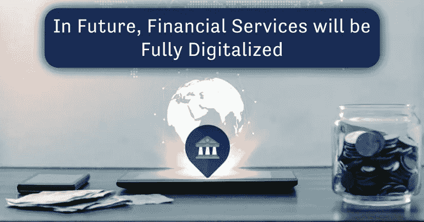

# 未来，金融服务将完全数字化

> 原文：<https://medium.com/codex/in-future-financial-services-will-be-fully-digitalized-dfa040b0e708?source=collection_archive---------14----------------------->

## 对于全世界数百万人来说，使用数字技术获得金融服务正变得越来越普遍

由作者设计

现在是 2022 年，是时候转换到数字时代了。某些流程，如客户服务，可能已经转移到网上；然而，由于客户和员工都希望以简单、快捷的方式进行沟通和开展业务，您必须确保了解所有最新的技术和趋势，以确保您的客户始终将您视为金融服务行业的思想领袖。

为了实现这一目标，我与商业伙伴进行了交谈，以了解如何在未来改变经营方式。

都傻眼了，对通过数字化产生被动收入的想法更少了。

我们开始吧

# 金融服务如何改变并采用数字化？

## 人工智能投资

OMNI 指挥官的高级副总裁 John Pennycuff 说，在未来的 5-10 年里，人工智能可能会在面向客户的服务、预测行为和分析中变得越来越普遍。你如何安装技术，如何收集和使用数据，将决定你在未来几年如何与客户互动和开展业务。

罗恩同意了。“金融服务将对人工智能、其工作方式及其潜力有更深入的了解。目前，人工智能被误解为有意识或智能的人，而实际上它是针对企业或客户的特定数据集进行的机器学习。与云过去的复杂和现在的广泛理解类似，人工智能将会成熟到企业可以有效利用它的地步。”人工智能是未来，所以现在就投资。"

[ikanb 咨询公司创始人兼首席顾问 Yajaira Rivera-Fernandez 对此表示赞同。除了面向客户的聊天机器人，机器学习见解将在内部使用，如承保和销售支持技术。做好准备，因为人工智能已经准备好彻底颠覆这个行业，如果你没有准备好适应，你可能会在你能给客户什么以及你能以多快的速度提供这些方面落后。](https://ikanbtech.com/)

## 包括数字货币

另一个不容忽视的趋势是比特币等数字货币的兴起。现在就做好准备是非常重要的，即使有许多关于他们在这个时间点的未来会如何发展的预测。“我们将开始看到更多的现任者增加他们在数字货币和区块链技术领域的使用和创新，”作者说。Yajaira 预测，保险和金融顾问将在十年后与元宇宙的客户见面。

如果还没有，这些新型货币有可能从根本上改变你做生意的方式，甚至改变你做生意的原因。现在开始考虑数字货币将如何融入您组织的整体格局是一个好主意。你必须首先选择你是否准备处理他们，处理他们，处理他们，或接受他们作为付款。您是否有适当的流程和工具来实现这一点？如果没有，你还在等什么？如果没有，现在是时候让您的组织为一个可能比我们想象的更加数字化的未来做好准备了。

谢默斯总结道:“胜利者将是那些拥抱技术、最大化员工效率并创造卓越客户体验的人。”。自满的人会失去市场份额，难以留住内部人才，最终，客户会被那些提供优质服务的人抢走。"

## 以客户为中心的计划

当客户拥有数字功能时，他们希望能够快速轻松地访问他们的帐户、保单、支付、更新和其他信息。为了让客户能够随时随地访问信息，您必须设置客户门户来促进这一过程。

正如[Cloud Journey Consulting Group](https://www.cloudjourneygroup.com/)的杰西·米德(Jessie Mead)所指出的，你需要“门户网站上的客户服务，以数字方式而非物理方式管理和联系关系经理的方式，以及不需要人工接触就能开立账户和进行交易的方式。”

同意这一点的是道格·莫尔，[维尔塔福尔](https://www.vertafore.com/)公司负责工业关系和伙伴关系的副总裁。我们认为[电子签名软件](https://wesignature.com/)、电子支付和自助门户网站是最重要的改进领域。该研究指出，“不应要求投保人通过电话或电子邮件联系其代理人来查看文件或更改保单。”

通过让顾客掌握指挥权，有可能让他们感觉对过程有更多的控制。

## 文书工作的终结

把客户放在第一位就像不让他们一遍又一遍地填写相同的纸质表格一样简单。“任何仍然使用纸张的程序都应该被评估，”Sean Andrews 说，他是 [Vantage Point 咨询](https://www.vantagepoint-inc.com/)的 Salesforce Solutions 架构师。数字平台可以减少数据收集的错误和损失。"

Seamus Ruiz-Earle， [Carabiner Group](https://carabinergroup.com/) 的创始人兼首席执行官，认为保留文件流程会增加公司的压力。在我和我的团队合作的金融服务公司中，文书工作是摩擦的主要来源。通过数字化处理掉丢失或破损的文档、难以辨认的字迹、输入错误的数据和归档错误的文件。

在线技术还能提供更快、更准确的服务，并能帮助你公司内部可能存在的问题慢慢解决。

## 技术登记

看一看您当前的技术堆栈。您有足够数量的系统吗？还不够吗？是不是太多了？他们执行你分配给他们的任务吗？如果是这样的话，现在是重新考虑的最佳时机，因为有许多新的选择可供选择。

作为起点，谢默斯建议先勾勒出你希望基于技术的解决方案实现的目标。“首先，描述并记录你需要什么；然后，而不是反过来，走出去，获得适当的数字化工具集。”真正分析你有什么系统，为什么有。有没有任何单一的解决方案可以用来取代一个或多个已经在使用的系统？如果是这种情况，那么转移很可能是值得的。

看看你的竞争对手在用什么也不是一个坏主意。为了了解其他业务做得好，人们想要什么，金融服务应该看一看它们。根据 [ZAG Interactive](https://www.zaginteractive.com/) 的营销副总裁 Michelle Brown 的说法，他们的最终目标是与他们喜欢做生意的人、他们可以信任的人以及他们认为会改善他们生活质量的人建立银行关系。

因为你的选择，和你合作会更方便吗？你有竞争对手没有的东西吗？你会因为这种转变而赢得消费者，还是会被认为只是在复制他们？确保你的修改是出于正确的原因——并且你优先考虑了客户的需求。

## 提供培训

在实施新技术时， [Brightmark](https://www.brightmark.com/) 的首席执行官马修·梅因格建议，要记住老年客户可能难以过渡到在线环境，这一点要牢记在心。保证你为客户提供有影响力的培训解决方案和机会，以保持他们的参与，并把他们作为客户，这是至关重要的。

提供登录名和密码并不保证他们能够访问您的客户门户网站、查看他们的投资组合或接收保单更新。如果能开发出文档或方法来指导老年客户使用互联网系统，将会大大减轻他们的忧虑。

Matthew 还提醒我们，将来所有年龄的客户都可能需要培训。同样必要的是对员工进行充分的培训，以确保他们在客户面前或打电话时不会笨手笨脚。让他们在引导下访问节目，也可能有助于消除一些与活动和客户互动记录相关的耻辱，如果以数字方式进行，时间会更长——这可能会让他们在过渡到新的数字系统时感觉更舒服。

如果你的客户和员工熟悉你的技术，你将能够更有效地合作。让培训成为你公司的优先事项。

## 数据在掌控之中

不需要知道位置。现在都是数据了。你不仅要收集适当的数据，还要以有益于底线的方式使用它。它从数据收集开始。

High Wing 的客户成功与合作副总裁 Eliot Bless 表示:“我们的客户迫切需要从他们的客户那里获取数据，整理这些数据，并在我们的保险市场上分发这些数据。传统上，这些任务是通过口头、电子邮件、亲自或在纸质表格和电子表格上完成的。公司内部的个人以不同的方式收集数据，导致了不完整的体验。对于他们的客户来说，可能需要多次聚会和会面才能获得所有必要的数据。

简化数据收集可以帮助你获得新客户并留住现有客户。因此，您需要一种简单的数字方法让客户输入请求并跟踪其进度。通过这种方式，请求不会因为组织中的障碍而变慢。

所以，一旦你获得了数据，确保你链接到正确的组和软件。整合来自外部平台的数据，并将其存储在单一的真实来源中，这是高效数字平台的目标。Sean 解释道:“在数字时代，最终用户和客户都希望能够轻松访问数据。自动化在这里至关重要，因为它将影响您获取和实现数据驱动的洞察力的方式。

## 想想我们互动的方式

因为数字化，你有能力完全重塑与客户互动的方式。这种趋势的一个突出例子是要求提高通信能力，以便更好地连接人们，特别是多渠道聊天和消息服务，以及信息/应用程序数据收集。

“因为许多人发现很难安排时间等待和呼叫客户服务，这不仅对客户来说更有效率，而且对金融服务公司来说也更有效率，因为他们可以同时服务更多的客户，”绿色讽刺公司的技术总监凯文·麦卡比和战略服务总监罗恩·里德说。这不仅对顾客来说更有效率，因为许多人发现安排时间等待和打电话给顾客服务更困难，而且对顾客来说也更有效率

根据 Sean 的说法，这种情况与前面描述的情况类似。到 2022 年，我们预计会有越来越多的客户改善他们的日程安排系统。“鉴于近年来发生的事件，为客户提供更灵活的预约替代方案的需求变得更加重要。公司通过简化内部用户的日程安排流程，同时提供对客户自我日程安排选择的访问，获得了独特的竞争优势。

向您的客户提供这些解决方案可能是获得他们信任和忠诚度的一种简单快捷的方法。这表明你在考虑别人的时间和优先事项，而不是你自己的..此外，这为他们提供了更多与你做生意的机会，这总是一个积极的发展。

## 改进的支付选项

凯文和罗恩预测，“支付能力将在 2022 年继续取得重大进展。”现在仍有许多金融机构当面接受支票或当面接受现金。公司将能够专注于与更具可扩展性的支付系统集成，并以经纪人完成工作的方式将数据与其核心系统进行协调。这将归结为利用这些企业平台，结合已经到位的利基系统，不仅简化资金的接收，而且简化资金的支付。"

专注于你所采用的策略，以及它们是否适合你所有的客户，无论是年轻人还是老年人。确保您拥有与您的技术堆栈和客户需求相兼容的技术。这样一来，你就不会因为一个支付问题而失去消费者。

但是请保持你的目光和对未来的思考。未来有哪些支付方式可供选择，你会接受其中的每一种吗？你现在有没有根据你的信念和原则将策略和软件放在适当的位置？愿你能跟上未来这一领域将发生的变化？如果没有，现在就开始寻找替代品。

## 结论

由于有可能接触到数十亿新客户，银行和越来越多的非银行机构已经开始向金融排斥和服务不足的人群提供数字金融服务，这些服务是基于多年来用于改善已经获得正规金融部门服务的人群的访问渠道的数字方法。

数字金融对新兴和发达经济体的金融包容性都有积极影响，数字金融为低收入和可变收入的个人提供的便利对他们来说往往比他们从传统监管银行获得此类服务的更高成本更有价值。

未来研究的最后一条道路是调查数字金融和经济危机之间的关系，以发现数字金融是否在危机期间助长了金融传染的蔓延。