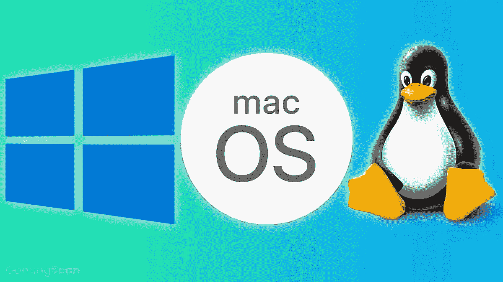

# 游戏中的操作系统和网络

> 原文：<https://medium.com/codex/in-game-operating-systems-and-networks-324059af692f?source=collection_archive---------28----------------------->

对于 Godda Game 的这些[游戏理念](/predict/got-interesting-games-ideas-and-platforms-for-learning-not-education-89391a7aa1c8)来说，核心游戏体验是关于学习，而不是教育，然后是帮助软件工程师、网络工程师和其他技术人才在玩 Godda Game 需要在游戏环境中模拟复杂系统和网络的惊人游戏时提升水平。

希望有很多游戏引擎可以帮助 Godda Game 开发令人惊叹的游戏体验，并将其集成到 Xbox 这样的主机上。Xbox 平台的所有者微软是这些游戏引擎之一 XNA 的幕后推手，雷德蒙的科技公司已经建立了一个完整的[游戏栈](https://developer.microsoft.com/en-us/games/products/)，帮助像 Godda Game 这样的游戏工作室建立每个玩家都喜欢玩的游戏，但是这些游戏开发平台都没有 Godda Game 模拟游戏中复杂的计算机系统和网络所需的功能。然后 Godda Game 设计了游戏内操作系统，该功能允许游戏开发人员和设计人员在他们开发的游戏中运行 windows、Linux 和 OSX 等操作系统，以便为玩家提供游戏体验，让他们发挥自己的技能。

这是一个全新的功能，Godda Game 将与其他游戏工作室分享，这将真正有助于构建令人惊叹的学习驱动型游戏，帮助任何人在游戏中学习编程、网络、数据科学。从科学研究中，我们知道当学习与有趣的经历联系在一起时会更有效率，但是仍然有很少的学习项目利用这一发现并与游戏工作室合作以产生基于游戏的更有效率的学习经历。Godda Games 非常愿意不仅通过学习驱动的游戏，而且通过一个完整的生态系统来帮助其他游戏专业人士轻松构建这种类型的游戏，来结束这款游戏。

例如，下面这个游戏创意使用游戏中的操作系统技术，在高科技公司总部获得有趣的体验，高科技行业的人会喜欢玩，他们不仅会从中获得乐趣，因为他们会保持自己的技能与时俱进，并学习其他人的技术技能。

 [## 大型技术总部和游戏体验

### 谷歌、微软和所有其他大型科技公司现在都是游戏环境

medium.com](/predict/big-tech-hq-and-gaming-experience-dbb35f2de563) 

PS: [Godda Game](https://mkrdiop.medium.com/list/godda-game-598649249472) 像 [Book Dojo](https://mkrdiop.medium.com/list/book-dojo-776e1a8b8b88) 实际上是一个没有任何天使投资人资助的一个人的创业公司，但致力于在手头资源很少的情况下提供创造性的技术产品和服务。也许有了基金会更好、更容易、更快，但我们知道只有基金不是成功的途径，因为我们已经看到很多创业公司在拥有数百万美元的基金后失败了。投资 Godda Game 或 Book Dojo，如果你相信这两个项目，但像其他人一样，它们可能会彻底失败。