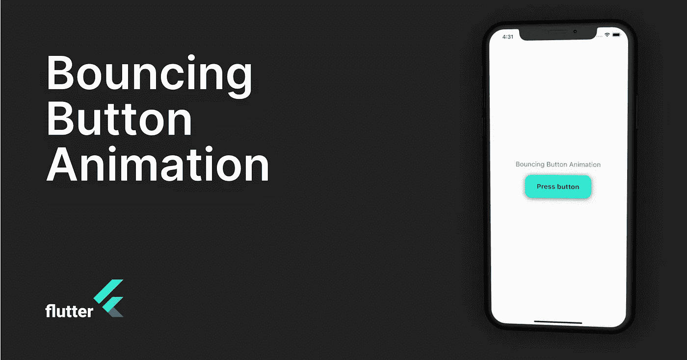

# 在 Flutter 中创建弹跳按钮动画

> 原文：<https://medium.com/codex/in-general-add-animations-to-your-applications-enriches-the-general-user-experience-68121522b57a?source=collection_archive---------1----------------------->

总的来说，在你的应用程序中添加动画可以丰富用户体验。

在 Flutter 中，创建动画非常简单和直观。在这种情况下，您将学习如何使用控制器和值创建弹跳按钮动画。