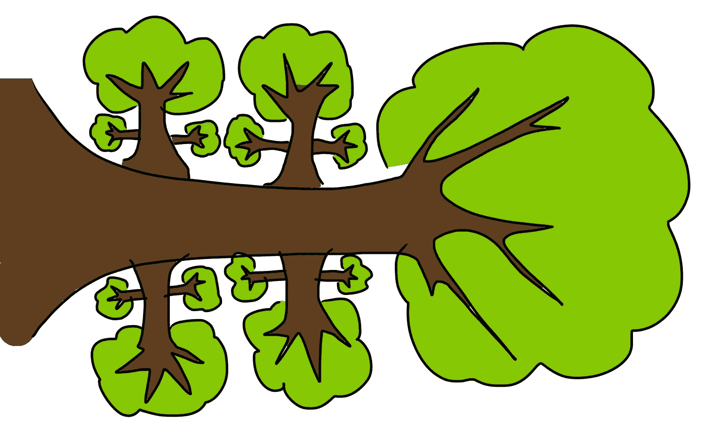

# 用 Python 解释二叉树中的有序、前序和后序遍历

> 原文：<https://medium.com/codex/in-order-pre-order-post-order-traversal-in-binary-trees-explained-in-python-1fc0c77f007f?source=collection_archive---------4----------------------->

递归 y 树

如果你目前正在学习二叉树及其变种，如二分搜索法树、AVL 树等，你可能需要知道如何遍历二叉树。本文试图为您简单解释这一点。

# 快速介绍—二叉树