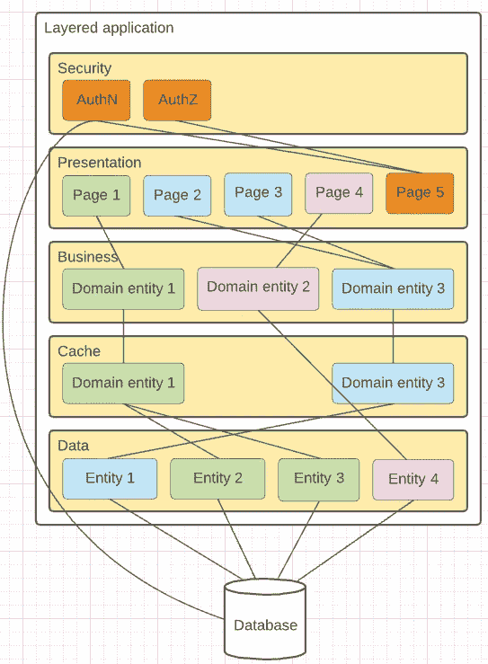
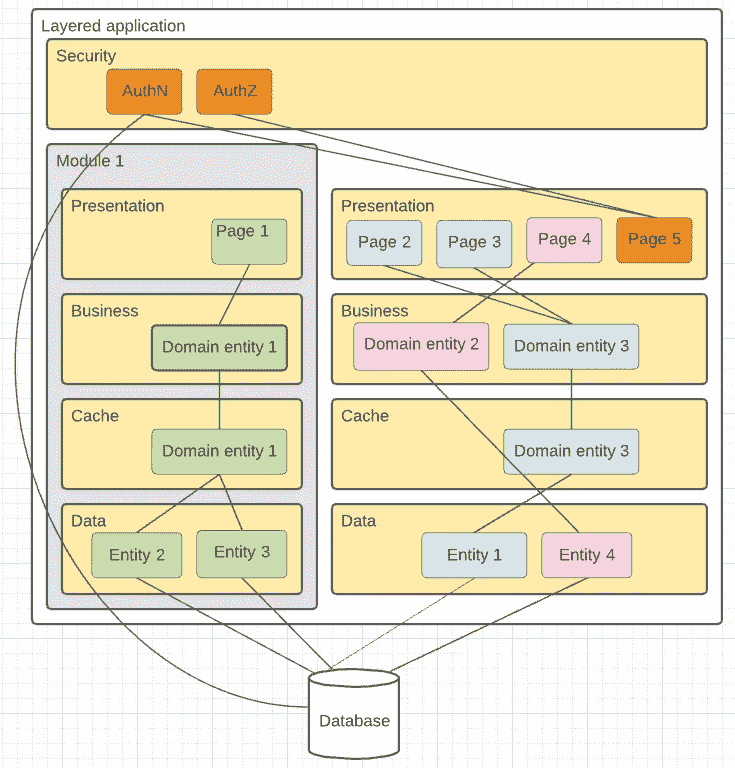
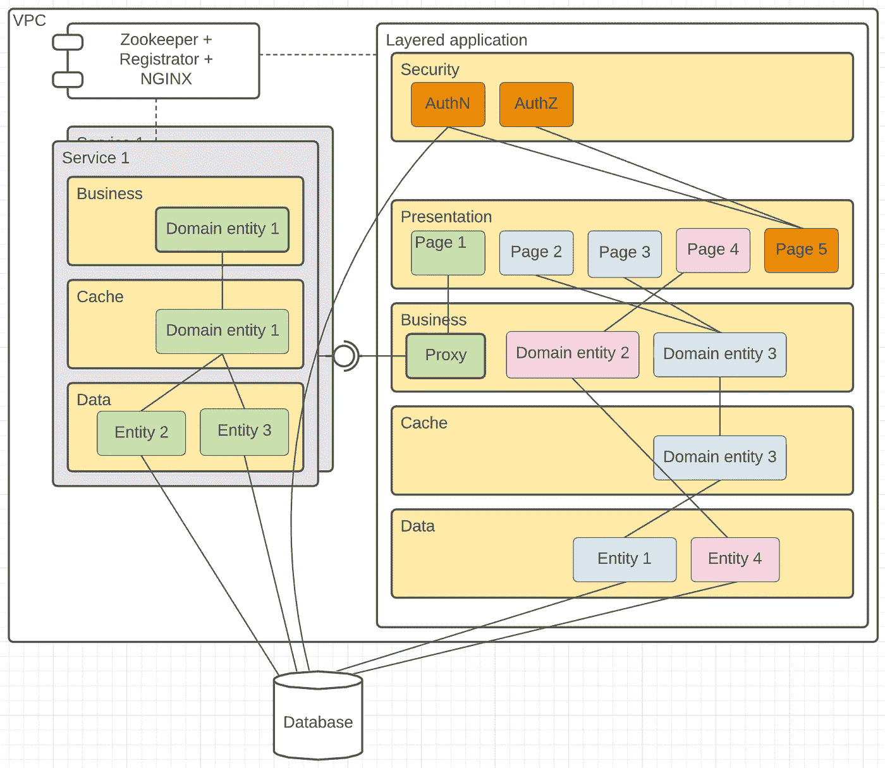

# 一开始，是独石(第一部分)

> 原文：<https://medium.com/codex/in-the-beginning-was-the-monolith-part-1-753116b51e93?source=collection_archive---------8----------------------->

通常，单片应用程序是使用 N 层架构构建的，其中 N 是架构所需的层数(通常为 3，但也可以更多)。我们的应用程序由 5 层组成。

**安全性**:这一层控制对应用程序的特权访问，提供相应的抽象来认证和授权用户访问。通常可以出于自己的管理目的重用表示层的一部分，例如注册新用户、恢复访问等。我们使用框架预构建安全提供者，因此登录/注销过程由这些提供者提供的高级 API 实现。此外，我们支持几个额外的页面来管理用户访问。

**表示**:提供一个用户界面与应用程序通信。我们使用服务器端渲染页面和 MVC 设计模式实现，因为它简化了表示层和其他层之间的通信。

**业务**:所有的业务逻辑都放在这里，所有的数据处理都封装在这一层。通常，复杂的业务实体由许多数据原语组成，但是从表示层的访问只允许高层领域抽象。

**缓存**:这是一个可选层，可以声明式地集成在业务和数据之间，以加速数据加载并减少持久存储的压力。

**数据**:最接近物理数据存储的层，通常反映存储数据契约。业务层可以通过抽象为更领域友好的数据结构，直接(或通过缓存层间接)访问存储的数据。

这种架构化解决方案的好处是，构建起来既快速又简单。许多著名的框架提供了良好的搭建机制，可以从头开始构建，并且发展非常快。此外，组件和层之间的通信就像“类实例到类实例”的通信一样简单。我相信当“时间”是你最关心的问题时，没有比 monolith 更好的建筑解决方案了。只有“买，不建”更好。

但是速度是有代价的。从一个大型的整体应用程序开始，我们意识到当处理一个整体时，控制特定部分的性能和响应性要困难得多。一个部分的性能下降反映了整个系统的性能下降。我们体验了噪音邻居效应的最佳表现。最重要的是，即使知道您的瓶颈，也没有简单的机制来控制特定子系统每个当前负载所需的资源。在这种情况下，你的最小公分母——禁止行动，以避免整个系统的伤害。

由于我们的解决方案没有满足一些最重要的质量属性，如高可用性和容错，这影响了用户体验，所以我们决定现在是时候完成我们在宏观服务方向上的步骤了，这将是完全本地(微服务)采用之间的中间状态。

# 整体到紧密耦合的宏观服务

第一阶段——将性能关键的业务行为提取到独立部署和独立管理的模块中。我们追求的第一个目标是——如果您能够提取和调优特定部分的性能，您就不需要担心整体的系统性能。所以采用微服务的第一个原因是关于微调整。

由于我们没有足够的时间和资源来重新设计解决方案，使其完全模块化，因此我们只确定了从主流程中提取的最关键部分。但是最初，我们将包含那些将要被提取的行为的全域范围的上下文封装到一个单独的模块中。

与之前的解决方案相比，这个解决方案没有太大的不同。唯一的“模块思维”允许我们从领域的角度审查我们的整体应用程序，并定义可以独立共存的有界上下文，包含正确执行业务请求所需的所有业务操作。

此外，与层-组件-服务接口相比，该模块的抽象程度要高得多。从商业角度来看，它是自给自足的，因此可以被视为“某物”的一个附加和独立的单元。例如，如果系统总体上支持“位置透明”特性，则该模块可以在虚拟化环境之外使用。

# 更大还是更小？

但是这个模块应该有多大呢？在这个阶段，我们陷入了两难境地:将模块提取为自给自足的应用程序(具有自己的 UI)或业务服务，公开全套 API 来解决业务任务。

我们认为，从长期角度来看，第一种方法更好，因为它允许您从整体中完全提取一部分(在这种情况下，您的正常运行时间 SLA 不包含任何其他部分的乘积)，并且可以由单独的团队完全垂直地支持。但是实现它的复杂度已经足够高了。这里主要关注的是:安全性(身份验证和授权层需要被提取为一个新的可重用组件)和平滑 UX(不应该有应用程序边界的感觉，所以 SSO 和常见的布局部件如页眉和页脚需要得到支持)。所以这种方法需要对两个部分(整个应用程序和提取的模块)做大量的工作。

第二种方法更简单，它允许将模块提取为一个单独的 web 服务，带有一组将由主应用程序使用的业务 API。它不必公开可见，因此这里可以放松安全约束。作为一种实现——它可以在 VPC 的主网络内部发布，而不对外部世界公开。此外，必须训练主应用程序支持与外部系统的通信，而不仅仅是实例化组件的函数调用。在后台，它也需要实现服务发现和 API 网关机制，但市场上充满了可用于降低实现成本的框架和技术不可知的解决方案，如 [Zookeeper、Nginx 和 Registrator](https://www.nginx.com/blog/service-discovery-nginx-plus-zookeeper/) 。所以这种方法被选为短期解决方案。

与之前的解决方案相比，该解决方案更好，因为它为零件的自身生命周期管理提供了支持，但与预期相差甚远，因为它没有正确实施云特性，并且需要额外的手动工作来正确管理服务生命周期(如支持健康检查等)。

但是引入弱依赖性已经带来了第一个好处——独立的可部署性和有限的干扰邻居效应，因为您可以独立地托管单独的进程。最终，其他业务关键部分作为独立的服务被迁移。主应用程序更像是一个中介，分析用户输入并调用适当的服务进行处理。该解决方案很难与现代云微服务架构相提并论——扩展、服务恢复、保证可用性都是部分自动化的。我们需要通过运行特定的 CI 代理，在负载增加或重启失败时提供新的服务。但我们已经有了进一步改进的空间，一些小应用程序可以改善云的特性——在它们之间添加网关并支持部件的扩展。

在这个重构的最后，我们的主要瓶颈变成了数据库，因为我们对所有部分都有一个单独的存储，所以我们的性能问题并没有消失，而是转移到了下一个组件层— RDS。但是我会在[的下一篇文章](/@vadim.barilo/in-the-beginning-was-the-monolith-part-2-database-ba4eed11fbbb)中分享我们减轻它的步骤。

# 吸取的教训:

*   微服务思维是好的，从微服务开始有时是过度工程化(可观察性、监控、基础设施协调等方面的额外成本)
*   领域模型、领域边界和有界上下文很重要——您应该将您的领域组织成一组具有其业务意图的独立上下文
*   即使有一个复杂的整体，定义核心模块，这个应用程序可以分成单独管理其有限的上下文
*   将您的模块提取为一个黑盒，由该模块公开最少的 API，足以对该域上下文中的数据执行定义的业务规则
*   从安全角度来看，零信任网络更好，但实现起来更复杂——只是禁止用户访问系统的某个部分是足够好的短期解决方案