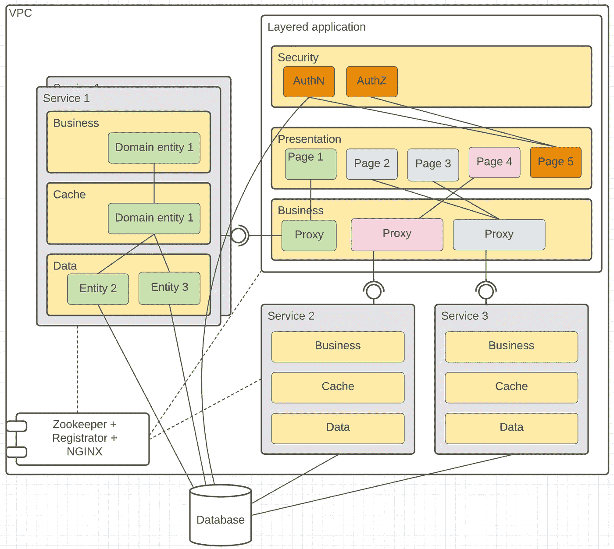
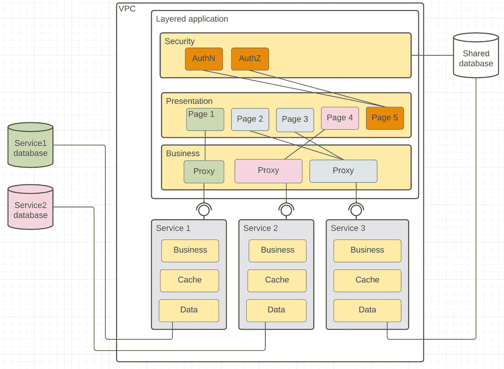
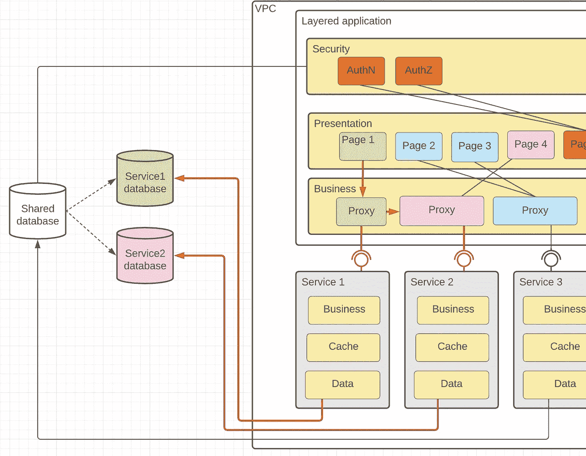
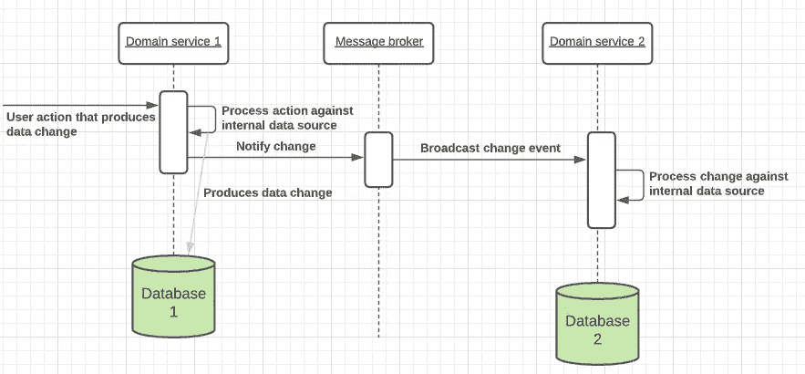
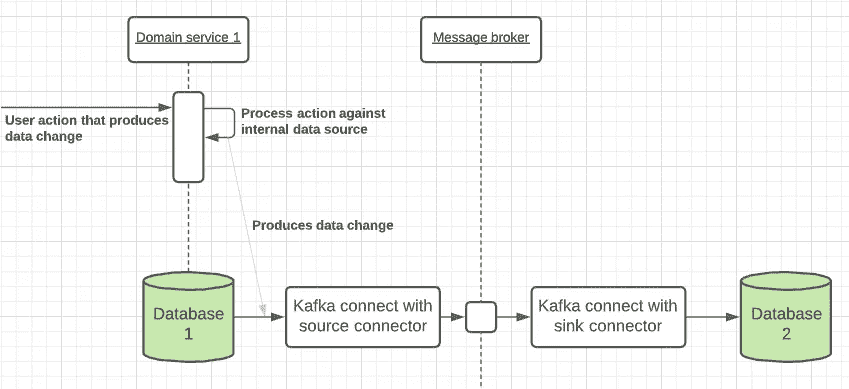

# 一开始，是 monolith(第二部分)/数据库

> 原文：<https://medium.com/codex/in-the-beginning-was-the-monolith-part-2-database-ba4eed11fbbb?source=collection_archive---------7----------------------->

数据库不原谅错误。这是 f̵r̵u̵s̵t̵r̵a̵t̵i̵o̵n̵失败的单点，尤其是当复杂的整体解决方案被绑定到一个 RDS 实例时。

不管您有多有经验，您的用户总会发现揭示 SQL 低效的用例或特定使用模式。任何 SQL 效率低下都会影响整体系统性能。



[将主应用重新设计为一组独立的宏服务](/codex/in-the-beginning-was-the-monolith-part-1-753116b51e93)后，以根应用作为中介，我们只实现了域边界之间独立的假象。我们仍然有一个共享的状态。

这显然会影响系统的可靠性，因为一个部分的低效率会影响整个系统的性能，因此用户可能会经历业务流程执行的减速。

投入时间进行系统重新设计，以变得更加云友好—我们改进了云的特性，如可用性和可维护性，但在用户满意度评估(可靠性)中仍处于同一等级。

因此，我们采用宏服务的下一个里程碑是当每个业务服务管理自己的数据子集时，实现“每个服务一个数据库”的设计模式。听起来很简单，不是吗？不要！

# 当设计不代表隐藏的复杂性时



您需要非常幸运地拥有一个域模型，它可以很容易地分割成独立的、不相交的块，并由不知道其他域服务存在的服务来管理。

我们在这里运气不好。

我不能透露我们的领域模型的细节，所以将使用一个众所周知的电子商务类比。

假设我们有“产品”和“用户”垂直切片的领域上下文，它们独立存在，并由独立的服务管理。UserDB 不存储订单信息—它主要用于收集所有与用户相关的信息—个人资料、权限、功能、访问历史等。ProductDB 关注的是库存、物流和订单。但是当订单被创建时，产品需要存储用户链接，并且用户在浏览时必须拥有创建的订单和愿望列表的所有链接。此设计中不再提供外键约束，但需要一些模拟来确保不同 RDS 中不同数据库之间的数据一致性。

努力寻找足够好的解决方案来满足这些需求，我们开始回顾出现数据交集的用例。所有这些使用案例都按照下一个核心相似性进行了分类:

*   **输入验证** —在创建/更新 *EntityA* 期间，您需要确保来自不同域的 *EntityB* 存在并且有效，例如

```
POST api/orders
{
  productVariantId: 25,
  userId: 2                //ensure user exists and is active
}
```

*   **数据丰富** —出于内部数据处理目的，需要来自单独域的一些附加信息，例如，考虑用户个人折扣计算订单总价

```
GET api/order-book/1
...
{
   userId: 2,
   totalPrice: 200.0,     //can differ between users with same items
   orders: [...]
}
```

# 输入验证

想法(和需求)是当数据操作发生在独立的域上下文中时，保持整个系统处于一致的状态。

由于我们本质上仍然是集中式的(从用户的角度来看),并且使用高级集中式中介将业务意图传播到相应的子域服务——我们可以通过利用特定部分的数据服务，使用上层来验证整个输入。


我们实现了特定的验证器，以确保如果验证没有通过，来自表示层的数据不能传播到下一层。

因为表示层可以完全访问所有域上下文代理，所以即使是异构请求(利用来自不同域的数据)也可以首先被完全分析。

如果发现一些错误，我们可以跳过进一步的处理，同时，如果所有应用的验证器都成功响应，我们可以使用子域数据服务继续处理。

验证器的示例:

```
class CreateOrderEvent { @ValidUser //implemented as REST API validation against service1
  private int userId; @ValidProductVariant //service2 REST API validation implementation
  private int productVariantId; ... other properties with basic validation like @Required ... 
}
```

从短期角度来看，这种解决方案已经足够好了，因为它允许对已经信任的数据使用代理数据服务，因为该解决方案确保数据在被较低层使用时是有效的。因为业务服务还没有对外公开——除了表示层没有人可以使用它们。

其他更复杂的场景(比如删除用户场景)也可以被这种方法覆盖—您只需要在上面一层进行更多的验证，就可以在下面一层的适当条件下拒绝执行(所以如果有这个用户创建的订单，用户可能不能被删除)。

```
@ValidDeleteUserContext  //validator when execution context matter
class DeleteUserEvent { @ValidUser
  private int userId;
}
```

从实现的角度来看，这种方法很简单，而且足够强大，可以确保在使用多个数据源时，系统在数据操作期间处于一致的状态。

# 数据丰富

想法(和需求)是支持“共享数据”的概念，并从许多领域上下文中访问它。

这种情况更复杂，其根本原因是领域上下文交叉，因为总是存在必须包含在许多上下文中的共享数据。一个例子可以是查找数据(例如国家),它可以在许多域对象中用作参考数据。



由于每个域上下文有几个数据存储，我们显然需要一个解决方案来访问存储在单独存储中的共享数据。

这里的传统挑战—共享数据不是静态的，可以通过自己的业务活动进行管理(例如，随着业务的全球扩张，国家/地区列表可能会发生变化)。

回顾用例的数量，我们发现唯一可接受的解决方案是为每个上下文保留共享数据的副本。

我们回顾了实现数据源之间一致性的几个选项:

*   *计划的数据同步* —基于数据可变性，我们使用 CRON 作业从源下载共享数据，并在目标位置替换它
*   *使数据源可观察到数据变化(事件流)* —因为我们希望拥有完全专用和松散耦合的业务域，所以最好通过消费者可用的业务 CRUD 事件序列来表示每个业务域对象的状态变化
*   *利用 CDC(变更数据捕获)数据库特性*实现发件箱模式——类似于上面的解决方案，但事件是实际的数据库行变更，而不是相应的业务抽象变更。

计划的数据同步作为一种选项被拒绝，因为它对数据库和网络资源的使用非常激烈—您总是使用完整的数据集，因为您不知道自己的差异。此外，数据一致性窗口足够高，因为该解决方案不知道实际的数据使用情况(CRON 是基于每一段时间的平均数据修改量构建的，因此不考虑数据修改的异常情况，如工作日和周末的活动)。

第二个回顾的方法是关于使业务服务可观察。



一旦变更发生——任何相关方(甚至是当前领域之外的)都可以对此变更做出反应。在我们的例子中—对 CRUD 事件作出反应，复制这个实体并同步当前状态。

这种方法被接受为候选方法，因为它还允许改进服务，使其本质上是反应性的，并主动通知状态变化。这种设计只有一个严重的隐藏复杂性——针对内部数据源处理数据和向消息代理发送更新应该在单个分布式事务中处理——如果在处理用户意图时只完成一个操作(例如，存储在数据库中，但消息未发送),则整个集群有陷入不一致状态的风险。

所以我们拒绝了它，而选择了第三个选项——数据库级别的状态变化可观察性。



与第二种方法相比，估计工作量也有所减少，因为该解决方案变得更简单，并且旨在解决相同的问题，而无需实现手工发布-订阅基础设施，并且在其设计中没有分布式事务。它基于 KafkaStreams 和 Debezium 连接器，在 RDS 之上支持传输数据更改。想法是对本地数据库更改事件做出反应，并使用 KafkaStream 连接器将这些更改正确地序列化为适当的 Kafka 事件，并通过代理传输到目标数据库。

结果—更改的数据被静默地传送到目标，而没有利用拥有这些数据源的相应服务。此外，最重要的是，接收器和源连接器允许对这些更改进行某种程度的控制，并在此基础上支持一些业务操作(例如，只对目的地使用字段的子集，或者根据目的地的目的过滤事件)。

因此，服务分离和存储分离让我们有更多的自由来更准确地控制每项服务。此外，性能问题已经可以隔离在特定的组件中，而不会损害整个系统。

在这个练习的最后，我们非常接近于最终垂直分割我们的解决方案(包括表示层)，成为完全分布式的、可独立管理的，并且有我们自己独立的发布生命周期。因此，我们开始采用微前端架构来完全垂直分割我们的解决方案。我将在下一篇文章中分享细节。

# 吸取的教训:

*   对所有微服务使用单个数据库是反模式的——您的性能问题或 SQL 效率低下只是转移到了较低层，但总体而言仍然是整个解决方案
*   领域思维是好的，但是共享数据无论如何是存在的——首选的解决方案是在接近正常使用的情况下合并它们
*   使用单一位置管理通用数据
*   使用公共数据作为特定域上的“读取副本”，不允许修改它
*   CDC 是手动数据同步流程的良好替代方案，易于实施，并且易于扩展/支持，因为市场提供了大量开源解决方案