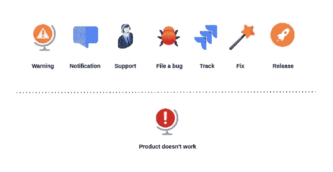

# 事故管理

> 原文：<https://medium.com/codex/incidents-management-5ab69e2865c5?source=collection_archive---------11----------------------->

## 软件工程

## 如何克服障碍，改进你的软件

成千上万次，我们所有人都遇到软件就是不工作。

Lukas/goumbik Pexels 的照片

它不会崩溃，不会抛出一个标志，通知你有一个错误——但是由于某种原因，它没有做它应该做的事情。这意味着不公平，糟糕的设计，以及对其行为的零预期，并大叫“*我不擅长我应该做的事情*”。

# 事件视角

以下概述了您的客户和您所看到的内容。

作者插图

可靠性被设计到产品及其背后的过程中。

视角就是一切。首先，从用户的角度来看你的软件。使用它，尝试它——满足消费者的需求。

从技术的角度改进你的产品，但是接着在你的流程上工作，看看还有什么可以改进的。

始终分析您的软件、功能、威胁、错误、事件和问题。

从技术上讲，为了改进我们的软件，需要整合以下所有实践和概念:

*   记录
*   审计
*   基础设施指标
*   硬件资源指标
*   自定义用户指标
*   实时警报
*   分析学
*   死后分析
*   事故报告
*   事故管理

可靠的软件不是一天就能构建和验证的。可靠性是必须实现的，你设计、建造和改进系统的方式都是它的一部分。

# 故障模式和影响分析

有许多框架和模型可以帮助您克服问题、分析和改进您的解决方案。

其中之一是故障模式和影响分析。FMEA 是一个系统的、主动的框架，用于识别可能的故障及其影响。

这是一个检查组成系统的组件和部件的过程，让您识别故障原因和影响。

FMEA 是可靠性工程的核心任务。

许多公司和社区并没有这样的模型，但是却努力追求高质量、稳定性和可靠性。

它只是让你认识到:

*   什么会出错
*   为什么会出现故障
*   失败的影响和后果是什么

# 事件指标

故障、中断和错误——所有原因都会导致停机，并影响系统的可靠性。

必须跟踪与事件相关的指标。事故管理、检测、诊断、解决和预防都是工程部门的关键绩效指标。

就关键绩效指标而言，以下是其中几个:

*   给定时间段内创建的警报数量
*   给定时间段内发生的事件数量
*   平均故障间隔时间
*   平均确认时间
*   检测平均时间
*   平均解决时间

只有当你把这些都准备好了，你才能真正了解哪些部分可以改进，无论是每个团队、产品、服务，还是整个工程部门。

# 待命轮换

无论您有专门的支持团队，还是您的开发人员正在支持内部组件，您都需要随叫随到的轮换。

事实证明，这有益于您的软件质量和可靠性。

在随叫随到期间，对处理事件所花费的时间进行衡量也是一种非常有用的方法，可以获得更多的洞察力。

尽管如此，世界上所有的 KPI、度量和指标都不能取代*上下文*。事件是独特的，统计数据有时是陷阱。对事件进行上下文感知分析是必须的，通常只需要一点常识。

# 发信号

有指标来分析您的组件是很好的，甚至在客户注意到问题之前就有实时警报是令人惊讶的。

> *可靠性不仅存在于软件中，也存在于团队中。*

为了向消费者提供可靠性，需要对问题进行警告和响应。缓解是关键—在问题爆发之前检测到它，您的客户甚至会注意到它，让您描绘出一幅完全不同的画面，并使您能够防止事故发生。

提醒是必须的。根据经验，您会惊讶于警报带来的好处。尝试一下，看看哪些渠道最适合您:

*   实时状态页面
*   电子邮件
*   短信
*   懈怠，团队，或者你使用的任何东西

许多成功的公司都具备这些条件。警报值得与监控一起成为公司范围内的举措。

# 六西格玛

为六个适马或 DFSS 设计是软件工程中的一种系统方法和模型，其目标是实现可靠性。这是一个产生高质量和改进质量的过程。

六个适马将使你拥有:

*   统计质量控制
*   系统方法
*   基于事实和数据的方法
*   基于项目和目标的焦点
*   客户导向

所有这些都是可靠软件的先决条件。这又允许你结合一个 DMAIC 循环，即设计-测量-分析-改进-控制。

软件工程中的事件管理有许多概念、因素和方面，但希望以上总结了其中的一部分。

无论你是工程师、建筑师、经理还是设计师，我希望你喜欢并发现这个故事很有趣。

感谢您的阅读！🎉