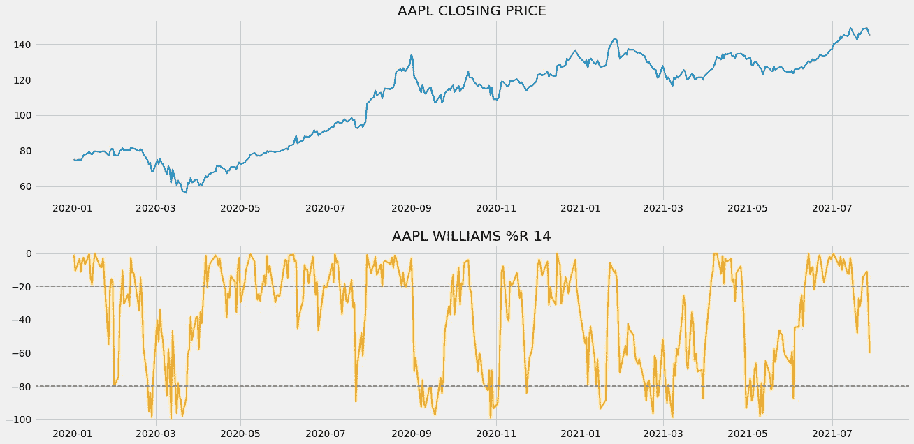
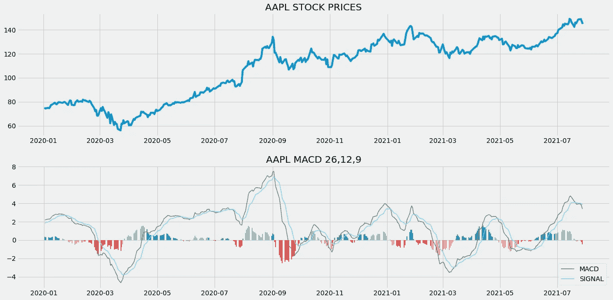
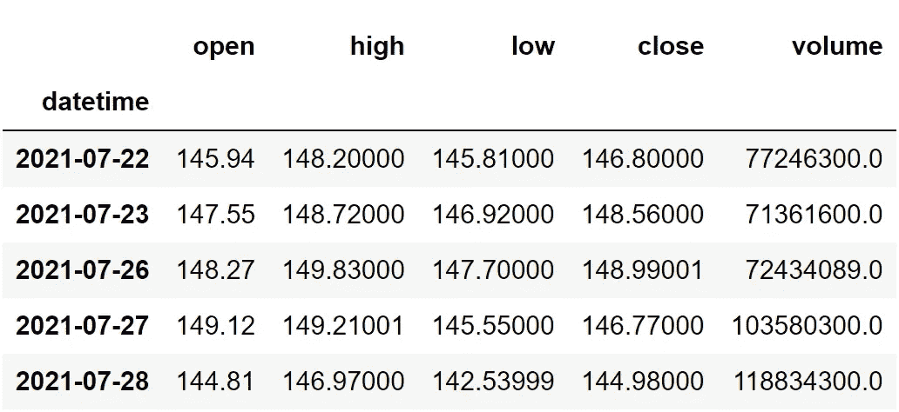
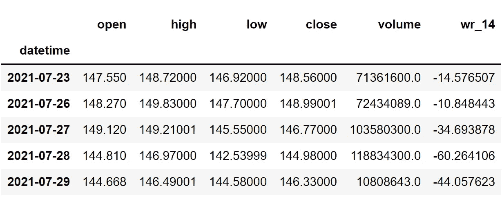
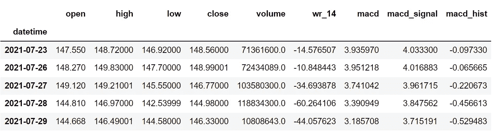
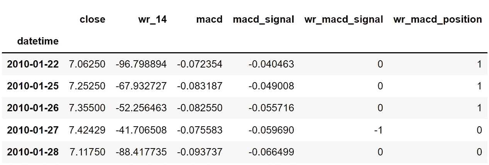

# 通过在 Python 中结合威廉姆斯%R 和 MACD 提高股票回报率

> 原文：<https://medium.com/codex/increasing-stock-returns-by-combining-williams-r-and-macd-in-python-5af999c90259?source=collection_archive---------5----------------------->

## 关于使用 python 结合两个技术指标并创建杀手交易策略的详细案例研究


照片由 [Jp Valery](https://unsplash.com/@jpvalery?utm_source=medium&utm_medium=referral) 在 [Unsplash](https://unsplash.com?utm_source=medium&utm_medium=referral) 上拍摄(作者编辑)

技术指标是交易领域的新宠，值得花时间去研究。虽然它在分析市场方面有更大的潜力，但是我们也应该明确地考虑它的缺点。虽然不多，但有一个明显的问题是，它会泄露错误信号，一旦被发现，可能会导致灾难性的后果。很难避免这种信号，但不是不可避免的，最好的方法之一是结合两个技术指标，其中一个指标作为过滤器，将真实信号与虚假信号进行分类。这正是我们今天要做的。

在这篇文章中，我们将结合两个强大的技术指标，威廉姆斯%R 和移动平均线收敛/发散(MACD ),创造一个杀手交易策略，尽可能消除虚假交易信号，大大提高投资回报。事不宜迟，让我们进入文章。

在继续之前，如果你想在没有任何代码的情况下回溯测试你的交易策略，有一个解决方案。这是[的后验区](https://www.backtestzone.com/)。这是一个平台，可以免费对不同类型的可交易资产的任意数量的交易策略进行回溯测试，无需编码。点击这里的链接，你可以马上使用这个工具:[https://www.backtestzone.com/](https://www.backtestzone.com/)

# 威廉姆斯%R

由拉里·威廉姆斯创立的威廉姆斯%R 是一个动量指标，其值在 0 到-100 之间波动。这个指标和随机振荡指标非常相似，但是计算方法不同。交易者使用这个指标，通过构建超买和超卖两个级别来发现交易的潜在进场点和出场点。在讨论超买和超卖水平之前，先说一句:当市场趋势看起来非常看涨并注定要盘整时，股票被认为是超买。类似地，当市场趋势似乎极度看跌并有反弹趋势时，股票到达超卖区域。超买和超卖水平的传统阈值分别是 20 和 80，但也没有任何禁止采取其他价值。

为了用 14 作为回望周期的传统设置来计算 Williams %R 的值，首先，确定 14 天时间范围内每个周期的最高价和最低价。然后，取两个差值:从最高价到收盘价，从最高价到最低价。最后，将第一个差值除以第二个差值，再乘以-100，以获得 Williams %R 的值。该计算可数学表示如下:

```
**W%R 14** = [ **H.HIGH** - **C.PRICE** ] / [ **L.LOW** - **C.PRICE** ] * ( **- 100** )where,
W%R 14 = 14-day Williams %R of the stock
H.HIGH = 14-day Highest High of the stock
L.LOW = 14-day Lowest Low of the stock
C.PRICE = Closing price of the stock
```

这个指标的基本思想是，当它是一个强劲的上升趋势时，股票将不断达到新高，同样，当它跟随一个强劲的下降趋势时，股票将达到新低。现在，让我们分析威廉姆斯%R 的图表，以便更好地理解该指标。



作者图片

上面的图表分为两个面板:上面的面板显示苹果股票数据的收盘价，下面的面板显示苹果 14 天 Williams %R 的读数。现在，该图表可以通过两种方式使用。第一种方法是使用图表作为工具来识别市场的超买和超卖状态。你可以观察到在市场的上方和下方有两条水平的灰色线，这是超买和超卖水平，分别位于-20 和-80。如果威廉姆斯%R 的读数高于上线或超买线，您可以认为市场处于超买状态。同样，如果威廉姆斯%R 的读数低于较低的线或超卖线，你可以假设市场处于超卖状态。

使用威廉姆斯%R 的第二种方法是识别市场中的虚假动量。在强劲的上升趋势中，威廉姆斯%R 的读数往往达到-20 以上。如果该指标下跌，并在下一次下跌之前努力达到-20 以上，表明市场的动力不是真实的，可能会跟随一个巨大的下跌趋势。同样，在健康的下跌趋势中，威廉姆斯%R 的读数必然会经常低于-80。如果该指标上涨，但在下一次上涨前未能达到-80，表明市场将遵循积极的趋势。

由于威廉姆斯%R 是一个方向指标(其运动与实际市场的运动成正比)，交易者也用这个指标来寻找和确认市场中的强劲上涨趋势或下跌趋势，并沿着它进行交易。一些指标在用于识别或确认市场趋势时没有多大用处，因为它们可能在本质上是滞后的(考虑历史数据点以确定当前读数的指标)，但 Williams %R 是一个有效的指标，因为它是领先指标(考虑先前数据点以预测未来走势的指标)。

# MACD

在学习 MACD 之前，有必要知道指数移动平均线(EMA)是什么意思。EMA 是一种移动平均线(MA ),它自动为最近的数据点分配较大的权重(除了重要性之外),而为遥远过去的数据点分配较小的权重。例如，一份试卷将由 10%的一分问题、40%的三分问题和 50%的长答案问题组成。从这个例子中，您可以观察到，我们根据重要性级别为试卷的每个部分分配了唯一的权重(长答案问题可能比一分问题更重要)。

现在，MACD 是一个趋势跟踪领先指标，通过减去两个指数移动平均线(一个周期较长，另一个周期较短)来计算。MACD 指标有三个显著的组成部分。

*   **MACD 线:**这条线是两个给定的指数均线之差。为了计算 MACD 线，需要计算一个周期较长的均线(慢速线)和一个周期较短的均线(快速线)。最快和最慢的长度分别是 12，26。从快速均线中减去慢速均线可以得到最终的 MACD 线值。计算 MACD 线的公式可以表示如下:

```
**MACD LINE = FAST LENGTH EMA - SLOW LENGTH EMA**
```

*   **信号线:**这条线是 MACD 线本身在给定时间段内的指数移动平均线。计算信号线最流行的时期是 9。由于我们平均了 MACD 线本身，信号线将比 MACD 线更平滑。
*   **直方图:**顾名思义，是特意绘制出来揭示 MACD 线和信号线区别的直方图。这是用来识别趋势的一个很好的组件。计算直方图的公式可表示如下:

```
**HISTOGRAM = MACD LINE - SIGNAL LINE**
```

既然我们已经了解了 MACD 到底是什么。让我们分析一张 MACD 的图表来建立对指标的直觉。



作者图片

此图中有两个面板:顶部面板是苹果收盘价的图，底部面板是计算的 MACD 成分的一系列图。让我们拆开来看看每一个部件。

底部面板中第一个也是最明显的部分显然是计算直方图值的图。你可以注意到，每当市场显示负趋势时，该图就会变红，每当市场显示正趋势时，该图就会变绿。直方图的这个特性在识别市场趋势时变得非常方便。每当 MACD 线和信号线之间的差异很大时，直方图就扩展得更大，并且值得注意的是，直方图有时收缩，表示两个其他分量之间的差异相对较小。

接下来的两个组件是 MACD 线和信号线。MACD 线是灰色的线图，显示了苹果股价的慢速均线和快速均线之间的差异。同样，蓝色的线图是代表 MACD 线本身的均线的信号线。正如我们之前讨论的，信号线看起来更像是 MACD 线的平滑版本，因为它是通过平均 MACD 线本身的值计算出来的。

# 交易策略

现在我们已经对威廉姆斯%R 和 MACD 指标建立了一些基本的直觉。让我们讨论一下这篇文章中我们将要实施的交易策略。这个策略非常简单。如果之前的威廉姆斯%R 读数高于-50，当前的威廉姆斯%R 读数低于-50，并且 MACD 线大于信号线，我们就做多(买入股票)。同样，如果之前的威廉姆斯%R 读数低于-50，当前的威廉姆斯%R 读数高于-50，并且 MACD 线小于信号线，我们做空(卖出股票)。我们的交易策略可以表述如下:

```
**PREV.WR** **> -50** AND **CUR.WR < -50** AND **MACD.L > SIGNAL.L** ==> **BUY SIGNAL**
**PREV.WR < -50** AND **CUR.WR >** -**50** AND **MACD.L < SIGNAL.L** ==> **SELL SIGNAL**
```

就是这样！我们的理论部分到此结束，让我们进入编程部分，我们将首先使用 Python 从头构建指标，构建讨论的交易策略，对苹果股票数据进行回溯测试，最后将结果与 SPY ETF 的结果进行比较。来做点编码吧！在继续之前，关于免责声明的一个注意事项:本文的唯一目的是教育人们，必须被视为一个信息，而不是投资建议等。

# 用 Python 实现

编码部分分为以下几个步骤:

```
**1\. Importing Packages
2\. Extracting Stock Data from Twelve Data
3\. Williams %R Calculation
4\. MACD Calculation
5\. Creating the Trading Strategy
6\. Creating our Position
7\. Backtesting
8\. SPY ETF Comparison**
```

我们将按照上面列表中提到的顺序，系好安全带，跟随每一个即将到来的编码部分。

## 步骤 1:导入包

将所需的包导入 python 环境是一个不可跳过的步骤。主要的包是处理数据的 Pandas，处理数组和复杂函数的 NumPy，用于绘图的 Matplotlib，以及进行 API 调用的请求。二级包是数学函数的 Math 和字体定制的 Termcolor(可选)。

**Python 实现:**

```
**# IMPORTING PACKAGES** 
import numpy as np
import pandas as pd
import matplotlib.pyplot as plt
import requests
from math import floor
from termcolor import colored as cl

plt.style.use('fivethirtyeight')
plt.rcParams['figure.figsize'] = (20,10)
```

现在我们已经将所有需要的包导入到 python 中。我们用十二数据的 API 端点来拉一下苹果的历史数据。

## 步骤 2:从 12 个数据中提取股票数据

在这一步，我们将使用由[twelvedata.com](https://twelvedata.com/)提供的 API 端点提取苹果的历史股票数据。在此之前，请注意 twelvedata.com:十二数据公司是领先的市场数据提供商之一，拥有大量适用于所有类型市场数据的 API 端点。它非常容易与十二数据提供的 API 进行交互，并且拥有有史以来最好的文档。此外，确保你有一个 twelvedata.com[的账户，只有这样，你才能访问你的 API 密匙(用 API 提取数据的重要元素)。](https://twelvedata.com/)

**Python 实现:**

```
**# EXTRACTING STOCK DATA** 
def get_historical_data(symbol, start_date):
    api_key = 'YOUR API KEY'
    api_url = f'https://api.twelvedata.com/time_series?symbol={symbol}&interval=1day&outputsize=5000&apikey={api_key}'
    raw_df = requests.get(api_url).json()
    df = pd.DataFrame(raw_df['values']).iloc[::-1].set_index('datetime').astype(float)
    df = df[df.index >= start_date]
    df.index = pd.to_datetime(df.index)
    return df

aapl = get_historical_data('AAPL', '2010-01-01')
aapl.tail()
```

**输出:**



作者图片

**代码解释:**我们做的第一件事是定义一个名为‘get _ historical _ data’的函数，该函数将股票的符号(‘symbol’)和历史数据的起始日期(‘start _ date’)作为参数。在函数内部，我们定义了 API 键和 URL，并将它们存储到各自的变量中。接下来，我们使用“get”函数提取 JSON 格式的历史数据，并将其存储到“raw_df”变量中。在对原始 JSON 数据进行清理和格式化之后，我们将以干净的 Pandas 数据帧的形式返回它。最后，我们调用创建的函数从 2010 年开始提取苹果的历史数据，并将其存储到‘AAPL’变量中。

## 步骤 3:威廉姆斯%R 计算

在这一步中，我们将按照之前讨论的公式计算 Williams %R 的值。

**Python 实现:**

```
**# WILLIAMS %R CALCULATION** 
def get_wr(high, low, close, lookback):
    highh = high.rolling(lookback).max() 
    lowl = low.rolling(lookback).min()
    wr = -100 * ((highh - close) / (highh - lowl))
    return wr

aapl['wr_14'] = get_wr(aapl['high'], aapl['low'], aapl['close'], 14)
aapl.tail()
```

**输出:**



作者图片

**代码解释:**我们首先定义一个名为“get_wr”的函数，它将股票的高价格数据(“高”)、低价格数据(“低”)、收盘价数据(“收盘”)和回望期(“周期”)作为参数。

在该函数中，我们首先借助 Pandas 软件包提供的“滚动”和“最大”函数来确定特定回看时段内的最高高点，并将其存储到“high”变量中。“滚动”函数的作用是考虑我们指定的 n 周期时间框架，而“最大值”函数过滤给定数据框架中的最大值。

接下来，我们将定义一个名为“lowl”的变量来存储指定回看周期时间范围内的最低低点，我们使用 Pandas 包提供的“滚动”和“最小”函数(顾名思义，过滤给定数据帧中的最小值)来确定该时间范围。

然后，我们将确定的最高最高值和最低低值代入之前讨论的公式，计算 Williams %R 的值，并将其存储到“wr”变量中。最后，我们返回并调用创建的函数来存储 Apple 的 Williams %R 读数，14 为回望期。

## 第四步:MACD 计算

在这一步中，我们将从提取的苹果历史数据中计算 MACD 指标的所有组成部分。

```
**# MACD CALCULATION** 
def get_macd(price, slow, fast, smooth):
    exp1 = price.ewm(span = fast, adjust = False).mean()
    exp2 = price.ewm(span = slow, adjust = False).mean()
    macd = pd.DataFrame(exp1 - exp2).rename(columns = {'close':'macd'})
    signal = pd.DataFrame(macd.ewm(span = smooth, adjust = False).mean()).rename(columns = {'macd':'signal'})
    hist = pd.DataFrame(macd['macd'] - signal['signal']).rename(columns = {0:'hist'})
    return macd, signal, hist

aapl['macd'] = get_macd(aapl['close'], 26, 12, 9)[0]
aapl['macd_signal'] = get_macd(aapl['close'], 26, 12, 9)[1]
aapl['macd_hist'] = get_macd(aapl['close'], 26, 12, 9)[2]
aapl = aapl.dropna()
aapl.tail()
```

**输出:**



作者图片

**代码解释:**首先，我们定义一个名为“get_macd”的函数，它获取股票的价格(“prices”)、慢速均线的长度(“slow”)、快速均线的长度(“fast”)以及信号线的周期(“smooth”)。

在函数内部，我们首先使用 Pandas 提供的“ewm”函数计算快速和慢速长度 ema，并将它们分别存储到“ema1”和“ema2”变量中。

接下来，我们通过从快速均线中减去慢速均线来计算 macd 线的值，并以熊猫数据帧的形式存储到“MACD”变量中。接下来，我们定义了一个名为“signal”的变量来存储信号线的值，该值是通过在指定的时间段内获取 macd 线值(“MACD”)的均线来计算的。

然后，我们通过从信号线的值(“信号”)中减去 macd 线的值(“MACD”)来计算直方图值，并将它们存储到“hist”变量中。最后，我们返回所有计算出的值，并调用创建的函数来存储苹果的 MACD 组件。

## 步骤 5:创建交易策略:

在这一步，我们将在 python 中实现讨论过的威廉姆斯%R 和移动平均线收敛/发散(MACD)组合交易策略。

**Python 实现:**

```
**# TRADING STRATEGY** 
def implement_wr_macd_strategy(prices, wr, macd, macd_signal):    
    buy_price = []
    sell_price = []
    wr_macd_signal = []
    signal = 0

    for i in range(len(wr)):
        if wr[i-1] > -50 and wr[i] < -50 and macd[i] > macd_signal[i]:
            if signal != 1:
                buy_price.append(prices[i])
                sell_price.append(np.nan)
                signal = 1
                wr_macd_signal.append(signal)
            else:
                buy_price.append(np.nan)
                sell_price.append(np.nan)
                wr_macd_signal.append(0)

        elif wr[i-1] < -50 and wr[i] > -50 and macd[i] < macd_signal[i]:
            if signal != -1:
                buy_price.append(np.nan)
                sell_price.append(prices[i])
                signal = -1
                wr_macd_signal.append(signal)
            else:
                buy_price.append(np.nan)
                sell_price.append(np.nan)
                wr_macd_signal.append(0)

        else:
            buy_price.append(np.nan)
            sell_price.append(np.nan)
            wr_macd_signal.append(0)

    return buy_price, sell_price, wr_macd_signal

buy_price, sell_price, wr_macd_signal = implement_wr_macd_strategy(aapl['close'], aapl['wr_14'], aapl['macd'], aapl['macd_signal'])
```

**代码解释:**首先，我们定义一个名为‘wr _ macd _ strategy’的函数，它将股票价格(‘prices’)、Williams %R 读数(‘wr’)、MACD 线读数(‘MACD’)和信号线读数(‘MACD _ Signal’)作为参数。

在该函数中，我们创建了三个空列表(buy_price、sell_price 和 wr_macd_signal ),在创建交易策略时，将在这些列表中追加值。

之后，我们通过 for 循环实施交易策略。在 for 循环内部，我们传递某些条件，如果条件得到满足，相应的值将被追加到空列表中。如果购买股票的条件得到满足，买入价将被追加到“buy_price”列表中，信号值将被追加为 1，表示购买股票。类似地，如果卖出股票的条件得到满足，卖价将被追加到“sell_price”列表中，信号值将被追加为-1，表示卖出股票。最后，我们返回附加了值的列表。然后，我们调用创建的函数并将值存储到各自的变量中。

## 步骤 6:创建我们的职位

在这一步中，我们将创建一个列表，如果我们持有股票，该列表将指示 1；如果我们不拥有或持有股票，该列表将指示 0。

**Python 实现:**

```
**# POSITION** 
position = []
for i in range(len(wr_macd_signal)):
    if wr_macd_signal[i] > 1:
        position.append(0)
    else:
        position.append(1)

for i in range(len(aapl['close'])):
    if wr_macd_signal[i] == 1:
        position[i] = 1
    elif wr_macd_signal[i] == -1:
        position[i] = 0
    else:
        position[i] = position[i-1]

close_price = aapl['close']
wr = aapl['wr_14']
macd_line = aapl['macd']
signal_line = aapl['macd_signal']
wr_macd_signal = pd.DataFrame(wr_macd_signal).rename(columns = {0:'wr_macd_signal'}).set_index(aapl.index)
position = pd.DataFrame(position).rename(columns = {0:'wr_macd_position'}).set_index(aapl.index)

frames = [close_price, wr, macd_line, signal_line, wr_macd_signal, position]
strategy = pd.concat(frames, join = 'inner', axis = 1)

strategy.head()
```

**输出:**



作者图片

**代码解释:**首先，我们创建一个名为‘position’的空列表。我们传递两个 for 循环，一个是为“位置”列表生成值，以匹配“信号”列表的长度。另一个 for 循环是我们用来生成实际位置值的循环。

在第二个 for 循环中，我们对“signal”列表的值进行迭代，而“position”列表的值被附加到满足哪个条件上。如果我们持有股票，头寸的价值仍为 1；如果我们卖出或不持有股票，头寸的价值仍为 0。最后，我们正在进行一些数据操作，将所有创建的列表合并到一个数据帧中。

从显示的输出中，我们可以看到，在前三行中，我们在股票中的位置保持为 1(因为交易信号没有任何变化)，但是当交易信号代表买入信号(-1)时，我们的位置突然变为 0。我们的头寸将保持-1，直到交易信号发生一些变化。现在是时候实现一些回溯测试过程了！

## 步骤 7:回溯测试

在继续之前，有必要知道什么是回溯测试。回溯测试是查看我们的交易策略在给定股票数据上表现如何的过程。在我们的例子中，我们将对我们的威廉姆斯%R 和 MACD 组合交易策略的苹果股票数据实施回溯测试过程。

**Python 实现:**

```
**# BACKTESTING** 
aapl_ret = pd.DataFrame(np.diff(aapl['close'])).rename(columns = {0:'returns'})
wr_macd_strategy_ret = []

for i in range(len(aapl_ret)):
    try:
        returns = aapl_ret['returns'][i] * strategy['wr_macd_position'][i]
        wr_macd_strategy_ret.append(returns)
    except:
        pass

wr_macd_strategy_ret_df = pd.DataFrame(wr_macd_strategy_ret).rename(columns = {0:'wr_macd_returns'})

investment_value = 100000
number_of_stocks = floor(investment_value / aapl['close'][0])
wr_macd_investment_ret = []

for i in range(len(wr_macd_strategy_ret_df['wr_macd_returns'])):
    returns = number_of_stocks * wr_macd_strategy_ret_df['wr_macd_returns'][i]
    wr_macd_investment_ret.append(returns)

wr_macd_investment_ret_df = pd.DataFrame(wr_macd_investment_ret).rename(columns = {0:'investment_returns'})
total_investment_ret = round(sum(wr_macd_investment_ret_df['investment_returns']), 2)
profit_percentage = floor((total_investment_ret / investment_value) * 100)
print(cl('Profit gained from the W%R MACD strategy by investing $100k in AAPL : {}'.format(total_investment_ret), attrs = ['bold']))
print(cl('Profit percentage of the W%R MACD strategy : {}%'.format(profit_percentage), attrs = ['bold']))
```

**输出:**

```
**Profit gained from the W%R MACD strategy by investing $100k in AAPL : 1207459.27**
**Profit percentage of the W%R MACD strategy : 1207%**
```

**代码解释:**首先，我们使用 NumPy 包提供的“diff”函数计算苹果股票的回报，并将其作为数据帧存储到“aapl_ret”变量中。接下来，我们传递一个 for 循环来迭代' aapl_ret '变量的值，以计算我们从交易策略中获得的回报，这些回报值被追加到' wr_macd_strategy_ret '列表中。接下来，我们将“wr_macd_strategy_ret”列表转换为数据帧，并将其存储到“wr_macd_strategy_ret_df”变量中。

接下来是回溯测试过程。我们将通过投资 10 万美元到我们的交易策略中来回测我们的策略。首先，我们将投资金额存储到“投资值”变量中。之后，我们正在计算使用投资金额可以购买的苹果股票数量。你可以注意到，我使用了 Math 软件包提供的“floor”函数，因为当投资金额除以苹果股票的收盘价时，它会输出一个十进制数。股票数量应该是整数，而不是小数。使用“底数”函数，我们可以去掉小数。请记住,“floor”函数比“round”函数要复杂得多。然后，我们传递一个 for 循环来查找投资回报，后面是一些数据操作任务。

最后，我们打印了我们在交易策略中投资 10 万美元的总回报，显示我们在大约 10 年半的时间里获得了大约 120 万美元的利润，利润率为 1207%。太好了！现在，让我们将我们的回报与 SPY ETF(一种旨在跟踪标准普尔 500 股票市场指数的 ETF)的回报进行比较。

## 第八步:间谍 ETF 对比

这一步是可选的，但强烈推荐，因为我们可以了解我们的交易策略相对于基准(间谍 ETF)的表现如何。在这一步中，我们将使用我们创建的“get_historical_data”函数提取 SPY ETF 数据，并将我们从 SPY ETF 获得的回报与我们在 Apple 上的交易策略回报进行比较。

你可能已经注意到，在我所有的算法交易文章中，我没有将策略结果与标准普尔 500 市场指数本身进行比较，而是与 SPY ETF 进行比较，这是因为大多数股票数据提供商(如 12 Data)不提供标准普尔 500 指数数据。所以，我别无选择，只能选择间谍 ETF。如果你有幸得到标准普尔 500 市场指数数据，建议用它来做比较，而不是任何 ETF。

**Python 实现:**

```
**# SPY ETF COMPARISON** 
def get_benchmark(start_date, investment_value):
    spy = get_historical_data('SPY', start_date)['close']
    benchmark = pd.DataFrame(np.diff(spy)).rename(columns = {0:'benchmark_returns'})

    investment_value = investment_value
    number_of_stocks = floor(investment_value/spy[0])
    benchmark_investment_ret = []

    for i in range(len(benchmark['benchmark_returns'])):
        returns = number_of_stocks*benchmark['benchmark_returns'][i]
        benchmark_investment_ret.append(returns)

    benchmark_investment_ret_df = pd.DataFrame(benchmark_investment_ret).rename(columns = {0:'investment_returns'})
    return benchmark_investment_ret_df

benchmark = get_benchmark('2010-01-01', 100000)
investment_value = 100000
total_benchmark_investment_ret = round(sum(benchmark['investment_returns']), 2)
benchmark_profit_percentage = floor((total_benchmark_investment_ret/investment_value)*100)
print(cl('Benchmark profit by investing $100k : {}'.format(total_benchmark_investment_ret), attrs = ['bold']))
print(cl('Benchmark Profit percentage : {}%'.format(benchmark_profit_percentage), attrs = ['bold']))
print(cl('W%R MACD Strategy profit is {}% higher than the Benchmark Profit'.format(profit_percentage - benchmark_profit_percentage), attrs = ['bold']))
```

**输出:**

```
**Benchmark profit by investing $100k : 288493.39**
**Benchmark Profit percentage : 288%**
**W%R MACD Strategy profit is 919% higher than the Benchmark Profit**
```

**代码解释:**此步骤中使用的代码与前一个回溯测试步骤中使用的代码几乎相似，但我们不是投资苹果，而是通过不实施任何交易策略来投资 SPY ETF。从输出可以看出，我们的交易策略跑赢了 SPY ETF 919%。太棒了。

# 最后的想法！

在粉碎理论和编程部分的巨大过程后，我们成功地学习了威廉姆斯%R 和移动平均线收敛/发散是什么，并通过使用 python 结合这两个指标建立了一个交易策略，实际上赚了钱。

现在是时候谈谈需要改进的地方了。第一个方面是建立一个更加复杂的交易策略。使用两个技术指标并不意味着我们的策略足够复杂，可以战胜疯狂的市场。因此，强烈建议想出新的、创新的、非传统的策略，并在不同的时间框架和情景下对各种股票进行回溯测试。

下一个方面是战略评估。对于那些不知道评估在交易领域意味着什么的人来说，它是从交易策略中获取实际见解的过程。在这篇文章中，我们直接得出结论，我们的战略是有利可图的，只需仔细研究已经取得的回报或利润，但有许多因素需要考虑。因此，评估我们的交易策略有助于我们用更实际和现实的事实更好地理解它。

最后一个方面显然是风险管理。它是股票市场中最常见、最敏感的术语，也是交易系统中必须执行的概念。仅仅因为我们在本文中没有实现它，并不意味着它不那么重要，在将该策略投入实际市场之前，必须确保它已经被正确部署。

本文没有讨论这些方面的原因是因为每个概念都是交易空间中的一个全新的章节，不可能在一篇文章的一小部分中讲述。话虽如此，你已经到了文章的结尾。如果您忘记了遵循任何编码部分，不要担心。我在文章末尾提供了完整的源代码。希望你能从这篇文章中学到一些新的有用的东西。

**赞助:** [EOD 历史数据](https://eodhistoricaldata.com/r/?ref=DHY3H8NT)是金融应用编程接口市场的领导者之一，提供各种各样的应用编程接口，从基本的每日市场数据到高度可定制的应用编程接口，如金融新闻应用编程接口和股票筛选应用编程接口。他们所有的 API 都是以一种本质上易于使用的方式设计的，因此初学者可以毫无障碍地使用它们。我个人使用过 [EOD 历史数据公司的](https://eodhistoricaldata.com/r/?ref=DHY3H8NT)API，从我的经验来看，他们的 API 既适合专业人士，也适合业余爱好者，用于辅助项目和构建企业级应用。

## 完整代码:

```
# IMPORTING PACKAGES

import numpy as np
import pandas as pd
import matplotlib.pyplot as plt
import requests
from math import floor
from termcolor import colored as cl

plt.style.use('fivethirtyeight')
plt.rcParams['figure.figsize'] = (20,10)

# EXTRACTING STOCK DATA

def get_historical_data(symbol, start_date):
    api_key = 'YOUR API KEY'
    api_url = f'https://api.twelvedata.com/time_series?symbol={symbol}&interval=1day&outputsize=5000&apikey={api_key}'
    raw_df = requests.get(api_url).json()
    df = pd.DataFrame(raw_df['values']).iloc[::-1].set_index('datetime').astype(float)
    df = df[df.index >= start_date]
    df.index = pd.to_datetime(df.index)
    return df

aapl = get_historical_data('AAPL', '2010-01-01')
aapl.tail()

# WILLIAMS %R CALCULATION

def get_wr(high, low, close, lookback):
    highh = high.rolling(lookback).max() 
    lowl = low.rolling(lookback).min()
    wr = -100 * ((highh - close) / (highh - lowl))
    return wr

aapl['wr_14'] = get_wr(aapl['high'], aapl['low'], aapl['close'], 14)
aapl.tail()

# WILLIAMS %R PLOT

plot_data = aapl[aapl.index >= '2020-01-01']

ax1 = plt.subplot2grid((11,1), (0,0), rowspan = 5, colspan = 1)
ax2 = plt.subplot2grid((11,1), (6,0), rowspan = 5, colspan = 1)
ax1.plot(plot_data['close'], linewidth = 2)
ax1.set_title('AAPL CLOSING PRICE')
ax2.plot(plot_data['wr_14'], color = 'orange', linewidth = 2)
ax2.axhline(-20, linewidth = 1.5, linestyle = '--', color = 'grey')
ax2.axhline(-80, linewidth = 1.5, linestyle = '--', color = 'grey')
ax2.set_title('AAPL WILLIAMS %R 14')
plt.show()

# MACD CALCULATION

def get_macd(price, slow, fast, smooth):
    exp1 = price.ewm(span = fast, adjust = False).mean()
    exp2 = price.ewm(span = slow, adjust = False).mean()
    macd = pd.DataFrame(exp1 - exp2).rename(columns = {'close':'macd'})
    signal = pd.DataFrame(macd.ewm(span = smooth, adjust = False).mean()).rename(columns = {'macd':'signal'})
    hist = pd.DataFrame(macd['macd'] - signal['signal']).rename(columns = {0:'hist'})
    return macd, signal, hist

aapl['macd'] = get_macd(aapl['close'], 26, 12, 9)[0]
aapl['macd_signal'] = get_macd(aapl['close'], 26, 12, 9)[1]
aapl['macd_hist'] = get_macd(aapl['close'], 26, 12, 9)[2]
aapl = aapl.dropna()
aapl.tail()

# MACD PLOT

plot_data = aapl[aapl.index >= '2020-01-01']

def plot_macd(prices, macd, signal, hist):
    ax1 = plt.subplot2grid((11,1), (0,0), rowspan = 5, colspan = 1)
    ax2 = plt.subplot2grid((11,1), (6,0), rowspan = 5, colspan = 1)

    ax1.plot(prices)
    ax1.set_title('AAPL STOCK PRICES')
    ax2.plot(macd, color = 'grey', linewidth = 1.5, label = 'MACD')
    ax2.plot(signal, color = 'skyblue', linewidth = 1.5, label = 'SIGNAL')
    ax2.set_title('AAPL MACD 26,12,9')

    for i in range(len(prices)):
        if str(hist[i])[0] == '-':
            ax2.bar(prices.index[i], hist[i], color = '#ef5350')
        else:
            ax2.bar(prices.index[i], hist[i], color = '#26a69a')

    plt.legend(loc = 'lower right')

plot_macd(plot_data['close'], plot_data['macd'], plot_data['macd_signal'], plot_data['macd_hist'])

# TRADING STRATEGY

def implement_wr_macd_strategy(prices, wr, macd, macd_signal):    
    buy_price = []
    sell_price = []
    wr_macd_signal = []
    signal = 0

    for i in range(len(wr)):
        if wr[i-1] > -50 and wr[i] < -50 and macd[i] > macd_signal[i]:
            if signal != 1:
                buy_price.append(prices[i])
                sell_price.append(np.nan)
                signal = 1
                wr_macd_signal.append(signal)
            else:
                buy_price.append(np.nan)
                sell_price.append(np.nan)
                wr_macd_signal.append(0)

        elif wr[i-1] < -50 and wr[i] > -50 and macd[i] < macd_signal[i]:
            if signal != -1:
                buy_price.append(np.nan)
                sell_price.append(prices[i])
                signal = -1
                wr_macd_signal.append(signal)
            else:
                buy_price.append(np.nan)
                sell_price.append(np.nan)
                wr_macd_signal.append(0)

        else:
            buy_price.append(np.nan)
            sell_price.append(np.nan)
            wr_macd_signal.append(0)

    return buy_price, sell_price, wr_macd_signal

buy_price, sell_price, wr_macd_signal = implement_wr_macd_strategy(aapl['close'], aapl['wr_14'], aapl['macd'], aapl['macd_signal'])

# TRADING SIGNALS PLOT

plt.plot(aapl['close'])
plt.plot(aapl.index, buy_price, marker = '^', markersize = 10, color = 'green')
plt.plot(aapl.index, sell_price, marker = 'v', markersize = 10, color = 'r')

# POSITION

position = []
for i in range(len(wr_macd_signal)):
    if wr_macd_signal[i] > 1:
        position.append(0)
    else:
        position.append(1)

for i in range(len(aapl['close'])):
    if wr_macd_signal[i] == 1:
        position[i] = 1
    elif wr_macd_signal[i] == -1:
        position[i] = 0
    else:
        position[i] = position[i-1]

close_price = aapl['close']
wr = aapl['wr_14']
macd_line = aapl['macd']
signal_line = aapl['macd_signal']
wr_macd_signal = pd.DataFrame(wr_macd_signal).rename(columns = {0:'wr_macd_signal'}).set_index(aapl.index)
position = pd.DataFrame(position).rename(columns = {0:'wr_macd_position'}).set_index(aapl.index)

frames = [close_price, wr, macd_line, signal_line, wr_macd_signal, position]
strategy = pd.concat(frames, join = 'inner', axis = 1)

strategy.head()

# BACKTESTING

aapl_ret = pd.DataFrame(np.diff(aapl['close'])).rename(columns = {0:'returns'})
wr_macd_strategy_ret = []

for i in range(len(aapl_ret)):
    try:
        returns = aapl_ret['returns'][i] * strategy['wr_macd_position'][i]
        wr_macd_strategy_ret.append(returns)
    except:
        pass

wr_macd_strategy_ret_df = pd.DataFrame(wr_macd_strategy_ret).rename(columns = {0:'wr_macd_returns'})

investment_value = 100000
number_of_stocks = floor(investment_value / aapl['close'][0])
wr_macd_investment_ret = []

for i in range(len(wr_macd_strategy_ret_df['wr_macd_returns'])):
    returns = number_of_stocks * wr_macd_strategy_ret_df['wr_macd_returns'][i]
    wr_macd_investment_ret.append(returns)

wr_macd_investment_ret_df = pd.DataFrame(wr_macd_investment_ret).rename(columns = {0:'investment_returns'})
total_investment_ret = round(sum(wr_macd_investment_ret_df['investment_returns']), 2)
profit_percentage = floor((total_investment_ret / investment_value) * 100)
print(cl('Profit gained from the W%R MACD strategy by investing $100k in AAPL : {}'.format(total_investment_ret), attrs = ['bold']))
print(cl('Profit percentage of the W%R MACD strategy : {}%'.format(profit_percentage), attrs = ['bold']))

# SPY ETF COMPARISON

def get_benchmark(start_date, investment_value):
    spy = get_historical_data('SPY', start_date)['close']
    benchmark = pd.DataFrame(np.diff(spy)).rename(columns = {0:'benchmark_returns'})

    investment_value = investment_value
    number_of_stocks = floor(investment_value/spy[0])
    benchmark_investment_ret = []

    for i in range(len(benchmark['benchmark_returns'])):
        returns = number_of_stocks*benchmark['benchmark_returns'][i]
        benchmark_investment_ret.append(returns)

    benchmark_investment_ret_df = pd.DataFrame(benchmark_investment_ret).rename(columns = {0:'investment_returns'})
    return benchmark_investment_ret_df

benchmark = get_benchmark('2010-01-01', 100000)

investment_value = 100000
total_benchmark_investment_ret = round(sum(benchmark['investment_returns']), 2)
benchmark_profit_percentage = floor((total_benchmark_investment_ret/investment_value)*100)
print(cl('Benchmark profit by investing $100k : {}'.format(total_benchmark_investment_ret), attrs = ['bold']))
print(cl('Benchmark Profit percentage : {}%'.format(benchmark_profit_percentage), attrs = ['bold']))
print(cl('W%R MACD Strategy profit is {}% higher than the Benchmark Profit'.format(profit_percentage - benchmark_profit_percentage), attrs = ['bold']))
```