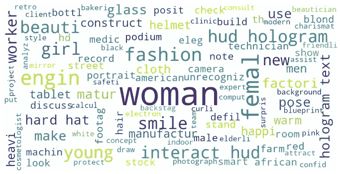
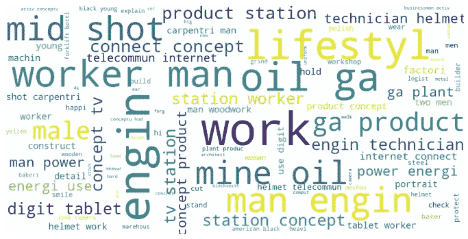
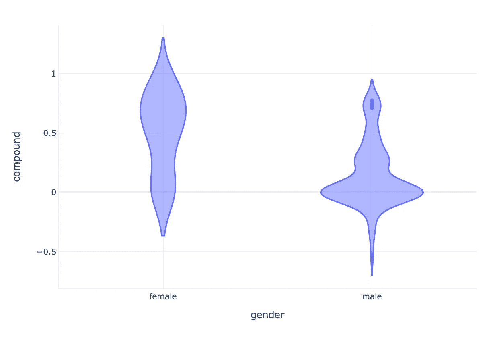
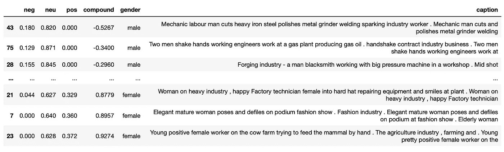

# 工业股票视频或股票视频如何促进性别刻板印象

> 原文：<https://medium.com/codex/industrial-stock-videos-or-how-stock-videos-boost-gender-stereotypes-21b75e0c12ea?source=collection_archive---------27----------------------->

## [法典](http://medium.com/codex)

你有没有尝试过为一个项目寻找工业背景下的免费库存视频？我做到了…我很震惊。大多数股票视频网站允许你搜索一组关键字，然后返回大量视频，通常它们非常适合你要搜索的内容。以我为例，我在搜索一个简单的词: ***行业*** 。我真正需要的是人们在机器前工作、进行维护、与物联网或未来工厂相关的视频。我主要发现的是男人和更多的男人。如果我发现一个女人的视频，她通常会友好地对一个男人微笑，向她解释一些事情。

我想:嗯，可能我反应过度了，只认出这些视频，因为它们让我很烦，但总的来说，这些视频分布得很好，也很公平。因此，我想:我们来做些统计吧！

# 网页抓取

这些视频股票网站的一个好处是大量的视频标签。对于每个视频，都有一个描述视频内容的标题。我将我的研究局限于一个单一的股票视频网站，即[www.dreamstime.com](http://www.dreamstime.com)，我在那里搜索带有标签 ***行业*** 的视频，我只过滤带有人物 的视频**。不得不承认，这些网站通常会试图阻碍自动抓取。幸运的是，python 的`urllib`包有一个简单的解决方法:**

```
page=urllib.request.Request(url, headers={‘User-Agent’: ‘Mozilla/5.0’})
```

添加一些`BeautifulSoup`，瞧，我们收到一个完整的视频描述列表，就像收到的第一个一样:

> 一边从无线耳机里列举音乐，拿着地图，一边在一个大型制造业里跳着滑稽的工程师。

嗯，这绝对是我们在工业环境中每天都能看到的东西。

# 数据清理

有了这些漂亮的视频描述，我用`NLTK`进行了一些数据清理，标准是:

*   标记化
*   删除停用词
*   堵塞物

我把字幕分成两组:

*   字幕包括任何*女人、女人、女孩、女性—* 女人**的**字幕
*   字幕包括任何*男人、男人、男孩、男性—* 男性**字幕**

# 统计数据

然后是一些文字云:



女性词汇云



公字云

这两者之间的区别再明显不过了。

对于女性标题，我们会发现类似于**时尚**(女性还应该从事什么行业？)，**年轻**(当然，她年轻！)、 **beauti** 和**微笑**(她怎么可能不是一个微笑的美女呢？)**。**好吧，还有 engin(在做词干之前，可能是 engineer，engineering，…)。我待会再谈这个。

对于男词云来说，重要的词有 **engin** ， **oil** ， **work** ， **min** ， **worker** ，…真实、肮脏、男人的工作。

好吧，很明显，这不仅仅是我从纯粹看视频开始时所期望的(或者说是希望的)初始偏见，而是有一些潜在的压力类型。

回到女工程师身上。她是

*…一位* ***魅力四射*** *成熟的女工程师…
…一位* ***魅力四射*** *成熟的女工程师…
…一位女工程师* ***笑容满面*** *…*

因此，即使她被宣布为工程师，她仍然需要一些额外的形容词，使她在该领域的一些特殊之处。

最后，为了让这一点更清楚，我使用了`NLTK`的情绪分析器 [*VADER*](https://www.nltk.org/_modules/nltk/sentiment/vader.html) *。*



VADER 获得的女性和男性字幕的情感复合的小提琴情节。

虽然有男演员的视频的字幕基本上是中性的，但有女演员的视频却非常偏向于正面的注释。



带有最消极(顶部)和最积极(底部)情绪的示例标题。

当女工程师开心地微笑着，或者是一个积极向上的奶牛农场女工时，男人们则在谈生意和握手。不，这不是性别平等。

# 总而言之…

全球各地的公司都在他们的工作中使用这种类型的视频，并以此——即使是无意识地——提升了快乐女人与动物和强壮商人的刻板印象。不仅如此:算法学习这种类型的数据。他们也学会了刻板印象。