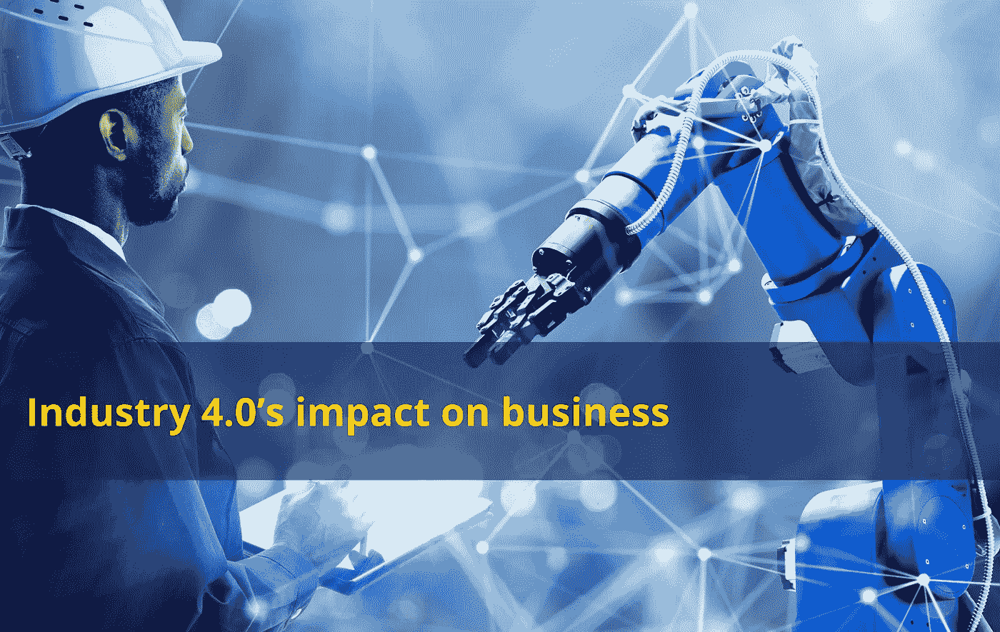

# 工业 4.0 对商业的影响

> 原文：<https://medium.com/codex/industry-4-0s-impact-on-business-70a0a95fdcae?source=collection_archive---------3----------------------->

图片由作者朱利亚诺·利古里提供

工业 4.0 又称第四次工业革命，是指将人工智能、物联网(IoT)、自动化等先进技术融入制造业等行业。这种整合预计将导致业务运营方式的重大变化和改进。