# 使用 REST APIs 提升您的 Power BI 大型数据集刷新

> 原文：<https://medium.com/codex/inflate-your-power-bi-large-dataset-refresh-using-rest-apis-c29906660ed7?source=collection_archive---------6----------------------->

微软最近宣布推出 Power BI Refresh Dataset REST APIs，以增强大型数据集刷新。对于那些正在努力使用传统方法(如表格对象模型、PowerShell 或表格模型脚本语言)刷新大型数据集的人来说，这是一大解脱。

现在，增强的 API 提供了更多有利于大型数据模型的定制选项和特性，如下图所示。

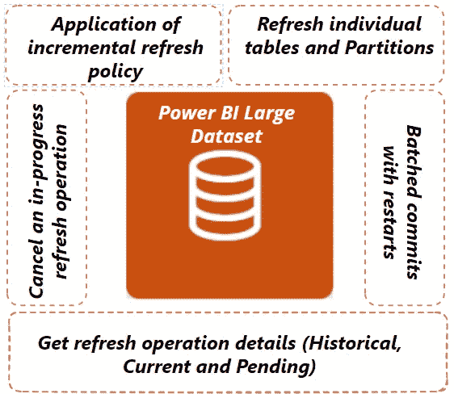

现在让我们逐一探讨这些选项

# **1。表和分区级刷新**

对于此示例，让我们创建一个逻辑应用程序来刷新 Power BI 数据集，并使用增强的 Power BI 刷新数据集 REST APIs

1.  在我们创建一个逻辑 cApp 之前，我们需要下面的，所以准备好下面的项目。

> → Power BI 数据集(大型数据集在测试该场景时会处于空闲状态)
> → Power BI 工作区 id 和数据集 id
> → SPN(在 Azure AD 中注册一个应用程序)具有 Power BI 数据集所需的权限

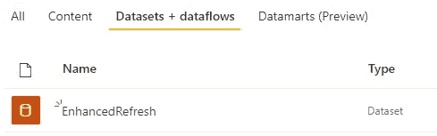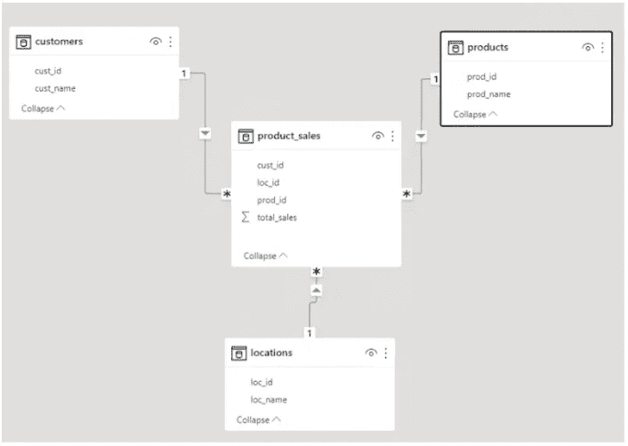

我已经用 4 个表创建了一个数据集，其中一个有 4 个分区

2.如果您在 Power BI 门户中打开您的数据集，您会看到与下面类似的 URL，因此在 groups/和 datasets/之后复制 id..它们是您的工作空间 id 和数据集 id

```
https://api.powerbi.com/v1.0/myorg/groups/{workspaceid}/datasets/{datasetId}/refreshes
```

3.若要获取 SPN 和其他详细信息，请连接到 Azure 门户→转到应用程序→获取客户端 Id、租户 Id 和客户端密码

4.现在我们已经准备好了创建逻辑应用程序的所有细节，并使用增强的 REST APIs 来刷新分区和表

5.打开 Azure 门户并搜索 LogicApp →输入所需的详细信息并单击创建

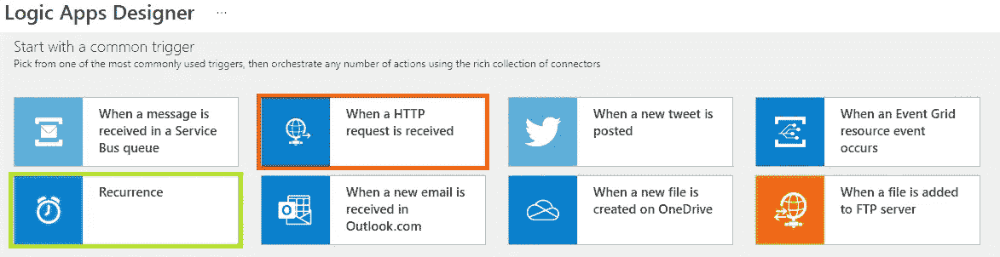

6.您可以选择“Recurrence”(定期刷新)或收到 HTTP 请求时(基于来自另一个应用程序的 HTTP 请求进行刷新)，在本例中，我使用了 Recurrence

7.添加 HTTP 任务并选择方法为“Post”

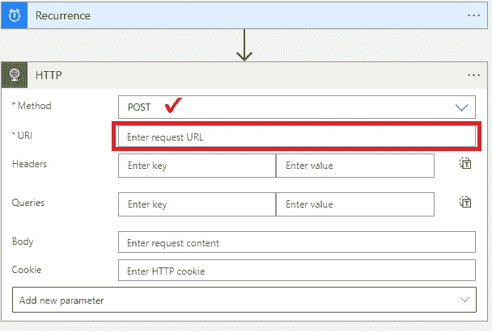

8.现在，从前面的步骤中获取工作空间 id 和数据集 id，并在下面的 URL 中分别替换它们

```
https://api.powerbi.com/v1.0/myorg/groups/{groupId}/datasets/{datasetId}/refreshes
```

9.该 URL 应该类似于下图所示

```
https://api.powerbi.com/v1.0/myorg/groups/f089354e-8366-4e18-aea3-4cb4a3a50b48/datasets/cfafbeb1-8037-4d0c-896e-a46fb27ff229/refreshes
```

10.将 URL 复制并粘贴到 URI 文本框中，然后将身份验证类型选择为 oAuth，并使用您在前面步骤中复制的值填写必填字段

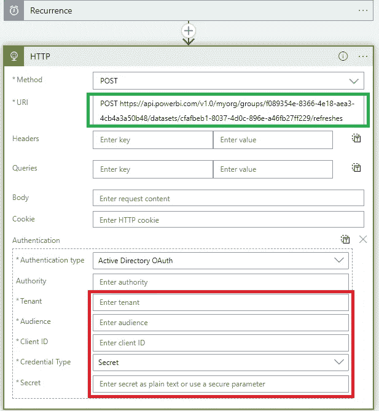

11.复制主体部分中的以下代码，并相应地替换数据库、表和分区的名称

```
{
  "commitMode": "transactional",
  "maxParallelism": 2,
  "objects": [
    {
      "database": "EnhancedRefresh",
      "table": "Products"
    },
    {
      "database": "EnhancedRefresh",
      "table": "Customers"
    },
    {
      "database": "EnhancedRefresh",
      "partition": "product_sales-1",
      "table": "product_sales"
    }
  ],
  "retryCount": 2,
  "type": "Full"
}
```

12.在本节中，我们仅刷新数据集中总共 4 个表中的 3 个表，对于 product_sales，我们仅刷新最新的分区(而不是整个表)

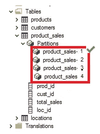

13.保存逻辑应用程序并触发它

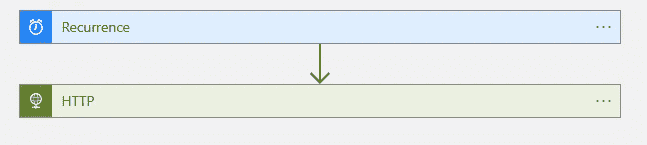

14.逻辑应用成功运行并刷新了所选的表和分区

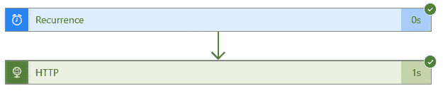

# 2.重启时批量提交

在上面的例子中，我们使用了“ ***事务性*** ”提交模式，这意味着，它将整个数据集的刷新作为单个事务来提交，如果由于某种原因刷新失败，我们必须再次刷新整个数据集。

1.  ***事务性*** 提交模式可能与每日完全刷新的大型数据集无关。
2.  ***PartialBatch*** 提交模式适用于每日完整刷新的大型数据集。
3.  因此，如果您想以部分批处理模式刷新数据集，请在脚本中进行修改

```
{
  "commitMode": "PartialBatch",
  "objects": [
    {
      "database": "EnhancedRefresh",
      "table": "Products"
    },
    {
      "database": "EnhancedRefresh",
      "table": "Customers"
    },
    {
      "database": "EnhancedRefresh",
      "table": "product_sales"
    }
  ],
  "retryCount": 2,
  "type": "Full"
}
```

# 3.获取刷新操作详细信息

在第 1 步中，我们创建了一个逻辑应用程序来触发 Power BI 数据集刷新，但它没有为我们提供任何有关刷新的状态，该任务只是启动数据集刷新并成功退出逻辑应用程序，但如果您想要获得有关数据集刷新的常规状态(失败、进行中、已完成)呢..等等)

1.  让我们回到逻辑应用程序，再添加一个任务来获取刷新的状态

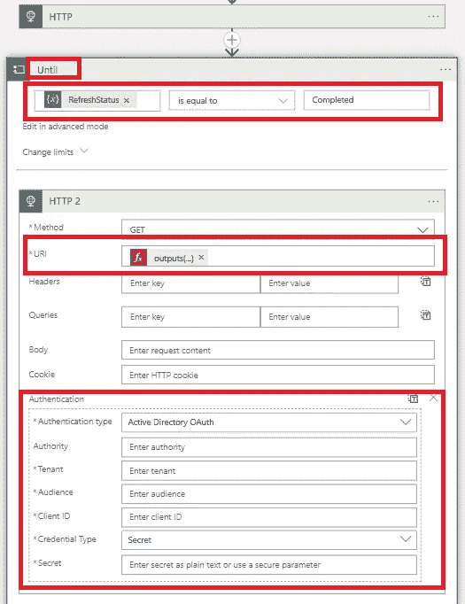

2.初始化一个变量以存储状态，然后循环检查定期(15、30 或 60 秒)的状态

3.循环将继续，直到在更改限制中设置的时间限制内满足条件

4.使用 GET 方法获取刷新的状态

5.在 URI 中，使用以下表达式从之前的 HTTP 任务中获取位置 id

```
@{outputs('HTTP')['headers']['location']}
```

6.添加身份验证方法和其他细节，与 HTTP 任务相同

7.添加一个设置变量操作，并将值设置为

```
@{body('HTTP')['status']}
```

8.最后，添加一个电子邮件任务，向您的团队通知数据集刷新的状态

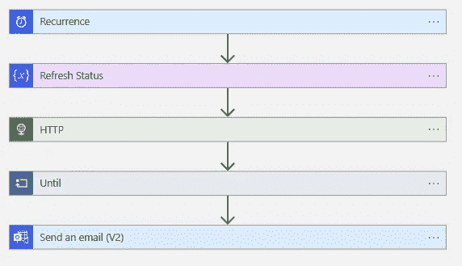

# 4.取消正在进行的刷新操作

在某些情况下，我们可能需要取消刷新。使用 DELETE 方法取消正在进行的刷新操作。

1.  在我们的示例中，如果刷新没有在给定的时间限制内完成，那么操作将从 until 循环中退出
2.  但在后端，刷新仍在运行，在这种情况下，如果您想取消刷新，请再添加一个任务

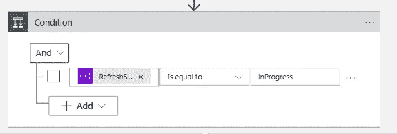

3.添加一个条件来检查刷新状态，如果正在进行(TRUE ),则添加一个 HTTP 任务，否则(FALSE)添加一个电子邮件任务

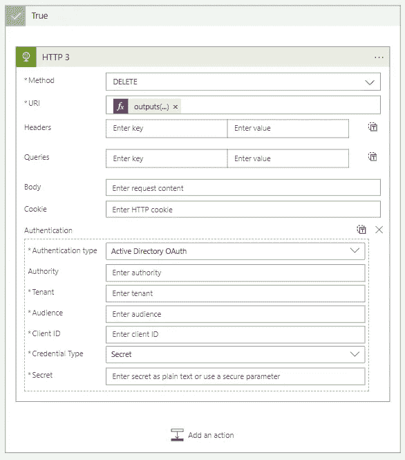

4.使用 DELETE 方法取消刷新

5.在 URI 中，使用以下表达式从之前的 HTTP 任务中获取位置 id

```
@{outputs('HTTP')['headers']['location']}
```

6.添加身份验证方法和其他细节，与 HTTP 任务相同

7.如前一步所述，将发送电子邮件任务移动到 FALSE

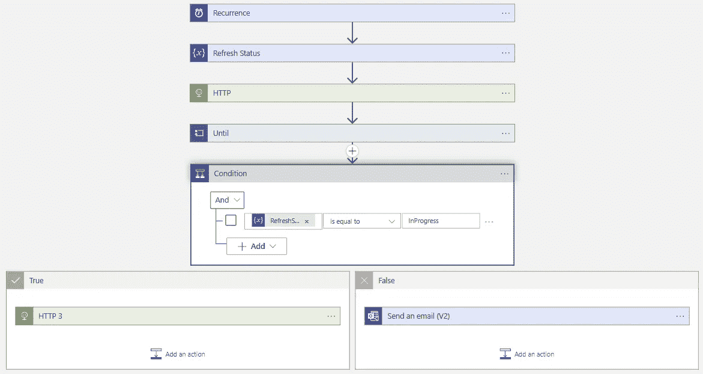

8.最终的逻辑应用程序看起来像上面所有的步骤，你可以根据你的需要添加更多的动作

# 5.应用增量刷新策略

对于增量刷新，我们要做的第一件事是对表应用刷新策略

1.  您可以在表格编辑器中设置表格的刷新策略，[单击此处](https://docs.tabulareditor.com/te2/incremental-refresh.html#setting-up-incremental-refresh-from-scratch-with-tabular-editor)了解更多详细信息。
2.  设置策略后，您可以使用下面的脚本来刷新数据集

```
 {
    "commitMode": "transactional",
    "applyRefreshPolicy": true,
    "effectiveDate": "01/01/2020",
  "objects": [
    {
      "database": "EnhancedRefresh",
      "table": "Products"
    },
    {
      "database": "EnhancedRefresh",
      "table": "Customers"
    },
    {
      "database": "EnhancedRefresh",
      "table": "product_sales"
    }
  ],
  "retryCount": 2,
  "type": "Full"
}
```

3.这个主题需要有自己的页面，所以我将在另一篇文章中逐步介绍这个过程。

> **注意:**
> →增强刷新仅适用于 Power BI Premium、Premium per user 和 Power BI Embedded 中的数据集。
> →根据专业版和高级版数据集基于 API 的刷新的一般限制，刷新次数有限。

我希望你喜欢读这篇文章，在我的下一篇文章中再见，然后享受国际足联和美国国家橄榄球联盟的比赛😄😄😄😄

