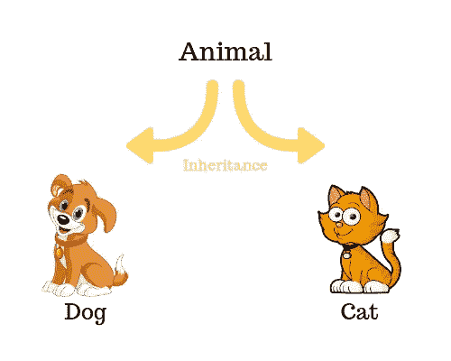

# 继承以及如何在自动化框架中实现它。

> 原文：<https://medium.com/codex/inheritance-and-how-to-implement-it-in-automation-framework-41d1b7c9a200?source=collection_archive---------4----------------------->

# **Java 中的继承:简介**

面向对象编程的核心原则之一——**继承——使我们能够重用现有代码或扩展现有类型。**简单来说，在 Java 中，一个类可以继承另一个类和多个接口，而一个接口可以继承其他接口。当从现有类继承时，可以重用父类的方法和字段。此外，您还可以向当前类添加新的方法和字段。



继承代表了**是一种**关系还是一种**父子**关系。考虑父类动物和子类狗。

```
public class Animal {
    public void move(){
        System.*out*.println("Animals can move");
    }

    public void sleep(){
        System.*out*.println("Animals can sleep");
    }
}
```

狗类是动物的一个子类。

```
public class Dog extends Animal {
@Override    
public void move() {
        System.*out*.println("Dogs can move");
    }

    public void bark() {
        System.*out*.println("Dogs can bark");
    }
}
```

除了私有成员之外，Dog 类可以访问 Animal 的所有方法。您可以使用 Dog 类的对象来访问 Animal 类的方法。更多详情，请参考本[文件](https://docs.oracle.com/javase/tutorial/java/IandI/index.html)。

# 在测试自动化框架中实现继承

为了构建一个健壮的测试自动化框架，使用 OOPs 概念是必须的，继承是 OOPs 的核心原则之一。让我们看看为什么，在哪里以及如何在测试自动化框架中使用继承。

## **基类**

每个测试类都扩展到基类。在基类中，我们初始化 Webdriver，一些变量和属性文件。我们甚至有 TestNg beforeTest，afterTest，beforeMethod 和 afterMethod。下面给出了基类的一个示例:

```
package Android;

import org.testng.annotations.AfterMethod;
import org.testng.annotations.AfterTest;
import org.testng.annotations.BeforeMethod;
import org.testng.annotations.BeforeTest;

import java.util.HashMap;
import java.util.Map;

public class Base {

    public static String *userPhone* = "1234567890";
    public static String *userEmail* = "xx.xxxxx@xxxx.com";
    String configFilepath = System.*getProperty*("user.dir") + "/path/to/configuration/file";

    /* setting some default params */
    public static Map<String, Object> setDefaultParams() {
        Map<String, Object> defaultParams = new HashMap<>();
        defaultParams.put("key", "value");
        defaultParams.put("key", "value");
        defaultParams.put("key", "value");
        return defaultParams;
    }

    @BeforeTest
    public void initialiseDriver() {
        //Code to initialise driver
    }

    @BeforeTest
    public void signUp() {
        //Code to signup
    }

    @BeforeMethod
    public void startScreeRescording() {
        //code to record screen

    }

    @AfterMethod
    public void stopScreenRecording() {
        //code to stop recording
    }

    @AfterTest
    public void tearDown() {
        //code to close all the resources drivers,properties file, etc
    }
}
```

每个测试类都扩展到基类，这样每个测试类都可以访问非私有变量，比如用户电子邮件和用户电话号码。一些测试需要默认参数，这些常见的默认参数我们在方法 setDefaultParams()中设置。通过这样做，我们不需要在测试类中一次又一次地设置变量和默认参数。此外，每当我们运行测试时，我们需要注册并开始记录屏幕，这些是作为 TestNg BeforeTest 和 AfterTest 方法提供的，在运行测试类中的测试方法时，TestNg 将在父类中查找 BeforeTest、BeforeMethod，从而确保注册发生在每个测试之前，屏幕记录在每个测试方法之前开始。我们确保在 AfterMethod 和 AfterTest 中停止屏幕录制、退出驱动程序并关闭其他资源。

## **管理网络驱动**

在一个框架中管理多个移动应用程序和不同类型的驱动程序是一项具有挑战性的任务。在一个框架中，一个驱动可以用不同的方式初始化，为了达到这个目的，我们可以使用一个接口。**接口指定了一个类必须做什么，而不是如何做。这是班级的蓝图。**

让我们看看驱动程序接口是什么样子的:

```
public interface IDriver<T> {

  T getDriver(String browserName);

  T getDriver(BaseConfig baseConfig);

  T getDriver(String appName, BaseConfig baseConfig);
}
```

在驱动程序类中实现上述接口

```
public class CreateAndroidDriver implements IDriver<AndroidDriver>{@Override
public AndroidDriver getDriver(String browserName) {
  //provide implementation if using a browser(chrome,firefox etc.)
}@Override
public AppiumDriver getDriver(BaseConfig baseConfig){
//provide implementation using a BaseConfig
}@Override
public AppiumDriver getDriver(String appName, BaseConfig baseConfig){
// provide implementation if there are multiple apps and baseConfig
}}
```

有了继承，我们将能够覆盖 IDriver <t>接口的方法，这样就可以在派生类中设计接口方法的有意义的实现。我们可以为其他驱动程序，如 IOSDriver，WebDriver 等类似的实现。</t>

## 管理设备

在运行自动化测试时，我们可能需要使用多个 android 或 iPhone 设备。通过继承，我们将能够轻松地管理这些设备。下面的界面显示了我们可以用设备做什么。

```
public interface IDevice {
  Device getDevice(String deviceUdid);

  List<Device> getDevices();
}
```

实现上面的接口:

```
public class AndroidDeviceManager implements IDevice{@Override
public List<Device> getDevices() {
//Code showing how to get list of all android devices
}@Override
public Device getDevice(String deviceUdid){
//Code to get a connected android device by Uuid
}
```

这里 androidDeviceManger 类将提供一个接口方法的实现，定义我们如何通过 UUID 获得一个 android 设备或者我们如何获得所有的 Android 设备。

类似地，我们可以在 iPhone 的情况下使用一个 IOSDeviceManager 类，它自己实现了如何通过 UUID 获得一个 iPhone 设备或者如何获得所有连接的 iPhone

## 查询数据库

在自动化测试中，我们通常会做两种类型的查询，即选择查询和更新查询，而数据库服务器可以是 MySQL、Microsoft SQL Server、Oracle、Postgres、Mongo 等。我们可以有一个接口，该接口具有我们可以执行的查询类型，并且数据库类具有接口方法的实现。我们可以有如下界面

```
public interface IDBManager{List<LinkedHashMap<String, String>> doSelect(
    String dbHost,
    int port,
    String dbName,
    boolean isSslEnabled,
    String userName,
    String password,
    String query)
    throws SQLException;int executeUpdate(
    String dbHost,
    int port,
    String dbName,
    boolean isSslEnabled,
    String userName,
    String password,
    String query)
    throws SQLException;}
```

我们可以拥有 DBManger 类，它将告诉我们如何连接数据库服务器并执行查询。例如:

```
public class DBManager implements IDBManager{List<LinkedHashMap<String, String>> doSelect(
    String dbHost,
    int port,
    String dbName,
    boolean isSslEnabled,
    String userName,
    String password,
    String query)
    throws SQLException{
//Code for making connection to mysql server and executing query
}int executeUpdate(
    String dbHost,
    int port,
    String dbName,
    boolean isSslEnabled,
    String userName,
    String password,
    String query)
    throws SQLException{//Code for making connection to mysql server and executing query
}}
```

以上是我使用继承的一些方法。有 n 种方法可以使用继承。如果你以其他方式使用继承，请注释。