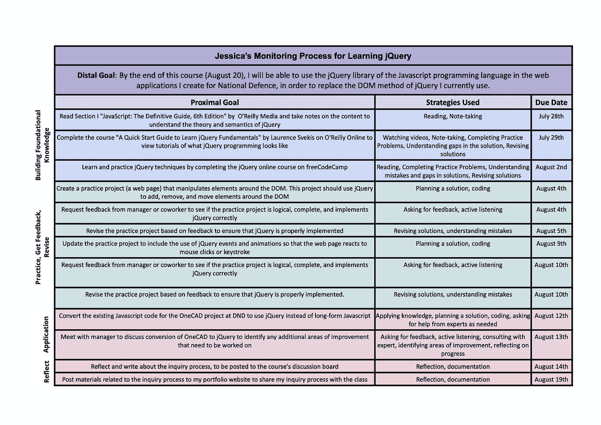

# jQuery 查询项目的初始监控过程

> 原文：<https://medium.com/codex/initial-monitoring-process-for-jquery-inquiry-project-f90c712a1a12?source=collection_archive---------24----------------------->

我刚刚于 2021 年 7 月在女王大学开始了我的专业教育硕士课程，并决定发布我在硕士旅程中学到的东西。我相信，作为一名软件开发人员，在一个以教育工作者为主的项目中，我有一个非常独特的视角(有一天，我会分享我为什么选择这个项目！).首先，我想分享一下我目前正在上的一门课:PME 800(自我调节探究和学习)。我参加这个项目时认为我将学习如何教育他人，所以这个课程非常强调我自己的 SRL 之旅以及如何实现学习目标，这令人耳目一新。

课程的主要部分是通过许多近期目标来设定和实现一个远期目标。几个月前，我刚刚在国防部门开始了一份新工作，我认为这将是加强我学习过程的绝佳机会。我选择以一个特定的编程库(jQuery)为目标来学习和实现我的工作。这是我在项目开始时设定的长远目标:

> 在本课程结束时(8 月 20 日)，我将能够在我为国防创建的 web 应用程序中使用 Javascript 编程语言的 jQuery 库，以取代我目前使用的 jQuery 的 DOM 方法。

我确保我的远端目标是一个 SMART 目标(ProjectSmartNews，2012 ),因为:

我选择了一种编程语言的特定元素(库)作为目标，这将有利于我的工作，同时也指出了它将被用来代替什么。

**可衡量的** —我目前在工作中使用不同的 Javascript 方法(DOM 对象)来创建 web 应用程序，因此我可以通过用 jQuery 替换该方法来创建相同的应用程序的能力来衡量这个目标。虽然 DOM 对象是 Javascript 的一个很好的起点，但是它比 jQuery 对象要长得多。

**同意** — jQuery 是我工作场所的首选 Javascript 库。我的经理要求我学习这个库，以便更有效地创建应用程序。他最初让我学习 DOM，现在我已经掌握了很好的工作知识，他认为我最好转向更有效的 jQuery 方法。

**现实** —我知道在本课程结束时学习整个编程语言是不现实的，所以选择一个特定的库更现实，因为它只是对我现有知识的补充，以改进我的编程风格。

**基于时间的** —我打算在课程结束时(8 月 20 日)实现这个目标，这也是我的同事希望我在工作中开始使用 jQuery 的时间。

正如 Eduardo Briceñ所说，如果我在学习区(TED，2016)度过一段时间，我未来的表现和成长将会受益，我将在学习新技能时进入学习区。虽然我可以用我目前的技能凑合，但我会留在绩效区。我很幸运处在一个低风险的环境中，因为我的团队希望我花时间来建立我的技能组合，所以只有利用这个机会并进入学习区才有意义，这样我才能成为一名更好的软件开发人员。

我真的对软件开发充满热情，特别是对前端开发(网页设计)的学习更加兴奋，这是我在学校里没有接触到的。我一直是一个非常有创造力的人，所以学习 jQuery 和 Javascript 让我能够挖掘这一方面。这个目标不仅对我的职业有帮助，对我个人也有帮助。这个目标将帮助我成为一名更好的开发人员，拥有更广泛的技能，同时也探索我个人项目的创造性方面。

我在目标设定阶段创建的初始监控流程文档

为了建立一个项目计划，我必须创建几个近目标，这样我才能实现我的远目标。为此，我创建了一个监控过程文档，其中包括我的近期目标、我将使用的策略和预期完成日期。我引用了一篇题为“探索自我调节策略在编程中关于学习风格的使用”的论文，以在创建我的目标时考虑计算机编程的有效 SRL 策略(Çakiroğlu 等人，2018)。我还试图尽可能多地基于以前的经验，了解学习一门新的编程语言通常需要多长时间，尽管在我看来，如果我需要调整这个过程，我也没问题。

请继续关注未来的帖子，通过我的查询项目来查看我的进展！

## 引用的作品

Çakiroğlu Ünal，呃 Betül，Uğur 努塞尔和 Aydoğdu 埃斯拉。(2018).探索自我调节策略在与学习风格相关的编程中的应用。*国际学校计算机科学教育杂志*， *2* (2)，14–28。【https://doi.org/10.21585/ijcses.v2i2.29 

ProjectSmartNews。(2012).如何写一个聪明的目标？YouTube。[https://www.youtube.com/watch?v=0Mi9_XEXQqc](https://www.youtube.com/watch?v=0Mi9_XEXQqc)。

泰德。(2016).如何在你关心的事情上做得更好？[爱德华多·布里塞尼奥:如何在你关心的事情上做得更好](https://www.ted.com/talks/eduardo_briceno_how_to_get_better_at_the_things_you_care_about)。