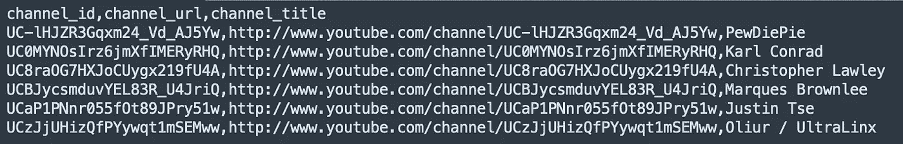
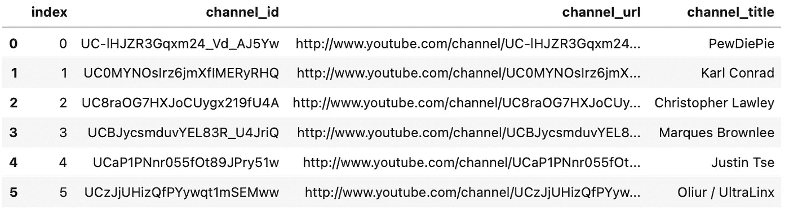
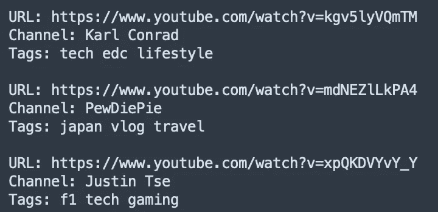
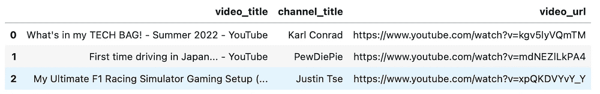

# 使用 Python 和 SQLite 插入数据库

> 原文：<https://medium.com/codex/inserting-into-database-using-python-and-sqlite-15ec2691dd7a?source=collection_archive---------10----------------------->

## 填充数据库的简单方法

在上一篇文章中，我展示了如何使用 SQLite 创建一个简单的数据库，以及我们如何通过 Pandas 在其上执行各种 SELECT 命令，并以数据帧的形式查看它们。如果您还没有阅读，请查看下面的链接:

[](https://lifang-lee.medium.com/creating-a-simple-database-using-python-and-sqlite-349d126253da) [## 使用 Python 和 SQLite 创建简单的数据库

### 还有如何用熊猫来看它们，它更漂亮

lifang-lee.medium.com](https://lifang-lee.medium.com/creating-a-simple-database-using-python-and-sqlite-349d126253da) 

在这里，我想继续这篇文章，看看我是否不仅可以从我的数据库中选择和提取数据，还可以向其中插入数据。这将节省我很多时间，而不是创造新的。sql 脚本或通过终端手动添加行。此外，我不希望每次向数据库中输入新内容时都要编写完整的 SQL 命令。

总的来说，我会试着分享我在这里学到的东西:

*   通过 Python 在数据库中创建新表并填充数据
*   向数据库中插入行

好了，我们开始吧。

**第一步:创建数据库**

让我们简单介绍一下数据库的创建过程。我将为此再次创建一个 YouTube 视频链接数据库。

我有一个 CSV 文件，包含我订阅的 YouTube 视频频道列表，直接取自[谷歌外卖](https://takeout.google.com)。在我的文本编辑器中打开它，它看起来如下:



因为我们将主要通过 Python 来填充数据库，所以我将只创建我需要开始的基本内容(即存储我的视频的表)。我们可以创建一个包含以下内容的. sql 脚本(我称之为“videoDB.sql”):

```
CREATE TABLE videos (
 video_id INTEGER PRIMARY KEY AUTOINCREMENT, video_title varchar(255), 
 video_url varchar(255), channel_id varchar(255), tag_1 varchar(255), tag_2 varchar(255), 
 tag_3 varchar(255)
 );
```

这里需要指出的是:

*   我使用 video_id 作为每行视频的唯一 id，这就是为什么我把它定义为主键，因为它们都是 1，2，3…我将它们指定为一个整数。此外，我不想在每次向表中添加新行时都定义新的 ID，所以我让它们使用 AUTOINCREMENT 为每一行自动生成一个新的 ID
*   如果你看到上面我的订阅 CSV 文件的截图，我将使用 YouTube 给每个频道的实际 ID，因此这里我只使用 *varchar(255)* 来适应它的长度
*   我现在有 3 个标签来定义每一行
*   我知道对几乎每一列都使用 *varchar(255)* 是我非常懒惰的表现(没有人真的需要 255 个字符作为视频标签)。

现在我们要做的就是在终端上运行它，并创建我们的数据库:

```
sqlite3 videoDB.db < videoDB.sql
```

给你。

**第二步:将我们的订阅列表作为表格插入我们的数据库**

让我们从导入这里需要的库开始。我会边走边解释我们使用它们的目的:

```
import pandas as pd
import sqlite3 as sql 
from bs4 import BeautifulSoup as bs
from urllib.request import urlopen, Request
```

这是我们学习将整个新表插入数据库的部分。请记住，我们现在只有一个空的视频，但我们没有一个频道表。我们只需将 CSV 文件的全部内容作为一个表插入到我们的数据库中(我将作为一个函数来完成):

```
def InputCreators():
    conn = sql.connect("videoDB.db")
    df = pd.read_csv("subscriptions.csv")
    df.to_sql('channels',conn,if_exists='append')
    conn.commit()
    conn.close()InputCreators()
```

解释:

*   我们使用 sqlite3.connect()创建一个到 videoDB 的连接
*   我们使用 pandas 将 CSV 文件作为数据帧读取，然后使用 to_sql 将它直接转换成数据库中的一个表
*   参数:将表名指定为“channels ”,引用我们的连接，如果表已经存在(实际上并不存在),我们直接追加到它后面
*   提交我们的条目并关闭到数据库的连接

我们可以通过运行以下命令来检查新表的外观:

```
conn = sql.connect("videoDB.db")
myChannels = pd.read_sql('SELECT * FROM channels;', conn)
myChannels
```



**第三步:通过 URL 将视频插入数据库**

像以前一样，我们建立了到数据库的连接，但这次我们还创建了一个游标来执行我们的 SQL 命令:

```
conn = sql.connect("videoDB.db")
c = conn.cursor()
```

我们将要求三个输入:1) URL，2)频道名称(是的，在这种情况下我们手动输入)，3)标签(其中 3 个在我们的视频表中，用空格分隔):

```
url_input = str(input("URL: "))
channel_input = input("Channel: ")
tags_input = input("Tags: ")
```

使用我们在开始时导入的 urllib 和 BeautifulSoup，以及我们插入的视频 URL，我们将提取视频标题:

```
url_opener = urlopen(Request(url_input, headers={'User-Agent': 'Mozilla'}))video_title = bs(url_opener, features="html.parser").title.get_text()
```

现在，请记住，我们手动输入了频道标题，由于我们的视频表接受的是 channel_id 而不是名称，因此我们将在 channels 表中找到与我们刚刚输入的名称相对应的 channel_id:

```
channel_id = c.execute("SELECT channel_id FROM channels WHERE channel_title = ?;", (channel_input,)).fetchall()channel_id = [x[0] for x in channel_id]
```

对于我们刚刚插入的由空格分隔的 3 个标签，现在我们想将它们分隔成一个由三个单词组成的列表，简单地做如下:

```
tags = tags_input.split(" ")
```

现在，我们将所有 5 个条目放入视频表的行中(不包括自动递增的 video_id)，即:

*   视频标题
*   视频 URL
*   3 个标签

我们将它们全部合并到一个列表中，然后我们将使用光标在我们的视频表中执行一个插入命令:

```
final_input = [video_title] + [url_input] + channel_id + tagsc.execute('INSERT INTO videos (video_title, video_url, channel_id, tag_1, tag_2, tag_3) VALUES (?,?,?,?,?,?);', final_input);

conn.commit()
conn.close()
```

整个代码(作为一个函数)如下所示:

```
def inputData():
    conn = sql.connect("videoDB.db")
    c = conn.cursor()
    url_input = str(input("URL: "))
    channel_input = input("Channel: ")
    tags_input = input("Tags: ")# Get title of the URL pageurl_opener = urlopen(Request(url_input, headers={'User-Agent': 'Mozilla'}))video_title = bs(url_opener, features="html.parser").title.get_text()# Find out the Channel ID related to the name in inputchannel_id = c.execute("SELECT channel_id FROM channels WHERE channel_title = ?;", (channel_input,)).fetchall()
    channel_id = [x[0] for x in channel_id]# Separate tags as listtags = tags_input.split(" ")# Combine everything into a list for inputfinal_input = [video_title] + [url_input] + channel_id + tags
    # print(final_input)
    c.execute('INSERT INTO videos (video_title, video_url, channel_id, tag_1, tag_2, tag_3) VALUES (?,?,?,?,?,?);', final_input);
    conn.commit()
    conn.close()inputData()
```

现在我们可以开始运行这个功能并插入我们的视频，我将尝试其中的 3 个:



然后，使用 pandas 快速检查给我们提供了:

```
myVideos = pd.read_sql('SELECT * FROM videos;', conn)
myVideos
```


当然我不想每次都看到所有这些，我只对视频标题、频道名称和 URL 感兴趣，这些我可以用 good old JOIN 来完成:

```
myVideos = pd.read_sql('SELECT videos.video_title, channels.channel_title, videos.video_url FROM videos INNER JOIN channels ON videos.channel_id = channels.channel_id;', conn)
myVideos
```



**旁注:处理错误 403**

具体到 urlopen，你可以看到我在参数中放入了一些头和其他东西:

```
url_opener = urlopen(Request(url_input, headers={'User-Agent': 'Mozilla'}))
```

实际上，你不需要在 YouTube 视频中使用它，但是我在一些 Hackernoon 文章中尝试了一下，得到了这个错误:

```
urllib.error.HTTPError: HTTP Error 403: Forbidden
```

因此，在谷歌上快速搜索后，我添加了这些参数，它起作用了。

**闭幕词**

肯定远非完美，我讨厌我每次都必须手动输入频道名称，而不是直接从 URL 本身提取它(这是我的下一个任务)，但您在这件事上的建设性反馈和帮助总是受到高度赞赏。

总的来说，我很喜欢学习这些，并努力将它们与我在上一篇文章中学到的东西结合起来，创建一个完整的数据库，我可以非常有效地输入和搜索。我希望这篇文章对你也有帮助！