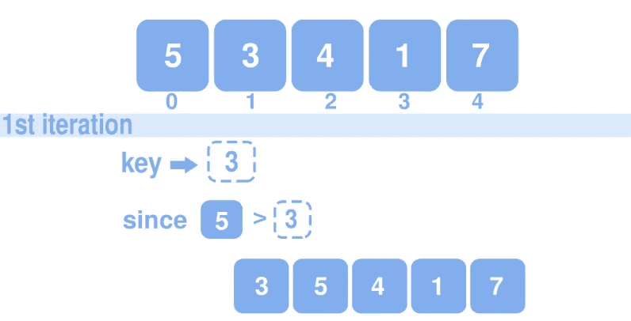

# 插入排序——工作原理、伪代码和 C++ & Python 实现

> 原文：<https://medium.com/codex/insertion-sort-how-it-works-psuedocode-and-c-python-implementation-d32b5f22f096?source=collection_archive---------7----------------------->

在本文中，我们将通过研究伪代码和它的实际实现来研究插入排序是如何工作的。

埃利亚娜·洛佩兹的插入排序插图

插入排序是解决排序问题的众多算法之一。

# 排序问题: