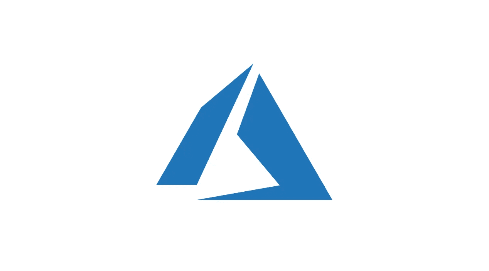
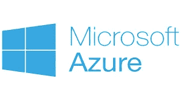
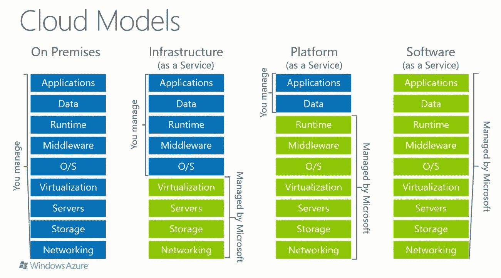
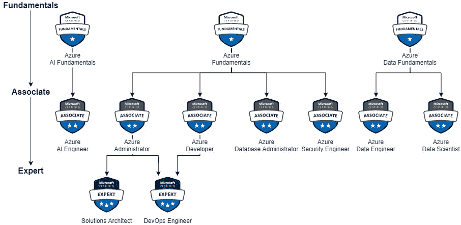

# 在云中

> 原文：<https://medium.com/codex/inside-the-cloud-9e5fe94b11da?source=collection_archive---------5----------------------->

什么是 Azure？

作为一名软件工程师，我对云计算的着迷驱使我去理解，也许有一天我会在这个不断发展的领域追求职业生涯。如果这也引起了你的兴趣，继续读下去。

尝试键入“什么是 Microsoft Azure？”任何搜索引擎。结果将显示它是微软的云计算平台，Azure 为全球企业提供各种服务。

这听起来很有趣，但是这到底意味着什么呢？

幸运的是，我能够与微软自己的 Varsha Sujanani 交谈。Varsha 是一名 Azure 技术培训师，通过展示她广博的知识，她能够给我一些关于 Azure 世界真实情况的见解。当我们探索这一令人印象深刻的操作时，我从 Varsha 那里学到的东西将包括在本阅读材料中。

**————>预警<———**

由于当今世界必须处理大量数据，对云服务及其提供的选项的需求不断增长。微软于 2010 年推出 Azure，作为谷歌应用引擎和亚马逊 Ec2 的替代云平台。根据瓦尔沙的说法，塞特亚·纳德拉(微软现任首席执行官)给公司带来了很多积极的变化。

微软首席执行官塞特亚·纳德拉

Satya 开创了 Azure 公共云业务，这促使该公司股票近年来攀升了 700%。萨提亚的举措还导致微软收购了 Nuance、LinkedIn 和 GitHub。

好吧，让我们来谈谈蓝色。像其他云服务一样，Azure 是一个云计算平台，包括 PaaS、IaaS 和 SaaS 等云模型。这意味着微软提供或出租对云计算技术的在线访问，包括虚拟机、数据库、SaaS 应用等。如果个别公司决定在站点上托管这些技术或资源，这将被称为“私有云”虽然托管私有云的公司将完全负责维护其云的整个结构，而不是由提供商在其他地方进行维护，但这也有其好处。根据 Varsha 的说法，如果该公司“拥有特定的数据治理或安全政策，他们就能够在其私有网络中利用云计算的力量来扩展和创新应用程序。”如果你更喜欢眼不见，心不烦的方法，这就是 IaaS、PaaS 和 SaaS 的用武之地。公司可以选择这些选项中的任何一个来优化他们的运营。请看下图，了解每个服务类别提供的内容:

如您所见，提供商可以提供一系列服务。以 SaaS 为例，想想 Outlook 或 Dropbox 等服务。在 IaaS 和 PaaS 的情况下，有一些事情企业仍然要负责。这就是为什么人们可能会为微软以外的雇主找到“微软 Azure”工作。这个操作需要从软件工程师到数据科学家的许多领域的员工的专业知识。

如果有人想开始云计算职业生涯，微软提供了无数的认证。最好的开始方式是完成 AZ-900-Azure 基础证书的要求，因为它是许多其他认证的先决条件。根据微软- " *Azure 基础认证是证明云概念、Azure 服务、Azure 工作负载、Azure 中的安全性和隐私以及 Azure 定价和支持的知识的机会。*

如果您对应用程序开发/维护、数据存储、计算和网络等概念有所了解，您将有机会成为全栈云开发人员、云工程师、解决方案架构师和管理员等。

我已经查过了，所以你不必:

云工程师职位平均每小时支付 57 美元。

Azure 岗位的全栈云开发人员每年可以支付 10-15 万美元。

Azure 虚拟化工程师职位的年薪在 11 万到 16 万美元之间。

更多信息:

 [## 微软认证:Azure 基础知识-学习

### 重要提示:该认证的英文版将于 2022 年 1 月 25 日更新。请下载…

docs.microsoft.com](https://docs.microsoft.com/en-us/learn/certifications/azure-fundamentals/) 

## 特别感谢 [Varsha Sujanani](https://www.linkedin.com/in/vasuja/) 让我了解了云计算的历史和服务！

*   作者:马修·S·乌姆拉辛格

*我不是微软的付费发言人…只是说说而已。*