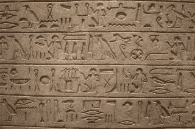
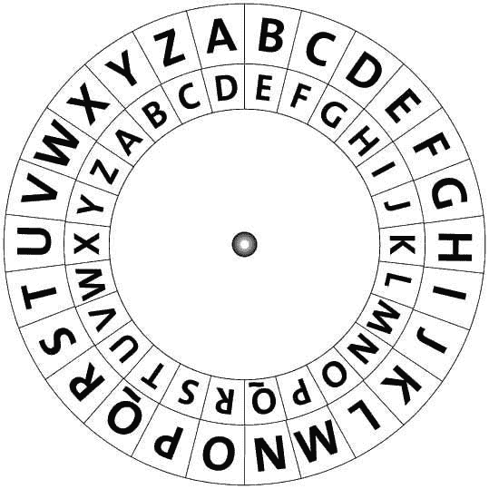
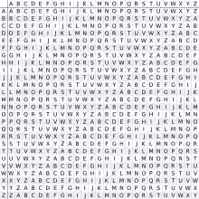
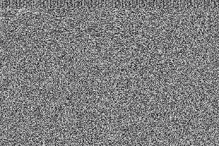
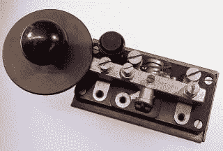
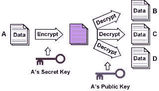
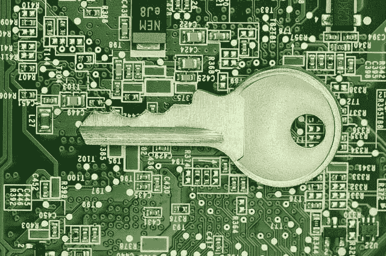

# 对密码学的洞察

> 原文：<https://medium.com/codex/insight-into-cryptography-e6672476be0f?source=collection_archive---------22----------------------->

# 在这篇文章中，

*   这是什么？
*   密码学的起源
*   我们为什么需要它？
*   密码和代码
*   凯撒移位密码
*   调换
*   维根涅尔
*   英格玛密码
*   密写
*   莫尔斯电码
*   公钥密码
*   为什么是密码学？

# 这是什么？

简单地说，DuckDuckGo 社区将密码学定义为“秘密写作的艺术”。一个更技术性的定义可以是“在被称为对手的第三方面前对安全通信技术的实践和研究”，就像维基百科上那样。密码学这个词来源于希腊语，κρυπτός (Kryptos)，意思是隐藏，γράφειν (graphia)，意思是书写。

> "承认用密码学，再多的暴力也不能解决一个数学问题."朱利安·阿桑奇

还记得你的老师让你和你最好的朋友坐在教室的另一边，因为你连一分钟都不能保持安静吗？然后你会开始通过短信来交流，因为你无法保持对肚子里可爱女孩或男孩的迷恋？你会以一种好奇的人无法理解你在上面写了什么的方式来写它。如果你写的是一种独特的语言(而不是你手写的“丑陋、不可理解”的版本)，你使用的秘密代码将是一种代码或密码。虽然那个时候，赌注没有那么高(是啊，除了尴尬)，但现在是。虽然世界已经转移到互联网时代，世界的信息也是如此。这不仅仅是为了保护正在发送的消息，也是为了保护已经存储在云中的数据。

> "人们必须承认，有了密码学，再多的暴力也无法解决数学问题."
> -雅各布·阿佩尔鲍姆(Tor 项目前核心成员)

密码学就是构建这样一种协议，帮助信息发送者保持他的信息不被不希望的人看到。根据维基百科的说法，它可以被定义为“将信息从可读状态转换为明显的无意义状态。”正如 exploratorium.edu 的[所描述的，为了有用，接收端和发送端都应该知道一些关于密码的事情。](http://exploratorium.edu/)

*   用于加密原始消息(也称为明文)的算法或方法。
*   与算法一起使用的密钥，允许对明文进行加密和解密。
*   密钥的有效期。

想想这个。你和你的小偷朋友设法偷了某个富有商人的钥匙。现在，你的目标可以想象为:

*   算法:你，定位商人的家，在最佳时机到达他的前门。
*   钥匙:你设法偷的钥匙是密码钥匙。
*   时间:过不了多久，商人就会发现他的钥匙不见了。这是您的密钥的有效期。

# 密码学的起源

大约在 19 世纪，在埃德加·爱伦·坡的小说《黄金虫》中,“密码学”一词出现了。当人们组织成部落、团体和王国的时候，密码学就出现了。关于战争、霸权和政治的观点。密码学的第一个已知证据可以追溯到大约 4000 年前的埃及文明。国王们在抄写员的帮助下用“象形文字”互相交流。这些文士是唯一知道如何读和写这些文字的人，国王们通过他们交换信息。

随着时间的推移，类似的代码出现了，比他们的前辈先进一点。最后，如今出现了难以破解的代码和密码，普通人几乎不可能用暴力破解它们。即使在大型超级计算机的帮助下，用暴力破解编码和加密的信息也是令人厌倦的。

# 密码和代码

密码和代码的区别很简单。密码逐个字母地改变消息，而代码将整个明文(消息)转换成其他单词或数字。

*   代码:代码是从一些有意义的信息到其他东西的映射，通常是一组没有任何意义的符号或字符。该代码还需要一个列出所有映射的码本。除非使用密码本进行解码，否则代码通常没有任何意义，密码本就像是信息中每个书写符号的钥匙。
*   密码:密码是一对创建加密和反向解密的算法。要解密密码，你需要密钥和解密算法。密钥是一个秘密的密码短语，用于运行算法来解密密码。没有密钥，算法就没用了。这就像你在不知道密码的情况下打开某人的行李箱。你最终会尝试所有可能的组合。

# 密码和代码的例子有哪些？

# 凯撒移位密码

公元前 753 年，世界见证了罗马帝国的崛起。随着罗马人的出现，出现了一种叫做凯撒移位密码的新方法。在这种方法中，加密信息依赖于将字母移动一个事先讨论并同意的数字。接收者然后将字母向后移动决定的量来接收原始消息。这是人们能找到的最简单的密码形式之一。

*   让我们假设卢克·天行者和他的义军同盟决定冲进死星。现在，假设有一条信息必须传达给叛军基地，同时保护它不受达斯·维德的攻击:“阿尔法小组就位。”
*   让我们假设约定的解密密钥是 5。因此，信息中的每个字母将顺时针移动五位数。
*   “FQUMF YJFR FY UTXNYNTS”将是基地收到的加密文本，任何人都可以设法捕获该消息。这毫无意义，但这种方法很古老，使用早在英特尔 4004 的处理器就能轻易破解。

# 调换

在这种类型的密码中，字母以某种规则的模式移动，组成一个杂乱无章的句子。让我们举个例子，拿这个短语来说。警察来找你了。为了把这个转换成一个换位密码，我们可以用一个叫做深度二围栏的东西。

所以这个短语现在可以写成

I G，你好

中国石油天然气股份有限公司

(或)

TEOIESOIGOYUHPLCICMNFRO

# 维根涅尔

Vigenère 被认为是最强有力的破解密码之一，并让黑客们保持了近三个世纪的警觉。正因为如此，它赢得了 Le Chiffre indèchiffrable 的称号，在法语中是“难以破译的密码”的意思。这种方法类似于凯撒移位密码。唯一的区别是关键。在这种方法中，关键不是一个数字，而是一系列交织在一起的凯撒密码。它是多字母替换的一种形式。

现在，让我们假设要发送的消息是“SENDMORETROOPS”现在，假设密码是“维克多”加密是这样完成的，单词 VICTOR 写在明文下面，并重复它，直到它与明文的长度匹配。明文中的单词和密钥中的单词被映射到网格中，其中每一行都以一个密钥字母开始。因此，我们将得到加密的消息，在本例中是“NMPWAFMMVKCFKA”

# 英格玛密码

有人说，图灵破解了英格玛密码，盟军就赢得了战争的一部分。德国人过去用这种叫做“谜机”的机器传递信息。

这个装置看起来像一台打字机，在上面打字母会产生密码信。现在，机器里有几个轮子通过电线与字母相连。所有的恩尼格玛机都是一样的，知道最初的配置对破译信息至关重要。此外，密匙是不固定的；它在信息中不断变化。每打完一定数量的字母后，每个轮子都会转动。即使盟军设法获得了恩尼格玛机的副本，他们也无法破译任何信息，因为他们知道最初的轮盘配置。艾伦·图灵用来解密恩尼格玛密码的东西被认为是现代计算机的始祖。

# 密写

还记得夏洛克·福尔摩斯的舞男案吗？这些信息毫无意义，看起来好像穴居人已经回到了这个世界。但是，当夏洛克得到更多这样的信息时，他明白了它们不是有人在胡闹，而是加密的信息。想想这个；你看到一条被编码或加密的信息。现在，如果你有一颗好奇的心，你会开始全力解密这条信息。你不妨设法从中获取真正的信息。这不是信息发送者想要的，不是吗？为了防止这种情况，消息的发送者将以第三方看不见的某种形式隐藏该消息，例如在图片或木制品中。

这种类型的编码信息可以追溯到古希腊。在这种类型的消息中，实际消息以某种形式隐藏起来，这样就不会引起第三方的怀疑。如果解码二维码的软件不是公开的，它也可能是交流编码信息的一种有效方式。这是在看似无辜的图片中隐藏数据或信息的最佳方式。没有人仅仅通过看它就能知道它保存了信息。一个 QR 码最多可以存储 177 行和 177 列，这意味着模块的最大数量是 31，329。这些模块的排列有助于商店更新。一个二维码可以存储的最大数据量约为 3Kb。

# 莫尔斯电码

莫尔斯电码是一种以信号形式传递信息的方式。文本可以以短信号和长信号的形式或者开和关的形式进行编码。两种不同的信号持续时间是点和虚线。点持续时间是莫尔斯电码传输中时间测量的基本单位。破折号的周期通常是圆点周期的三倍。如今，莫尔斯电码与其说是一种信息编码方法，不如说是一种紧急求助热线。

# 公钥密码

想想这个。你成功地创造了一个程序，没有人能破解你的密码。不提供密码就无法破解。很酷；你会在极度隐私的情况下分享信息。但是，钥匙呢？你不能通过你的密码共享你的密钥，是吗？我的意思是，没有密钥，接收者如何解码信息得到密钥？当然可以！你会在她耳朵里告诉她钥匙，但你难道不知道隔墙有耳吗？如果接收器在地球的另一边呢？发个帖子？如果邮递员或者邮政网络中的任何人就是间谍呢？你不能相信任何人。为了克服这个限制，引入了公钥密码。

这被认为是*终极现代密码*。每个公钥密码都有两个密钥，一个公钥和一个私钥。这两把钥匙属于接收信息的人。一个密钥是公钥，可以给任何人。另一个密钥是私钥，由所有者保密。您的密码是您在设置帐户时为其设置的，是您的私人密钥。帐户创建成功后，系统会自动为您生成一个公钥。任何使用互联网的人都可以使用这个公钥。很酷的一点是，如果某个东西是用你的公钥加密的，只有你可以用你的私钥解密它。

现在，假设您正在向同事发送安全邮件。在提交之前，邮件服务获取接收者的公钥，并使用该密钥对邮件内容进行加密。当收件人收到邮件时，只有他的密码(私钥)才能解密内容。这就是它的工作原理。

现代密码学存在于数学、计算机科学、电子工程、通信科学和物理学科的交叉点。密码学的应用包括电子商务、基于芯片的支付卡、数字货币、计算机密码和军事通信。直到现代，密码学几乎专指加密，即把普通信息(称为明文)转换成难以理解的形式(称为密文)的过程。

# 为什么是密码学？

如果你还在问这个问题，让我为你创造一个场景。“你生活在一个不存在密码学的世界。你终于买了一件你等了很久的东西。你登录在线商店，点击立即购买选项。您将被重定向到一个页面，在那里您必须输入您的卡的详细信息。你输入你的卡号 XXXX XXXX XXXX XXXX，然后卡验证值(CVV) XXX。现在已经结束了。您已经完成了一次成功的交易。你很快就能拿到你的产品。几天后，你收到一份银行通知，是关于你没有完成的一笔交易。你向你的银行查询，他们告诉你你的卡被使用了。你立即指示他们封锁你的卡。他们按照指示做了，但无法收回花掉的钱。

# 发生了什么事？

由于支付网关没有使用任何加密，附近窥探数据包的黑客设法获取并读取了你的数据包。他拿到了你的卡号，CVV，还有你发给支付公司的所有其他信息。这对于他来说是可能的，因为你在互联网上发送的任何细节都是明文，而不是散列。

类似地，当不使用加密时，很多事情都岌岌可危。军事机密、医疗信息、银行信息、服务器密码、短信、电子邮件和电话都被加密以确保安全。隐私权甚至在世界上大多数国家都是一种东西。因此，加密是这个数字时代的基本必需品之一。

# 谢谢

感谢阅读这篇文章。也可以查看我的 Instagram 和 T2 和脸书的页面了解更多内容。

考虑支持我。【https://buymeacoffee.com/yasharyan 