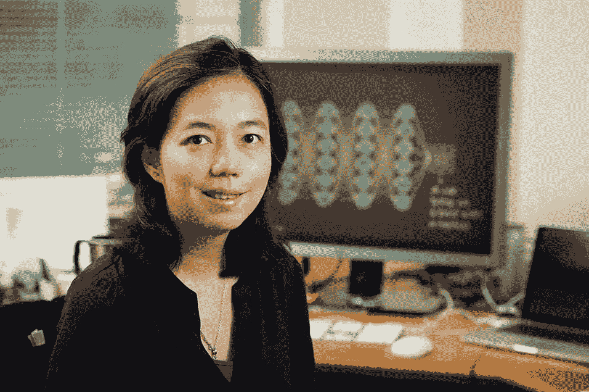
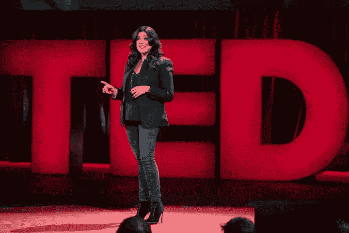
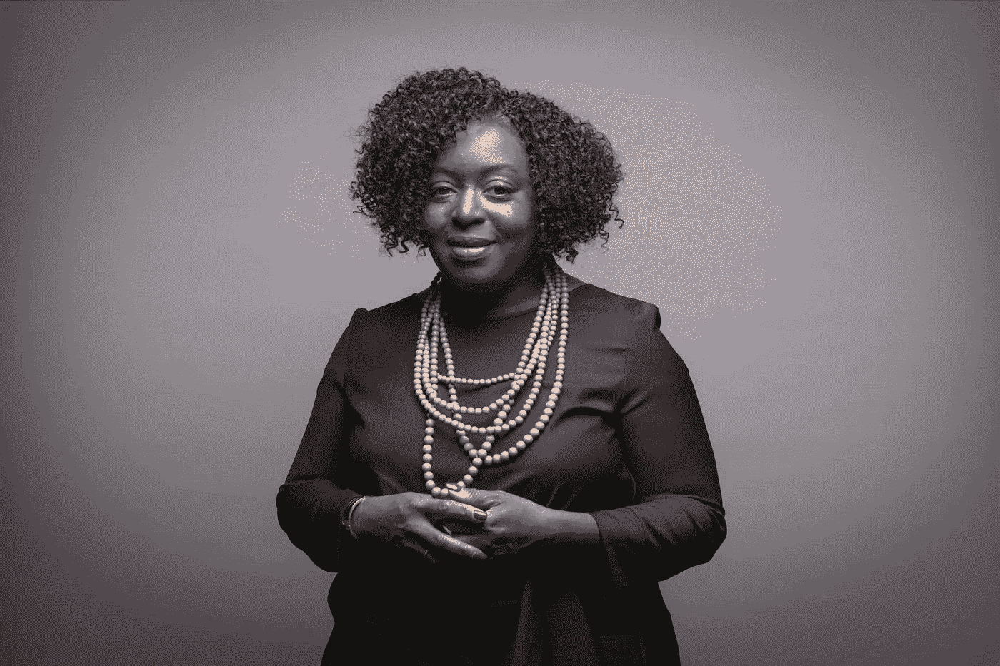

# 激励科技领域的女性

> 原文：<https://medium.com/codex/inspiring-women-in-tech-b19e0b797541?source=collection_archive---------7----------------------->

这篇文章献给挑战科技行业性别差距和现状的女性。

# 玛丽莎·梅耶尔

来源: [nbcnews](http://nbcnews.com/tech/tech-news/marissa-mayer-stepping-down-verizon-completes-yahoo-deal-n771556)

她来自威斯康辛州，打算成为一名儿科神经外科医生，于是就读于斯坦福大学。后来，她转了专业，最终获得了计算机科学硕士学位。她成为了**谷歌第一位女工程师**和**第 20 名员工**。

她在谷歌一些主要未来的发展中扮演了一个关键角色，比如谷歌搜索、谷歌图片、谷歌产品搜索、谷歌地图、iGoogle、Gmail 等。她在这家科技公司工作了 13 年，这为她担任雅虎的下一个角色做好了准备。。除此之外，2014 年，她被福布斯 40 位 40 岁以下女性评选为第 16 位最具影响力女性。

# **Ruchi Sanghvi**

来源:[经济时代](https://economictimes.indiatimes.com/magazines/panache/when-joining-a-startup-dont-ask-what-position-what-role-paytms-ruchi-sanghvi/articleshow/48353782.cms)

鲁奇在印度浦那长大。她的好奇心驱使她来到卡内基梅隆大学，在那里她攻读了电子计算机工程的学士和硕士学位。她是 2010 年脸书聘用的第一位女工程师。在那里，她参与了脸书核心功能的开发，如新闻订阅，并于 2006 年成为脸书平台的产品负责人。

2011 年，她离开了脸书，与 Aditya Agarwal 共同创立了名为 **Cove** 的秘密合作创业公司。一年后，这家初创公司被卖给了 Dropbox，Ruchi 成为了 Dropbox 的运营副总裁。2015 年，她离开了 Dropbox，但仍在那里担任顾问。离开 Dropbox 后，她创建了南方公园社区。 South Park Commons 是一个技术社区和共同工作空间，位于旧金山的南方公园附近，目前在全球拥有 450 多名活跃成员和校友。

# 费-李非

来源: [IEEE 频谱](https://spectrum.ieee.org/computer-vision-leader-feifei-li-on-why-ai-needs-diversity)

她毕业于普林斯顿大学，获得物理学学士学位，毕业于加州理工学院，获得计算机科学博士学位。

她目前是红杉资本(sequoia capital)的教授和斯坦福人工智能研究所(HAI)的联合主任。她专注于**认知和计算神经科学**，以及**机器学习**以提高 AI 图像识别能力。这项研究导致她从 2017 年 1 月到 2018 年 9 月从斯坦福大学休假，当时她担任谷歌的**副总裁和谷歌云**的**人工智能和机器学习首席科学家。**

# 雷斯马·索贾尼

来源:[时间](https://time.com/collection/american-voices-2017/5088970/american-voices-reshma-saujani/)

与名单上的其他女性不同，Resha 没有学习计算机科学或其他相关领域。她毕业于哈佛大学和耶鲁大学法学院，2010 年，她成为第一位竞选国会议员的印度裔美国女性。

然而，她仍然在很大程度上影响了科技行业。2012 年，她创办了名为“编码女孩”的非营利组织。它旨在增加计算机科学领域的妇女人数，目前支持 500，000 名学习如何编码的女孩、妇女和非二胎个人。他们正在接触世界各地的女孩，并有望在 2030 年前缩小新的入门级技术工作中的性别差距。印象深刻，对吧？

# 金伯利·布赖恩特

来源: [sfchronicle](https://medium.com/r?url=https%3A%2F%2Fwww.sfchronicle.com%2Fvisionsf%2Farticle%2FKimberly-Bryant-Black-Girls-Code-founder-opens-10995066.php)

另一位最初没有涉足这个行业，但留下了巨大影响的女性是金伯利·布莱恩特。她努力为她在湾区的女儿找到一个多样化的计算机编程课程，这激励了她。她决定自己动手，并在 2011 年用她的 401(k)启动了[黑人女孩代码](https://www.blackgirlscode.com/)，现在的任务是在 2040 年前教会一百万有色人种女孩如何编程。

# 支持

想知道如何支持科技界的女性？你可以参与社区或者向支持 STEM 女性的社区和组织捐款，比如 [GirlsWhoCode](https://give.girlswhocode.com/give/77372/#!/donation/checkout) 、 [BlackGirlsCode](https://wearebgc.org/donate/) 、 [WomenWhoCode](https://www.womenwhocode.com/donate) 、[girls instech](https://girlsintech.org/donate)和 [GirlsDevelopIT](https://girldevelopit.networkforgood.com/projects/124267-scholarship-campaign) 。