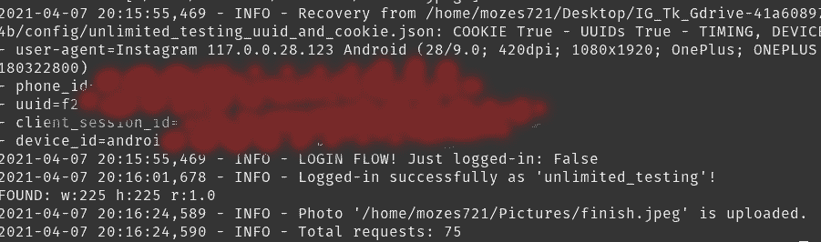

# 来自 GDrive 或本地存储的 Instagram 发布图像

> 原文：<https://medium.com/codex/instagram-choose-img-from-gdrive-or-local-storage-629fa836dd4f?source=collection_archive---------9----------------------->

亚历山大·沙托夫在 [Unsplash](https://unsplash.com?utm_source=medium&utm_medium=referral) 上拍摄的照片

## 该项目分为三个部分:

1 首先从你的电脑目录中获取图片，你可以在这里找到:

 [## 使用 Python 查找目录中的文件和文件夹

### 摘要

medium.com](/nerd-for-tech/find-files-folders-in-your-directory-with-python-2ff11081e373) 

从你的硬盘下载文件，你可以在这里找到:

 [## 使用 Python 从 Google API 请求/获取文件

### 本文介绍了如何首先设置您的 Google Drive API，然后创建一个 python 脚本来下载…

medium.com](/nerd-for-tech/request-get-files-from-google-api-with-python-f6dab75681ae) 

3 rd 将上述两者结合起来的主要应用程序脚本如下:

Tkinter 是事实上的标准 GUI(图形用户界面)包。

**Instabot** 用于推广的免费 Instagram python bot 和 API python wrapper。

> ***注:***
> 
> 要做到这一点，所有的部分都必须包含在内，最需要注意的是设置你的 GDrive API，因为它包含了大部分的验证等步骤。

# 导入/包和图像

如前所述，我们从导入少量的 tkinter 导入开始，如 tk、标签、按钮、PIL 以及图像库。Instabot 登录到我们的帐户和职位。从定时器模块和**检查**和**驱动列表**脚本得到想要的图像。

我们在 bot 变量中初始化 instabot Bot()方法以使其运行。

继续启动 **CheckIMG** 脚本函数 **choose_option()** 从本地驱动器或 Gdrive 文件中选择图像。

> 完成后，将 **time.sleep** 设置为 3 秒，这样文件就可以被下载和访问以供发布！

如果图像变量 ***为空*** 则制作一个图像变量和' '。来自 drive_list 脚本的 join(image_input)名称，以便可以访问和用于发布。否则显然从本地目录中选择了图像，并且图片从 **CheckIMG** 脚本中继承了**图像**的字符串名称！

启动 app.py

请注意，图像的像素尺寸比例对帖子的成功起着巨大的作用(自己选择不同类型的图片的错误，有些通过，有些给我一个**错误**)！

# Tkinter GUI 设置

我们继续创建应用程序类 **IGGUI** 。这个类的构造函数调用[基类](https://www.askpython.com/python/oops/inheritance-in-python) ( `tk.Frame`)构造函数并传递 master 对象，这样就可以初始化重要的东西了。

继续使用标准协议来创建 __init__ 方法。

使用`super`实际上会修改主对象，所以我们将自己的副本更新为最新的，因为其他调用需要它。

我们用 **Image** 方法创建可以打开图片的 self.image。

必须调整其大小，然后必须创建一个新的 self.img 变量，以便将其存储在 Tkinter GUI 应用程序中进行显示。

此后将调用 self.create_widgets()函数，它应该是不言自明的。我们只需创建一个标签，并将其分配到相应的网格位置。此外，使用 Tkinter 的 Entry 方法以及关于文章的 textarea 的 StringVar()。

提交后的 self.button 运行帖子的最后一个功能，以便进一步处理…

说到设计，它并不完美，但它完成了工作:P

回调具有存储 self.content 文本的值。之后，我们**销毁**我们的 GUI 应用程序，并创建一个名为 entry_text 的 golbal 变量，其中包含我们输入的文本内容，在这种情况下，它是喵喵#curios #cat ❤ ❤ ❤

然后我们创建一个根来启动 tkinter。幕后的 Tk()解释器。

分配标题并创建使用根作为其*主实例的应用程序实例。*

**app** 。**主循环**()告诉 **Python** 运行 **Tkinter** 事件循环。

# 正在执行 Post！

现在这是最简单的部分，只剩下两行代码了。

我们通过传递您的“用户名”和“密码”来登录，从而调用 bot.login。

然后 **bot.upload_photo** 带图片我们选择以及标题我们传入我们在 Tkinter 中写的文本。

它发表的帖子大约有多长(撒有❤的隐私)

# 结论

这个项目是如此令人头痛，但可以从中学到很多东西。从搜索自己目录中的文件开始，继续访问您的 GDrive 文件，最后实现 Tkinter 和 Instabot。有无限的可能性，唯一阻止你的想法是你的想象！

快乐编码你可以在下面找到完整的项目:

 [## Mozes721/IG_Tk_Gdrive

### 该项目是在 IG 上使用 Tkinter(图形用户界面)发布。如果您想从…获取图像，会在终端上得到提示

github.com](https://github.com/Mozes721/IG_Tk_Gdrive)