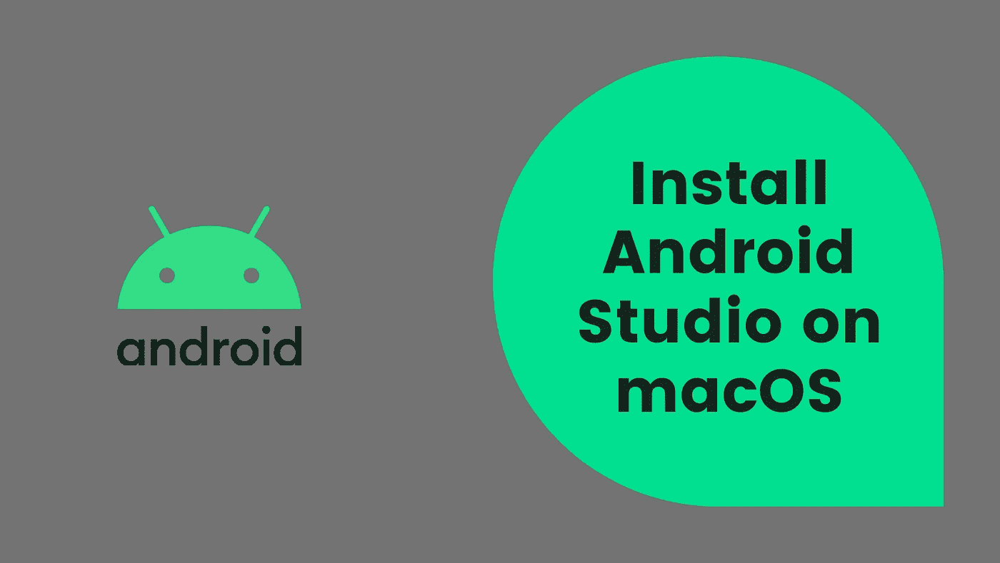

# 在 macOS 上安装 Android Studio 并创建一个项目

> 原文：<https://medium.com/codex/install-android-studio-on-macos-and-create-a-project-fb8780d6f868?source=collection_archive---------2----------------------->

## [法典](http://medium.com/codex)

## 在 macOS 上设置并安装 Android Studio。学习 Android 项目结构。

Android Studio 安装

在本教程中，我们将了解如何在 macOS 上安装 **Android Studio** ，以及如何使用 Android Studio 创建一个新项目。我计划写一系列关于 Android 应用的教程…