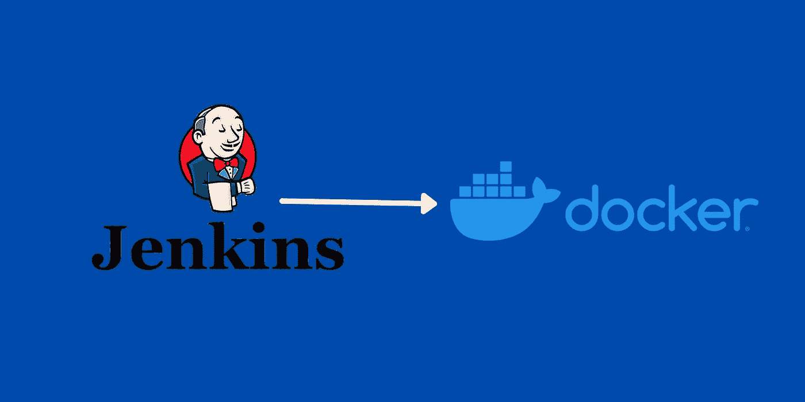

# 使用 AWS Lightsail 上的 Docker 安装 Jenkins

> 原文：<https://medium.com/codex/install-jenkins-using-docker-on-aws-lightsail-3a0682fd33cd?source=collection_archive---------5----------------------->

了解如何在 AWS Lightsail 服务器中安装 Jenkins 服务器作为 Docker 容器，以及如何使用端口访问 Jenkins 服务器。

**使用 AWS Lightsail 上的 Docker 安装 Jenkins】**

Jenkins 是一个开源的自动化服务器。您可以将 Jenkins 用于 CI/CD(持续集成和持续交付)工作。使用 Jenkins 将帮助您解决许多与部署相关的问题。Jenkins 是开发人员中非常受欢迎的工具…