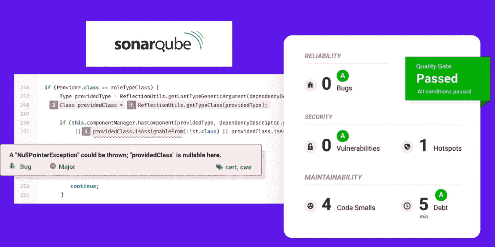

# 使用 PostgreSQL 在 Ubuntu 21 上安装 SonarQube

> 原文：<https://medium.com/codex/install-sonarqube-on-ubuntu-21-using-postgresql-e2201fce4bf0?source=collection_archive---------0----------------------->

## 在 Ubuntu 上安装 SonarQube 服务器的分步指南。

SonarQube 服务器

每个开发人员都在尽最大努力生产干净安全的代码。然而，开发人员可能会编写一些错误的代码。开发人员和他/她的同行代码审查者可能不会发现代码中存在的缺陷/漏洞。因此，我们需要一个工具来分析我们的来源，并列出…